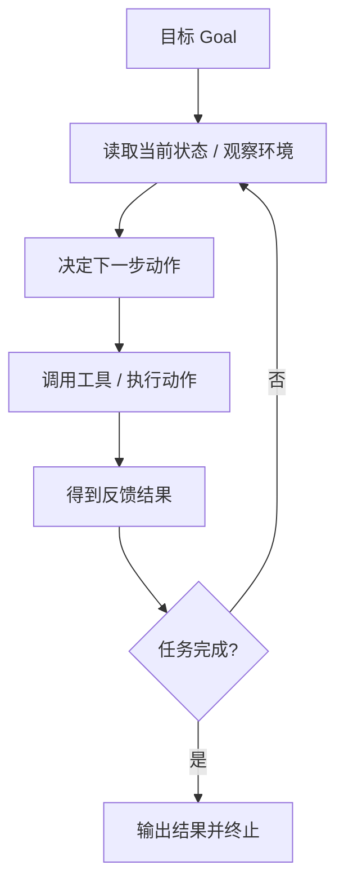

# AI Agent - 第 1 课：AI Agent 是什么，它和普通大模型调用有什么区别

## 学习目标（本节结束后你能做到什么）

- 用自己的话解释 AI Agent 的最小定义，而不是把它理解成“更聪明的聊天机器人”。
- 区分普通 LLM 调用、固定 Workflow 和 AI Agent 三种系统形态。
- 理解 Agent 为什么一定离不开“观察、决策、行动、反馈”的闭环。
- 能判断一个需求到底该做成 Prompt、工作流，还是 Agent。
- 从后端工程视角理解 Agent 系统的最小组成部分。

## 内容讲解（核心概念，用类比、例子、图示说清楚）

### 1. 先拆掉一个最常见误解：AI Agent 不是“会聊天的人设”

很多人第一次接触 AI Agent，脑海里会出现一个画面：  
一个能对话、能记住上下文、看起来像数字员工的 AI 助手。

这个画面不能说完全错，但它抓到的是表象，不是本质。

如果一个系统只是这样：

1. 你给它一个问题
2. 它调用一次大模型
3. 它返回一段文本答案

那它本质上还是一个**单轮 LLM 应用**，不是一个完整意义上的 Agent。

AI Agent 真正关键的地方不在于“它会不会说话”，而在于：

**它是否围绕一个目标，在环境中持续感知信息、做出决策、调用动作，并根据反馈继续推进任务，直到完成、失败或达到终止条件。**

注意这里有几个关键词：

- 围绕目标
- 感知环境
- 做出决策
- 调用动作
- 根据反馈继续推进

只要你把这几个词抓住，后面很多花哨名词都会自动落位。

### 2. 一个最小定义：什么叫 Agent

我们先给出一个工程上足够实用的定义：

**AI Agent = 大模型或推理模块 + 明确目标 + 可用工具/动作 + 可读取的状态/环境信息 + 多轮决策执行闭环。**

换句话说，Agent 不是一个单点能力，而是一个系统。

你可以把它想成一个刚入职但执行力很强的同事：

- 你给他一个目标：“帮我排查昨晚支付超时率升高的原因。”
- 他不会只回一句抽象建议。
- 他会先去看监控、查日志、对比变更、检查依赖服务、整理结论。
- 如果查到一半发现信息不足，他会继续问系统、继续读数据、继续推进。

这就已经比“回答一个问题”更像“执行一个任务”了。

所以 Agent 的核心，不是问答，而是**任务推进能力**。

### 3. 为什么普通 LLM 调用不等于 Agent

先看一个普通的大模型调用：

```text
输入：请解释什么是缓存雪崩
输出：一段关于缓存雪崩的解释
```

这是一个典型的“输入一次，输出一次”的模式。  
模型在这个过程中没有真实接触外部环境，也没有采取动作，更没有根据动作结果继续调整策略。

再看一个稍微复杂一点的例子：

```text
输入：请总结这篇文章
系统先拉取文章正文
然后把正文喂给模型
输出：总结结果
```

它比上一种更复杂，但本质上通常还是一个**固定工作流**，因为系统已经提前写死了步骤：

1. 取文章
2. 调模型总结
3. 返回结果

模型并没有决定“下一步该做什么”，而只是负责生成其中一个步骤的结果。

所以，普通 LLM 应用和固定工作流系统，虽然都可能用到大模型，但它们通常都不满足 Agent 最重要的特征：  
**在执行过程中，系统的下一步行动是动态决定的，而不是完全预先写死的。**

### 4. Workflow 和 Agent 的区别，不在于复杂度，而在于“谁决定下一步”

这是第一课里最关键的区别。

你可以先记住一句话：

**Workflow 的核心是预定义流程，Agent 的核心是动态决策。**

我们用一个研发场景来举例。

#### 场景 A：固定 Workflow

需求：收到一条工单后，自动做分类、提取优先级、分派团队。

如果你的系统逻辑是：

1. 读取工单内容
2. 用模型判断类别
3. 用规则判断优先级
4. 根据类别路由到固定团队

那么这更像一个 Workflow。  
它很有价值，也很实用，但重点是：系统路径已经提前确定了。

#### 场景 B：Agent

需求：收到“支付成功但订单未更新”的线上问题后，自动协助排查。

这时系统可能要动态决定：

- 先查订单服务日志，还是先查消息队列堆积
- 是否要看最近变更记录
- 是否要读取告警平台的异常时间线
- 如果查到消息重复消费，再不要继续查数据库锁等待
- 是否已经有足够证据形成排查结论

这里最难的点不再是“某一步怎么生成文本”，而是**根据当前观察结果决定下一步动作**。  
这时才更接近 Agent。

所以不要把 Agent 理解成“更长的工作流”。  
它们不是长度不同，而是决策机制不同。

### 5. Agent 的最小闭环：观察、思考、行动、再观察

AI Agent 之所以叫 Agent，是因为它像一个在环境里行动的执行体，而不是一个静态回答器。

你可以把它抽象成下面这个循环：



这个图里最重要的是两个点。

第一，Agent 一定要和环境发生关系。  
这里的环境可以是真实网页、数据库、知识库、日志系统、文件系统、代码仓库、业务 API，也可以是更抽象的状态存储。

第二，Agent 一定是闭环的。  
它不是“一次想完所有事情”，而是先看一点、做一步、拿反馈、再决定。

这和后端系统里的事件驱动处理有点像。  
你不会在不知道外部返回值之前，就假设后面所有分支都能一次写死；Agent 也是一样，它必须根据执行结果调整路径。

### 6. 从后端工程视角看，Agent 至少包含哪些部件

如果你把 Agent 当成一个后端服务来看，它至少通常有下面几层东西：

#### 6.1 目标输入

系统要先知道自己在完成什么。  
例如：

- 帮用户回答问题
- 帮研发排查问题
- 帮销售整理客户信息
- 帮面试系统生成试卷

目标不清，Agent 就会到处乱试。  
所以很多失败的 Agent，根本不是模型不够强，而是目标定义不清。

#### 6.2 状态与上下文

Agent 需要知道当前已经做了什么、拿到了什么信息、还缺什么。  
这部分不一定全放在 prompt 里，很多时候需要单独的结构化状态。

例如：

- 当前任务 ID
- 已调用过哪些工具
- 关键中间结果
- 当前假设
- 是否触发过人工审批
- 剩余预算和剩余步数

这和后端里的任务状态机、Saga 上下文、审计日志有很强的相似性。

#### 6.3 工具或动作

如果没有工具，Agent 大多数时候只能“说”，不能“做”。  
工具可能包括：

- 搜索知识库
- 查询数据库
- 调业务 API
- 读取日志
- 写工单评论
- 发送通知
- 修改某个系统配置

工具是 Agent 的“手”和“脚”。

#### 6.4 决策器

这里通常是大模型，但不一定只有大模型。  
它的任务不是单纯生成自然语言，而是做决策：

- 现在要不要继续查
- 该调用哪个工具
- 工具参数是什么
- 当前证据是否足够
- 什么时候该停

#### 6.5 终止与护栏

Agent 不能无限跑下去。  
必须定义清楚：

- 最大步数
- 超时时间
- 成本预算
- 哪些动作需要人工确认
- 哪些高风险工具禁止自动调用

如果你没有这些，Agent 很容易从“自动化助手”变成“自动化事故制造机”。

### 7. 一个非常实用的判断标准：什么需求适合做 Agent

你可以先用下面这个标准判断。

适合考虑 Agent 的问题通常有这些特征：

- 任务目标明确，但达到目标的路径不完全固定
- 执行中需要根据中间结果动态选择下一步
- 任务会访问多个信息源或多个工具
- 任务步骤可能跨多轮，不是一问一答能结束
- 单纯规则写死会非常僵硬，维护成本高

例如：

- 线上故障辅助排查
- 复杂工单处理建议
- 代码仓库问答加变更建议
- 跨系统数据核对与异常解释

不太适合一上来做 Agent 的场景通常是：

- 输入输出非常稳定
- 流程路径清晰固定
- 高风险操作多，不允许模型自主判断
- 每一步都能用明确规则表达
- 只是一个简单的分类、抽取、总结任务

例如“识别工单类型并路由到对应团队”，大多数时候 Workflow 就够了。  
如果你硬上 Agent，往往只是在引入额外不确定性。

### 8. 再进一步：不是所有带工具调用的系统都叫 Agent

这也是一个很容易混淆的点。

假设你的系统每次收到用户提问时都会这样做：

1. 去知识库检索 3 条文档
2. 把检索结果拼进 prompt
3. 调一次模型生成答案

这通常更像一个 RAG 系统，不一定是 Agent。  
因为工具调用虽然存在，但调用顺序、次数、策略往往是固定的。

再比如：

1. 先调用搜索工具
2. 再调用数据库工具
3. 最后统一总结

如果这三步永远都写死，那它更像“工具增强的 Workflow”，还不是典型 Agent。

所以判断的关键不在于“有没有工具”，而在于：

**模型是否真的在执行过程中承担了部分策略决策。**

### 9. 一个你现在就可以装进脑子的分类框架

你可以先把大模型应用分成这三类：

| 类型 | 典型特征 | 下一步由谁决定 | 适合场景 |
| --- | --- | --- | --- |
| 普通 LLM 调用 | 单轮输入输出 | 开发者预先写死 | 问答、总结、改写、分类 |
| Workflow | 多步骤，但步骤固定 | 开发者预先编排 | 稳定流程自动化、标准化处理 |
| AI Agent | 多步骤，路径动态变化 | 模型根据状态和反馈决定 | 开放任务、探索型任务、跨工具任务 |

这个表你不用死记，但要反复拿它去判断你看到的产品和方案。  
很多号称 Agent 的系统，本质上其实只是包装得更复杂的 Workflow。

### 10. 第一性原理总结：Agent 解决的到底是什么问题

现在我们把这节课压缩成一句最重要的话：

**当任务目标明确，但实现路径不完全确定，且执行中需要不断读取外部信息、调用动作并根据反馈调整策略时，普通 Prompt 和固定 Workflow 都会变得僵硬，这时 Agent 才有价值。**

所以 Agent 不是为了“显得高级”，而是为了处理这类问题：

- 信息不完整，需要边查边做
- 路径不固定，需要动态选择
- 多工具协作，需要一步步推进
- 中间结果会改变后续策略

如果你之后一直带着这四个判断标准去学，后面就不容易被框架和 buzzword 带偏。

## 小结（3-5 条关键点）

- AI Agent 的本质不是聊天，而是围绕目标，在环境中观察、决策、行动并根据反馈持续推进任务。
- 普通 LLM 调用通常是单轮输入输出；Workflow 是多步但固定；Agent 则是在执行中动态决定下一步。
- 判断一个系统是不是 Agent，关键不在于有没有工具，而在于工具使用策略是否由模型基于状态和反馈动态决定。
- Agent 适合目标明确但路径不固定的任务；流程稳定、规则清晰的场景通常更适合 Workflow。
- 从后端工程视角看，Agent 至少要有目标、状态、工具、决策器和终止护栏这几个核心部件。

---

## 检查站：请回答以下问题

1. 用你自己的话解释：AI Agent 和普通大模型问答的核心区别是什么？请不要只回答“Agent 可以调用工具”，而是说清楚它为什么是一个闭环系统。
2. Workflow 和 Agent 的区别到底在哪里？你试着用“谁决定下一步”这个角度解释一下。
3. 结合你熟悉的后端业务，举一个“更适合做 Workflow”的例子，再举一个“更适合做 Agent”的例子，并说明原因。
4. 如果让你设计一个最小可用的 Agent 服务，你觉得至少要有哪几个组成部分？你可以先不追求术语标准，但要讲出各部分职责。

把你的答案直接发给我，我会根据你的掌握情况决定是进入第 2 课，还是先补一节 `01b` 帮你把 Agent、Workflow、RAG 的边界彻底打清楚。
