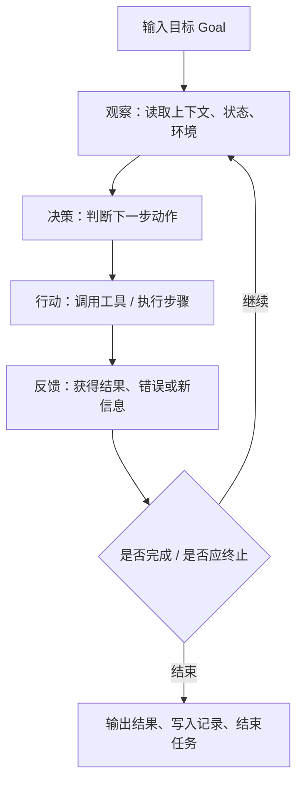
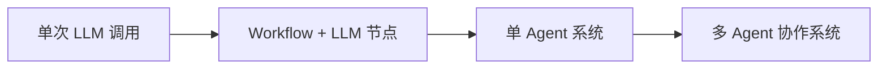

# AI Agent - 第 1 课：AI Agent 是什么，它和普通大模型调用有什么区别

## 学习目标（本节结束后你能做到什么）

- 用工程语言而不是营销语言解释什么是 AI Agent。
- 明确区分 `LLM 应用`、`工作流 Workflow`、`Agent`、`多 Agent 系统`。
- 理解 Agent 为什么天然会引入状态、工具、反馈、风险控制这些系统问题。
- 判断一个需求到底该做成提示词应用、工作流，还是 Agent。
- 建立后续整套 AI Agent 主题的总地图，知道每一章在解决哪一类问题。

## 先给结论

如果只记一句话，我希望你先记住这句：

**AI Agent 不是“更会聊天的大模型”，而是“围绕目标、在环境里反复观察、决策、行动、再观察的执行系统”。**

这里最重要的不是“AI”，而是“Agent”。

“Agent” 这个词在很多领域都出现过。  
在强化学习里，它是和环境交互的智能体；  
在软件工程里，它更像一个有目标、有动作、有反馈回路的执行体；  
在今天的大模型系统里，它通常是：

**大模型 + 工具 + 状态 + 记忆 + 执行循环 + 控制边界。**

这也是为什么，一旦你认真做 Agent，你会很快发现问题已经不再只是 prompt 写得好不好，而是会一路延伸到：

- 工具怎么设计
- 状态怎么存
- 上下文怎么裁剪
- 什么时候停
- 出错了怎么恢复
- 写操作怎么做权限控制
- 线上怎么排障

所以，Agent 从第一天起就不是一个“纯模型问题”，而是一个**系统设计问题**。

---

## 1. 为什么很多人会把 Agent 理解浅了

很多人第一次接触 AI Agent，脑子里出现的是这种画面：

- 一个会对话的 AI 助手
- 它能记住上文
- 它会自己拆任务
- 它看起来像个“数字员工”

这个画面有一定道理，但它抓到的是外表，不是本质。

因为下面这三种东西，在用户眼里可能都像“AI 助手”：

### 1.1 单轮 LLM 应用

例如：

```text
输入：帮我解释什么是缓存雪崩
输出：一段解释
```

它只有一次输入和一次输出。  
模型没有真实感知环境，也没有采取动作，更没有根据动作结果继续推进。

### 1.2 固定工作流 + 大模型节点

例如：

1. 收到工单
2. 调大模型做分类
3. 用规则决定优先级
4. 路由到处理团队

这里用到了模型，但整体流程是写死的。  
模型只是流程里的一个节点，不是整个系统的“执行者”。

### 1.3 真正意义上的 Agent

例如：

“帮我排查昨晚支付成功率下降的原因，并给出初步结论。”

这个任务里，系统可能需要：

1. 先查监控
2. 发现数据库没问题
3. 再查消息队列堆积
4. 发现消费者错误率升高
5. 继续查最近变更
6. 形成带证据的排查结论

这里最关键的是：  
**下一步做什么，不是完全预先写死的，而是根据当前观察结果动态决定的。**

这时，它才更像 Agent。

---

## 2. 一个足够工程化的定义

我们给出一个实用定义：

**AI Agent 是一个围绕目标运行的系统：它能感知环境、维护状态、调用动作、根据反馈调整后续行为，并在受控边界内持续推进任务。**

拆开来看，里面至少有六个组成部分：

1. `目标（Goal）`
2. `环境（Environment）`
3. `感知（Observation）`
4. `动作（Action / Tool Use）`
5. `状态（State / Context / Memory）`
6. `策略（Policy / Decision Loop）`

这个定义比“一个会自动调工具的大模型”更完整，因为它把 Agent 拉回到了它最本质的东西：

**闭环。**

---

## 2b. 为什么“生产级 Agent”是 2023 之后才可行的

面试里经常被问到一个开放题：

**“Agent 这个概念其实 60 年代就有了，为什么最近才突然热起来？”**

能答上“不是 Agent 变了，是模型变了”，立刻高一个档次。具体是四个技术前置条件同时成熟：

### 2b.1 原生的 Tool Calling / Function Calling

在这之前，想让模型调工具只能靠 prompt 格式约定 + 正则解析，失败率非常高。真正让工具调用从 demo 变成生产能力的是：

- OpenAI Function Calling（2023 年中）与之后的 `tool_calls` 结构化协议
- Anthropic Claude 3 系列原生 `tool_use`（2024 年初），Claude 3.5 / 3.7 / 4 系列把多工具并行调用稳定化
- Google Gemini `function_declarations`、Qwen/DeepSeek 等开源模型对齐 OpenAI 协议
- **MCP（Model Context Protocol）**：Anthropic 在 2024 年底推出的工具接入协议，把“工具”和“模型”解耦，让同一个工具可以接到任何模型，2025 年已经成为事实上的行业标准

没有结构化 tool calling，Agent 谈不上“可靠地调用外部世界”。

### 2b.2 长上下文窗口

早期 4K / 8K 窗口下，Agent 跑 5 步历史就撑不住了。真正的拐点是：

- GPT-4 Turbo 128K（2023 年底）
- Claude 2.1 / Claude 3 系列 200K
- Gemini 1.5 1M、2.5 2M（2024-2025）
- Claude Sonnet 4.5 / 4.6 / 4.7 稳定在 200K 以上且 attention 质量保持

有了长上下文，Agent 才有资格“带着完整任务历史继续推进”。

### 2b.3 真正的推理能力（Chain-of-Thought / Reasoning Models）

- OpenAI o1（2024 Q3）首次把“思考过程”变成模型一等能力
- DeepSeek R1（2025 年初）把 RL + reasoning 开源化
- Anthropic Extended Thinking（Claude 3.7 起）、Gemini 2.0/2.5 Thinking、Qwen QwQ、Kimi K2 reasoning
- 2025 年底 2026 年初，reasoning 已经从“可选特性”变成“Agent 模型的默认配置”

没有推理能力，Agent 只会“按感觉下一步”，有了推理，才能“根据观察修正计划”。

### 2b.4 成本和延迟下行

Agent 要跑 10-100 步，每步如果 $0.05、2 秒，用户根本用不起。2024-2026 的成本曲线几乎每年降一个数量级：

- GPT-4o mini / Claude Haiku 3.5 / Gemini Flash / DeepSeek V3 把“小而够用”的价格压到 **~$0.15 / 百万 input tokens**
- Prompt caching（Anthropic / OpenAI）让系统 prompt 不再每次重算，Agent 循环里复用率 80%+ 是常态
- **Inference-time 优化**（speculative decoding、batched tool calls、并行工具执行）把一次 Agent 任务的时延压到 10-60 秒

四条都到齐，Agent 才从“能 demo”变成“能卖钱”。

面试时可以这么收：

> 不是 Agent 概念新，而是**原生 tool calling + 长上下文 + 推理能力 + 成本下降**这四个前置条件在 2023-2025 之间同时落地，才让“围绕目标的执行闭环”第一次在生产环境跑得动。

---

## 3. Agent 和普通 LLM 调用，差别到底在哪

下面这张表很重要，它是后面所有章节的起点。

| 维度 | 普通 LLM 调用 | Workflow + LLM | AI Agent |
| --- | --- | --- | --- |
| 核心能力 | 文本生成 | 固定流程中的局部智能 | 动态决策与任务推进 |
| 下一步由谁决定 | 开发者 | 开发者 | 系统在运行时动态决定 |
| 是否调用工具 | 可选 | 可选 | 通常必需 |
| 是否维护状态 | 很弱 | 有但有限 | 很强 |
| 是否存在执行循环 | 通常没有 | 有，但路径固定 | 有，且路径动态 |
| 失败恢复复杂度 | 低 | 中 | 高 |
| 线上风险 | 低到中 | 中 | 中到高 |
| 适合场景 | 问答、改写、总结 | 流程稳定的业务 | 环境不完整、路径不固定的复杂任务 |

你可以把它理解成三种不同的软件系统：

- `LLM 应用`：像一个函数，输入一段文本，输出一段文本。
- `Workflow`：像一个流程引擎，步骤预定义。
- `Agent`：像一个带推理能力的任务执行器。

很多团队在这一步就会出偏差：  
明明业务只需要工作流，却为了“先进”硬做 Agent。  
结果系统复杂度暴涨，但收益很有限。

---

## 3b. 能力谱系：从 Augmented LLM 到 Agent

上面那张表是一个“三分法”，简单好记，但真实面试里如果能进一步展开成**谱系（spectrum）**，就会比别人多一个档次。

这个谱系是 Anthropic 在 2024 年底《Building Effective Agents》里定义的，已经成为 2025-2026 行业共识。它的核心主张是：

**“Agent”不是一个开关，而是一条从简单到复杂的连续曲线。大多数业务系统其实不需要最右边的 Agent，只需要谱系中间的 Workflow。**

### 3b.1 谱系的三段

```
           简单、可控                                 动态、强大
   ┌────────────┐    ┌──────────────────┐    ┌─────────────┐
   │ Augmented  │ -> │   Workflows      │ -> │   Agents    │
   │    LLM     │    │  (5 种模式)      │    │ (动态循环)  │
   └────────────┘    └──────────────────┘    └─────────────┘
   LLM + 检索        LLM 在预定义图里     LLM 在运行时
   + 工具 + 记忆     按模式编排            决定下一步
```

**Augmented LLM**：不是单次调用，而是一个“被增强的 LLM 原语”——自带 RAG 检索、工具调用、短期记忆。大多数 Copilot 类产品本质是这一层。

**Workflows**：多个 Augmented LLM 按**预定义的控制流**组合起来。Anthropic 归纳了 **5 种经典模式**，面试里能说出这 5 种名字就是加分项：

1. **Prompt Chaining（提示链）**：把复杂任务拆成顺序步骤，每步一个 LLM 调用，上一步输出是下一步输入。典型例子：先翻译再润色；先抽取再验证。
2. **Routing（路由）**：分类器 LLM 先判断输入类型，再路由给专门的 handler。例如客服请求分成“账单 / 技术支持 / 退款”。
3. **Parallelization（并行）**：同一任务拆成并行子任务，再聚合。两种子形态：**Sectioning**（任务切片，如分章总结一本书）和 **Voting**（多次独立执行取多数，典型用于安全检查）。
4. **Orchestrator-Workers（编排者-执行者）**：一个 orchestrator LLM 动态把任务拆成子任务，分发给 worker LLM，再汇总。和 parallelization 的区别是**子任务结构是运行时决定的**，不是预定义的。
5. **Evaluator-Optimizer（评估-优化循环）**：一个 LLM 生成，另一个 LLM 批判并反馈，循环几轮直到通过。翻译、代码生成、文案打磨常用。

**Agents**：只有当任务是**开放式的、步数不可预知、需要模型在运行时根据环境持续决策**时，才真正需要 Agent。这是最贵、最难 debug、风险最高的一档。

### 3b.2 这个谱系在面试里的价值

被问到“你们系统算 Agent 吗”时，不要陷入“是 / 不是”的二分陷阱，而是：

> “按 Anthropic 的能力谱系，我们的系统其实是一个 Orchestrator-Workers 模式的 Workflow，只在 XX 环节引入了真正的 Agent 自主决策。我们故意没把它做成全 Agent，因为……”

这种回答会立刻让面试官判断你“读过一手资料 + 有工程取舍”。

### 3b.3 选型决策：谱系越靠右，成本越高

Anthropic 原文给出的判断原则（我用工程语言翻译一下）：

- **默认选最左边能解决问题的那一档。**
- 当任务路径固定、输出空间收敛时，Workflow 已经足够，不要上 Agent。
- 真正需要 Agent 的场景通常有两个特征：任务步数不可预先规划 + 错了需要模型自己修正。
- Agent 的每一点“自主性”都对应一点“可控性的丢失”，不要免费送出去。

这条原则是 2025-2026 业界最主流的反“过度 Agent 化”共识。

---

## 4. Agent 的核心不是回答，而是推进任务

这是第一课最值得你牢牢记住的一个判断：

**Agent 的本质不是“回答问题”，而是“推进任务”。**

这个差异乍看很小，实际上决定了整个系统设计。

### 4.1 “回答问题”偏向一次性推理

比如：

- “什么是 Redis 的惰性删除？”
- “帮我总结这段文字。”

系统重点在于：

- 理解输入
- 组织语言
- 给出正确结果

### 4.2 “推进任务”偏向连续执行

比如：

- “帮我写出一份初步调研方案。”
- “帮我排查线上事故的第一轮证据。”
- “帮我把这个需求转成技术方案和待办列表。”

系统重点变成：

- 现在知道了什么
- 还缺什么
- 下一步该做什么
- 哪一步可以自动做，哪一步要人工确认
- 什么时候算完成

这时，问题就从“生成质量”扩展到了“执行质量”。

### 4.3 从后端工程看，“推进任务”对应的是 Workflow Engine

如果你有后端背景，这里有一个很顺的类比：

**“推进任务”这件事，在传统后端里对应的不是 REST API，而是 Workflow Engine（Temporal / Cadence / Airflow / Step Functions）。**

这些系统之所以存在，就是因为单次 RPC 模型无法表达“一个跑几分钟到几小时、中间可能失败、要持久化状态、能恢复能重试”的业务。它们提供：

- **Durable State**：任务状态持久化到数据库，进程挂了能恢复
- **Checkpoints**：每一步完成后落盘，不重跑已完成的步骤
- **Deterministic Replay**：用事件重放重建状态
- **Retries + Compensation**：失败自动重试、补偿逻辑
- **Human-in-the-Loop**：能在某一步等待人工审批

看过这些字就会发现：**Agent 系统后面会补的每一个工程能力（run/step 对象、checkpoint、replay、HITL、retry、超时、幂等），本质上就是 LLM 版本的 workflow engine**。

这个类比在面试里至少有两个用处：

1. 被问“Agent 和普通 RPC 服务在架构上最大的差别是什么”——答“它不是请求响应语义，而是长任务语义，和 Temporal 同一个问题域”。
2. 被问“Agent 的任务怎么持久化 / 怎么恢复”——直接借 workflow engine 成熟方案回答，避免把 Agent 重新造一遍轮子。

这也是后面第 7 课（工程实现）、第 23 课（任务状态机）真正要展开的主题。

---

## 5. Agent 最小闭环：观察、决策、行动、反馈

我们把 Agent 抽象成一个循环：



这个图看起来很简单，但后面所有复杂问题都来自这里：

- 观察不准，会乱决策
- 决策太开放，会乱跑
- 动作不可靠，会失败
- 反馈太噪，会误判
- 没有终止条件，会死循环

你也可以把它和后端系统做一个类比：

- `观察` 像读取数据库、缓存、搜索结果、外部 API
- `决策` 像业务逻辑判断
- `行动` 像调用下游服务
- `反馈` 像返回值、异常、状态变更
- `终止` 像状态机到终态

所以从架构视角看，Agent 并不神秘。  
它只是把“推理”这件事插进了业务执行闭环。

---

## 6. 从系统设计看，Agent 至少要有哪几层

如果你把 Agent 当成一套后端系统看，通常至少会有下面这些层次：

### 6.1 目标层

系统必须明确：

- 当前目标是什么
- 边界是什么
- 成功标准是什么

比如“帮我排查问题”是个很宽的目标。  
更好的写法可能是：

- 排查过去 2 小时内支付成功率下降的初步原因
- 优先读取监控、日志、最近变更
- 输出一份带证据的排查摘要
- 不做任何写操作

没有成功标准的 Agent，很容易永远“继续做下去”。

### 6.2 上下文与状态层

系统需要知道：

- 当前做到哪一步
- 已有哪些结论
- 调过哪些工具
- 哪些结果已经证伪
- 当前是否需要人工接管

这部分不是随便塞点聊天记录就能解决的，后面第 3 课和第 9 课会展开讲。

### 6.3 工具层

没有工具的 Agent，大多数时候只是“能规划的聊天机器人”。

工具就是它和外部世界交互的手脚，比如：

- 搜索知识库
- 查数据库
- 读网页
- 调内部 API
- 发通知
- 写工单

### 6.4 决策层

通常由大模型承担，但也不一定完全靠模型。

它负责：

- 当前是否该调用工具
- 该用哪个工具
- 参数怎么填
- 是否要继续
- 是否信息已足够

### 6.5 治理层

这一层经常被忽略，但是真正决定能不能上线：

- 权限边界
- 超时
- 步数上限
- 成本预算
- 审计
- 风险护栏

如果没有治理层，Agent 很快就会从“智能”变成“危险”。

---

## 6b. Agent 的自主度分级（L1-L5）

2024-2026 这波真正的产品化 Agent（Cursor、Claude Code、Devin、Manus、OpenAI Operator、Claude Computer Use、GitHub Copilot Agent）让一个问题变得实际：

**“你这个系统到底有多自主？”**

业界逐渐收敛出一套类比自动驾驶 L0-L5 的分级。面试里被问“你怎么评估一个 Agent 产品的成熟度”，这个是目前最通用的标准答案。

| 级别 | 名字 | 决策权 | 人工介入 | 典型产品 |
| --- | --- | --- | --- | --- |
| **L1** | Assist（建议） | 人做全部决策 | 每次动作 | GitHub Copilot 补全、早期 ChatGPT |
| **L2** | Execute with Approval（有监督执行） | Agent 建议动作，人一键确认 | 每一步确认 | 早期 Cursor Chat、Notion AI write |
| **L3** | Conditional Autonomy（条件自主） | Agent 自主跑，在预设检查点暂停 | 关键节点 HITL | Cursor Agent、Claude Code plan/auto 模式、Windsurf Cascade |
| **L4** | High Autonomy（高度自主） | Agent 完全自主，在受限域内闭环 | 只看结果 | Devin、Cursor Background、Manus、OpenAI Deep Research、Claude Computer Use |
| **L5** | Full Autonomy（完全自主） | 跨域长期自主，无需交接 | 异常时才介入 | 研究阶段，尚无生产产品 |

几个关键观察，都是面试加分点：

### 6b.1 级别越高，对系统的要求越“后端化”

- L1-L2 的主战场在**模型质量和交互体验**；
- L3 开始必须引入**状态持久化、checkpoint、HITL 接管点**（对应 Workflow Engine 那一套）；
- L4 必须引入**沙箱、权限分级、成本预算、任务中断恢复、回滚、审计**；
- L5 在系统设计上还没有公认方案，目前都是研究话题。

这也解释了为什么 Cursor Agent（L3）能稳定商用，而 Devin（L4）至今仍在"小心选择任务"的阶段。

### 6b.2 级别不是越高越好

面试里常有个陷阱问题：“你们为什么不直接做 L4？”
标准答案：**自主度 ≠ 商业价值**。L4 的失败代价是“跑错 50 步 + 执行了有副作用的动作”，L2-L3 的失败代价是“用户多点一下取消”。在风险敏感场景（金融、医疗、生产环境 infra），**故意停在 L2-L3 是专业选择，不是技术不行**。

### 6b.3 同一产品可以同时支持多个级别

2025 年之后的主流做法：**同一 Agent 产品暴露多个 autonomy 档位让用户按任务自选**。

- Claude Code：`plan mode`（L2）/ `auto-accept edits`（L3）/ `dangerous-skip-permissions`（L4）
- Cursor：`Ask`（L1）/ `Edit`（L2）/ `Agent`（L3）/ `Background Agent`（L4）
- Claude Computer Use + Operator：都需要显式“开启自主模式”才会进入 L4

面试时如果能提出**"autonomy 档位也是产品设计的一部分，不是技术实现的一部分"**这种观察，会让面试官觉得你不只是搬运概念。

---

## 7. 什么时候它只是 Workflow，什么时候才算 Agent

这个问题会反复出现，所以第一课就先讲清楚。

### 7.1 Workflow 的核心：预定义

如果系统路径大致是：

1. 读输入
2. 调模型分类
3. 路由
4. 发通知

那它更像 Workflow。  
即使用了大模型，也还是 Workflow。

### 7.2 Agent 的核心：动态性

如果系统路径大致是：

1. 看当前证据
2. 判断还缺什么
3. 动态挑一个动作
4. 再根据返回值修正方向

那它更像 Agent。

一个很实用的判断句是：

**不是看有没有模型，而是看“下一步”在多大程度上是运行时决定的。**

---

## 7b. Agent 和相邻概念的区分

面试里经常遇到“Agent 和 X 有什么区别”的追问，X 不止是 Workflow。2025-2026 最高频的四个对比对象：

### 7b.1 Agent vs RPA（UiPath / Automation Anywhere / Power Automate Desktop）

| | RPA | LLM Agent |
| --- | --- | --- |
| 决策来源 | 录制脚本 + 规则 | LLM 推理 |
| 对 UI 的鲁棒性 | 脆弱（选择器一变就挂） | 可以看图理解（VLM / Computer Use） |
| 新任务适配 | 需要重新录制 | 自然语言改一下 prompt |
| 失败恢复 | 基本靠重跑 | 可以观察结果自主修正 |
| 擅长 | 高度重复、UI 稳定的流程 | UI 变化大、需要推理的任务 |

关键分歧：**RPA 是“给定步骤的机器人”，Agent 是“给定目标的机器人”**。

2024 年以后 Claude Computer Use、OpenAI Operator 的出现，让 Agent 开始**真正蚕食 RPA 的市场**——同一个屏幕操作任务，RPA 要维护脚本，Agent 可以直接按自然语言跑。但 Agent 在**大批量、严稳定性**场景仍然不如 RPA（一次跑错可能比 RPA 贵 100 倍）。

### 7b.2 Agent vs Workflow Engine / BPMN（Temporal / Camunda / Airflow）

| | Workflow Engine | LLM Agent |
| --- | --- | --- |
| 控制流 | 预定义 DAG / 状态图 | 运行时动态 |
| 确定性 | 完全确定（given input → given path） | 非确定（同 input 不同 path） |
| 失败语义 | 自动重试 / 补偿事务 | 需要 agent 自己判断 / HITL |
| 适合 | 业务流程稳定、审计要求强 | 路径不可预知 |

关键区别是**控制流是否在运行时决定**。真实系统经常混用：外层是 Workflow（确定性骨架），某些决策节点调用 Agent（动态推理），再回到 Workflow 继续。

### 7b.3 Agent vs 规则引擎（Drools / Easy Rules）

| | 规则引擎 | LLM Agent |
| --- | --- | --- |
| 知识表达 | `if-then` 规则库 | 自然语言 + few-shot |
| 新规则的增删 | 写规则 / 编译 | 改 prompt / 换 tool |
| 可解释性 | 高（每条规则可追溯） | 低（模型黑盒 + CoT 可能是编的） |
| 擅长 | 规则有限、变化慢的领域（风控、核保） | 规则隐含、需要语义理解 |

关键观察：**规则引擎是"穷举世界"，Agent 是"理解世界"**。前者在合规/审计强的场景依然不可替代，后者在长尾和语义任务上碾压前者。

### 7b.4 Agent vs 强化学习里的 Agent（AlphaGo / 自驾 / Atari RL）

这个区分经常被忽略，但面试官一问你答不上来就很尴尬：

| | RL Agent | LLM Agent |
| --- | --- | --- |
| 知识来源 | 训练环境里试错学到的 | 大规模预训练 + SFT + RLHF |
| 决策依据 | 学到的 policy 网络 | LLM 的 in-context reasoning |
| 泛化 | 通常在训练分布内 | 能 zero-shot 新任务 |
| 样本效率 | 低（需要上亿步交互） | 高（零样本可用） |

2025 年开始两条路线在融合：**Agentic RL**（对应第 11 课）——用 RL 训练 LLM Agent 的 tool use / long-horizon policy，既有 LLM 的泛化，又有 RL 的 goal-directed 能力。DeepSeek R1、Qwen QwQ、OpenAI o1 / o3 series 都在这个方向上。

---

## 8. 单 Agent、多 Agent、工作流，三者的关系

这是一个你后面会越来越常用的结构图：



这不是“等级越高越先进”的关系，而是复杂度逐步上升的关系。

### 8.1 单次 LLM 调用

优点：

- 简单
- 便宜
- 好调试

缺点：

- 不能持续推进任务

### 8.2 Workflow + LLM

优点：

- 可控
- 稳定
- 适合成熟流程

缺点：

- 不适合动态路径

### 8.3 单 Agent

优点：

- 可以处理不完整信息和不固定路径

缺点：

- 调试难度明显提升

### 8.4 多 Agent

优点：

- 适合强分工、强并行、强角色边界的任务

缺点：

- 协调成本、责任归因、消息风暴、状态同步问题会陡增

所以真实世界最稳的路线通常不是“直接上多 Agent”，而是：

**先把单 Agent 做稳，再看是否真的需要拆成多 Agent。**

---

## 9. 为什么很多 Agent 项目会失败

Agent 项目失败，很多时候不是因为模型不够强，而是因为下面这些原因：

### 9.1 目标定义含糊

“帮我自动化处理客服问题”这种目标太大太空。

模型会努力，但系统不知道什么叫完成。

### 9.2 动作边界不清

工具开放太多，模型到处乱试。  
或者工具太少，模型只能空想。

### 9.3 状态没管住

没有结构化状态，只有对话历史。  
长任务一长，系统就开始失忆。

### 9.4 没有终止条件

能继续就继续，越做越贵，最后还不一定更准。

### 9.5 没有可观测性

你知道它“错了”，但不知道是哪一步错的。

所以如果你以后自己做 Agent，请记住：

**最难的从来不是“让模型更聪明”，而是“让系统可控”。**

---

## 9b. 真实数量级：一个 Agent 任务到底多贵 / 多少步 / 多久

面试里一旦进入“这玩意能商用吗”，就会被追问具体数字。光说“很贵”“很慢”没用，要能报出**数量级**。2025-2026 主流产品的参考值：

| 场景 | 典型步数 | Token 用量（I/O 合计） | 成本 | 墙钟时间 | 代表产品 |
| --- | --- | --- | --- | --- | --- |
| 单轮问答 Agent（带 1-2 次检索） | 1-3 | 5K-20K | $0.001-$0.01 | 2-10 秒 | Perplexity 单问、ChatGPT Search |
| 客服 / 订票类任务 Agent | 3-10 | 20K-100K | $0.01-$0.10 | 10-60 秒 | Intercom Fin、各种垂直客服 |
| Deep Research 类 | 30-100 | 500K-3M | $0.50-$5 | 3-20 分钟 | OpenAI Deep Research、Perplexity Pro、You.com |
| Coding Agent 解一个 issue | 20-200 | 300K-5M | $0.30-$10 | 2-30 分钟 | Cursor Agent、Claude Code、Devin、SWE-Agent |
| Computer Use / Operator | 50-500 | 500K-5M（含大量截图） | $1-$20 | 5-60 分钟 | Claude Computer Use、OpenAI Operator |
| 长 horizon 规划 Agent | 不定 | 易爆炸 | 不定，常失控 | >30 分钟经常空转 | 早期 AutoGPT、BabyAGI 类 |

几个值得记住的经验规律：

### 9b.1 “步数墙”约在 20-50 步

没有精心工程化的 Agent（无结构化 memory、无 checkpoint、无 sub-agent 拆分），绝大多数会在 **20-50 步之后明显退化**：上下文噪声累积、错误互相干扰、工具调用开始打转。2024 年 AutoGPT 爆红又速凉的核心原因就是这堵墙。

突破这堵墙的主流工程手段（后面几课会展开）：

- **结构化 memory / notes**（而不是把全部历史塞 context）；
- **sub-agent 分层**（子任务开独立 context）；
- **显式 plan + re-plan**，而不是每步都让模型自由决定；
- **Agentic RL 训练**，让模型学会“长 horizon 不退化”。

### 9b.2 成本的二阶问题：Prompt Cache 命中率

一次 Agent 任务里，system prompt + 工具定义 + 历史几乎每步都重复，直接算的话成本会高到离谱。真实部署下，**Prompt caching（Anthropic / OpenAI 都支持）可以把有效成本降到账面价格的 20-40%**。

面试里被问“你们 Agent 成本怎么控”，能答出这一条就赢一半。

### 9b.3 延迟的主战场：工具 I/O 而非模型推理

一个 Agent 一轮 10 秒里，模型推理可能只占 2-3 秒，剩下的大头都在**工具 I/O**（搜索、读文件、调 API）。优化延迟的实际手段不是换更快的模型，而是：

- **并行工具调用**（2024 年后所有主流模型原生支持）；
- **流式工具返回**；
- **工具结果本地缓存**；
- **推测性预执行**（猜下一步调什么，提前发起）。

### 9b.4 面试里报数字的好句式

> “我们这个 Agent 一次任务大概 X 步、Y 千 token、Z 毛钱、N 秒；p95 在 M 秒；主要成本在 system prompt 重复，通过 prompt cache 降了 60%；主要延迟在外部工具调用，通过并行 tool call 降了 40%。”

这一段背下来，基本上在 Agent 相关面试里报数字就不会怯场。

---

## 10. 什么时候值得上 Agent，什么时候不值得

下面是一个非常实用的决策表。

### 值得考虑 Agent 的场景

- 任务路径不固定
- 信息要边查边补
- 中途观察会显著改变后续动作
- 人工本来就在“先查再判断再继续查”
- 输出不仅是答案，还有执行结果或行动建议

### 不太值得直接上 Agent 的场景

- 流程完全固定
- 规则非常明确
- 写操作风险很高
- 成本和时延必须极可控
- 主要问题其实是数据质量或业务规则，而不是推理能力

一个很稳的工程判断是：

**如果任务本来就是稳定流程，优先 Workflow；如果任务天然依赖运行时观察与动态决策，再考虑 Agent。**

---

## 11. 一套“面试回答版”框架

如果以后面试被问：

**“什么是 AI Agent？它和普通大模型调用有什么区别？”**

你可以按这个顺序说：

1. 普通大模型调用通常是一次输入一次输出，本质是文本生成。
2. Agent 强调围绕目标运行的闭环，不只是回答，还要观察、决策、行动、再观察。
3. Agent 通常要有工具、状态和记忆，否则很难完成复杂任务。
4. Workflow 和 Agent 的关键区别，不是有没有模型，而是谁决定下一步。
5. 从工程上看，Agent 不是 prompt 技巧，而是一套任务执行系统，会引入工具设计、状态管理、权限控制、可观测性等问题。

如果你能说到这里，已经明显比“Agent 就是能自动调用工具的大模型”更扎实了。

---

## 小结

这一课最核心的东西有三层：

### 第一层：定义

**Agent 是围绕目标运行的执行闭环。**

### 第二层：边界

它和普通 LLM 调用、固定 Workflow 的最大差别，在于：

**下一步动作是不是由系统在运行时动态决定。**

### 第三层：工程含义

一旦你认真做 Agent，你面对的就不再只是 prompt，而是：

- 工具
- 状态
- 记忆
- 终止条件
- 权限
- 风险
- 可观测性

这也是为什么，`AI Agent` 这个主题值得单独作为一个大专题系统学习。

---

## 问题

1. 为什么说“能对话”不是 Agent 的本质，而只是表象？
2. Workflow 和 Agent 的根本区别，为什么不是“复杂度”，而是“谁决定下一步”？
3. 如果一个系统能查知识库并回答问题，它为什么仍然不一定是 Agent？
4. 如果你们团队要做一个“线上故障排查助手”，哪些部分最先会把它从普通 LLM 应用推向 Agent 系统？
