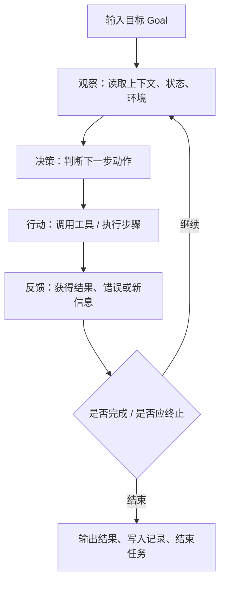
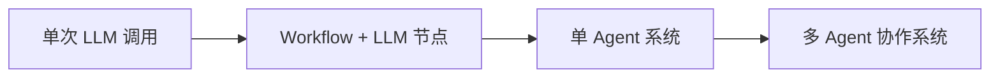

# AI Agent - 第 1 课：AI Agent 是什么，它和普通大模型调用有什么区别

## 学习目标（本节结束后你能做到什么）

- 用工程语言而不是营销语言解释什么是 AI Agent。
- 明确区分 `LLM 应用`、`工作流 Workflow`、`Agent`、`多 Agent 系统`。
- 理解 Agent 为什么天然会引入状态、工具、反馈、风险控制这些系统问题。
- 判断一个需求到底该做成提示词应用、工作流，还是 Agent。
- 建立后续整套 AI Agent 主题的总地图，知道每一章在解决哪一类问题。

## 先给结论

如果只记一句话，我希望你先记住这句：

**AI Agent 不是“更会聊天的大模型”，而是“围绕目标、在环境里反复观察、决策、行动、再观察的执行系统”。**

这里最重要的不是“AI”，而是“Agent”。

“Agent” 这个词在很多领域都出现过。  
在强化学习里，它是和环境交互的智能体；  
在软件工程里，它更像一个有目标、有动作、有反馈回路的执行体；  
在今天的大模型系统里，它通常是：

**大模型 + 工具 + 状态 + 记忆 + 执行循环 + 控制边界。**

这也是为什么，一旦你认真做 Agent，你会很快发现问题已经不再只是 prompt 写得好不好，而是会一路延伸到：

- 工具怎么设计
- 状态怎么存
- 上下文怎么裁剪
- 什么时候停
- 出错了怎么恢复
- 写操作怎么做权限控制
- 线上怎么排障

所以，Agent 从第一天起就不是一个“纯模型问题”，而是一个**系统设计问题**。

---

## 1. 为什么很多人会把 Agent 理解浅了

很多人第一次接触 AI Agent，脑子里出现的是这种画面：

- 一个会对话的 AI 助手
- 它能记住上文
- 它会自己拆任务
- 它看起来像个“数字员工”

这个画面有一定道理，但它抓到的是外表，不是本质。

因为下面这三种东西，在用户眼里可能都像“AI 助手”：

### 1.1 单轮 LLM 应用

例如：

```text
输入：帮我解释什么是缓存雪崩
输出：一段解释
```

它只有一次输入和一次输出。  
模型没有真实感知环境，也没有采取动作，更没有根据动作结果继续推进。

### 1.2 固定工作流 + 大模型节点

例如：

1. 收到工单
2. 调大模型做分类
3. 用规则决定优先级
4. 路由到处理团队

这里用到了模型，但整体流程是写死的。  
模型只是流程里的一个节点，不是整个系统的“执行者”。

### 1.3 真正意义上的 Agent

例如：

“帮我排查昨晚支付成功率下降的原因，并给出初步结论。”

这个任务里，系统可能需要：

1. 先查监控
2. 发现数据库没问题
3. 再查消息队列堆积
4. 发现消费者错误率升高
5. 继续查最近变更
6. 形成带证据的排查结论

这里最关键的是：  
**下一步做什么，不是完全预先写死的，而是根据当前观察结果动态决定的。**

这时，它才更像 Agent。

---

## 2. 一个足够工程化的定义

我们给出一个实用定义：

**AI Agent 是一个围绕目标运行的系统：它能感知环境、维护状态、调用动作、根据反馈调整后续行为，并在受控边界内持续推进任务。**

拆开来看，里面至少有六个组成部分：

1. `目标（Goal）`
2. `环境（Environment）`
3. `感知（Observation）`
4. `动作（Action / Tool Use）`
5. `状态（State / Context / Memory）`
6. `策略（Policy / Decision Loop）`

这个定义比“一个会自动调工具的大模型”更完整，因为它把 Agent 拉回到了它最本质的东西：

**闭环。**

---

## 3. Agent 和普通 LLM 调用，差别到底在哪

下面这张表很重要，它是后面所有章节的起点。

| 维度 | 普通 LLM 调用 | Workflow + LLM | AI Agent |
| --- | --- | --- | --- |
| 核心能力 | 文本生成 | 固定流程中的局部智能 | 动态决策与任务推进 |
| 下一步由谁决定 | 开发者 | 开发者 | 系统在运行时动态决定 |
| 是否调用工具 | 可选 | 可选 | 通常必需 |
| 是否维护状态 | 很弱 | 有但有限 | 很强 |
| 是否存在执行循环 | 通常没有 | 有，但路径固定 | 有，且路径动态 |
| 失败恢复复杂度 | 低 | 中 | 高 |
| 线上风险 | 低到中 | 中 | 中到高 |
| 适合场景 | 问答、改写、总结 | 流程稳定的业务 | 环境不完整、路径不固定的复杂任务 |

你可以把它理解成三种不同的软件系统：

- `LLM 应用`：像一个函数，输入一段文本，输出一段文本。
- `Workflow`：像一个流程引擎，步骤预定义。
- `Agent`：像一个带推理能力的任务执行器。

很多团队在这一步就会出偏差：  
明明业务只需要工作流，却为了“先进”硬做 Agent。  
结果系统复杂度暴涨，但收益很有限。

---

## 4. Agent 的核心不是回答，而是推进任务

这是第一课最值得你牢牢记住的一个判断：

**Agent 的本质不是“回答问题”，而是“推进任务”。**

这个差异乍看很小，实际上决定了整个系统设计。

### 4.1 “回答问题”偏向一次性推理

比如：

- “什么是 Redis 的惰性删除？”
- “帮我总结这段文字。”

系统重点在于：

- 理解输入
- 组织语言
- 给出正确结果

### 4.2 “推进任务”偏向连续执行

比如：

- “帮我写出一份初步调研方案。”
- “帮我排查线上事故的第一轮证据。”
- “帮我把这个需求转成技术方案和待办列表。”

系统重点变成：

- 现在知道了什么
- 还缺什么
- 下一步该做什么
- 哪一步可以自动做，哪一步要人工确认
- 什么时候算完成

这时，问题就从“生成质量”扩展到了“执行质量”。

---

## 5. Agent 最小闭环：观察、决策、行动、反馈

我们把 Agent 抽象成一个循环：



这个图看起来很简单，但后面所有复杂问题都来自这里：

- 观察不准，会乱决策
- 决策太开放，会乱跑
- 动作不可靠，会失败
- 反馈太噪，会误判
- 没有终止条件，会死循环

你也可以把它和后端系统做一个类比：

- `观察` 像读取数据库、缓存、搜索结果、外部 API
- `决策` 像业务逻辑判断
- `行动` 像调用下游服务
- `反馈` 像返回值、异常、状态变更
- `终止` 像状态机到终态

所以从架构视角看，Agent 并不神秘。  
它只是把“推理”这件事插进了业务执行闭环。

---

## 6. 从系统设计看，Agent 至少要有哪几层

如果你把 Agent 当成一套后端系统看，通常至少会有下面这些层次：

### 6.1 目标层

系统必须明确：

- 当前目标是什么
- 边界是什么
- 成功标准是什么

比如“帮我排查问题”是个很宽的目标。  
更好的写法可能是：

- 排查过去 2 小时内支付成功率下降的初步原因
- 优先读取监控、日志、最近变更
- 输出一份带证据的排查摘要
- 不做任何写操作

没有成功标准的 Agent，很容易永远“继续做下去”。

### 6.2 上下文与状态层

系统需要知道：

- 当前做到哪一步
- 已有哪些结论
- 调过哪些工具
- 哪些结果已经证伪
- 当前是否需要人工接管

这部分不是随便塞点聊天记录就能解决的，后面第 3 课和第 9 课会展开讲。

### 6.3 工具层

没有工具的 Agent，大多数时候只是“能规划的聊天机器人”。

工具就是它和外部世界交互的手脚，比如：

- 搜索知识库
- 查数据库
- 读网页
- 调内部 API
- 发通知
- 写工单

### 6.4 决策层

通常由大模型承担，但也不一定完全靠模型。

它负责：

- 当前是否该调用工具
- 该用哪个工具
- 参数怎么填
- 是否要继续
- 是否信息已足够

### 6.5 治理层

这一层经常被忽略，但是真正决定能不能上线：

- 权限边界
- 超时
- 步数上限
- 成本预算
- 审计
- 风险护栏

如果没有治理层，Agent 很快就会从“智能”变成“危险”。

---

## 7. 什么时候它只是 Workflow，什么时候才算 Agent

这个问题会反复出现，所以第一课就先讲清楚。

### 7.1 Workflow 的核心：预定义

如果系统路径大致是：

1. 读输入
2. 调模型分类
3. 路由
4. 发通知

那它更像 Workflow。  
即使用了大模型，也还是 Workflow。

### 7.2 Agent 的核心：动态性

如果系统路径大致是：

1. 看当前证据
2. 判断还缺什么
3. 动态挑一个动作
4. 再根据返回值修正方向

那它更像 Agent。

一个很实用的判断句是：

**不是看有没有模型，而是看“下一步”在多大程度上是运行时决定的。**

---

## 8. 单 Agent、多 Agent、工作流，三者的关系

这是一个你后面会越来越常用的结构图：



这不是“等级越高越先进”的关系，而是复杂度逐步上升的关系。

### 8.1 单次 LLM 调用

优点：

- 简单
- 便宜
- 好调试

缺点：

- 不能持续推进任务

### 8.2 Workflow + LLM

优点：

- 可控
- 稳定
- 适合成熟流程

缺点：

- 不适合动态路径

### 8.3 单 Agent

优点：

- 可以处理不完整信息和不固定路径

缺点：

- 调试难度明显提升

### 8.4 多 Agent

优点：

- 适合强分工、强并行、强角色边界的任务

缺点：

- 协调成本、责任归因、消息风暴、状态同步问题会陡增

所以真实世界最稳的路线通常不是“直接上多 Agent”，而是：

**先把单 Agent 做稳，再看是否真的需要拆成多 Agent。**

---

## 9. 为什么很多 Agent 项目会失败

Agent 项目失败，很多时候不是因为模型不够强，而是因为下面这些原因：

### 9.1 目标定义含糊

“帮我自动化处理客服问题”这种目标太大太空。

模型会努力，但系统不知道什么叫完成。

### 9.2 动作边界不清

工具开放太多，模型到处乱试。  
或者工具太少，模型只能空想。

### 9.3 状态没管住

没有结构化状态，只有对话历史。  
长任务一长，系统就开始失忆。

### 9.4 没有终止条件

能继续就继续，越做越贵，最后还不一定更准。

### 9.5 没有可观测性

你知道它“错了”，但不知道是哪一步错的。

所以如果你以后自己做 Agent，请记住：

**最难的从来不是“让模型更聪明”，而是“让系统可控”。**

---

## 10. 什么时候值得上 Agent，什么时候不值得

下面是一个非常实用的决策表。

### 值得考虑 Agent 的场景

- 任务路径不固定
- 信息要边查边补
- 中途观察会显著改变后续动作
- 人工本来就在“先查再判断再继续查”
- 输出不仅是答案，还有执行结果或行动建议

### 不太值得直接上 Agent 的场景

- 流程完全固定
- 规则非常明确
- 写操作风险很高
- 成本和时延必须极可控
- 主要问题其实是数据质量或业务规则，而不是推理能力

一个很稳的工程判断是：

**如果任务本来就是稳定流程，优先 Workflow；如果任务天然依赖运行时观察与动态决策，再考虑 Agent。**

---

## 11. 一套“面试回答版”框架

如果以后面试被问：

**“什么是 AI Agent？它和普通大模型调用有什么区别？”**

你可以按这个顺序说：

1. 普通大模型调用通常是一次输入一次输出，本质是文本生成。
2. Agent 强调围绕目标运行的闭环，不只是回答，还要观察、决策、行动、再观察。
3. Agent 通常要有工具、状态和记忆，否则很难完成复杂任务。
4. Workflow 和 Agent 的关键区别，不是有没有模型，而是谁决定下一步。
5. 从工程上看，Agent 不是 prompt 技巧，而是一套任务执行系统，会引入工具设计、状态管理、权限控制、可观测性等问题。

如果你能说到这里，已经明显比“Agent 就是能自动调用工具的大模型”更扎实了。

---

## 小结

这一课最核心的东西有三层：

### 第一层：定义

**Agent 是围绕目标运行的执行闭环。**

### 第二层：边界

它和普通 LLM 调用、固定 Workflow 的最大差别，在于：

**下一步动作是不是由系统在运行时动态决定。**

### 第三层：工程含义

一旦你认真做 Agent，你面对的就不再只是 prompt，而是：

- 工具
- 状态
- 记忆
- 终止条件
- 权限
- 风险
- 可观测性

这也是为什么，`AI Agent` 这个主题值得单独作为一个大专题系统学习。

---

## 问题

1. 为什么说“能对话”不是 Agent 的本质，而只是表象？
2. Workflow 和 Agent 的根本区别，为什么不是“复杂度”，而是“谁决定下一步”？
3. 如果一个系统能查知识库并回答问题，它为什么仍然不一定是 Agent？
4. 如果你们团队要做一个“线上故障排查助手”，哪些部分最先会把它从普通 LLM 应用推向 Agent 系统？
