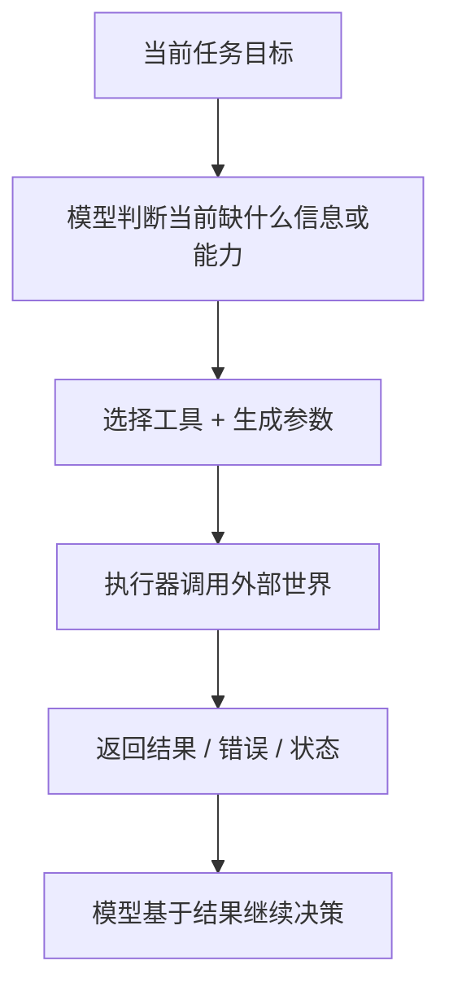

# AI Agent - 第 2 课：Tool Calling：Agent 为什么能调用工具做事

## 学习目标

- 理解 Tool Calling 解决的不是“格式化输出”，而是“行动能力”。
- 说清楚模型、工具描述、执行器、结果回灌之间的完整链路。
- 知道为什么工具设计质量，往往比模型本身更决定 Agent 的上限。
- 理解工具调用里的副作用、幂等、权限和错误语义问题。
- 能从工程视角判断一个 API 到底适不适合直接暴露给 Agent。

## 先给结论

**Tool Calling 的本质，是把模型从“只会生成文字”扩展成“能借助外部能力行动”的系统接口。**

很多入门资料把 Tool Calling 讲成：

- 模型输出一段 JSON
- 系统再去调函数

这当然没错，但太浅了。

更准确的理解应该是：

1. 模型要先判断现在缺什么能力
2. 模型要在多个工具里做选择
3. 模型要生成结构化参数
4. 系统要保证执行可靠、可控、可审计
5. 工具结果要回灌给模型，形成下一轮决策

所以 Tool Calling 本质上是一个**行动闭环接口**，不是单纯的“函数格式输出”。

---

## 1. 为什么大模型光会说还不够

普通大模型最擅长的是：

- 解释
- 归纳
- 改写
- 生成

但一旦任务变成下面这些，它就不够了：

- 查今天的实时天气
- 查某个订单状态
- 搜公司知识库
- 新建工单
- 发消息
- 改数据库里的状态

这些事情有一个共同点：

**答案不在模型参数里，而在外部世界里。**

模型可以“理解”天气是什么、订单系统长什么样、工单系统如何使用。  
但它并不能凭空知道你这家公司此刻的真实订单状态，也不可能靠语言能力直接把工单真的创建出来。

所以 Tool Calling 的出现，本质上是为了解决这个问题：

**让模型不再只是“解释世界”，而是能“操作世界”。**

---

## 2. Tool Calling 的最小组成

一个完整的工具调用能力，至少有四部分：

### 2.1 工具描述（Tool Spec）

它告诉模型：

- 这个工具叫什么
- 它适合解决什么问题
- 需要哪些参数
- 参数的含义是什么
- 返回结果大概长什么样

### 2.2 模型决策

模型在当前上下文下判断：

- 要不要调用工具
- 调哪个工具
- 参数应该填什么

### 2.3 执行器（Executor）

系统真正去调用：

- HTTP API
- 数据库查询
- 搜索引擎
- 文件系统
- 浏览器
- 其他内部服务

### 2.4 结果回灌（Observation）

把结果告诉模型：

- 工具成功了吗
- 返回了什么关键字段
- 如果失败，为什么失败
- 下一步是否应该继续

所以一个完整链路是：



只有把这四层都看清楚，Tool Calling 才真的算被理解了。

---

## 3. Tool Calling 和“模型直接回答”到底差在哪

如果用户问：

“订单 123456 当前状态是什么？”

### 方式 A：模型直接回答

模型可能会：

- 猜一个状态
- 或者礼貌地说自己无法访问实时数据

### 方式 B：模型调用工具

系统可能这样执行：

1. 模型判断：这不是知识问题，而是实时状态问题。
2. 模型选择 `query_order` 工具。
3. 模型生成参数：`order_id=123456`。
4. 执行器真正去查订单服务。
5. 返回：`status=PAID, updated_at=...`
6. 模型再组织成面向用户的结果。

这两者的区别不是“一个更聪明”，而是：

**后者具备了面向环境的行动能力。**

---

## 4. 工具调用为什么是 Agent 的基础设施

如果一个系统没有工具，它多数时候只能做：

- 解释
- 推理
- 写计划
- 给建议

它不能真正：

- 获取实时信息
- 操作外部资源
- 改变业务状态
- 完成带副作用的任务

所以很多“看起来很聪明”的 demo，一上线就暴露出价值不足，原因往往不是模型不够强，而是：

**它没有可靠的工具系统。**

你可以把工具理解成 Agent 的：

- 手
- 脚
- 眼睛
- 耳朵

没有工具，模型只能在脑子里空转。  
有了工具，它才开始真的进入“任务执行”阶段。

---

## 5. 为什么很多 Tool Calling 项目做不稳

真实项目里，Tool Calling 失败往往不是因为模型完全不会，而是因为工具层设计得太差。

最常见的问题有：

### 5.1 工具描述太抽象

比如工具名叫：

- `processData`
- `invokeBiz`
- `doTask`

模型根本不知道它们适合什么场景。

### 5.2 多个工具功能重叠

例如同时存在：

- `search_docs`
- `search_knowledge`
- `search_internal_content`

描述又差不多。  
结果模型和新人同事一样，不知道该打哪个电话。

### 5.3 参数太业务黑话

如果参数是：

- `sceneCode`
- `bizNo`
- `extMap`
- `actionType`

模型很难稳定填对。

### 5.4 返回结构太像前端 DTO

工具返回一大坨嵌套字段、UI 展示文案、无关状态。  
模型需要从噪音里自己抽关键信息，效果很容易漂。

### 5.5 一个动作拆得太碎

比如“查询订单”被拆成：

- 查订单基本信息
- 查支付信息
- 查物流信息
- 查退款信息

表面看灵活，实际上模型会来回调用很多次，成本高、错误也多。

所以你很快会发现：

**工具层不是“把现有 API 直接暴露出去”就完了，而是要专门为 Agent 重做一层。**

---

## 6. 一个好工具应该长什么样

从工程上讲，一个适合给 Agent 用的工具，通常要满足四个条件：

### 6.1 可理解

模型看名字和描述，大致就能知道：

- 它适合什么问题
- 和其他工具怎么区分

比如：

- `query_order_status`
- `search_internal_docs`
- `create_incident_ticket`

都比 `doActionV2` 强很多。

### 6.2 可填写

参数必须清楚、稳定、边界明确。

例如：

- `order_id`
- `user_id`
- `start_time`
- `end_time`

比：

- `payload`
- `metadata`
- `extra`

更适合模型使用。

### 6.3 可消费

返回结果要让下一轮推理容易继续，而不是给模型出阅读理解题。

适合 Agent 的返回值通常更偏：

- 结构化
- 关键字段清晰
- 错误语义标准化
- 有成功 / 失败标志

### 6.4 可控制

系统要能对这个工具做：

- 超时
- 限流
- 权限控制
- 幂等保护
- 审计记录

如果缺少这层，Tool Calling 很快就会从“能力增强”变成“风险放大器”。

---

## 7. Tool Calling 的三种难度层级

你可以把工具分成三层。

### 7.1 只读工具

例如：

- 搜索知识库
- 查订单
- 看日志
- 读网页

这类工具相对安全，是最适合一开始开放给 Agent 的。

### 7.2 低风险写工具

例如：

- 创建草稿
- 写一条评论
- 发通知
- 打标签

可以自动执行，但最好有审计。

### 7.3 高风险写工具

例如：

- 扣款
- 删数据
- 改配置
- 发生产环境命令

这类工具一般不应该完全交给模型自动放行，而应该接入人工确认、审批或策略引擎。

所以工具系统设计的一个核心原则是：

**先让 Agent 会读，再让它会写；先开放低风险动作，再逐步放开高风险动作。**

---

## 8. 参数生成不是简单 JSON，而是“受约束决策”

很多人把 Tool Calling 理解成：

“模型输出 JSON，不就完了么？”

问题是，真实世界里参数不是这么简单。

举个例子，假设有一个创建会议的工具：

- `participants`
- `start_time`
- `duration`
- `room_type`
- `need_recording`

模型除了“填格式”之外，还要处理：

- 时间是否冲突
- 参数是否缺失
- 是否有默认值
- 用户说“下周二下午”到底对应哪个绝对时间
- 是否要追问再执行

所以 Tool Calling 真正难的不是序列化，而是：

**如何把模糊意图变成可执行参数。**

这本质上是一个“语义解释 -> 约束满足 -> 安全执行”的过程。

---

## 9. 结果回灌为什么和工具调用本身一样重要

很多系统把精力都花在“怎么调出去”，却忽略了“怎么喂回来”。

但 Agent 不是单步系统，它要根据结果继续推进。

所以工具返回至少应该回答四个问题：

1. 成功还是失败？
2. 如果失败，错误类型是什么？
3. 关键信息是什么？
4. 这些信息对下一步有什么意义？

例如，下面两种返回效果完全不同：

### 返回 A

```json
{
  "success": false,
  "message": "request failed"
}
```

### 返回 B

```json
{
  "success": false,
  "error_type": "permission_denied",
  "retryable": false,
  "human_action_required": true
}
```

对模型来说，返回 B 才真的能支撑下一步判断：

- 是不是该重试
- 是不是该换工具
- 是不是该转人工

所以结果回灌不是附属品，它是决策循环的一部分。

---

## 10. Tool Calling 和函数调用、插件、MCP 是什么关系

这几个词容易混。

### 10.1 Function Calling

更像是一种接口表达形式：

- 你声明函数名、参数 schema
- 模型输出调用意图和参数

它更偏“模型如何表达调用”。

### 10.2 Tool Calling

更偏“系统如何把外部能力开放给模型使用”。

它比 function calling 更大，因为它还包括：

- 执行
- 错误处理
- 结果回灌
- 权限和治理

### 10.3 插件 / MCP

更偏生态和协议层。  
MCP 解决的是不同工具、数据源、宿主如何用统一方式暴露能力。

所以：

- Function Calling 更像表达层
- Tool Calling 更像运行时能力层
- MCP 更像协议和生态层

后面第 10 课会系统讲这些协议边界。

---

## 11. Tool Calling 为什么会把问题从“模型效果”升级成“系统治理”

只做文本生成时，风险大多是：

- 幻觉
- 答错
- 风格不合适

一旦接上工具，风险立刻升级成：

- 调错工具
- 调对工具但参数错
- 重复执行写操作
- 权限越界
- 高风险动作自动放行
- 死循环调用
- 成本失控

所以从这里开始，Agent 主题就和普通 Prompt Engineering 拉开了。

因为你必须开始回答这些问题：

- 这个工具谁能用？
- 这次调用是不是重复的？
- 执行失败后重试安全吗？
- 工具结果该不该写入记忆？
- 用户能不能看见全部结果？

这已经进入工程系统设计了。

---

## 12. 面试里怎么答得更扎实

如果被问：

**“什么是 Tool Calling？为什么 Agent 能调用工具？”**

你可以这么答：

1. Tool Calling 的本质是把大模型从纯文本生成扩展成可调用外部能力的执行系统。
2. 模型本身并不会真的执行工具，它只是根据工具描述选择工具并生成参数。
3. 真正执行的是系统侧的工具执行器，然后再把结果回灌给模型，形成下一轮决策。
4. Tool Calling 的上限很大程度上取决于工具设计质量，包括命名、参数、返回结构、错误语义和权限控制。
5. 真实工程里最大的难点不是“让模型输出 JSON”，而是副作用控制、幂等、权限、超时、失败恢复和审计。

这样回答，明显会比“就是模型帮你调函数”深入很多。

---

## 小结

这一课最重要的不是记命令，而是建立一句正确理解：

**Tool Calling 是 Agent 的行动接口。**

它让模型从“只会说”变成“能做事”，但同时也把系统带入了新的复杂度：

- 工具设计
- 参数约束
- 错误回灌
- 权限边界
- 幂等和副作用
- 治理和审计

后面你会越来越发现：  
很多 Agent 的上限，不是模型决定的，而是工具系统决定的。

---

## 问题

1. 为什么说 Tool Calling 解决的不是“格式化输出”，而是“行动能力”？
2. 一个适合给 Agent 用的工具，为什么不能直接把现有内部 API 原样暴露？
3. 为什么工具结果回灌和“调用出去”一样重要？
4. 什么类型的工具适合先开放给 Agent，什么类型的工具应该放在人工审批后？
