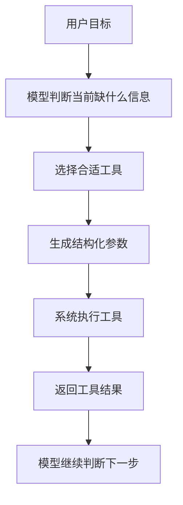

# AI Agent - 第 2 课：Tool Calling：Agent 为什么能调用工具做事

## 学习目标

- 理解 Tool Calling 解决的根问题，不再把它理解成“模型突然会写函数参数了”。
- 区分“模型会回答问题”和“系统能真正做事”之间的差别。
- 说清楚工具调用的完整链路：选工具、填参数、执行、回灌结果、继续决策。
- 知道为什么很多 Agent 失败，不是模型太笨，而是工具设计太差。
- 能从后端工程视角判断一个工具接口是否适合给 Agent 用。

## 内容讲解

### 1. 为什么模型光会说还不够

普通大模型最擅长的是“根据输入生成输出”。  
这件事在问答、总结、改写、翻译里非常有用，但一旦任务变成下面这些，就不够了：

- 查一下今天杭州天气
- 去数据库里找某个订单
- 搜索一下知识库
- 帮我创建一个 Jira 工单
- 给这个用户发一条通知

这些任务有一个共同点：

**答案不在模型参数里，而在外部世界里。**

模型可能“知道”杭州大概是什么气候，但它并不知道你此刻的实时天气。  
模型可能“懂”工单系统是什么，但它没法凭空把工单真的创建出来。

所以 Tool Calling 的本质不是“让模型写 JSON”，而是：

**把模型从“只会想和说”扩展成“能借助手和脚去做”。**

### 2. Tool Calling 到底是什么

我们先用一句比较工程化的话定义它：

**Tool Calling 是让模型在推理过程中，选择某个外部能力，并产出结构化参数，再由系统去真正执行。**

这里有三个角色：

- 模型：负责判断“现在该用哪个工具”“参数应该填什么”
- 工具描述：告诉模型“我能做什么、需要什么参数、返回什么结果”
- 工具执行器：真正去调数据库、HTTP API、搜索服务、文件系统

所以工具调用从来都不是模型自己完成的。  
模型并没有真的去查数据库，它只是说：“我建议现在调用 `query_order`，参数是 `order_id=123456`。”

然后系统收到这个结构化意图后，才真正执行。

### 3. 一个完整的工具调用链路长什么样

你可以把 Tool Calling 看成一个很小的闭环：

比如用户说：

“帮我看看昨天支付失败最多的是哪个渠道。”

系统可能这样推进：

1. 模型意识到这个问题不能瞎答，必须查数据。
2. 它选择一个类似 `query_payment_stats` 的工具。
3. 它生成参数，比如日期范围是昨天、统计维度是支付渠道、指标是失败数。
4. 系统真正去查数据库或分析服务。
5. 工具返回统计结果。
6. 模型再基于结果生成最终回答，或者继续往下钻。

这时候你就会发现：

**Agent 的能力边界，往往不是模型决定的，而是工具箱决定的。**

### 4. 为什么 Tool Calling 是 Agent 的基础设施

如果一个 Agent 没有工具，它大多数时候只是“能规划的聊天机器人”。

它可以：

- 给建议
- 写思路
- 做推理
- 给解释

但它不能：

- 读实时数据
- 改外部状态
- 和业务系统交互
- 执行真正有副作用的动作

所以我们经常说：

**Tool Calling 是 Agent 从“语言系统”变成“行动系统”的起点。**

这也是为什么很多人第一次做 Agent 时，会觉得 demo 很聪明，但线上没什么价值。  
根本原因不是模型差，而是它既没有可靠工具，也没有可靠执行。

### 5. 工具不是越多越好，关键是可理解、可控、可组合

很多人刚做 Agent 会犯一个特别常见的错误：  
把公司现有的几十上百个 API 一股脑全注册给模型。

结果通常是：

- 模型选错工具
- 工具之间功能重叠
- 参数名称太业务化，模型理解不了
- 一个动作拆得太碎，模型来回试错

从 Agent 角度看，一个好工具通常有这几个特点。

#### 5.1 名字能看懂

工具名要能表达动作本身。

比如：

- `search_docs`
- `query_order`
- `create_ticket`
- `send_message`

而不是：

- `doTaskV2`
- `invokeBizFlow`
- `processData`

模型和人一样，看到烂命名也会迷路。

#### 5.2 参数要稳定而清楚

比如“查询订单”这个工具，参数应该是：

- `order_id`
- `user_id`
- `start_time`
- `end_time`

而不是：

- `bizNo`
- `sceneCode`
- `extMap`

参数越像“工程内部黑话”，模型越难用对。

#### 5.3 返回结果要适合下一步推理

很多工具接口本来是给前端页面用的，返回一大坨嵌套字段、展示文案、无关信息。  
对 Agent 来说，这种结果非常难继续消费。

Agent 更适合拿到：

- 关键字段
- 明确状态
- 结构化结果
- 必要的错误信息

工具返回不是越多越好，而是越“能支撑下一步决策”越好。

### 6. Tool Calling 最容易被低估的一件事：结果回灌

很多人以为工具调用的关键是“调用出去”，其实更关键的是“结果怎么回来”。

因为模型不是一次性把整件事都想完的，它往往要根据观察结果继续决策。  
所以工具结果回灌给模型时，至少要解决这几个问题：

- 成功还是失败
- 失败的原因是什么
- 返回的核心字段是什么
- 这些字段对下一步意味着什么

举个例子：

如果一个工具只返回“请求失败”，那模型基本什么也学不到。  
但如果返回：

- `error_type=permission_denied`
- `error_type=timeout`
- `error_type=not_found`

那模型就可能做出完全不同的后续动作：

- 权限不够 -> 请求人工审批
- 超时 -> 重试或换个工具
- 不存在 -> 结束并说明原因

所以 Tool Calling 其实不是单点动作，而是：

**一次“行动 -> 观察 -> 再决策”的循环接口。**

### 7. 工具调用为什么会失败

真实项目里，Tool Calling 失败通常不是因为模型完全不会，而是因为下面几类原因。

#### 7.1 工具描述太抽象

模型不知道这个工具适合什么场景，于是乱选。

#### 7.2 多个工具功能重叠

比如既有 `search_docs`，又有 `search_knowledge`，又有 `search_internal_data`，但说明都差不多。  
模型就会像新人同事一样，不知道该打哪个电话。

#### 7.3 参数复杂而且耦合

比如一个工具要求 12 个参数，其中 5 个还是互斥条件。  
这种接口就算给人写 SDK 也难用，更别说给模型。

#### 7.4 工具副作用太强

比如可以直接“删数据、发通知、改配置”。  
这类工具如果没有审批和权限护栏，就很危险。

#### 7.5 结果不可消费

返回太长、太乱、太像页面数据，模型拿到也没法稳定往下推理。

### 8. 从后端工程视角，怎么设计适合 Agent 的工具

如果你有后端经验，可以把 Agent 工具想成“给不太稳定但很灵活的上游调用者设计 API”。  
这种 API 最重要的不是炫，而是稳。

比较实用的设计原则有这些：

- 一个工具尽量只做一件明确的事
- 参数名尽量接近业务语义，不要内部黑话
- 能默认的参数尽量默认，不要全交给模型填
- 错误码和错误信息要能区分失败类型
- 高风险操作要拆成“建议”和“执行”两步
- 写操作尽量带幂等键，避免重复执行
- 工具返回要尽量结构化，方便下一步推理

一个很有用的判断标准是：

**如果一个工具你不放心给一个刚入职、不了解业务细节但执行力很强的实习生直接用，那多半也不适合直接暴露给 Agent。**

### 9. Tool Calling 和 MCP、函数调用、插件有什么关系

这几个词经常会混在一起。

你可以这样理解：

- Tool Calling：一个总概念，表示“模型可以选择工具并调用”
- Function Calling：很多模型厂商提供的具体接口形态，本质上是 Tool Calling 的一种实现方式
- MCP：更像一种把外部能力标准化暴露出来的协议
- 插件 / Tools / Skills：通常是具体能力的打包形式

所以不用被名词吓到。  
这些东西的核心目标都差不多：

**让模型能以结构化、可控的方式用外部能力。**

### 10. 一个更贴近落地的结论

真正做 Agent 时，Tool Calling 不是锦上添花，而是地基。

你最后系统好不好用，往往取决于：

- 有没有把工具接口重新设计成“Agent 友好型”
- 有没有把危险动作收好权限
- 有没有把工具结果整理成模型可继续推理的格式
- 有没有给模型一个不容易选错工具的工具箱

很多时候，优化 Tool Calling 的收益，远远大于继续微调 prompt。

## 小结

这一课最重要的不是记住术语，而是建立一个直觉：

**模型本身不直接连数据库、不直接发请求、不直接改系统。它只负责决定“该用什么工具、怎么用”，真正执行的是你构建的工具层。**

所以 Tool Calling 的本质是把模型接到外部世界。  
而 Agent 工程里最难的一部分，常常不是模型，而是工具设计、权限控制、错误处理和结果回灌。

## 问题

1. 为什么说 Tool Calling 解决的是“接入外部世界”的问题，而不是“让模型更聪明”的问题？
2. 如果一个工具命名混乱、参数很多、返回很杂，会对 Agent 造成什么影响？
3. 为什么说 Tool Calling 的关键不只是“调用成功”，还包括“结果回灌得是否适合继续决策”？
4. 对于“删数据”“改配置”“发通知”这类工具，为什么不能直接裸露给 Agent？
