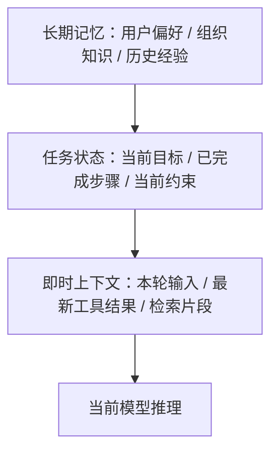

# AI Agent - 第 3 课：上下文、状态与记忆：Agent 为什么需要“脑子”和“笔记”

## 学习目标

- 彻底区分 `上下文`、`状态`、`工作记忆`、`长期记忆` 这些常被混用的概念。
- 理解为什么只靠聊天历史，Agent 很快就会“失忆”“跑偏”或“污染自己”。
- 能判断什么信息该放 prompt，什么信息该结构化存储，什么该进入记忆系统。
- 建立“上下文工程”的第一层世界观：模型的脑子，很多时候是系统拼出来的。
- 明白为什么后面我们还需要专门讲 `Memory`、`RAG`、`Context Engineering` 深水区。

## 先给结论

如果只记一句话，我希望你记住：

**Agent 不是靠“聊天记录很长”变聪明的，而是靠系统把“当下最重要的信息”在正确时机送进来。**

所以，真正决定 Agent 表现的，往往不是单次 prompt，而是三件事：

1. 它当前能看到什么
2. 它当前记得什么
3. 它当前处在什么任务状态

这三件事如果混在一起不区分，系统后面几乎一定会出问题。

---

## 1. 为什么聊天记录撑不起复杂 Agent

很多人刚做 Agent 时的第一反应是：

“模型不是能看上下文吗？那我把前面对话都带上不就行了。”

这个做法在简单场景里可以勉强成立，比如：

- 几轮咨询问答
- 简单内容润色
- 轻量知识问答

但一旦任务变复杂，很快会暴露出几个问题：

### 1.1 长度失控

对话越长，token 越多，成本越高，延迟越大。

### 1.2 重点丢失

模型虽然“都看到了”，但未必知道当前任务真正重要的是什么。

### 1.3 状态模糊

聊天记录不是状态机。  
你很难只靠自然语言历史，稳定判断：

- 哪些步骤已完成
- 当前卡在哪
- 哪些结论已证伪
- 哪一步需要人工接管

### 1.4 长任务不可恢复

任务执行到一半服务重启了，或者用户下次再来继续。  
仅靠聊天历史，你很难恢复一个复杂任务的精确中间状态。

所以，聊天历史最多只能算“信息来源之一”，它不能承担 Agent 的全部大脑功能。

---

## 2. 四个最容易混淆的词：上下文、状态、短期记忆、长期记忆

这四个词特别容易被混着用。  
你一定要先拆开。

### 2.1 上下文（Context）

上下文指的是：

**这一轮模型推理时，它实际能看到的输入集合。**

可能包括：

- 系统提示词
- 用户当前问题
- 最近几轮对话
- 当前任务摘要
- 工具返回结果
- 检索出的知识片段
- 安全约束

所以，上下文强调的是：

**“当前这一轮推理的视野”**

### 2.2 状态（State）

状态更偏结构化，强调的是：

**任务目前到底进行到哪里了。**

例如：

- 任务 ID
- 当前步骤
- 已完成步骤
- 最后一次工具调用状态
- 当前候选结论
- 是否进入等待人工确认

状态解决的是控制问题，而不是记忆问题。

### 2.3 短期记忆（Working Memory / Session Memory）

短期记忆更像这次任务里的临时工作台。

比如：

- 用户刚说过预算不能超过 3000
- 已经搜索过 3 个候选方案
- 当前重点在数据库连接池，而不是 MQ

这些信息对当前任务很重要，但未必值得长期保存。

### 2.4 长期记忆（Long-term Memory）

长期记忆是跨任务、跨会话仍然有复用价值的信息。

比如：

- 用户偏好：喜欢简洁回答
- 组织知识：审批流程规则、告警字段定义
- 历史经验：类似事故之前怎么处理过

它更像系统积累下来的“可复用经验”。

---

## 3. 一张图把它们放到一起



这张图里最关键的是：

- `长期记忆` 不是每次都全喂
- `状态` 是控制骨架
- `上下文` 是当前这一轮真正喂给模型的内容

如果把这三层都混成“历史消息列表”，后面一定会又贵又乱。

---

## 4. 上下文工程为什么比 Prompt Engineering 更重要

很多团队做 Agent 做着做着，会陷入一个误区：

只要效果不好，就继续改 prompt。

但真正影响效果的往往不是某一句神奇提示词，而是：

**在有限窗口里，到底给模型放进去了什么。**

这就是上下文工程。

你可以把它理解成四个核心问题：

1. 哪些信息必须出现？
2. 哪些信息应该摘要后出现？
3. 哪些信息应该按需检索后再注入？
4. 哪些信息根本不该让模型看见？

这件事的重要性远超很多人的直觉。

因为模型不是因为“看到很多信息”就更聪明，  
而是因为“看到恰当的信息”才更稳定。

---

## 5. 为什么“信息越多越好”是错觉

这是上下文设计里最危险的误区之一。

很多人会说：

“保险起见，把历史记录、所有工具原始结果、全部相关文档、全部用户画像都塞进去吧。”

听起来像是信息更全了，但实际上会带来至少五种问题：

### 5.1 注意力稀释

模型有限的注意力会被大量次要信息分散。

### 5.2 旧信息污染新任务

当前任务已经变了，但模型还在受旧上下文影响。

### 5.3 证据冲突

多个来源彼此矛盾，模型可能抓错主要依据。

### 5.4 成本和时延暴涨

token 越多越贵，生成也越慢。

### 5.5 幻觉更难定位

一旦输出错了，你很难判断它到底是被哪段上下文误导的。

所以，好上下文不是“大”，而是：

**相关、干净、足够。**

---

## 6. 一个很实用的分层方法：即时层、任务层、长期层

### 6.1 即时层：当前这一轮必须看的

例如：

- 用户刚发来的问题
- 最新工具结果
- 当前最关键的观察

它最接近“现在该怎么办”。

### 6.2 任务层：支撑整段执行过程的

例如：

- 目标
- 当前步骤
- 已完成任务
- 中间假设
- blocker

它最接近“这次任务到底做到哪了”。

### 6.3 长期层：未来还想复用的

例如：

- 用户偏好
- 组织规则
- 历史案例

它最接近“以后还能不能帮上忙”。

从系统设计看，这三层最好分别管理，而不是混成一个大 prompt。

---

## 7. 状态为什么必须结构化，而不是全写成自然语言

这是一个特别重要的工程判断。

一句话原则：

**凡是系统要依赖的东西，优先结构化；凡是给模型参考的东西，才优先自然语言。**

举例：

### 更适合结构化的内容

- 当前任务阶段：`planning / running / waiting_approval / done`
- 当前步数：`7`
- 最后一次工具调用是否成功：`true / false`
- 剩余预算：`$0.12`
- 是否允许写操作：`false`

### 更适合自然语言的内容

- 当前思路总结
- 中间结论解释
- 给用户的答复
- 检索内容摘要

为什么？

因为结构化状态适合：

- 稳定判断
- 约束执行
- 恢复任务
- 做审计

而自然语言适合：

- 推理
- 解释
- 形成语义联系

如果把系统控制逻辑建立在自然语言上，系统后面会非常脆。

---

## 8. 短期记忆和长期记忆，最大的区别不是时间，而是“写入门槛”

很多人会以为：

- 当前会话里的就是短期记忆
- 跨会话保存的就是长期记忆

这只是表面。

更深一层的区别是：

**长期记忆必须有更高的写入门槛。**

因为长期记忆一旦写进去，就会持续影响未来多个任务。

所以并不是：

“只要这个信息有点价值，就存下来。”

而应该问：

- 它未来复用概率高吗？
- 它会不会很快过时？
- 它会不会和已有记忆冲突？
- 它会不会带来隐私或权限风险？

举个例子：

### 值得进长期记忆

- 用户喜欢结果先给结论、再给推理过程
- 某业务团队统一使用特定术语
- 某系统事故排查一定优先看消费者堆积

### 不值得进长期记忆

- 这次任务里临时搜索出来的一条网页内容
- 某次中间步骤的瞬时结果
- 已过期的任务状态

长期记忆存多了并不一定更强，很多时候只会更脏。

---

## 9. 笔记系统为什么和记忆系统不一样

这两个东西很像，但不要混。

### 记忆

更像可复用经验、长期背景。

### 笔记

更像当前任务中显式记录下来的中间思路和事实。

例如一个研发助手在排查线上问题时，笔记可以记录：

- 已确认：支付请求量正常
- 已确认：数据库 RT 正常
- 待确认：MQ 消费者错误率上升原因
- 已排除：缓存命中率异常

笔记的最大价值是：

**把原本只存在于模型脑内的隐式过程，变成系统外部的显式状态。**

一旦做到这一步，你才能真正支持：

- 任务恢复
- 人工接管
- 多 Agent 协作
- 审计与复盘

所以笔记不是“额外装饰”，而是长任务系统的骨架之一。

---

## 10. 记忆和 RAG 的关系

这两个概念经常被混。

你可以先这么区分：

### RAG

强调从外部知识源按需检索信息。

比如：

- 公司文档
- 产品手册
- API 文档
- 历史复盘报告

### 记忆

强调与当前用户、当前 Agent、当前任务体系相关的历史信息。

比如：

- 用户偏好
- 某角色常见操作习惯
- 某任务类型的经验沉淀

所以它们不是互斥关系。  
很多成熟系统里：

- `RAG` 负责拿“外部知识”
- `Memory` 负责拿“内部经验”
- `State` 负责告诉系统“现在做到哪”

---

## 10b. 各层到底怎么存：从概念到工程栈的映射

前面 10 节把“上下文 / 状态 / 短期记忆 / 长期记忆 / 笔记”讲清楚了，但真实面试里最狠的一问永远是：

**“好，你说要分开，那分别存哪里？怎么读？怎么恢复？”**

这一节就把上面每一层，落成一张具体的工程实现表。

| 概念层 | 存哪里 | 数据结构 | 生命周期 | 典型操作 |
| --- | --- | --- | --- | --- |
| **上下文（Context）** | 不真存，**每轮运行时装配** | 按角色分块的 message 列表 | 请求级 | 装配、裁剪、压缩、Prompt Cache 命中 |
| **任务状态（State）** | OLTP（Postgres / MySQL）+ 事件日志（Kafka / WAL） | `run` + `step` 两张表 + event stream | 任务级，持久化 | 读写、checkpoint、replay、恢复 |
| **短期 / 工作记忆** | Redis / 内存 / LangGraph `State` | Key-Value + 结构化字段 | 会话级，TTL 自动过期 | set / get / append note / clear |
| **长期记忆** | 向量库 + OLTP + 画像表 + KG（按子类型选，详见第 25 课） | 详见第 25 课 | 跨会话持久 | extract / search / update / forget |
| **笔记（Notes）** | 挂在任务状态上，或独立 notes 表 | 结构化 checklist + 自由文本 | 任务级 | append / pin / reorganize |

下面拆开讲每一层的工程决策。

### 10b.1 上下文不是“存”出来的，是“装”出来的

每一轮推理前，系统从其他层拿数据，按模板拼成最终 prompt。所以上下文本身没有持久化，真正持久化的是构成它的组件。

但上下文有一个运行时优化必须讲清楚，它是 2024-2026 Agent 成本控制的核心——**Prompt Cache**。要讲清 Prompt Cache，得先讲清 LLM 推理的两阶段。

#### 先理解 LLM 推理的两阶段：Prefill vs Decode

一次 LLM 请求内部分两步：

| 阶段 | 做什么 | 算力占比 | 类比 |
| --- | --- | --- | --- |
| **Prefill（预填）** | 把整段 prompt 读进去，**一次性**计算每层每 token 的注意力矩阵 K 和 V | **80-90%** | SQL 的 "query planning"：一次性构建执行计划 |
| **Decode（解码）** | 基于 Prefill 的 KV 矩阵，**逐 token** 生成输出 | 10-20% | SQL 的 "row-by-row scan"：基于计划一行行产出 |

关键事实：**一次 LLM 调用里 80-90% 的算力花在 Prefill，不是 Decode**，尤其是 prompt 长、输出短的场景——而 Agent 循环正好就是这种形态（10K+ token 的 system prompt + 工具定义 + 历史，几百 token 的输出）。

#### 什么是 KV Cache

Transformer 每一层每个 token 会算出两个矩阵：**K (Key) 和 V (Value)**，用于后续 token 计算 attention。这些矩阵被保存在 GPU 显存里，就叫 KV Cache。它是 Prefill 阶段的副产物，也是 Decode 阶段反复用到的东西。

#### Prompt Cache 的原理

provider 把上一次请求 Prefill 算出的 KV 矩阵缓存下来，**下一个请求只要前缀一字不差，就跳过 Prefill**，直接用缓存的 KV 进入 Decode。

三家 provider 的实现对比：

| Provider | 触发方式 | 命中价格 | TTL |
| --- | --- | --- | --- |
| **Anthropic Claude** | 显式打 `cache_control` marker | **0.1× input 价**（省 90%） | 5 分钟 / 1 小时 |
| **OpenAI** | ≥1024 token 前缀**自动命中** | **0.5× input 价**（省 50%） | 5-60 分钟 |
| **Google Gemini** | 显式 Context Caching API | **~0.25×**（省 75%） | 默认 1 小时 |

#### 为什么 Agent 循环受益特别大

一次 Agent 任务的 prompt 结构是：

```
[system prompt] + [工具定义 JSON] + [历史 step 1~N-1] + [当前 step N]
└──────── 前缀，每轮都重复 ────────┘     └── 唯一变化 ──┘
```

每走一步，只有最后一段变，前面 95%+ 是相同前缀。**命中率能做到 80-95%**。

具体算一笔账（Claude Sonnet，input $3/M，cached read $0.3/M）：

- 10K token 前缀 × 20 步 Agent 任务
- 不开 cache：`10000 × 20 × $3/M = $0.60`
- 开 cache（第 1 步写入，后 19 步命中）：`10000 × $3/M + 10000 × 19 × $0.3/M = $0.03 + $0.057 ≈ $0.087`
- **差距 6-7 倍**

这就是为什么业界把 "Prompt Cache 命中率" 当 Agent 核心指标之一——命中率从 50% 提到 90%，等于账单直接对半砍。

#### 别和这两个东西混

面试/文档里常把下面三层混淆，实际上是不同架构层的三件事：

| 层 | 名字 | 在哪里 | 省的是什么 |
| --- | --- | --- | --- |
| **应用 / 网关层** | **Response Cache** | 自己的 Redis / CDN | 完全跳过 LLM 调用（相同请求直接返回上次响应） |
| **Provider 侧** | **Prompt Cache** | provider 的 KV Cache | 跳过 Prefill 阶段（仍然走 LLM，只是便宜 2-10 倍） |
| **路由 / 调度层** | **Sticky Session** | 负载均衡 / 推理框架（vLLM PagedAttention 等） | 把同一 session 请求打到同一 GPU，让 KV Cache 留在显存不被换出 |

自建推理（vLLM / SGLang）时三层都要自己管；调 API 时主要关心第 1、2 层——第 2 层由 provider 提供，你只负责把 prompt 写成"前缀稳定"的形状。

### 10b.2 任务状态：最小表结构

参考第 1 课末尾讲的 Workflow Engine 类比，状态层的最小表结构通常是：

```sql
-- 任务主体（对应 Temporal 的 Workflow）
CREATE TABLE agent_runs (
  run_id           UUID PRIMARY KEY,
  user_id          BIGINT,
  goal             TEXT,
  phase            ENUM('planning','running','waiting_approval','done','failed'),
  current_step     INT,
  budget_remaining NUMERIC,
  started_at       TIMESTAMP,
  updated_at       TIMESTAMP
);

-- 每一步（对应 Temporal 的 Activity）
CREATE TABLE agent_steps (
  step_id     UUID PRIMARY KEY,
  run_id      UUID,
  seq         INT,
  kind        ENUM('llm','tool','human','subagent'),
  input       JSONB,
  output      JSONB,
  tokens_in   INT,
  tokens_out  INT,
  cost_usd    NUMERIC(10,6),
  state       ENUM('pending','running','ok','failed','cancelled'),
  started_at  TIMESTAMP,
  ended_at    TIMESTAMP
);
```

再加一个 **append-only 事件日志** 记录所有状态转移（`step_started / tool_called / llm_replied / approval_waited / step_finished / run_cancelled`…），任务崩溃后可以按事件重放恢复。这是 Claude Code / Cursor Agent / LangGraph 都在用的同一套模式。

### 10b.3 短期记忆为什么用 Redis 而不是 OLTP

- 会话级数据会被频繁 append / read
- TTL 是天然需求（任务结束自动回收）
- 不需要 ACID，只需要 consistency-within-session
- 延迟要求 < 5ms（每轮推理前都要读）

典型字段长这样：

```json
{
  "session_id": "...",
  "scratchpad": "用户已确认预算<3000；已排除方案A...",
  "confirmed_facts": ["budget<3000", "region=shanghai"],
  "pending_questions": ["具体入住日期？"],
  "tool_call_cache": {
    "search_hotel:shanghai:2026-05": {"result_ref":"..."}
  }
}
```

LangGraph 的 `State` 对象本质就是这个；MemGPT 的 `core memory` 也是同一个东西；Claude Agent SDK 的 `context state` 同源。

### 10b.4 笔记：任务态里的显式化中间产物

笔记（第 9 节讲过）在存储上并不是新一层，它通常**挂在任务状态上**，以 artifact 形式存在：

```sql
CREATE TABLE agent_notes (
  note_id     UUID PRIMARY KEY,
  run_id      UUID,
  kind        ENUM('checklist','observation','hypothesis','blocker'),
  content     TEXT,
  pinned      BOOLEAN,    -- 是否始终进上下文
  created_at  TIMESTAMP
);
```

关键词是 `pinned`——pinned 笔记每轮都进上下文（不怕长度），非 pinned 按需召回。这是 Claude Code 的 `TODO` 机制 / Cursor Agent 的 `plan.md` / Manus 的 `artifact pin` 的共同抽象。

---

## 10c. 长期记忆的工程深水区留到第 25 课

到这里，第 3 课需要建立的心智模型已经够用了：

- 长期记忆不是聊天历史
- 长期记忆不是任务状态
- 长期记忆是跨任务仍然有复用价值的信息
- 长期记忆必须有比短期记忆更高的写入门槛

如果继续展开，就会进入另一个问题：

**长期记忆系统怎么写入、怎么更新、怎么冲突处理、怎么遗忘、怎么治理用户画像。**

这已经不是本课的“概念分层”，而是第 25 课的“记忆工程深水区”。

第 25 课会专门展开：

- Episodic / Semantic / Procedural / Profile 四类长期记忆
- 写入判定流水线
- 读取预算和召回策略
- 冲突解决
- 遗忘和级联删除
- 用户画像的权限、作用域和审计

所以本课先记住一句话就够：

**第 3 课负责把上下文、状态、短期记忆、长期记忆拆清楚；第 25 课负责把长期记忆治理讲透。**

---

## 11. 一个成熟 Agent 的脑子，通常是“拼出来的”

这句话很关键：

**Agent 的脑子，不是天然全在模型里，而是系统拼出来的。**

它通常由下面几部分组成：

- 系统提示词：角色和边界
- 当前输入：用户这次想干什么
- 任务状态：当前执行进度
- 工作记忆：当前任务的临时重点
- 检索知识：需要时补进来的资料
- 长期记忆：未来可复用的偏好和经验
- 工具结果：最新观察

所以你如果以后想优化一个 Agent，不要只想着“换更强模型”。  
很多时候真正更有效的是：

- 改上下文装配
- 改状态结构
- 改记忆写入策略
- 改检索粒度

这也是为什么后面我们要把 `Memory`、`RAG`、`Context Engineering` 分开讲。

---

## 12. 典型失败模式：没有区分信息层次

下面这些问题，很多项目都踩过。

### 12.1 所有信息都塞对话历史

后果：

- 成本上涨
- 重点模糊
- 长任务越来越不稳

### 12.2 把系统状态写成自然语言摘要

后果：

- 状态不可精确恢复
- 逻辑判断变脆

### 12.3 长期记忆无门槛写入

后果：

- 脏记忆越来越多
- 未来召回噪声越来越大

### 12.4 不做笔记，只靠模型隐式推理

后果：

- 中断难恢复
- 多人难协作
- 回放难排障

所以如果你只想记住一个工程启发，可以记这个：

**Agent 不是“让模型记住更多”，而是“把不同类型的信息放到正确的系统位置上”。**

---

## 小结

这一课最重要的是把几个概念彻底拆开：

- `上下文`：这一轮模型能看到什么
- `状态`：任务现在进行到哪
- `短期记忆`：当前任务里的临时工作记忆
- `长期记忆`：跨任务仍然有复用价值的信息

如果你以后做 Agent，只靠聊天历史推进复杂任务，基本迟早会碰到：

- 失忆
- 跑偏
- 污染
- 成本失控
- 难以恢复

真正更稳的办法是：

**让系统承担“脑子拼装器”的责任。**

---

## 问题

1. 为什么说聊天历史不能等价于状态机？
2. 什么类型的信息应该结构化存储，而不是写成自然语言？
3. 为什么长期记忆需要比短期记忆更高的写入门槛？
4. 笔记系统和长期记忆系统最大的区别是什么？
