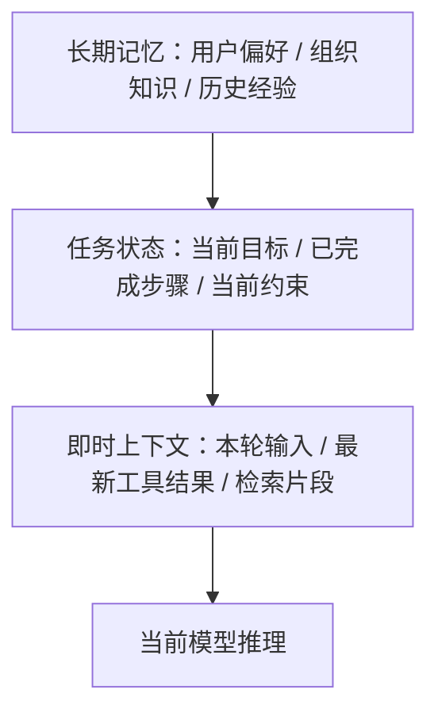

# AI Agent - 第 3 课：上下文、状态与记忆：Agent 为什么需要“脑子”和“笔记”

## 学习目标

- 彻底区分 `上下文`、`状态`、`工作记忆`、`长期记忆` 这些常被混用的概念。
- 理解为什么只靠聊天历史，Agent 很快就会“失忆”“跑偏”或“污染自己”。
- 能判断什么信息该放 prompt，什么信息该结构化存储，什么该进入记忆系统。
- 建立“上下文工程”的第一层世界观：模型的脑子，很多时候是系统拼出来的。
- 明白为什么后面我们还需要专门讲 `Memory`、`RAG`、`Context Engineering` 深水区。

## 先给结论

如果只记一句话，我希望你记住：

**Agent 不是靠“聊天记录很长”变聪明的，而是靠系统把“当下最重要的信息”在正确时机送进来。**

所以，真正决定 Agent 表现的，往往不是单次 prompt，而是三件事：

1. 它当前能看到什么
2. 它当前记得什么
3. 它当前处在什么任务状态

这三件事如果混在一起不区分，系统后面几乎一定会出问题。

---

## 1. 为什么聊天记录撑不起复杂 Agent

很多人刚做 Agent 时的第一反应是：

“模型不是能看上下文吗？那我把前面对话都带上不就行了。”

这个做法在简单场景里可以勉强成立，比如：

- 几轮咨询问答
- 简单内容润色
- 轻量知识问答

但一旦任务变复杂，很快会暴露出几个问题：

### 1.1 长度失控

对话越长，token 越多，成本越高，延迟越大。

### 1.2 重点丢失

模型虽然“都看到了”，但未必知道当前任务真正重要的是什么。

### 1.3 状态模糊

聊天记录不是状态机。  
你很难只靠自然语言历史，稳定判断：

- 哪些步骤已完成
- 当前卡在哪
- 哪些结论已证伪
- 哪一步需要人工接管

### 1.4 长任务不可恢复

任务执行到一半服务重启了，或者用户下次再来继续。  
仅靠聊天历史，你很难恢复一个复杂任务的精确中间状态。

所以，聊天历史最多只能算“信息来源之一”，它不能承担 Agent 的全部大脑功能。

---

## 2. 四个最容易混淆的词：上下文、状态、短期记忆、长期记忆

这四个词特别容易被混着用。  
你一定要先拆开。

### 2.1 上下文（Context）

上下文指的是：

**这一轮模型推理时，它实际能看到的输入集合。**

可能包括：

- 系统提示词
- 用户当前问题
- 最近几轮对话
- 当前任务摘要
- 工具返回结果
- 检索出的知识片段
- 安全约束

所以，上下文强调的是：

**“当前这一轮推理的视野”**

### 2.2 状态（State）

状态更偏结构化，强调的是：

**任务目前到底进行到哪里了。**

例如：

- 任务 ID
- 当前步骤
- 已完成步骤
- 最后一次工具调用状态
- 当前候选结论
- 是否进入等待人工确认

状态解决的是控制问题，而不是记忆问题。

### 2.3 短期记忆（Working Memory / Session Memory）

短期记忆更像这次任务里的临时工作台。

比如：

- 用户刚说过预算不能超过 3000
- 已经搜索过 3 个候选方案
- 当前重点在数据库连接池，而不是 MQ

这些信息对当前任务很重要，但未必值得长期保存。

### 2.4 长期记忆（Long-term Memory）

长期记忆是跨任务、跨会话仍然有复用价值的信息。

比如：

- 用户偏好：喜欢简洁回答
- 组织知识：审批流程规则、告警字段定义
- 历史经验：类似事故之前怎么处理过

它更像系统积累下来的“可复用经验”。

---

## 3. 一张图把它们放到一起



这张图里最关键的是：

- `长期记忆` 不是每次都全喂
- `状态` 是控制骨架
- `上下文` 是当前这一轮真正喂给模型的内容

如果把这三层都混成“历史消息列表”，后面一定会又贵又乱。

---

## 4. 上下文工程为什么比 Prompt Engineering 更重要

很多团队做 Agent 做着做着，会陷入一个误区：

只要效果不好，就继续改 prompt。

但真正影响效果的往往不是某一句神奇提示词，而是：

**在有限窗口里，到底给模型放进去了什么。**

这就是上下文工程。

你可以把它理解成四个核心问题：

1. 哪些信息必须出现？
2. 哪些信息应该摘要后出现？
3. 哪些信息应该按需检索后再注入？
4. 哪些信息根本不该让模型看见？

这件事的重要性远超很多人的直觉。

因为模型不是因为“看到很多信息”就更聪明，  
而是因为“看到恰当的信息”才更稳定。

---

## 5. 为什么“信息越多越好”是错觉

这是上下文设计里最危险的误区之一。

很多人会说：

“保险起见，把历史记录、所有工具原始结果、全部相关文档、全部用户画像都塞进去吧。”

听起来像是信息更全了，但实际上会带来至少五种问题：

### 5.1 注意力稀释

模型有限的注意力会被大量次要信息分散。

### 5.2 旧信息污染新任务

当前任务已经变了，但模型还在受旧上下文影响。

### 5.3 证据冲突

多个来源彼此矛盾，模型可能抓错主要依据。

### 5.4 成本和时延暴涨

token 越多越贵，生成也越慢。

### 5.5 幻觉更难定位

一旦输出错了，你很难判断它到底是被哪段上下文误导的。

所以，好上下文不是“大”，而是：

**相关、干净、足够。**

---

## 6. 一个很实用的分层方法：即时层、任务层、长期层

### 6.1 即时层：当前这一轮必须看的

例如：

- 用户刚发来的问题
- 最新工具结果
- 当前最关键的观察

它最接近“现在该怎么办”。

### 6.2 任务层：支撑整段执行过程的

例如：

- 目标
- 当前步骤
- 已完成任务
- 中间假设
- blocker

它最接近“这次任务到底做到哪了”。

### 6.3 长期层：未来还想复用的

例如：

- 用户偏好
- 组织规则
- 历史案例

它最接近“以后还能不能帮上忙”。

从系统设计看，这三层最好分别管理，而不是混成一个大 prompt。

---

## 7. 状态为什么必须结构化，而不是全写成自然语言

这是一个特别重要的工程判断。

一句话原则：

**凡是系统要依赖的东西，优先结构化；凡是给模型参考的东西，才优先自然语言。**

举例：

### 更适合结构化的内容

- 当前任务阶段：`planning / running / waiting_approval / done`
- 当前步数：`7`
- 最后一次工具调用是否成功：`true / false`
- 剩余预算：`$0.12`
- 是否允许写操作：`false`

### 更适合自然语言的内容

- 当前思路总结
- 中间结论解释
- 给用户的答复
- 检索内容摘要

为什么？

因为结构化状态适合：

- 稳定判断
- 约束执行
- 恢复任务
- 做审计

而自然语言适合：

- 推理
- 解释
- 形成语义联系

如果把系统控制逻辑建立在自然语言上，系统后面会非常脆。

---

## 8. 短期记忆和长期记忆，最大的区别不是时间，而是“写入门槛”

很多人会以为：

- 当前会话里的就是短期记忆
- 跨会话保存的就是长期记忆

这只是表面。

更深一层的区别是：

**长期记忆必须有更高的写入门槛。**

因为长期记忆一旦写进去，就会持续影响未来多个任务。

所以并不是：

“只要这个信息有点价值，就存下来。”

而应该问：

- 它未来复用概率高吗？
- 它会不会很快过时？
- 它会不会和已有记忆冲突？
- 它会不会带来隐私或权限风险？

举个例子：

### 值得进长期记忆

- 用户喜欢结果先给结论、再给推理过程
- 某业务团队统一使用特定术语
- 某系统事故排查一定优先看消费者堆积

### 不值得进长期记忆

- 这次任务里临时搜索出来的一条网页内容
- 某次中间步骤的瞬时结果
- 已过期的任务状态

长期记忆存多了并不一定更强，很多时候只会更脏。

---

## 9. 笔记系统为什么和记忆系统不一样

这两个东西很像，但不要混。

### 记忆

更像可复用经验、长期背景。

### 笔记

更像当前任务中显式记录下来的中间思路和事实。

例如一个研发助手在排查线上问题时，笔记可以记录：

- 已确认：支付请求量正常
- 已确认：数据库 RT 正常
- 待确认：MQ 消费者错误率上升原因
- 已排除：缓存命中率异常

笔记的最大价值是：

**把原本只存在于模型脑内的隐式过程，变成系统外部的显式状态。**

一旦做到这一步，你才能真正支持：

- 任务恢复
- 人工接管
- 多 Agent 协作
- 审计与复盘

所以笔记不是“额外装饰”，而是长任务系统的骨架之一。

---

## 10. 记忆和 RAG 的关系

这两个概念经常被混。

你可以先这么区分：

### RAG

强调从外部知识源按需检索信息。

比如：

- 公司文档
- 产品手册
- API 文档
- 历史复盘报告

### 记忆

强调与当前用户、当前 Agent、当前任务体系相关的历史信息。

比如：

- 用户偏好
- 某角色常见操作习惯
- 某任务类型的经验沉淀

所以它们不是互斥关系。  
很多成熟系统里：

- `RAG` 负责拿“外部知识”
- `Memory` 负责拿“内部经验”
- `State` 负责告诉系统“现在做到哪”

---

## 10b. 各层到底怎么存：从概念到工程栈的映射

前面 10 节把“上下文 / 状态 / 短期记忆 / 长期记忆 / 笔记”讲清楚了，但真实面试里最狠的一问永远是：

**“好，你说要分开，那分别存哪里？怎么读？怎么恢复？”**

这一节就把上面每一层，落成一张具体的工程实现表。

| 概念层 | 存哪里 | 数据结构 | 生命周期 | 典型操作 |
| --- | --- | --- | --- | --- |
| **上下文（Context）** | 不真存，**每轮运行时装配** | 按角色分块的 message 列表 | 请求级 | 装配、裁剪、压缩、Prompt Cache 命中 |
| **任务状态（State）** | OLTP（Postgres / MySQL）+ 事件日志（Kafka / WAL） | `run` + `step` 两张表 + event stream | 任务级，持久化 | 读写、checkpoint、replay、恢复 |
| **短期 / 工作记忆** | Redis / 内存 / LangGraph `State` | Key-Value + 结构化字段 | 会话级，TTL 自动过期 | set / get / append note / clear |
| **长期记忆** | 向量库 + OLTP + 画像表 + KG（按子类型选，见 10c） | 见 10c | 跨会话持久 | extract / search / update / forget |
| **笔记（Notes）** | 挂在任务状态上，或独立 notes 表 | 结构化 checklist + 自由文本 | 任务级 | append / pin / reorganize |

下面拆开讲每一层的工程决策。

### 10b.1 上下文不是“存”出来的，是“装”出来的

每一轮推理前，系统从其他层拿数据，按模板拼成最终 prompt。所以上下文本身没有持久化，真正持久化的是构成它的组件。

但上下文有一个运行时优化必须讲清楚，它是 2024-2026 Agent 成本控制的核心——**Prompt Cache**。要讲清 Prompt Cache，得先讲清 LLM 推理的两阶段。

#### 先理解 LLM 推理的两阶段：Prefill vs Decode

一次 LLM 请求内部分两步：

| 阶段 | 做什么 | 算力占比 | 类比 |
| --- | --- | --- | --- |
| **Prefill（预填）** | 把整段 prompt 读进去，**一次性**计算每层每 token 的注意力矩阵 K 和 V | **80-90%** | SQL 的 "query planning"：一次性构建执行计划 |
| **Decode（解码）** | 基于 Prefill 的 KV 矩阵，**逐 token** 生成输出 | 10-20% | SQL 的 "row-by-row scan"：基于计划一行行产出 |

关键事实：**一次 LLM 调用里 80-90% 的算力花在 Prefill，不是 Decode**，尤其是 prompt 长、输出短的场景——而 Agent 循环正好就是这种形态（10K+ token 的 system prompt + 工具定义 + 历史，几百 token 的输出）。

#### 什么是 KV Cache

Transformer 每一层每个 token 会算出两个矩阵：**K (Key) 和 V (Value)**，用于后续 token 计算 attention。这些矩阵被保存在 GPU 显存里，就叫 KV Cache。它是 Prefill 阶段的副产物，也是 Decode 阶段反复用到的东西。

#### Prompt Cache 的原理

provider 把上一次请求 Prefill 算出的 KV 矩阵缓存下来，**下一个请求只要前缀一字不差，就跳过 Prefill**，直接用缓存的 KV 进入 Decode。

三家 provider 的实现对比：

| Provider | 触发方式 | 命中价格 | TTL |
| --- | --- | --- | --- |
| **Anthropic Claude** | 显式打 `cache_control` marker | **0.1× input 价**（省 90%） | 5 分钟 / 1 小时 |
| **OpenAI** | ≥1024 token 前缀**自动命中** | **0.5× input 价**（省 50%） | 5-60 分钟 |
| **Google Gemini** | 显式 Context Caching API | **~0.25×**（省 75%） | 默认 1 小时 |

#### 为什么 Agent 循环受益特别大

一次 Agent 任务的 prompt 结构是：

```
[system prompt] + [工具定义 JSON] + [历史 step 1~N-1] + [当前 step N]
└──────── 前缀，每轮都重复 ────────┘     └── 唯一变化 ──┘
```

每走一步，只有最后一段变，前面 95%+ 是相同前缀。**命中率能做到 80-95%**。

具体算一笔账（Claude Sonnet，input $3/M，cached read $0.3/M）：

- 10K token 前缀 × 20 步 Agent 任务
- 不开 cache：`10000 × 20 × $3/M = $0.60`
- 开 cache（第 1 步写入，后 19 步命中）：`10000 × $3/M + 10000 × 19 × $0.3/M = $0.03 + $0.057 ≈ $0.087`
- **差距 6-7 倍**

这就是为什么业界把 "Prompt Cache 命中率" 当 Agent 核心指标之一——命中率从 50% 提到 90%，等于账单直接对半砍。

#### 别和这两个东西混

面试/文档里常把下面三层混淆，实际上是不同架构层的三件事：

| 层 | 名字 | 在哪里 | 省的是什么 |
| --- | --- | --- | --- |
| **应用 / 网关层** | **Response Cache** | 自己的 Redis / CDN | 完全跳过 LLM 调用（相同请求直接返回上次响应） |
| **Provider 侧** | **Prompt Cache** | provider 的 KV Cache | 跳过 Prefill 阶段（仍然走 LLM，只是便宜 2-10 倍） |
| **路由 / 调度层** | **Sticky Session** | 负载均衡 / 推理框架（vLLM PagedAttention 等） | 把同一 session 请求打到同一 GPU，让 KV Cache 留在显存不被换出 |

自建推理（vLLM / SGLang）时三层都要自己管；调 API 时主要关心第 1、2 层——第 2 层由 provider 提供，你只负责把 prompt 写成"前缀稳定"的形状。

### 10b.2 任务状态：最小表结构

参考第 1 课末尾讲的 Workflow Engine 类比，状态层的最小表结构通常是：

```sql
-- 任务主体（对应 Temporal 的 Workflow）
CREATE TABLE agent_runs (
  run_id           UUID PRIMARY KEY,
  user_id          BIGINT,
  goal             TEXT,
  phase            ENUM('planning','running','waiting_approval','done','failed'),
  current_step     INT,
  budget_remaining NUMERIC,
  started_at       TIMESTAMP,
  updated_at       TIMESTAMP
);

-- 每一步（对应 Temporal 的 Activity）
CREATE TABLE agent_steps (
  step_id     UUID PRIMARY KEY,
  run_id      UUID,
  seq         INT,
  kind        ENUM('llm','tool','human','subagent'),
  input       JSONB,
  output      JSONB,
  tokens_in   INT,
  tokens_out  INT,
  cost_usd    NUMERIC(10,6),
  state       ENUM('pending','running','ok','failed','cancelled'),
  started_at  TIMESTAMP,
  ended_at    TIMESTAMP
);
```

再加一个 **append-only 事件日志** 记录所有状态转移（`step_started / tool_called / llm_replied / approval_waited / step_finished / run_cancelled`…），任务崩溃后可以按事件重放恢复。这是 Claude Code / Cursor Agent / LangGraph 都在用的同一套模式。

### 10b.3 短期记忆为什么用 Redis 而不是 OLTP

- 会话级数据会被频繁 append / read
- TTL 是天然需求（任务结束自动回收）
- 不需要 ACID，只需要 consistency-within-session
- 延迟要求 < 5ms（每轮推理前都要读）

典型字段长这样：

```json
{
  "session_id": "...",
  "scratchpad": "用户已确认预算<3000；已排除方案A...",
  "confirmed_facts": ["budget<3000", "region=shanghai"],
  "pending_questions": ["具体入住日期？"],
  "tool_call_cache": {
    "search_hotel:shanghai:2026-05": {"result_ref":"..."}
  }
}
```

LangGraph 的 `State` 对象本质就是这个；MemGPT 的 `core memory` 也是同一个东西；Claude Agent SDK 的 `context state` 同源。

### 10b.4 笔记：任务态里的显式化中间产物

笔记（第 9 节讲过）在存储上并不是新一层，它通常**挂在任务状态上**，以 artifact 形式存在：

```sql
CREATE TABLE agent_notes (
  note_id     UUID PRIMARY KEY,
  run_id      UUID,
  kind        ENUM('checklist','observation','hypothesis','blocker'),
  content     TEXT,
  pinned      BOOLEAN,    -- 是否始终进上下文
  created_at  TIMESTAMP
);
```

关键词是 `pinned`——pinned 笔记每轮都进上下文（不怕长度），非 pinned 按需召回。这是 Claude Code 的 `TODO` 机制 / Cursor Agent 的 `plan.md` / Manus 的 `artifact pin` 的共同抽象。

---

## 10c. 长期记忆的四个子类型与各自存储

这一节是面试里最容易露馅的地方。认知科学里，长期记忆不是一块，而是**四类**，业界（MemGPT / Mem0 / Zep / Letta）全按这个分法实现。只讲“短期 / 长期”二分法是 2022 年的水平。

```
Profile      = "你是谁"           → 稳定、全量注入
Semantic     = "你知道什么事实"    → 较稳定、按需检索
Procedural   = "你会做什么套路"    → 较稳定、按任务模板命中
Episodic     = "你经历过什么"      → 大量增长、按相关性检索
```

### 10c.1 Episodic Memory（情景记忆）

**存什么**：具体发生过的事件、对话、交互。

例子：
- “用户张三 2026-03-15 问我 K8s Pod OOM 怎么排查，我用 tool A、B、C 回答”
- “上次做数据库迁移的对话里，用户否决了方案 B，原因是风控”

**存哪里**：

```
raw 对话 / trace        → 对象存储（S3）
metadata + LLM 摘要     → Postgres（按时间 / 用户过滤）
embedding               → 向量库（ch31），按语义检索
```

**表结构**：

```sql
CREATE TABLE episodic_memories (
  episode_id     UUID PRIMARY KEY,
  user_id        BIGINT,
  session_id     UUID,
  summary        TEXT,          -- LLM 摘要
  raw_uri        TEXT,          -- 对象存储 URI
  embedding      VECTOR(1536),
  importance     NUMERIC(4,3),  -- 重要度打分
  last_accessed  TIMESTAMP,     -- 供衰减用
  created_at     TIMESTAMP
);
```

**召回方式**：用当前任务的 query 做向量检索，top-k episode 摘要进上下文；raw 只在需要深挖时拉（贵）。

### 10c.2 Semantic Memory（语义记忆 / 事实库）

**存什么**：去掉了“什么时候发生”语境的、稳定的事实。

例子：
- “用户偏好 Python，不喜欢 Go”
- “公司告警阈值：延迟 > 500ms 升 P1”
- “DB_A 的 schema 有 user_id 字段但没有 email”

**存哪里**（两种主流选择）：

**选择 A：Knowledge Graph（Neo4j / JanusGraph）**

事实存成三元组：
```
(user:张三) --[prefers]--> (language:Python)
(user:张三) --[dislikes]--> (language:Go)
```

优点：关系查询强（“张三不喜欢什么语言”秒答），冲突容易发现（同主体同谓词多 object）。缺点：工程复杂，团队门槛高。**Zep 走的就是这条路线。**

**选择 B：Postgres + 向量索引（更常见）**

```sql
CREATE TABLE semantic_facts (
  fact_id      UUID PRIMARY KEY,
  subject      VARCHAR(128),   -- "user:张三" / "org:acme"
  predicate    VARCHAR(64),
  object       TEXT,
  confidence   NUMERIC(4,3),
  source_ref   TEXT,           -- 回指到 episode
  valid_from   TIMESTAMP,
  valid_to     TIMESTAMP,      -- 支持"失效"
  embedding    VECTOR(1536),
  UNIQUE(subject, predicate, object, valid_from)
);
```

`valid_from / valid_to` 是关键——**事实有时间性**。“张三偏好 Python”可能三个月后失效。Zep 的 Temporal KG 和 Mem0 的 `UPDATE / DELETE` 操作本质都是这一对字段的游戏。

### 10c.3 Procedural Memory（过程记忆 / 技能）

**存什么**：做一类任务的“套路”——用哪些工具，按什么顺序，遇到什么情况走哪个分支。

例子：
- “排查 Pod OOM：先看 metrics，再看 events，再看 logs”
- “发布流程：改 config → 跑 test → PR → deploy”

**存哪里**：

```
workflow 模板          → Git / prompt library
调用序列 + 参数         → Postgres（procedure 表）
embedding              → 向量库（按任务类型检索 procedure）
```

这一类实际上和第 33 章的 Prompt 管理平台深度重合。面试时如果能说出 **“Procedural memory 本质就是 prompt 版本化 + 工作流模板”**，会是很强的加分。

### 10c.4 User / Org Profile（画像记忆）

**存什么**：相对稳定的用户 / 组织属性。

例子：
- “张三：senior backend，5 年经验，Python + Go”
- “公司 Acme：医疗行业，合规敏感，禁止 GPT-4”

**存哪里**：结构化 Postgres，或直接挂在 Feature Store（第 37 章）。**不需要向量**，因为每个请求都全量加载（体积通常 < 1KB）。

```sql
CREATE TABLE user_profile (
  user_id      BIGINT PRIMARY KEY,
  preferences  JSONB,   -- {"response_style":"concise", ...}
  attributes   JSONB,   -- {"role":"sre","seniority":"senior"}
  constraints  JSONB,   -- {"forbidden_tools":[...]}
  updated_at   TIMESTAMP
);
```

### 10c.5 四类的使用时机

```
每轮推理 = Profile 全量 + Semantic top-k + Procedural 命中 + Episodic top-k + 短期记忆 + 当前状态
```

其中 Profile 每次全加，后三类都是**检索式按需注入**。这也是为什么 10d 要讲读取预算。

### 10c.6 "存哪里"为什么看起来那么多？三种"多"要分清

读到这里最容易卡住的一点：10b 总表写"长期记忆 = 向量库 + OLTP + 画像表 + KG"，10c 每个子类又写"存在 A 或 B"——**到底是多选一，还是组合用？**

答案是这里有**三种不同含义的"多"**，混在一起讲就乱了。

#### 含义一：同一条记忆 → 多种介质分工存（必须组合）

一条 episodic 记忆"用户张三 3-15 问 K8s OOM"**不是 3 份数据，是同一件事的 3 个视图**：

| 介质 | 存什么 | 为什么必须用它 |
| --- | --- | --- |
| 对象存储（S3） | 原始对话 trace / 工具调用 raw | 体积大（几十 KB-几 MB），审计和 replay 用 |
| Postgres | 摘要 + 元数据（user_id / time / importance） | 按用户、按时间精确过滤 |
| 向量库 | 摘要的 embedding | 按语义检索"找和当前问题相似的过去事件" |

类比：一部电影的**原片在硬盘**、**海报和剧情在网站 DB**、**"相似电影"靠 embedding**——三份都指同一部电影，但各自干一件别的介质干不了的事。**这种组合是必选项，不是可选。**

#### 含义二：同一类记忆 → 多种方案二选一（按团队能力选）

Semantic Memory 写"KG 或 Postgres + 向量"——这是**二选一**，不是两个都上：

| 方案 | 选它当 | 代价 |
| --- | --- | --- |
| Knowledge Graph（Zep 路线） | 关系查询重要（"张三不喜欢什么"秒答）、要跨主体做事实推理 | Neo4j 运维门槛高，团队没人会就是噩梦 |
| Postgres + pgvector（Mem0 路线） | 关系查询需求简单、团队熟 Postgres | 复杂关系查询要写多层 JOIN |

**默认选 B**。只有做**企业级多租户事实推理**（医疗病历、法律案件、合规追溯）时才值得上 KG。

Procedural Memory 里"Git / prompt library / 向量库"也是同理——小规模就 Git + 一张简单表；规模大了（procedure > 100 个）才加向量检索做 "按任务相似度选套路"。

#### 含义三：不同类记忆 → 各自独立表（天生分开）

最容易被误解的一点：四个子类是**四个独立的子系统**，不是"一条记忆存 4 次"：

| 子类 | 表 | 为什么分开 |
| --- | --- | --- |
| Episodic | S3 + episodic_memories + 向量 | 量大、按时间/语义检索 |
| Semantic | semantic_facts（带 valid_from/valid_to） | 要支持"事实失效"语义 |
| Procedural | Git + procedure 表 | 本质是版本化 prompt/工作流 |
| Profile | user_profile（JSONB） | 每请求全量加载，不需要检索 |

一条原始事件最多**分解**到 4 个子系统，每个子系统内部只一条记录。

#### 决策树：一条原始事件进来，怎么落地

```
原始事件：用户张三 3-15 问 "K8s Pod OOM 怎么排查"，
         Agent 调 tool A/B/C，结论"是 memory limit 设低了"，
         用户顺口说了句"我一般用 Python 写运维脚本"

  ↓ 事件结束，记忆 extractor（LLM-gated 或 rule-based）扫描：

┌────────────────────────────────────────────────────────────┐
│ 1. 这是一次具体交互？                                         │
│    → 是 → 写 Episodic：                                      │
│      ● 原 trace           → S3                               │
│      ● 摘要 + metadata    → Postgres episodic_memories       │
│      ● 摘要 embedding     → 向量库                           │
│                                                              │
│ 2. 对话里冒出稳定事实？                                      │
│    → "张三偏好 Python"   → 写 Semantic：                     │
│      ● semantic_facts 一行 (subject/predicate/object)        │
│      ● 冲突检测：张三以前有没有别的 language 偏好？           │
│                                                              │
│ 3. 走通了一个有复用价值的套路？                              │
│    → "OOM 排查 = metrics → events → logs" → 写 Procedural    │
│      ● procedure 表 / prompt library                         │
│                                                              │
│ 4. 画像属性要更新？                                          │
│    → "张三 = SRE" 已知就不写；新发现就 UPDATE user_profile    │
└────────────────────────────────────────────────────────────┘
```

**写** 的时候分四条路分开写（性质不同），**读** 的时候四条路并行查（都要进上下文）——这是完整的读写对称。

#### 30 秒面试版答案

> "多存"有三种情况要分清：**一条记忆跨介质分工**（原文 S3、摘要 Postgres、embedding 向量库，三份数据指同一事，必选组合）、**同类记忆选路线**（KG 或 Postgres+向量，默认选后者，二选一）、**不同子类记忆各走各的表**（Episodic/Semantic/Procedural/Profile 四张独立表，天生分开）。一条原始事件进来，extractor 把它分解到最多 4 个子系统，每个子系统内部只一条记录。

---

## 10d. 写入、读取、冲突、遗忘

记忆系统真正难的不是“怎么存”，而是：

- 什么时候写？写什么？谁来判断？
- 什么时候读？读多少？读哪条？
- 两条记忆打架了怎么办？
- 什么时候该忘掉？

### 10d.1 写入策略（四种，按成本 / 质量权衡）

| 策略 | 说明 | 成本 | 质量 | 典型场景 |
| --- | --- | --- | --- | --- |
| **Sync inline** | 每轮推理后立即抽取并写入 | 高（每轮多一次 LLM 调用） | 高 | 客服、重要决策 |
| **Async batch** | 会话结束后批处理抽取 | 低 | 中（有延迟） | 通用场景主流做法 |
| **LLM-gated** | 模型的工具列表里有 `save_memory`，自己决定 | 中 | 高（但看模型判断） | ChatGPT Memory、Claude Projects |
| **Rule-based** | 显式触发（“记住我偏好 X”） | 零 | 用户可控但遗漏多 | 辅助以上三种 |

2024-2026 业界主流是 **Async batch + LLM-gated 组合**：会话结束跑一次批抽取，同时任务进行中允许模型主动 `save_memory`。

### 10d.2 读取策略与窗口预算

一次推理前要决定读什么记忆进上下文。三条路径组合：

1. **Always-load**（Profile）：体积小，全量注入到 system prompt；
2. **Retrieval**（Semantic + Episodic）：对当前 query 做向量检索 top-k（通常 5-10）；
3. **Salience score**（Episodic）：`score = importance × recency × frequency`，高分保留。

**记忆窗口预算**：通常把长期记忆控制在上下文的 **10-20%**（例如 200K context 里最多塞 20-40K 记忆），超过就会干扰当前任务。这是 2025 年之后普遍共识——长 context 不等于该把记忆全塞进去。

### 10d.3 冲突处理（Memory Conflict）

两条记忆矛盾时怎么办：

- **Temporal precedence**：`valid_to` 新覆盖旧（默认策略）；
- **Source confidence**：用户显式确认 > LLM 抽取；
- **Active reconciliation**：写入前 LLM 先判断“这条是否和已有记忆冲突”，冲突则触发 update 或保留双版本；
- **Mem0 的方案**：每条写入都做 `ADD / UPDATE / DELETE / NOOP` 四分类决策，相当于把 CRUD 语义暴露给 LLM。

**面试原题**：
> “张三半年前说喜欢 Python，现在说改用 Go 了，你怎么处理？”

**正确答法**：不是覆盖，而是让旧事实 `valid_to = now()` 失效，新事实 `valid_from = now()` 生效，保留时间线。这是 Zep 的 Temporal KG 核心设计。

### 10d.4 遗忘（Forgetting）

**为什么必须遗忘**：

- 过时信息继续召回 → 决策错乱；
- 记忆无限增长 → 向量库召回精度随规模衰减；
- GDPR / 隐私合规 → 必须支持 Right to be forgotten。

**四种机制**：

1. **TTL**：episodic memory 超过 N 月自动归档到冷存储；
2. **Decay scoring**：`score = importance × exp(-λ × days_since_access)`，长期没被召回的下沉；
3. **Explicit delete**：用户 / 合规工单触发，**跨存储级联删除**（向量 + 原文 + 画像字段 + KG 边）；
4. **Consolidation**：10 条相似记忆合并成 1 条摘要，类似人类“记得大概但忘了细节”。

**工程最易漏的点：删除必须级联**。向量库删了但原文没删，下次检索会 404；原文删了但向量没删，搜出来指向空 id。这就是第 36 章为什么把 Artifact lineage 做成一等对象——删除是一个 lineage-wide 操作。

---

## 10e. 真实系统怎么做的（2024-2026 参考架构）

能顺口说出下面几个系统的名字和设计亮点，立刻让面试官觉得“读过源码 / 跟过社区”。

| 系统 | 分层 | 核心机制 | 存储栈 | 最值得偷师的点 |
| --- | --- | --- | --- | --- |
| **MemGPT / Letta** | Core memory（在上下文）+ Archival memory（外存） | OS 风格分页：模型自己调 `recall` 把外存换进上下文 | SQLite + 向量 | 把“模型管理自己的记忆”变成一等能力 |
| **Mem0**（2024） | Episodic + Semantic 双层 | 抽取管线：LLM 读对话 → 生成 fact → 查重 → `ADD/UPDATE/DELETE/NOOP` | 向量库 + Graph（可选） | **写入时的 CRUD 语义**，防止脏记忆累积 |
| **Zep** | 消息层 + 事实层 + 时间知识图谱 | Temporal KG：每条事实 `valid_from / valid_to`，事实可 invalidate | Postgres + Graph | **时间性事实**，解决“用户改主意”场景 |
| **LangGraph Checkpointer** | State + Thread | 图状态序列化，多后端（Postgres / Redis / SQLite） | 可插拔 | **Thread / Checkpoint 抽象**，直接断点续跑 |
| **ChatGPT Memory**（2024） | 用户级 fact list | LLM-gated 写入，用户可见可编辑 | OpenAI 内部 | **用户可见可删**，合规友好 |
| **Claude Projects + Memory**（2024-2025） | Project-scoped files + cross-project memory | 手动 pin + 自动抽取混合 | 内部 | **Project scope 隔离**，工作 / 生活分区 |
| **Cursor Memory / Windsurf Cascade Memories**（2025-2026） | Repo-scoped rules + preferences | 交互中学习，持久化为仓库级规则文件 | 文件系统 + 内部 | **规则文件化**，可进版本控制 |
| **Claude Agent SDK**（2025） | State + File-backed memory + Memory Tool | Checkpointing + `memory_tool` | SQLite + 文件 | **Memory 作为工具**，和工具系统同构 |

### 10e.1 可以直接复用的五条架构共识

1. **记忆是工具的一种**（MemGPT / ChatGPT / Claude Agent SDK）：模型通过 `save_memory` / `recall_memory` 显式调用，而不是系统隐式后台运行。
2. **写入要有 CRUD 语义**（Mem0 开创）：不是只能 append，还要能 update / invalidate / delete。
3. **事实要带时间**（Zep 开创）：否则一年后你的记忆仓库就是一堆“曾经成立过的矛盾事实”。
4. **Checkpoint 必须 first-class**（LangGraph）：不是附加功能，是状态层的核心能力。
5. **用户可见 + 可编辑**（ChatGPT Memory / Claude Projects）：既是合规需要，也是让用户帮你清理脏记忆的最便宜方案。

### 10e.2 面试里的 30 秒版答案

> “我们的记忆架构分四层：Profile 全量注入；Semantic 走 Postgres + 向量 + 时间戳版本；Procedural 复用 Prompt 管理平台的模板；Episodic 走对象存储 + 向量检索，按 salience score 召回。写入用 async batch + LLM-gated 混合，冲突按时间戳 + confidence 优先，遗忘走 TTL + decay + 显式删除三路。参考系是 Mem0 的 CRUD 语义、Zep 的时间知识图谱、LangGraph 的 checkpointer。”

能这么答，这一题基本稳了。

---

## 11. 一个成熟 Agent 的脑子，通常是“拼出来的”

这句话很关键：

**Agent 的脑子，不是天然全在模型里，而是系统拼出来的。**

它通常由下面几部分组成：

- 系统提示词：角色和边界
- 当前输入：用户这次想干什么
- 任务状态：当前执行进度
- 工作记忆：当前任务的临时重点
- 检索知识：需要时补进来的资料
- 长期记忆：未来可复用的偏好和经验
- 工具结果：最新观察

所以你如果以后想优化一个 Agent，不要只想着“换更强模型”。  
很多时候真正更有效的是：

- 改上下文装配
- 改状态结构
- 改记忆写入策略
- 改检索粒度

这也是为什么后面我们要把 `Memory`、`RAG`、`Context Engineering` 分开讲。

---

## 12. 典型失败模式：没有区分信息层次

下面这些问题，很多项目都踩过。

### 12.1 所有信息都塞对话历史

后果：

- 成本上涨
- 重点模糊
- 长任务越来越不稳

### 12.2 把系统状态写成自然语言摘要

后果：

- 状态不可精确恢复
- 逻辑判断变脆

### 12.3 长期记忆无门槛写入

后果：

- 脏记忆越来越多
- 未来召回噪声越来越大

### 12.4 不做笔记，只靠模型隐式推理

后果：

- 中断难恢复
- 多人难协作
- 回放难排障

所以如果你只想记住一个工程启发，可以记这个：

**Agent 不是“让模型记住更多”，而是“把不同类型的信息放到正确的系统位置上”。**

---

## 小结

这一课最重要的是把几个概念彻底拆开：

- `上下文`：这一轮模型能看到什么
- `状态`：任务现在进行到哪
- `短期记忆`：当前任务里的临时工作记忆
- `长期记忆`：跨任务仍然有复用价值的信息

如果你以后做 Agent，只靠聊天历史推进复杂任务，基本迟早会碰到：

- 失忆
- 跑偏
- 污染
- 成本失控
- 难以恢复

真正更稳的办法是：

**让系统承担“脑子拼装器”的责任。**

---

## 问题

1. 为什么说聊天历史不能等价于状态机？
2. 什么类型的信息应该结构化存储，而不是写成自然语言？
3. 为什么长期记忆需要比短期记忆更高的写入门槛？
4. 笔记系统和长期记忆系统最大的区别是什么？
