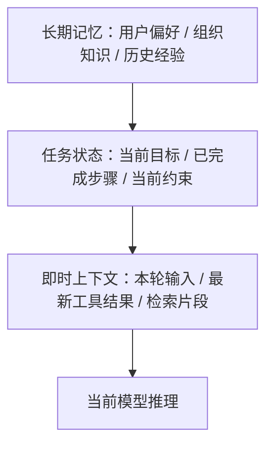

# AI Agent - 第 3 课：上下文、状态与记忆：Agent 为什么需要“脑子”和“笔记”

## 学习目标

- 彻底区分 `上下文`、`状态`、`工作记忆`、`长期记忆` 这些常被混用的概念。
- 理解为什么只靠聊天历史，Agent 很快就会“失忆”“跑偏”或“污染自己”。
- 能判断什么信息该放 prompt，什么信息该结构化存储，什么该进入记忆系统。
- 建立“上下文工程”的第一层世界观：模型的脑子，很多时候是系统拼出来的。
- 明白为什么后面我们还需要专门讲 `Memory`、`RAG`、`Context Engineering` 深水区。

## 先给结论

如果只记一句话，我希望你记住：

**Agent 不是靠“聊天记录很长”变聪明的，而是靠系统把“当下最重要的信息”在正确时机送进来。**

所以，真正决定 Agent 表现的，往往不是单次 prompt，而是三件事：

1. 它当前能看到什么
2. 它当前记得什么
3. 它当前处在什么任务状态

这三件事如果混在一起不区分，系统后面几乎一定会出问题。

---

## 1. 为什么聊天记录撑不起复杂 Agent

很多人刚做 Agent 时的第一反应是：

“模型不是能看上下文吗？那我把前面对话都带上不就行了。”

这个做法在简单场景里可以勉强成立，比如：

- 几轮咨询问答
- 简单内容润色
- 轻量知识问答

但一旦任务变复杂，很快会暴露出几个问题：

### 1.1 长度失控

对话越长，token 越多，成本越高，延迟越大。

### 1.2 重点丢失

模型虽然“都看到了”，但未必知道当前任务真正重要的是什么。

### 1.3 状态模糊

聊天记录不是状态机。  
你很难只靠自然语言历史，稳定判断：

- 哪些步骤已完成
- 当前卡在哪
- 哪些结论已证伪
- 哪一步需要人工接管

### 1.4 长任务不可恢复

任务执行到一半服务重启了，或者用户下次再来继续。  
仅靠聊天历史，你很难恢复一个复杂任务的精确中间状态。

所以，聊天历史最多只能算“信息来源之一”，它不能承担 Agent 的全部大脑功能。

---

## 2. 四个最容易混淆的词：上下文、状态、短期记忆、长期记忆

这四个词特别容易被混着用。  
你一定要先拆开。

### 2.1 上下文（Context）

上下文指的是：

**这一轮模型推理时，它实际能看到的输入集合。**

可能包括：

- 系统提示词
- 用户当前问题
- 最近几轮对话
- 当前任务摘要
- 工具返回结果
- 检索出的知识片段
- 安全约束

所以，上下文强调的是：

**“当前这一轮推理的视野”**

### 2.2 状态（State）

状态更偏结构化，强调的是：

**任务目前到底进行到哪里了。**

例如：

- 任务 ID
- 当前步骤
- 已完成步骤
- 最后一次工具调用状态
- 当前候选结论
- 是否进入等待人工确认

状态解决的是控制问题，而不是记忆问题。

### 2.3 短期记忆（Working Memory / Session Memory）

短期记忆更像这次任务里的临时工作台。

比如：

- 用户刚说过预算不能超过 3000
- 已经搜索过 3 个候选方案
- 当前重点在数据库连接池，而不是 MQ

这些信息对当前任务很重要，但未必值得长期保存。

### 2.4 长期记忆（Long-term Memory）

长期记忆是跨任务、跨会话仍然有复用价值的信息。

比如：

- 用户偏好：喜欢简洁回答
- 组织知识：审批流程规则、告警字段定义
- 历史经验：类似事故之前怎么处理过

它更像系统积累下来的“可复用经验”。

---

## 3. 一张图把它们放到一起

这张图里最关键的是：

- `长期记忆` 不是每次都全喂
- `状态` 是控制骨架
- `上下文` 是当前这一轮真正喂给模型的内容

如果把这三层都混成“历史消息列表”，后面一定会又贵又乱。

---

## 4. 上下文工程为什么比 Prompt Engineering 更重要

很多团队做 Agent 做着做着，会陷入一个误区：

只要效果不好，就继续改 prompt。

但真正影响效果的往往不是某一句神奇提示词，而是：

**在有限窗口里，到底给模型放进去了什么。**

这就是上下文工程。

你可以把它理解成四个核心问题：

1. 哪些信息必须出现？
2. 哪些信息应该摘要后出现？
3. 哪些信息应该按需检索后再注入？
4. 哪些信息根本不该让模型看见？

这件事的重要性远超很多人的直觉。

因为模型不是因为“看到很多信息”就更聪明，  
而是因为“看到恰当的信息”才更稳定。

---

## 5. 为什么“信息越多越好”是错觉

这是上下文设计里最危险的误区之一。

很多人会说：

“保险起见，把历史记录、所有工具原始结果、全部相关文档、全部用户画像都塞进去吧。”

听起来像是信息更全了，但实际上会带来至少五种问题：

### 5.1 注意力稀释

模型有限的注意力会被大量次要信息分散。

### 5.2 旧信息污染新任务

当前任务已经变了，但模型还在受旧上下文影响。

### 5.3 证据冲突

多个来源彼此矛盾，模型可能抓错主要依据。

### 5.4 成本和时延暴涨

token 越多越贵，生成也越慢。

### 5.5 幻觉更难定位

一旦输出错了，你很难判断它到底是被哪段上下文误导的。

所以，好上下文不是“大”，而是：

**相关、干净、足够。**

---

## 6. 一个很实用的分层方法：即时层、任务层、长期层

### 6.1 即时层：当前这一轮必须看的

例如：

- 用户刚发来的问题
- 最新工具结果
- 当前最关键的观察

它最接近“现在该怎么办”。

### 6.2 任务层：支撑整段执行过程的

例如：

- 目标
- 当前步骤
- 已完成任务
- 中间假设
- blocker

它最接近“这次任务到底做到哪了”。

### 6.3 长期层：未来还想复用的

例如：

- 用户偏好
- 组织规则
- 历史案例

它最接近“以后还能不能帮上忙”。

从系统设计看，这三层最好分别管理，而不是混成一个大 prompt。

---

## 7. 状态为什么必须结构化，而不是全写成自然语言

这是一个特别重要的工程判断。

一句话原则：

**凡是系统要依赖的东西，优先结构化；凡是给模型参考的东西，才优先自然语言。**

举例：

### 更适合结构化的内容

- 当前任务阶段：`planning / running / waiting_approval / done`
- 当前步数：`7`
- 最后一次工具调用是否成功：`true / false`
- 剩余预算：`$0.12`
- 是否允许写操作：`false`

### 更适合自然语言的内容

- 当前思路总结
- 中间结论解释
- 给用户的答复
- 检索内容摘要

为什么？

因为结构化状态适合：

- 稳定判断
- 约束执行
- 恢复任务
- 做审计

而自然语言适合：

- 推理
- 解释
- 形成语义联系

如果把系统控制逻辑建立在自然语言上，系统后面会非常脆。

---

## 8. 短期记忆和长期记忆，最大的区别不是时间，而是“写入门槛”

很多人会以为：

- 当前会话里的就是短期记忆
- 跨会话保存的就是长期记忆

这只是表面。

更深一层的区别是：

**长期记忆必须有更高的写入门槛。**

因为长期记忆一旦写进去，就会持续影响未来多个任务。

所以并不是：

“只要这个信息有点价值，就存下来。”

而应该问：

- 它未来复用概率高吗？
- 它会不会很快过时？
- 它会不会和已有记忆冲突？
- 它会不会带来隐私或权限风险？

举个例子：

### 值得进长期记忆

- 用户喜欢结果先给结论、再给推理过程
- 某业务团队统一使用特定术语
- 某系统事故排查一定优先看消费者堆积

### 不值得进长期记忆

- 这次任务里临时搜索出来的一条网页内容
- 某次中间步骤的瞬时结果
- 已过期的任务状态

长期记忆存多了并不一定更强，很多时候只会更脏。

---

## 9. 笔记系统为什么和记忆系统不一样

这两个东西很像，但不要混。

### 记忆

更像可复用经验、长期背景。

### 笔记

更像当前任务中显式记录下来的中间思路和事实。

例如一个研发助手在排查线上问题时，笔记可以记录：

- 已确认：支付请求量正常
- 已确认：数据库 RT 正常
- 待确认：MQ 消费者错误率上升原因
- 已排除：缓存命中率异常

笔记的最大价值是：

**把原本只存在于模型脑内的隐式过程，变成系统外部的显式状态。**

一旦做到这一步，你才能真正支持：

- 任务恢复
- 人工接管
- 多 Agent 协作
- 审计与复盘

所以笔记不是“额外装饰”，而是长任务系统的骨架之一。

---

## 10. 记忆和 RAG 的关系

这两个概念经常被混。

你可以先这么区分：

### RAG

强调从外部知识源按需检索信息。

比如：

- 公司文档
- 产品手册
- API 文档
- 历史复盘报告

### 记忆

强调与当前用户、当前 Agent、当前任务体系相关的历史信息。

比如：

- 用户偏好
- 某角色常见操作习惯
- 某任务类型的经验沉淀

所以它们不是互斥关系。  
很多成熟系统里：

- `RAG` 负责拿“外部知识”
- `Memory` 负责拿“内部经验”
- `State` 负责告诉系统“现在做到哪”

---

## 11. 一个成熟 Agent 的脑子，通常是“拼出来的”

这句话很关键：

**Agent 的脑子，不是天然全在模型里，而是系统拼出来的。**

它通常由下面几部分组成：

- 系统提示词：角色和边界
- 当前输入：用户这次想干什么
- 任务状态：当前执行进度
- 工作记忆：当前任务的临时重点
- 检索知识：需要时补进来的资料
- 长期记忆：未来可复用的偏好和经验
- 工具结果：最新观察

所以你如果以后想优化一个 Agent，不要只想着“换更强模型”。  
很多时候真正更有效的是：

- 改上下文装配
- 改状态结构
- 改记忆写入策略
- 改检索粒度

这也是为什么后面我们要把 `Memory`、`RAG`、`Context Engineering` 分开讲。

---

## 12. 典型失败模式：没有区分信息层次

下面这些问题，很多项目都踩过。

### 12.1 所有信息都塞对话历史

后果：

- 成本上涨
- 重点模糊
- 长任务越来越不稳

### 12.2 把系统状态写成自然语言摘要

后果：

- 状态不可精确恢复
- 逻辑判断变脆

### 12.3 长期记忆无门槛写入

后果：

- 脏记忆越来越多
- 未来召回噪声越来越大

### 12.4 不做笔记，只靠模型隐式推理

后果：

- 中断难恢复
- 多人难协作
- 回放难排障

所以如果你只想记住一个工程启发，可以记这个：

**Agent 不是“让模型记住更多”，而是“把不同类型的信息放到正确的系统位置上”。**

---

## 小结

这一课最重要的是把几个概念彻底拆开：

- `上下文`：这一轮模型能看到什么
- `状态`：任务现在进行到哪
- `短期记忆`：当前任务里的临时工作记忆
- `长期记忆`：跨任务仍然有复用价值的信息

如果你以后做 Agent，只靠聊天历史推进复杂任务，基本迟早会碰到：

- 失忆
- 跑偏
- 污染
- 成本失控
- 难以恢复

真正更稳的办法是：

**让系统承担“脑子拼装器”的责任。**

---

## 问题

1. 为什么说聊天历史不能等价于状态机？
2. 什么类型的信息应该结构化存储，而不是写成自然语言？
3. 为什么长期记忆需要比短期记忆更高的写入门槛？
4. 笔记系统和长期记忆系统最大的区别是什么？
