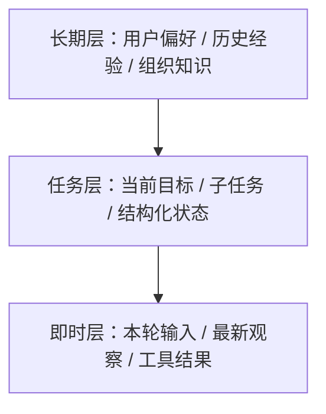

# AI Agent - 第 3 课：上下文、状态与记忆：Agent 为什么需要“脑子”和“笔记”

## 学习目标

- 区分上下文、状态、短期记忆、长期记忆这几个经常混在一起的概念。
- 理解为什么只靠聊天历史，Agent 很快就会“失忆”和“跑偏”。
- 能判断什么信息该塞进 prompt，什么信息该单独结构化存储。
- 理解记忆不是越多越好，而是要为当前任务服务。
- 初步建立“上下文工程”的意识，知道 Agent 的脑子其实是被系统拼出来的。

## 内容讲解

### 1. 为什么 Agent 不能只靠一段聊天记录活着

很多人刚做 Agent 时会天然地觉得：

“反正模型能读上下文，那我把前面对话都丢进去不就行了？”

这件事在简单问答里还勉强能工作，但任务一复杂，问题就出来了：

- 上下文会越来越长，成本越来越高
- 历史信息太多，模型抓不住重点
- 任务中间状态不清楚，模型不知道现在做到哪了
- 长任务跨会话后，历史上下文根本带不过来

所以从工程角度看，Agent 不能只有“嘴”，还得有：

- 当前任务的工作台
- 一份结构化状态
- 可检索的历史记忆
- 可持续更新的笔记

你可以把它想成一个做复杂任务的同事：

- 聊天记录像口头交流
- 状态像任务看板
- 笔记像工作文档
- 记忆像过去做过的事和积累的经验

光靠“我们之前聊过”是撑不起复杂协作的。

### 2. 四个很容易混淆的概念

#### 2.1 上下文

上下文指的是**这一轮模型推理时，它能看到的全部输入材料**。

可能包括：

- 用户当前问题
- 最近几轮对话
- 系统提示词
- 工具调用结果
- 当前任务状态摘要
- 检索出来的知识片段

上下文是“模型当下能看到什么”。

#### 2.2 状态

状态更偏结构化，表示**任务当前进行到哪一步**。

比如：

- 当前任务 ID
- 已调用过哪些工具
- 哪些子任务已完成
- 哪个步骤失败过
- 当前结论是否足够
- 是否等待人工审批

状态不是给人看的聊天记录，而是给系统和模型共同使用的任务控制面。

#### 2.3 短期记忆

短期记忆更像当前会话里的临时工作记忆。

比如：

- 刚才用户说预算不超过 3000
- 这轮搜索已经看过 3 篇资料
- 当前正在排查消息队列问题

这类信息和当前任务强相关，但未必值得永久保存。

#### 2.4 长期记忆

长期记忆是跨会话、跨任务还能复用的内容。

比如：

- 用户偏好：喜欢简洁回答，不喜欢太多术语
- 组织知识：告警平台字段含义、审批流程规则
- 历史经验：上次类似事故最终是数据库连接池耗尽

长期记忆的价值，在于未来还能帮助决策。

### 3. 为什么“上下文工程”比 prompt 工程更重要

很多 Agent 系统后面做不稳，一个核心原因是：  
团队一直在调 prompt，却没有认真设计“模型到底应该看到哪些信息”。

真正影响效果的通常不是一句提示词，而是下面这件事：

**在有限上下文窗口里，给模型放进最有用的信息。**

这就是上下文工程。

你可以把它理解成：

- 哪些信息必须出现
- 哪些信息应该摘要
- 哪些信息应该检索后按需注入
- 哪些信息根本不该给模型

一个常见失败例子是：

把整段几十轮对话、所有工具原始返回、所有历史记忆、整份知识库片段一股脑塞进去。  
结果看起来“信息很全”，但模型反而更容易抓错重点。

所以好上下文不是“大”，而是“准”。

### 4. 一套很实用的分层思路

我们可以把 Agent 的信息层分成三层来看。

#### 4.1 即时层

这一层是模型当下最直接需要处理的东西：

- 当前用户问题
- 最新工具结果
- 当前回合的关键观察

它最接近“现在该怎么办”。

#### 4.2 任务层

这一层是长任务最关键的部分：

- 目标是什么
- 当前做到哪里
- 还有哪些待办
- 哪些假设已经验证过

如果没有这一层，Agent 很容易反复做同样的事，或者突然换方向。

#### 4.3 长期层

这一层更像“经验”和“背景”：

- 业务约束
- 用户偏好
- 历史案例
- 组织知识

它不是每轮都必须全给，但在合适的时候应该能检索出来。

### 5. 不是所有信息都应该放进长期记忆

很多人做长期记忆时也容易走偏：  
觉得只要有价值，就全记下来。

结果会出现几个问题：

- 记忆库越来越脏
- 无关信息越来越多
- 检索时噪声变大
- 模型被旧信息误导

所以记忆一定要做选择。

一个比较实用的原则是：

- 与当前任务强相关，但短期有效 -> 放短期记忆或状态
- 未来高概率复用 -> 放长期记忆
- 只是一次性中间结果 -> 不必长期保存
- 带强时效性或已过期 -> 需要淘汰或降权

记忆系统的重点不是“存得多”，而是“以后还找得到真正有用的东西”。

### 6. 笔记系统为什么很重要

除了记忆，很多成熟 Agent 还会有一类能力：记笔记。

笔记和记忆不完全一样。

记忆更像过去积累的知识和经验。  
笔记更像当前任务过程中的显式记录。

比如在一个研发助手场景里，笔记可能会记录：

- 已确认的问题现象
- 已排除的假设
- 下一步待查项
- 当前 blocker
- 暂时结论

笔记的最大价值是：

**把原本只存在于模型隐式推理里的东西，变成显式、可审计、可恢复的外部状态。**

这件事非常重要，因为模型的“脑内想法”默认是不稳定、不可持久、不可回放的。  
而一旦写成结构化笔记，系统就能：

- 中断后恢复
- 多 Agent 共享
- 人工接管
- 做审计和复盘

### 7. 记忆和 RAG 的关系

这两个概念很容易混。

你可以这样区分：

- RAG 更强调“从外部知识源检索信息”
- 记忆更强调“保留与当前 Agent 或当前用户相关的历史信息”

举例来说：

- 公司知识库里的排障文档，更像 RAG 数据源
- 这个用户之前偏好什么风格，更像记忆
- 上一个相似故障是怎么处理的，可能既是知识，也可以沉淀成记忆

所以两者不是谁替代谁，而是经常一起配合。

### 8. 什么时候该用结构化状态，而不是自然语言摘要

有一个特别重要的工程判断：

**凡是系统逻辑要依赖的信息，尽量结构化；凡是只给模型参考的信息，才优先自然语言。**

比如：

- `step_status=done`
- `approval_required=true`
- `retry_count=2`
- `budget_remaining=0.35`

这些东西如果只写成一段自然语言，系统很难稳定消费。  
但如果做成结构化字段，就更适合：

- 路由分支
- 权限控制
- 终止判断
- 监控统计

这点和后端系统很像：

能用明确字段表达的，就不要永远指望从一段文案里再解析回来。

### 9. 一个实用的落地建议：先做“任务状态”，再谈“长期记忆”

很多团队一上来就想做很复杂的 Memory System，最后半年都在折腾向量库、记忆类型、召回权重。  
但真实落地里，最先产生巨大收益的往往不是“长期记忆”，而是：

**让 Agent 先有一份靠谱的任务状态。**

因为大多数线上 Agent 先死在这些地方：

- 不知道当前进行到哪
- 遇到失败后不会恢复
- 重试时重复执行
- 换会话后丢失任务上下文

这些问题靠“任务状态 + 笔记”通常比靠“复杂长期记忆”更快解决。

### 10. 这一课最该带走的感觉

Agent 不是一个靠“超长 prompt”硬撑出来的系统。  
它更像一个由多层外部信息拼起来的认知体。

真正靠谱的 Agent，脑子往往不只在模型里，而是在模型外：

- 上下文装配器
- 任务状态机
- 记忆检索层
- 笔记系统
- 审计日志

这也是为什么很多优秀 Agent 系统看起来不像一个 prompt，而更像一个后端服务。

## 小结

这一课最核心的点是：

**上下文是模型当下看到的东西，状态是任务当前进行到哪，记忆是未来还想复用的信息，笔记是把推理过程显式外化的工具。**

如果你只靠聊天记录支撑 Agent，它迟早会失忆、跑偏、重复劳动。  
如果你把状态、记忆、笔记分层做好，Agent 才会从“会聊天”慢慢变成“会持续做事”。

## 问题

1. 为什么说“把所有历史对话都塞进 prompt”不是一个可持续的 Agent 方案？
2. 上下文、状态、短期记忆、长期记忆，这四者分别更像在解决什么问题？
3. 为什么很多场景里，先把任务状态做好，比一上来做复杂长期记忆更重要？
4. 你觉得“笔记系统”和“记忆系统”最大的区别是什么？
