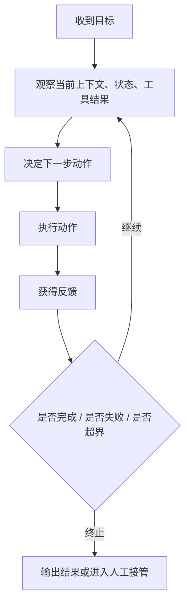

# AI Agent - 第 4 课：决策循环：ReAct、Plan-Execute 与终止条件

## 学习目标

- 理解 Agent 的真正骨架不是某个框架，而是“决策循环”。
- 说清楚 ReAct、Plan-Execute、Reflection 各自在解决什么问题。
- 知道为什么不同任务适合不同执行模式，而不是一个套路打天下。
- 理解终止条件、失败恢复、回退策略为什么决定 Agent 是否可控。
- 学会从“任务结构”出发，而不是从“框架流行度”出发做选择。

## 先给结论

如果第一课讲的是“什么是 Agent”，这一课讲的就是：

**Agent 真正运行起来，到底靠什么骨架。**

你可以把 Agent 想成一个不断重复的闭环：

1. 看当前信息
2. 决定下一步动作
3. 执行动作
4. 观察结果
5. 再决定是否继续

而 ReAct、Plan-Execute、Reflection 这些方法，本质上都不是“魔法框架”，它们只是对这个循环的不同组织方式。

---

## 1. Agent 真正的核心，其实是“循环”

很多人学 Agent 时，会先接触一堆名词：

- ReAct
- Plan-and-Execute
- Reflection
- Tree Search
- Self-Correction

这些名词容易让人误以为 Agent 的核心是“范式名字”。

但更本质的理解应该是：

**Agent 的核心是带反馈的决策循环。**

也就是说，Agent 不是一次性把答案想完，而是：

- 先看一点
- 做一步
- 拿到结果
- 再修正下一步

这和很多经典控制系统、强化学习系统、后端状态机系统其实有很强的相似性。

---

## 2. 一个最小执行循环长什么样



这个图看似简单，但已经包含了 Agent 的全部核心问题：

- 观察是否充分？
- 决策是否正确？
- 动作是否安全？
- 反馈是否可信？
- 停止条件是否明确？

后面你会越来越发现：

**Agent 失败，大多不是“不会说”，而是“循环失控”。**

---

## 3. ReAct：边想边做，为什么它这么自然

ReAct 可以理解成：

**Reason + Act**

也就是：

- 先写当前判断
- 再选一个动作
- 拿到结果
- 继续判断

它特别像一个人真实排查问题时的自然过程。

比如你在排查线上故障：

1. 当前现象是 RT 抖动
2. 先查监控
3. 发现 CPU 正常
4. 再查依赖服务
5. 发现下游超时增多
6. 再查下游日志

这个过程很难在一开始就完整规划好。  
每一步都依赖上一步观察。

所以 ReAct 的优势非常明显：

- 灵活
- 自然
- 适合信息不完整的场景
- 工具反馈能快速改变路径

但它也有明显问题：

- 容易绕路
- 容易重复试探
- 长任务容易散
- 成本很容易失控

所以你可以把 ReAct 理解成：

**最像人类即兴工作方式的 Agent 循环。**

它很强，但也很容易“走神”。

---

## 4. Plan-Execute：为什么很多长任务更适合它

Plan-Execute 的思路是：

1. 先把任务拆成若干步骤
2. 再按步骤去执行

它的好处在于：

- 路径更稳定
- 过程更容易可视化
- 长任务不容易完全散掉
- 比较适合审计和回放

比如让系统完成“市场调研报告”：

### 先规划

1. 明确调研范围
2. 收集资料
3. 提炼观点
4. 组织结构
5. 生成输出

### 再执行

每一步再做细化和工具调用。

这类任务相比 ReAct 更适合先规划，因为：

- 目标相对清晰
- 中途不是每一步都需要高度即兴
- 需要对整体结构有把握

但 Plan-Execute 也不是完美的。

问题通常出在：

- 初始计划就错了
- 计划过粗，执行还是乱
- 外部环境变化太大，计划很快过期

所以现实中更常见的不是“只规划一次”，而是：

**计划 + 执行 + 计划修正**

---

## 5. Reflection：为什么很多任务需要“二次审查”

Reflection 本质上是在主循环外再加一层：

**先产出，再审查，再决定是否修正。**

这特别适合：

- 代码生成
- 文案生成
- 方案设计
- 调研总结

因为这类任务常见的问题不是“查不到事实”，而是：

- 第一次结果太粗
- 漏掉约束
- 逻辑不完整
- 风格不一致

Reflection 解决的是：

**第一次产出可用，但不够稳。**

它像一个内建 reviewer。

不过要注意，Reflection 不是免费午餐。

它会带来：

- 更多 token
- 更多时延
- 更多“自我解释”
- 不一定真的更正确

所以最好的使用方式通常不是“每一步都反思”，而是：

- 在关键节点反思
- 在最终输出前反思
- 在高风险动作前反思

---

## 6. ReAct、Plan-Execute、Reflection，不是对立关系

真实系统里，它们常常是组合关系。

一个常见模式是：

1. 先规划大步骤
2. 每一步内部用 ReAct 做动态探索
3. 最终结果再做 Reflection

你可以把它理解成三层不同时间尺度：

- `Plan`：长时间尺度，决定主路径
- `ReAct`：短时间尺度，处理局部动态性
- `Reflection`：质量尺度，防止粗糙结果直接放行

这比“选一个流行范式然后全局套用”更接近真实工程。

---

## 7. 什么时候该用哪种循环

这里给你一个很实用的判断表。

### 更适合 ReAct 的任务

- 信息不完整
- 路径高度依赖中途观察
- 工具结果会强烈改变下一步
- 本来就像人在“边查边想”

例如：

- 故障排查
- 深度网页搜索
- 多轮信息核验

### 更适合 Plan-Execute 的任务

- 目标明确
- 任务可拆分
- 步骤稳定
- 长任务需要结构感

例如：

- 调研报告
- 旅行计划
- 招聘 JD 生成与审核

### 更适合加 Reflection 的任务

- 输出质量波动大
- 需要自检
- 风险不在“查不到”，而在“写得不够好”

例如：

- 代码生成
- 文档撰写
- 方案说明

---

## 8. 终止条件为什么是 Agent 设计里的生命线

很多 Agent demo 看起来很聪明，但一到线上就暴露出一个致命问题：

**它不知道什么时候该停。**

这会带来什么后果？

- 不断调工具
- 明明查不到还继续搜
- 已经足够回答还在补充
- 成本越来越高
- 最终用户感受到的是“又慢又啰嗦”

所以任何可上线的 Agent，都必须有显式终止条件。

常见终止条件包括：

- 已达到成功标准
- 达到最大步数
- 达到最大时长
- 达到成本预算
- 连续失败次数过多
- 当前任务需要人工接管

你可以把终止条件理解成：

**自由决策的边界墙。**

没有这堵墙，Agent 很快就会从“自主”变成“失控”。

---

## 9. 失败恢复：为什么 Agent 不能只会“报错退出”

真实环境里，失败是常态，不是例外。

常见失败包括：

- 工具超时
- 参数错误
- 权限不足
- 检索结果为空
- 下游返回 500
- 模型选错工具

如果你的 Agent 遇到失败只会：

```text
任务失败，请重试
```

那它其实还没有完成工程化。

更成熟的恢复策略通常包括：

### 9.1 重试

适合可重试、无副作用或幂等动作。

### 9.2 改道

比如换一个工具、换一种检索方式。

### 9.3 降级

比如不再自动执行，只给建议。

### 9.4 终止并解释

无法继续时，明确告诉用户卡在哪。

### 9.5 人工接管

高风险或持续失败时转给人。

所以“失败恢复”不是后补功能，而是循环设计的一部分。

---

## 10. 一个高级但很实用的视角：决策循环就是策略函数

如果你从更偏理论的角度看，Agent 决策循环其实可以抽象成：

```text
下一步动作 = 策略(当前观察, 当前状态, 当前记忆, 当前约束)
```

这里的“策略”在不同系统里可能是：

- 单纯 prompt + LLM
- prompt + 工具描述
- 规则 + LLM 混合
- 规划器 + 执行器组合
- 甚至是训练出来的 policy

这个视角特别好，因为它把各种范式统一了。

你会发现：

- ReAct 是一种策略组织方式
- Plan-Execute 也是
- Reflection 只是增加了一个反馈修正环

这对你后面理解 Agentic RL 也很有帮助。

---

## 11. 为什么“什么时候停”往往比“下一步做什么”更难

这是很多人一开始不会想到的。

“下一步做什么”，模型往往还能给出不少合理尝试。  
但“什么时候停”，其实更接近系统价值判断。

例如：

- 排查到什么程度算足够？
- 搜索到几条证据才能下结论？
- 当前结论置信度不高，要继续还是先输出草稿？
- 用户到底更在意完整性还是速度？

这些问题不是纯推理问题，而是：

- 业务偏好
- 产品目标
- 成本预算
- 风险偏好

的综合体现。

所以终止条件很多时候不应该完全交给模型，而应该由系统先给出边界。

---

## 12. 从工程演进角度，决策循环通常怎么长出来

一个成熟 Agent 的循环，往往不是一开始就设计得很复杂。

更现实的演化路线通常是：

### 阶段 1：单轮 LLM

先能答。

### 阶段 2：简单 ReAct

开始会调工具。

### 阶段 3：有最大步数、超时、失败处理

开始可控。

### 阶段 4：引入任务计划与状态机

开始适合长任务。

### 阶段 5：关键节点反思、回放、评估

开始可持续优化。

这条演化路线很重要，因为它提醒我们：

**不要一开始就迷恋复杂循环，先让最小闭环稳定跑起来。**

---

## 小结

这一课最重要的收获有三点：

### 第一，Agent 的骨架是循环

不是某个框架，而是：

`观察 -> 决策 -> 行动 -> 反馈 -> 再观察`

### 第二，不同循环解决不同任务结构

- ReAct：适合边查边想
- Plan-Execute：适合长任务拆解
- Reflection：适合结果自检

### 第三，终止条件和失败恢复决定能不能上线

没有终止、没有恢复，Agent 很快就会失控。

所以后面你做 Agent 时，别只问：

“下一步怎么做？”

也一定要问：

“什么时候停？”

---

## 问题

1. 为什么说 ReAct 的优势是灵活，但问题是容易绕路？
2. Plan-Execute 为什么更适合长任务，但也可能因为初始计划错误而失效？
3. Reflection 为什么不能无限加，否则会带来新的问题？
4. 为什么说 Agent 设计里“终止条件”往往和“下一步动作”同样重要？
