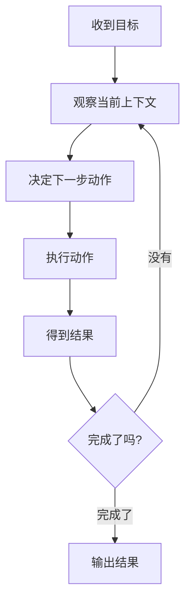

# AI Agent - 第 4 课：决策循环：ReAct、Plan-Execute 与终止条件

## 学习目标

- 理解 Agent 最核心的不是某个框架，而是“怎么看、怎么想、怎么做、什么时候停”。
- 能说清楚 ReAct、Plan-Execute、Reflection 各自在解决什么问题。
- 知道为什么不同任务适合不同决策循环，而不是一个套路打天下。
- 理解终止条件、失败恢复和回退策略为什么是 Agent 稳定性的关键。
- 能从任务特征出发，选一个合适的执行模式。

## 内容讲解

### 1. Agent 真正的核心，其实是“循环”

前面两课我们分别讲了工具和记忆。  
但把它们串起来的真正骨架，其实是决策循环。

你可以把一个 Agent 的执行过程想成不断重复下面这几个动作：

1. 看看现在知道了什么
2. 判断下一步应该做什么
3. 执行动作
4. 读回结果
5. 再决定要不要继续

所以 Agent 和普通一次性问答最大的差别，不只是“它能调工具”，而是：

**它能在多轮观察和行动中逐步推进任务。**

### 2. 最简单的循环长什么样

这里最重要的不是图，而是一个感觉：

**Agent 的执行不是直线，而是带反馈的回路。**

而不同范式的区别，本质上是：

- 这个回路里“思考”怎么做
- 是否先整体规划
- 是否做中途反思
- 什么时候应该停止

### 3. ReAct：边想边做

ReAct 可以用一句话概括：

**先写出当前想法，再做一个动作，再根据结果继续想。**

它很像一个人在排查问题时的自然过程：

- 我先猜一下方向
- 去查一个点
- 看结果不对
- 再修正判断

ReAct 的优势是灵活。

比如一个排查型任务：

- 先看监控
- 再看日志
- 发现日志提示下游超时
- 再查依赖服务状态

这里每一步都依赖前一步结果，所以边想边做特别自然。

ReAct 很适合这些任务：

- 信息不完整，需要边查边推进
- 路径不固定
- 工具反馈会明显改变下一步决策

但它也有明显缺点：

- 容易绕路
- 容易重复做同样的检查
- 长任务里越来越散
- 成本容易失控

所以 ReAct 很像一个聪明但容易即兴发挥的同事。  
短任务很好用，长任务不一定稳。

### 4. Plan-Execute：先做计划，再执行

Plan-Execute 更像另一种工作方式：

**先把任务拆成几个步骤，再按步骤执行。**

比如“做一份市场调研报告”，系统可能先规划：

1. 明确调研范围
2. 检索资料
3. 提炼观点
4. 组织报告结构
5. 生成最终文稿

它的优点是更有秩序，尤其适合长任务。

因为一旦计划写出来，系统至少知道：

- 现在做第几步
- 前面哪些已经完成
- 后面还有什么待办

Plan-Execute 很适合这些任务：

- 目标相对清晰
- 任务可以拆成稳定步骤
- 中途不需要太多即兴跳转
- 需要较强的过程可见性

但它也有缺点：

- 初始计划可能就错了
- 计划过粗时，执行阶段还是会乱
- 环境变化大时，原计划可能很快失效

所以 Plan-Execute 不是更高级，而是更适合“结构化长任务”。

### 5. Reflection：做完以后回头审一下自己

Reflection 的思路很接近代码 review 或复盘：

**先产出一个结果，再让系统自己检查：这玩意有没有明显问题，要不要重做。**

这特别适合以下场景：

- 代码生成
- 文案生成
- 报告总结
- 方案设计

因为这类任务常常不是“查一个事实就结束”，而是第一次产出很可能不够好。  
此时如果完全不反思，结果会很飘；但如果每一步都过度反思，成本又会爆炸。

所以 Reflection 更像一个“第二道脑内质检”。

它解决的问题是：

- 第一版输出质量不稳定
- 结果需要自检
- 系统需要避免太明显的低级错误

但它也有边界：

- 反思并不等于真的更对
- 可能只是让模型更会“解释自己”
- 多轮反思会显著增加成本和时延

所以 Reflection 要适量用，别把它当万能药。

### 6. 三种模式怎么选

你可以先用一个很实用的判断方法：

#### 6.1 任务路径是否高度依赖中途观察

如果是，那更偏 ReAct。

例如：

- 故障排查
- 浏览网页找信息
- 现场问答式研究

#### 6.2 任务能否先拆成相对稳定的步骤

如果能，那更偏 Plan-Execute。

例如：

- 写调研报告
- 做旅行规划
- 生成标准化方案

#### 6.3 第一次输出后是否很需要复检

如果需要，那可以加 Reflection。

例如：

- 代码生成
- 合同摘要
- 多段文本整理

很多真实系统最终都不是纯粹一种，而是混合使用：

- 先规划
- 再逐步执行
- 在关键节点反思

### 7. 终止条件为什么特别重要

很多 Agent demo 漂亮，但线上不敢放，一个关键原因就是：

**它不知道什么时候该停。**

不知道停，会出现很多问题：

- 无休止调用工具
- 成本超预算
- 明明查不到还一直查
- 结果已经够了却还在补充

所以终止条件是 Agent 设计里必须明确的一层。

常见终止条件包括：

- 已经拿到满足要求的结果
- 达到最大步数
- 达到超时时间
- 达到成本预算
- 连续失败次数过多
- 命中人工接管条件

终止条件不是“兜底细节”，而是 Agent 是否可控的生命线。

### 8. 失败恢复为什么要提前设计

Agent 不是每一步都会成功。  
现实里很常见的失败包括：

- 工具超时
- 外部 API 报错
- 模型选错工具
- 参数生成不对
- 检索结果为空

这时候系统不能只会“报错退出”，而应该至少有一些恢复策略：

- 允许重试
- 换一个工具
- 缩小范围再查
- 降级成纯文本回答
- 请求人工确认

从工程角度看，稳定 Agent 的关键不是“永不失败”，而是：

**失败时也有秩序。**

### 9. 一个容易被忽略的问题：循环越长，越需要显式状态

ReAct 在短任务里经常看起来很丝滑。  
但只要任务一长，就会出现一个问题：  
模型很容易忘记自己前面为什么这么做。

所以循环越长，越要把中间状态显式写出来，比如：

- 当前步骤
- 已验证假设
- 已排除方向
- 待办列表
- 当前 blocker

这也是为什么很多成熟 Agent 系统最后都会长得像：

- 一个执行循环
- 加一个状态机
- 再加一些笔记 / 记忆 / 审计

而不是只靠一段 prompt 在脑内硬撑。

### 10. 一个更接近真实落地的结论

如果你今天真要做一个 Agent，不要先问：

“我要不要上某个框架？”

更应该先问：

- 这个任务更像边查边做，还是先规划再执行？
- 我需不需要中途反思？
- 我准备怎么终止？
- 失败时怎么恢复？

这几个问题回答清楚了，后面的实现形态反而自然。

## 小结

这节课最重要的是建立这样一个认识：

**Agent 的灵魂不是某个模型名，也不是某个框架名，而是它的执行循环。**

ReAct 强在灵活，Plan-Execute 强在有序，Reflection 强在自检。  
真正落地时，关键不是背定义，而是根据任务特征选择合适的循环，并且把终止条件和失败恢复提前设计好。

## 问题

1. ReAct、Plan-Execute、Reflection 分别更适合解决哪类问题？
2. 为什么说“终止条件”不是小细节，而是 Agent 可控性的关键？
3. 如果一个任务路径会频繁受中途观察结果影响，你觉得更适合哪种执行模式？为什么？
4. 为什么真实系统里，很多 Agent 最终都会从“纯 prompt 循环”演化成“循环 + 状态机 + 审计”的结构？
