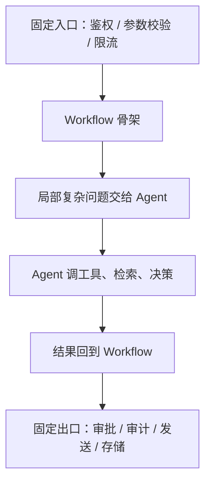

# AI Agent - 第 5 课：Workflow 与 Agent：边界、权衡与混合架构

## 学习目标

- 不再把 Workflow 和 Agent 理解成“静态 vs 智能”的粗糙二分。
- 知道为什么很多业务需求其实更适合 Workflow，而不是 Agent。
- 学会判断什么时候该让模型动态决策，什么时候应该把流程写死。
- 理解混合架构为什么往往比“纯 Agent”更稳、更容易上线。
- 对 Coze、Dify、n8n 这类平台建立正确预期：它们是交付形式，不是思想本身。

## 先给结论

这节课最重要的一句话是：

**Workflow 负责稳定流程，Agent 负责动态决策，真正可上线的系统往往是二者混合，而不是非此即彼。**

很多团队在这一步会出偏差：

- 要么把一切都做成工作流，结果系统遇到一点动态情况就卡住
- 要么把一切都做成 Agent，结果系统复杂度和风险一起暴涨

所以这节课的目标不是“选边站”，而是学会做边界判断。

---

## 1. 为什么这两个词总被混在一起

因为现实里大多数 AI 系统都不是纯形态。

例如一个工单系统可能是这样：

1. 固定入口校验参数
2. 用模型做分类
3. 固定规则决定优先级
4. 如果内容复杂，再交给 Agent 做补充分析
5. 最后再回到固定流程发送通知

这时你很难一句话说它是 Workflow 还是 Agent。  
它其实是混合系统。

所以如果你只靠“有没有用大模型”来区分，几乎一定会混。

最有用的区分方式只有一个：

**下一步动作，主要是预先定义的，还是运行时动态决定的？**

---

## 2. Workflow 的本质是什么

Workflow 的核心不是“简单”，而是：

**整体路径提前定义。**

也就是说，系统的执行骨架在开发阶段就已经明确了。

比如：

1. 读输入
2. 清洗数据
3. 分类
4. 路由
5. 存储结果
6. 发通知

即使其中某一步用了模型做摘要或分类，它整体仍然是 Workflow。  
因为路径的主导权依然在开发者手里。

Workflow 的优势特别稳定：

- 强可控
- 易调试
- 易回放
- 易做 SLA
- 易做审计
- 易做权限和审批

所以你会发现，很多企业真正能跑得很稳的 AI 系统，本质上都是：

**工作流里嵌了模型，而不是全交给 Agent。**

---

## 3. Agent 的本质又是什么

Agent 的关键不是“复杂”，而是：

**路径的一部分甚至大部分，要在运行时动态形成。**

例如一个排障助手：

1. 先查监控
2. 发现 CPU 正常
3. 再查消息堆积
4. 发现消费者异常
5. 再去看最近变更
6. 决定是否停止排查并形成结论

这里路径为什么动态？

因为第三步不是一开始就写死的，而是由第二步观察结果决定。

这就是 Agent 相比 Workflow 最根本的不同：

**它把部分控制权交给了运行时决策。**

---

## 4. 一个真正有用的区分标准：谁决定下一步

这句话值得你一直记着：

**Workflow 和 Agent 的关键区别，不是复杂度，而是谁决定下一步。**

### Workflow

- 下一步主要由开发者预定义

### Agent

- 下一步主要由系统根据当前观察结果动态判断

这个区分比“有没有工具”“是不是多轮”“是不是能聊天”都更本质。

因为你会发现：

- 一个多轮聊天机器人，不一定是 Agent
- 一个能调工具的工作流，不一定是 Agent
- 一个只有少量步骤但路径动态的小系统，也可能已经是 Agent

---

## 5. 为什么很多需求不该直接做 Agent

这是非常重要的工程判断。

很多团队一看到 Agent，就会自然想：

“那我们把这条业务链也做成 Agent 吧，看起来更高级。”

但如果任务本身是：

- 规则明确
- 路径稳定
- 异常少
- 风险高
- 强依赖审计

那它通常更适合 Workflow。

例如：

- 审批流
- 表单校验
- 报表生成
- 固定模板内容生成
- 账务类流程

这些任务的核心难点往往不是“动态决策”，而是：

- 规则表达是否准确
- 权限是否正确
- 幂等是否做好
- 回放是否清晰

如果你硬把这些东西做成 Agent，系统的解释成本、测试成本、风险成本都会显著上升。

---

## 5b. 传统 Workflow 解决不了什么：AI Workflow 的价值场景

上面讲的是"很多任务不该做 Agent"。但反过来也要问一个问题：**既然流程都能提前画 DAG，那为什么还需要 AI？传统 Workflow 到底解决不了什么？**

一句话答案：

**传统 Workflow 的根本假设是"所有分支、所有输入格式、所有错误情况都能提前穷举"。AI Workflow 的价值，就是那些穷举不完的地方。**

下面是 7 类典型场景。每一类都配"传统方案的痛点 / 例子 / 边界"。

### 5b.1 非结构化输入的理解

**传统方案的痛点**：每新增一种输入格式就要加一个 parser，运维地狱。

**例子**：财务系统处理 100 家供应商的发票，格式各不相同（PDF、扫描件、Excel、图片）。传统做法是每家做一套 OCR 模板；AI Workflow 一个多模态模型 + prompt 就覆盖 90%。

**边界**：关键字段（金额、税号）要做确定性校验，不能纯靠模型。

### 5b.2 Schema 漂移 / 上游 API 变更

**传统方案的痛点**：上游字段名改了，ETL 直接挂。

**例子**：对接 Salesforce，某天对方把 `opportunity_value` 改成 `deal_amount`，所有管道一夜全红。AI 做字段 fuzzy matching 可以自愈，带人工审核。

**边界**：核心字段严格 schema validation，自适应只开在非关键路径。

### 5b.3 长尾分支爆炸

**传统方案的痛点**：规则写到 100+ 个 `if-else` 就失控，新类目一来全部失效。

**例子**：客服工单分类，传统靠几百条关键词规则维护；AI 一个 text classification + 少量 few-shot 就解决，还能 zero-shot 新类目。

**边界**：高风险分类（退款、投诉升级）走 AI 分类 + 规则兜底。

### 5b.4 需要推理、归纳、重写

**传统方案无解**。

**例子**：

- 把 1 小时会议录音提炼成 5 条 action item
- 把 50 条客户反馈归纳成 3 个核心问题
- 把冗长的故障报告改写成给 CEO 的 3 句话摘要

这种任务传统 Workflow 根本写不出来，**AI 在这里不是"优化"，是"从 0 到 1"**。

**边界**：输出质量靠 evaluator / human-in-the-loop 保障。

### 5b.5 动态路径选择

**传统方案的痛点**：DAG 是静态的，无法根据前一步的**语义结果**选分支。

**例子**：SRE 排障——看完监控，如果发现是网络问题就查网络，CPU 问题就查进程，消息堆积就查消费者。传统 DAG 要穷举所有 "看到 X 就走 Y"，**穷举不完**。AI 可以直接理解错误信息的语义去选下一步。

**边界**：这一类其实已经从 AI Workflow 滑向了 Agent（第 6 节讲的），要警惕"看起来动态但其实能规则化"的假动态。

### 5b.6 自然语言触发 / 意图到执行

**传统方案的痛点**：每种触发场景都要预先建一个 endpoint / DAG。

**例子**：用户说 "把上周销售 top 3 的商品截图发到 Slack #sales"，传统 Workflow 需要有人**预先**写好这条 DAG；AI Workflow 可以**当场生成**——从自然语言直接产出一段参数化的执行计划。

**边界**：AI **只生成草稿**，真正执行前走人工确认（除非是只读任务）。这和 Cursor 写代码一样，永远要 review。

### 5b.7 失败诊断与自修复

**传统方案的痛点**：失败 → alert → 值班工程师肉眼看日志 → 改参数重跑，平均恢复时间（MTTR）高。

**例子**：一个数据导入任务失败，AI 读错误日志 + DAG 上下文 + 最近一次成功 run 的 diff，自动判断"是第 47 行的日期格式问题"，给出修复 patch。

**边界**：AI 输出的是**建议**，不是自动修复。只有在反复验证稳定后，才敢把某些类别的修复做成自动重试。

### 5b.8 反过来讲：不在这 7 类里的任务，别加 AI

这 7 类**反向定义**了 AI Workflow 的必选场景。如果你的任务：

- 输入结构化
- schema 稳定
- 分支数量有限
- 不需要推理 / 归纳 / 重写
- 路径能提前画完
- 触发方式固定
- 错误处理能用规则表达

那它就是**纯 Workflow 的领地**，硬塞 AI 只会增加成本、降低稳定性、放大风险。

面试里如果被问"AI Workflow 和传统 Workflow 区别是什么"，不要答"AI Workflow 就是加了 LLM 节点"——这是 demo 级别的理解。正确答案是：

**AI Workflow 扩展了传统 Workflow 的能力边界，让系统能处理"无法提前穷举的输入、分支、推理和错误"。AI 不是替代 Workflow，是把 Workflow 管不了的 7 类场景接上。**

---

## 6. 什么时候 Agent 真正有价值

Agent 值得引入，通常是因为任务具有下面这些特征：

### 6.1 信息不完整

系统必须边查边补信息。

### 6.2 路径不固定

下一步要根据当前观察动态决定。

### 6.3 工具反馈会显著改变后续动作

例如排障、研究、网页操作、复杂分析。

### 6.4 人工本来就在做“先查再判断再继续查”的工作

这说明任务天然适合 Agent 化。

比如：

- 故障排查
- 调研分析
- 知识综合
- 多来源比对
- 半自动运营协助

所以 Agent 最擅长的，不是“帮你把确定流程再执行一遍”，而是：

**处理不确定路径下的复杂认知和执行任务。**

---

## 7. 混合架构为什么往往比纯 Agent 更靠谱

真实世界里，“纯 Agent” 往往很美，但“混合架构”更稳。

一个常见架构如下：

这里的思想非常重要：

- 用 Workflow 管“稳定部分”
- 用 Agent 管“动态部分”

这样做的好处是：

- 风险边界清楚
- 调试范围可控
- SLA 更容易做
- 模型失控时更容易降级

这比“整条链路都让模型自己决定”靠谱得多。

---

## 8. 哪些部分最适合交给 Agent

经验上，最值得交给 Agent 的部分通常是：

- 任务拆解
- 检索与信息整合
- 多工具之间的动态选择
- 复杂推理
- 结果总结与解释

这些问题的共同特征是：

- 静态规则写起来成本很高
- 情况变化多
- 人工也需要判断

而不太适合直接交给 Agent 的部分通常是：

- 权限放行
- 资金扣减
- 强一致写操作
- 高风险配置修改
- 合规终态判断

这背后其实有一个原则：

**让 Agent 负责高认知密度的部分，让系统规则负责高风险密度的部分。**

---

## 9. 低代码平台怎么看：它们帮的是“搭系统”，不是“替你做判断”

像 Coze、Dify、n8n 这类平台之所以很受欢迎，是因为它们能快速提供：

- 节点编排
- 模型节点
- 工具接入
- 知识库
- 条件分支
- 简单 Agent 节点

也就是说，它们降低的是：

**交付成本**

但它们并不能替你解决：

- 哪部分该 Workflow
- 哪部分该 Agent
- 风险边界在哪里
- 哪些动作需要人工审批

所以平台是“加速器”，不是“架构判断器”。

如果架构边界没想清楚，用任何平台都可能做出不稳的系统。

---

## 9b. Dify / Coze / n8n 详细对比与选型

这三家最常被混在一起讲，但**定位完全不同**。选错了不是"能不能用"的问题，是"方向性错误"。

### 9b.1 一句话定位

| 工具 | 一句话 | 目标产物 |
| --- | --- | --- |
| **Dify** | **LLM 应用 / Agent 构建平台**（LLMOps） | "一个企业内部的 AI 应用"（知识库问答 / AI 客服 / 内部工具） |
| **Coze** | **AI Bot 构建 + 渠道分发平台** | "一个能发到飞书 / 抖音 / Discord 的 bot" |
| **n8n** | **通用自动化平台**（iPaaS，对标 Zapier / Make） | "把一堆 SaaS 串起来"，AI 只是顺便 |

**关键差异**：Dify 和 Coze 是 **AI-first**（生来就为 LLM 应用而做），n8n 是 **自动化-first**（先有自动化平台，后来加了 AI node）。三家不是竞争关系，是不同象限。

### 9b.2 详细对比

| 维度 | Dify | Coze | n8n |
| --- | --- | --- | --- |
| 背后公司 | Langgenius（开源社区） | 字节跳动 | n8n.io（德国） |
| 许可 | Apache 2.0（完全开源） | 闭源 SaaS（企业版可私有化） | Fair-Code（源码可读，商用需授权） |
| 部署 | Docker self-host / SaaS | 主要 SaaS（coze.cn 国内 / coze.com 海外） | Docker self-host / npm / SaaS |
| 核心抽象 | App / Workflow / Agent / Knowledge Base | Bot / Plugin / Workflow / Knowledge | Workflow（节点图），AI 是一类 node |
| RAG 能力 | 一级公民（内置向量库、切分、召回、重排） | 一级公民（知识库功能完善） | 需自己搭（通过 node 拼） |
| 工具 / 插件 | 自定义 tool + MCP 支持 | 自建插件市场（数百个） | **800+ integration**（三家最强） |
| 多渠道发布 | 需自己做 API 集成 | **内置**发到飞书 / 抖音 / Telegram / Discord / WeChat | 主要是 webhook 触发 |
| 模型支持 | 市面几乎所有 LLM（中英都强） | 优先豆包 + 主流模型 | 通过 node 连任意 API |
| 典型用户 | 企业 AI 工程团队 | 中小开发者 / 内容创作者 / 运营 | 自动化工程师 / RevOps / 销售运营 |
| 学习曲线 | 中（概念多） | 低（UI 友好） | 中（节点多） |
| 定价 | 开源免费 + 云服务收费 | 免费 + 企业版 | 开源免费 + 托管版收费 |

### 9b.3 什么时候选哪个

**选 Dify**：
- 公司要做"基于内部知识库的 AI 问答系统"
- 要做 workflow 类 AI 应用（客户邮件自动分类回复）
- 需要可私有化部署、完全可控、代码可审
- 团队有工程能力，想深度定制

**选 Coze**：
- 做飞书 / 抖音 / Discord / 微信上的 bot
- 不想养工程团队，SaaS 用起来就完事
- 用豆包模型或国内模型（合规 / 成本考虑）
- 要用现成插件（搜索、绘图、代码执行、TTS 等）

**选 n8n**：
- 核心诉求是**串联 SaaS**：CRM → Email → Slack → DB → Notion
- 现有工作流里只有**少量 AI 步骤**（AI 分类、写文案、转写），大部分是数据搬运和触发
- 要 self-host、要和内网系统对接
- 替代 Zapier / Make

### 9b.4 三个都不够用的场景

如果你的需求是：

- **真正的自主 Agent**（复杂工具调用 + 规划 + 反思 + 长任务）
- **多 Agent 协作**
- **强代码能力 / 性能要求高**
- **需要深度定制 decision loop**

那这三个**都不够**。你需要 **LangGraph / AutoGen / Claude Agent SDK / 自研**。这三个平台的 Agent 能力都停留在 "简化版 ReAct" 的层次，做到 80% 日常需求没问题，再深就撞墙。

### 9b.5 面试常问的一个陷阱问题

**"Dify 和 LangChain / LangGraph 是什么关系？"**

- **LangChain / LangGraph** 是**代码库**，给工程师用，灵活但重代码。
- **Dify** 是**带 UI 的平台**，把 LangChain 类能力包成可视化操作，降低交付成本。

所以不是竞品，是**同一批能力的两种交付形式**：代码形态 vs 平台形态。企业里常见的组合是 **Dify 做 80% 标准应用 + LangGraph 做 20% 深度定制**。

---

## 10. 一个成熟团队通常怎么演进

最稳的路线通常不是：

“上来就做全自主 Agent。”

而是：

### 第一阶段：先做 Workflow

把固定流程先打通。

### 第二阶段：在一个最痛点节点加模型能力

例如分类、摘要、检索。

### 第三阶段：只把少量高价值的动态判断交给 Agent

例如复杂排障、复杂问答、知识综合。

### 第四阶段：如果单 Agent 稳定了，再考虑多 Agent

这条路线看起来保守，但现实里成功率往往更高。

因为它可以：

- 逐步验证价值
- 渐进暴露风险
- 方便做回滚和 A/B

---

## 11. 从成本角度，Workflow 和 Agent 也不是一个数量级

这一点很容易被低估。

Workflow 的成本通常更可预测，因为：

- 步骤数固定
- 模型调用次数相对稳定
- 工具调用路径可预估

Agent 的成本则更难预测，因为：

- 可能会多轮探索
- 可能多次检索
- 可能重复调用工具
- 可能反复反思

所以一个很重要的现实问题是：

**有些任务从能力上适合 Agent，但从成本上不一定适合。**

这也是为什么很多成熟系统最终会做成：

- 简单请求走 Workflow
- 难请求或高价值请求才进入 Agent 模式

这其实就是一种“分层智能”。

---

## 12. 一个最实用的判断框架

如果你以后要判断一个需求该怎么做，可以问自己下面几个问题：

### 12.1 任务路径是否稳定

稳定 -> 更偏 Workflow  
不稳定 -> 更偏 Agent

### 12.2 中途观察会不会改变后续路径

不会 -> Workflow 足够  
会 -> 更值得考虑 Agent

### 12.3 错误代价高不高

高 -> 优先 Workflow 或混合架构  
低到中 -> 可以更大胆使用 Agent

### 12.4 系统是否需要强审计和强可回放

如果需要，Workflow 或混合架构通常更友好。

### 12.5 这个任务里“认知判断”的比重高不高

高 -> Agent 更有发挥空间  
低 -> 规则和工作流通常更稳

---

## 小结

这一课最重要的结论是：

### 第一，Workflow 和 Agent 不该被简单理解成“旧 vs 新”

它们解决的是不同问题。

### 第二，核心判断是“谁决定下一步”

- 预定义 -> Workflow
- 动态决定 -> Agent

### 第三，真实世界最稳的是混合架构

用 Workflow 守住流程和风险，  
用 Agent 处理复杂认知与动态决策。

所以以后不要再问：

“Workflow 和 Agent 谁更高级？”

更该问的是：

**这个任务到底需要多少动态性，以及这份动态性值不值得系统承担。**

---

## 问题

1. 为什么说 Workflow 和 Agent 的区别不是“有没有模型”，而是“谁决定下一步”？
2. 哪类任务虽然也能做成 Agent，但工程上其实更适合 Workflow？
3. 为什么混合架构往往比纯 Agent 更适合上线？
4. 如果一个系统高风险写操作很多，你会优先选择纯 Agent、纯 Workflow，还是混合架构？为什么？
