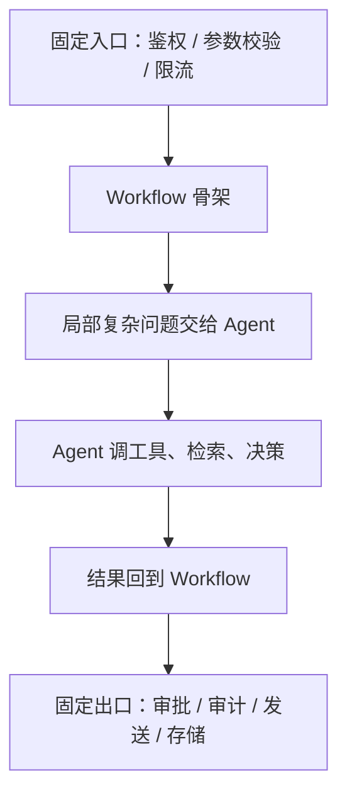

# AI Agent - 第 5 课：Workflow 与 Agent：边界、权衡与混合架构

## 学习目标

- 不再把 Workflow 和 Agent 理解成“静态 vs 智能”的粗糙二分。
- 知道为什么很多业务需求其实更适合 Workflow，而不是 Agent。
- 学会判断什么时候该让模型动态决策，什么时候应该把流程写死。
- 理解混合架构为什么往往比“纯 Agent”更稳、更容易上线。
- 对 Coze、Dify、n8n 这类平台建立正确预期：它们是交付形式，不是思想本身。

## 先给结论

这节课最重要的一句话是：

**Workflow 负责稳定流程，Agent 负责动态决策，真正可上线的系统往往是二者混合，而不是非此即彼。**

很多团队在这一步会出偏差：

- 要么把一切都做成工作流，结果系统遇到一点动态情况就卡住
- 要么把一切都做成 Agent，结果系统复杂度和风险一起暴涨

所以这节课的目标不是“选边站”，而是学会做边界判断。

---

## 1. 为什么这两个词总被混在一起

因为现实里大多数 AI 系统都不是纯形态。

例如一个工单系统可能是这样：

1. 固定入口校验参数
2. 用模型做分类
3. 固定规则决定优先级
4. 如果内容复杂，再交给 Agent 做补充分析
5. 最后再回到固定流程发送通知

这时你很难一句话说它是 Workflow 还是 Agent。  
它其实是混合系统。

所以如果你只靠“有没有用大模型”来区分，几乎一定会混。

最有用的区分方式只有一个：

**下一步动作，主要是预先定义的，还是运行时动态决定的？**

---

## 2. Workflow 的本质是什么

Workflow 的核心不是“简单”，而是：

**整体路径提前定义。**

也就是说，系统的执行骨架在开发阶段就已经明确了。

比如：

1. 读输入
2. 清洗数据
3. 分类
4. 路由
5. 存储结果
6. 发通知

即使其中某一步用了模型做摘要或分类，它整体仍然是 Workflow。  
因为路径的主导权依然在开发者手里。

Workflow 的优势特别稳定：

- 强可控
- 易调试
- 易回放
- 易做 SLA
- 易做审计
- 易做权限和审批

所以你会发现，很多企业真正能跑得很稳的 AI 系统，本质上都是：

**工作流里嵌了模型，而不是全交给 Agent。**

---

## 3. Agent 的本质又是什么

Agent 的关键不是“复杂”，而是：

**路径的一部分甚至大部分，要在运行时动态形成。**

例如一个排障助手：

1. 先查监控
2. 发现 CPU 正常
3. 再查消息堆积
4. 发现消费者异常
5. 再去看最近变更
6. 决定是否停止排查并形成结论

这里路径为什么动态？

因为第三步不是一开始就写死的，而是由第二步观察结果决定。

这就是 Agent 相比 Workflow 最根本的不同：

**它把部分控制权交给了运行时决策。**

---

## 4. 一个真正有用的区分标准：谁决定下一步

这句话值得你一直记着：

**Workflow 和 Agent 的关键区别，不是复杂度，而是谁决定下一步。**

### Workflow

- 下一步主要由开发者预定义

### Agent

- 下一步主要由系统根据当前观察结果动态判断

这个区分比“有没有工具”“是不是多轮”“是不是能聊天”都更本质。

因为你会发现：

- 一个多轮聊天机器人，不一定是 Agent
- 一个能调工具的工作流，不一定是 Agent
- 一个只有少量步骤但路径动态的小系统，也可能已经是 Agent

---

## 5. 为什么很多需求不该直接做 Agent

这是非常重要的工程判断。

很多团队一看到 Agent，就会自然想：

“那我们把这条业务链也做成 Agent 吧，看起来更高级。”

但如果任务本身是：

- 规则明确
- 路径稳定
- 异常少
- 风险高
- 强依赖审计

那它通常更适合 Workflow。

例如：

- 审批流
- 表单校验
- 报表生成
- 固定模板内容生成
- 账务类流程

这些任务的核心难点往往不是“动态决策”，而是：

- 规则表达是否准确
- 权限是否正确
- 幂等是否做好
- 回放是否清晰

如果你硬把这些东西做成 Agent，系统的解释成本、测试成本、风险成本都会显著上升。

---

## 6. 什么时候 Agent 真正有价值

Agent 值得引入，通常是因为任务具有下面这些特征：

### 6.1 信息不完整

系统必须边查边补信息。

### 6.2 路径不固定

下一步要根据当前观察动态决定。

### 6.3 工具反馈会显著改变后续动作

例如排障、研究、网页操作、复杂分析。

### 6.4 人工本来就在做“先查再判断再继续查”的工作

这说明任务天然适合 Agent 化。

比如：

- 故障排查
- 调研分析
- 知识综合
- 多来源比对
- 半自动运营协助

所以 Agent 最擅长的，不是“帮你把确定流程再执行一遍”，而是：

**处理不确定路径下的复杂认知和执行任务。**

---

## 7. 混合架构为什么往往比纯 Agent 更靠谱

真实世界里，“纯 Agent” 往往很美，但“混合架构”更稳。

一个常见架构如下：

这里的思想非常重要：

- 用 Workflow 管“稳定部分”
- 用 Agent 管“动态部分”

这样做的好处是：

- 风险边界清楚
- 调试范围可控
- SLA 更容易做
- 模型失控时更容易降级

这比“整条链路都让模型自己决定”靠谱得多。

---

## 8. 哪些部分最适合交给 Agent

经验上，最值得交给 Agent 的部分通常是：

- 任务拆解
- 检索与信息整合
- 多工具之间的动态选择
- 复杂推理
- 结果总结与解释

这些问题的共同特征是：

- 静态规则写起来成本很高
- 情况变化多
- 人工也需要判断

而不太适合直接交给 Agent 的部分通常是：

- 权限放行
- 资金扣减
- 强一致写操作
- 高风险配置修改
- 合规终态判断

这背后其实有一个原则：

**让 Agent 负责高认知密度的部分，让系统规则负责高风险密度的部分。**

---

## 9. 低代码平台怎么看：它们帮的是“搭系统”，不是“替你做判断”

像 Coze、Dify、n8n 这类平台之所以很受欢迎，是因为它们能快速提供：

- 节点编排
- 模型节点
- 工具接入
- 知识库
- 条件分支
- 简单 Agent 节点

也就是说，它们降低的是：

**交付成本**

但它们并不能替你解决：

- 哪部分该 Workflow
- 哪部分该 Agent
- 风险边界在哪里
- 哪些动作需要人工审批

所以平台是“加速器”，不是“架构判断器”。

如果架构边界没想清楚，用任何平台都可能做出不稳的系统。

---

## 10. 一个成熟团队通常怎么演进

最稳的路线通常不是：

“上来就做全自主 Agent。”

而是：

### 第一阶段：先做 Workflow

把固定流程先打通。

### 第二阶段：在一个最痛点节点加模型能力

例如分类、摘要、检索。

### 第三阶段：只把少量高价值的动态判断交给 Agent

例如复杂排障、复杂问答、知识综合。

### 第四阶段：如果单 Agent 稳定了，再考虑多 Agent

这条路线看起来保守，但现实里成功率往往更高。

因为它可以：

- 逐步验证价值
- 渐进暴露风险
- 方便做回滚和 A/B

---

## 11. 从成本角度，Workflow 和 Agent 也不是一个数量级

这一点很容易被低估。

Workflow 的成本通常更可预测，因为：

- 步骤数固定
- 模型调用次数相对稳定
- 工具调用路径可预估

Agent 的成本则更难预测，因为：

- 可能会多轮探索
- 可能多次检索
- 可能重复调用工具
- 可能反复反思

所以一个很重要的现实问题是：

**有些任务从能力上适合 Agent，但从成本上不一定适合。**

这也是为什么很多成熟系统最终会做成：

- 简单请求走 Workflow
- 难请求或高价值请求才进入 Agent 模式

这其实就是一种“分层智能”。

---

## 12. 一个最实用的判断框架

如果你以后要判断一个需求该怎么做，可以问自己下面几个问题：

### 12.1 任务路径是否稳定

稳定 -> 更偏 Workflow  
不稳定 -> 更偏 Agent

### 12.2 中途观察会不会改变后续路径

不会 -> Workflow 足够  
会 -> 更值得考虑 Agent

### 12.3 错误代价高不高

高 -> 优先 Workflow 或混合架构  
低到中 -> 可以更大胆使用 Agent

### 12.4 系统是否需要强审计和强可回放

如果需要，Workflow 或混合架构通常更友好。

### 12.5 这个任务里“认知判断”的比重高不高

高 -> Agent 更有发挥空间  
低 -> 规则和工作流通常更稳

---

## 小结

这一课最重要的结论是：

### 第一，Workflow 和 Agent 不该被简单理解成“旧 vs 新”

它们解决的是不同问题。

### 第二，核心判断是“谁决定下一步”

- 预定义 -> Workflow
- 动态决定 -> Agent

### 第三，真实世界最稳的是混合架构

用 Workflow 守住流程和风险，  
用 Agent 处理复杂认知与动态决策。

所以以后不要再问：

“Workflow 和 Agent 谁更高级？”

更该问的是：

**这个任务到底需要多少动态性，以及这份动态性值不值得系统承担。**

---

## 问题

1. 为什么说 Workflow 和 Agent 的区别不是“有没有模型”，而是“谁决定下一步”？
2. 哪类任务虽然也能做成 Agent，但工程上其实更适合 Workflow？
3. 为什么混合架构往往比纯 Agent 更适合上线？
4. 如果一个系统高风险写操作很多，你会优先选择纯 Agent、纯 Workflow，还是混合架构？为什么？
