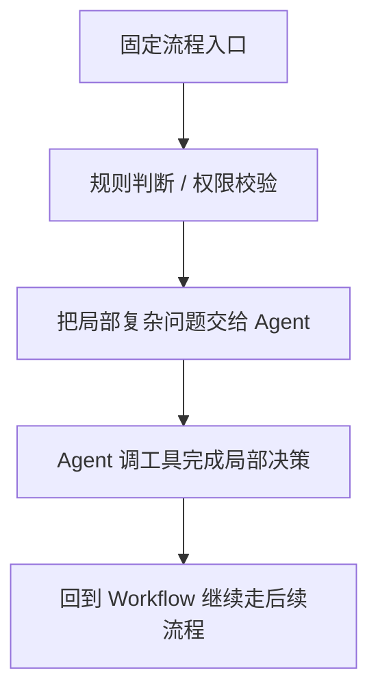

# AI Agent - 第 5 课：Workflow 与 Agent：边界、权衡与混合架构

## 学习目标

- 理解 Workflow 和 Agent 的核心区别，不再把二者简单理解成“静态”和“智能”。
- 知道为什么很多业务场景其实更适合 Workflow，而不是 Agent。
- 能判断什么时候该让模型动态决策，什么时候该把流程写死。
- 理解混合架构为什么往往比“纯 Agent”更靠谱。
- 对 Coze、Dify、n8n 这类平台形成正确预期：它们是交付方式，不是思想本身。

## 内容讲解

### 1. 这两个词为什么总被混在一起

AI 应用落地时，经常会出现两个系统形态：

- 一种是流程已经预先定义好，模型只在局部提供能力
- 一种是模型要决定“下一步该做什么”

前者更像 Workflow。  
后者更像 Agent。

但真实项目里，这两种东西经常混着出现，所以大家就容易混淆。

最有用的区分方式只有一个：

**到底是谁决定下一步。**

如果下一步基本是系统预先写好的，那就是 Workflow。  
如果下一步要根据当前观察结果动态决定，那才更像 Agent。

### 2. Workflow 的本质是什么

Workflow 的核心不是“简单”，而是：

**把流程结构提前确定。**

比如一个工单处理流程：

1. 读取工单
2. 分类
3. 提取优先级
4. 路由到团队
5. 发送通知

这条链路里，即使你用了大模型做分类和摘要，它本质上还是 Workflow，  
因为整体路径是预定义的。

Workflow 的优势非常明显：

- 可控
- 容易调试
- 容易做 SLA
- 出问题容易定位
- 容易做权限和审批

所以很多业务系统并不需要 Agent，只需要“加了模型能力的工作流”。

### 3. Agent 的本质是什么

Agent 和 Workflow 最大的不同在于：

**路径不是完全提前写死，而是执行过程中动态形成。**

比如一个故障排查助手：

- 先查监控
- 发现数据库指标正常
- 再查消息积压
- 发现队列堆积严重
- 再去看消费者错误日志

这里下一步到底查什么，不是系统提前硬编码好的，而是由当前证据驱动。  
这才是 Agent 真正的价值所在。

所以 Agent 并不是“更高级的工作流”，而是：

**把局部决策权交给模型和执行闭环。**

### 4. 为什么很多需求其实不该做 Agent

这是特别重要的一点。

很多团队一听说 Agent，就会想把所有流程都“智能化”。  
但真实情况是：

如果任务本身步骤稳定、规则清楚、异常路径有限，那 Workflow 往往更好。

比如：

- 表单审核
- 工单分类
- 报表生成
- 固定模板的内容处理
- 明确规则的审批流

这些任务的难点通常不在“下一步怎么想”，而在：

- 规则清不清楚
- 数据源稳不稳定
- 权限和审计怎么做

如果硬做成 Agent，系统只会更复杂，收益却不一定更高。

### 5. 一个实用判断标准：到底需不需要动态决策

你可以用下面几个问题来判断。

#### 5.1 任务步骤是否大体固定

如果基本固定，优先 Workflow。

#### 5.2 中途观察结果会不会显著改变后续路径

如果会，才更值得考虑 Agent。

#### 5.3 错误代价高不高

如果代价很高，倾向先 Workflow，再在局部加 Agent，而不是一上来放开自主决策。

#### 5.4 规则能否清楚表达

如果能，那很多时候规则引擎比 Agent 更稳。

### 6. 很多成熟系统最终都会走向“混合架构”

纯 Workflow 太死，纯 Agent 太飘。  
所以真实项目最常见的形态其实是混合架构：

这类架构特别常见。

比如一个客服系统：

- 先由固定流程做身份验证和路由
- 再让 Agent 总结上下文、查知识库、生成答复建议
- 最后由固定流程控制是否自动发送、是否人工审批

这时候 Agent 更像一个“智能决策节点”，而不是整个系统的总导演。

### 7. 低代码平台为什么看起来都像 Workflow + Agent 的混合体

像 Coze、Dify、n8n 这类平台，本质上是在帮你更快搭这种混合系统。

它们通常会提供：

- 固定节点编排能力
- 大模型调用节点
- 工具调用能力
- 知识库接入
- 条件分支
- 简单的 Agent 节点

所以你会发现：

这些平台真正强的地方，往往不是“把 Agent 做得多前沿”，而是让你更快把整个流程搭起来。  
对于很多公司来说，这反而比研究最前沿范式更有价值。

但要注意一件事：

**用了低代码平台，不代表你就真的想清楚架构了。**

平台能加速交付，但不会替你做边界判断。

### 8. 混合架构里最值得交给 Agent 的部分是什么

经验上，最适合交给 Agent 的通常是这些地方：

- 任务拆解
- 检索与信息综合
- 工具选择
- 方案生成
- 多轮排查
- 结果总结与解释

而不太适合直接交给 Agent 的往往是这些：

- 权限校验
- 账务扣减
- 强一致写操作
- 高风险配置变更
- 合规审批终态判定

也就是说：

**让 Agent 去做“认知和决策密集”的部分，让 Workflow 去守住“规则和风险密集”的部分。**

### 9. 从系统演进角度，最靠谱的路线通常是什么

真实团队做 Agent，最稳妥的路线通常不是：

“一开始就做一个全能自主 Agent”。

更常见、更现实的路线反而是：

1. 先做固定 Workflow
2. 在某个最费人的节点引入模型能力
3. 再把少量动态决策交给 Agent
4. 最后再考虑更复杂的协作或多 Agent

这条路线的好处是：

- 能逐步验证价值
- 出问题可控
- 更容易做 A/B 和回滚
- 方便和现有系统兼容

很多“Agent 项目失败”，不是因为 Agent 不行，而是因为团队跳过了这条渐进路线。

### 10. 一个更贴近工程实际的结论

做架构决策时，不要问：

“Workflow 高级还是 Agent 高级？”

更该问：

- 这个任务到底需要多少动态性？
- 哪部分适合模型判断？
- 哪部分必须由系统硬控？
- 一旦做错，代价有多高？

想清楚这些，再去选平台、选框架、选实现方式，事情会顺很多。

## 小结

这一课最核心的一句话是：

**Workflow 负责稳定流程，Agent 负责动态决策，真实系统最常见的是二者混合。**

不要为了“做 Agent”而做 Agent。  
如果流程本来就稳定，Workflow 往往更划算。  
如果任务确实依赖中途观察和动态决策，再把那一部分交给 Agent，通常才是更好的系统设计。

## 问题

1. Workflow 和 Agent 最关键的区分点是什么？
2. 为什么很多业务场景其实更适合 Workflow，而不是纯 Agent？
3. 在混合架构里，哪些环节更适合交给 Agent，哪些更适合交给固定流程？
4. 你觉得“低代码平台能加快交付，但不能替代架构判断”这句话为什么成立？
