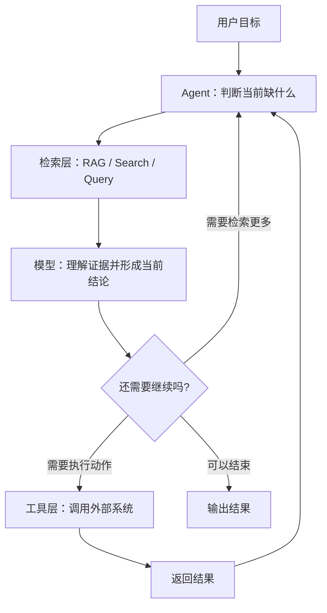

# AI Agent - 第 6 课：RAG 与 Agent：知识获取、推理与执行怎么配合

## 学习目标

- 彻底区分 RAG 系统和 Agent 系统，不再把二者混成一个模糊概念。
- 理解“知识获取”“推理判断”“动作执行”是三件不同的事。
- 知道什么时候只做 RAG 就够了，什么时候必须引入 Agent。
- 学会看清 Agentic RAG 的本质，不再把“多检索几次”误当成 Agent 全部。
- 建立一个更接近真实生产系统的 RAG + Agent 分层视角。

## 先给结论

一句话总结这节课：

**RAG 解决的是“模型不知道怎么办”，Agent 解决的是“为了完成目标，下一步该做什么”。**

所以二者不是谁替代谁，而是经常一起工作：

- RAG 提供外部知识
- Agent 决定何时查、查什么、查完怎么用、是否继续行动

如果你把它们混成一个词，系统设计会很容易乱掉。

---

## 1. 为什么 RAG 和 Agent 总被混

因为很多看起来“像 Agent”的系统，本质上只是：

1. 用户提问
2. 检索知识
3. 模型根据检索结果回答

而很多 Agent 也会：

- 接知识库
- 调搜索
- 查文档

所以表面上看，它们都像：

“先找资料，再让模型说话。”

但如果往下拆，就会发现关注点完全不同。

---

## 2. RAG 的本质是什么

RAG 是：

**Retrieval-Augmented Generation**

它解决的核心问题是：

**模型参数里没有，或者不能只相信模型参数时，怎么办？**

它的基本流程是：

1. 用户提问
2. 系统把问题转成检索请求
3. 从外部知识源召回相关内容
4. 把召回内容放进上下文
5. 模型基于这些内容生成答案

所以 RAG 本质上是在做一件事：

**给模型补知识。**

它最擅长的场景通常是：

- 企业知识库问答
- API 文档问答
- FAQ
- 手册、制度、规范问答
- 带出处的回答

这里的核心目标通常是：

- 答得对
- 有依据
- 别胡编

---

## 3. Agent 的本质又是什么

Agent 的关注点并不是“缺知识”本身，而是：

**为了完成一个目标，系统接下来该做什么。**

它可能需要：

- 决定先搜哪个方向
- 调多个工具
- 中间整合结果
- 根据反馈调整路径
- 最终执行某个动作

所以 Agent 的本质不是“知道更多”，而是：

**更会推进。**

这就是为什么一个系统即便接了知识库，也未必是 Agent；  
反过来，一个 Agent 即使不接知识库，也可能依旧是 Agent。

---

## 4. 一个最实用的区分法

你可以用下面这个判断：

### 如果系统主要在做：

- 检索资料
- 塞进上下文
- 输出基于资料的答案

那它更像 **RAG**。

### 如果系统主要在做：

- 判断还缺什么信息
- 决定下一步查什么或做什么
- 根据结果继续推进
- 直到任务完成

那它更像 **Agent**。

也就是说：

**RAG 更像“知识注入机制”，Agent 更像“任务推进机制”。**

---

## 5. 为什么很多业务只做 RAG 就够了

这是很重要的工程判断。

很多团队一看到“AI + 知识库”，就直接往 Agent 方向想。  
但真实情况是，很多需求只做 RAG 反而更稳、更省。

比如下面这些：

- 问公司制度
- 问接口文档
- 问产品功能说明
- 问排障手册
- 问 FAQ

这类需求的关键不是“下一步怎么决策”，而是：

- 资料能不能找准
- 证据能不能喂对
- 回答能不能基于资料生成

如果此时硬做成 Agent，复杂度会明显增加，但收益不一定同步增加。

所以一句很值得记住的话是：

**不是接了知识库就叫 Agent。**

---

## 6. 那为什么很多 Agent 又离不开 RAG

因为 Agent 做复杂任务时，经常也需要知识。

例如一个研发助手排查问题时，除了查实时监控和日志，还可能要：

- 查内部排障手册
- 查最近事故复盘
- 查服务字段说明
- 查数据库表结构说明

这些东西本质上都是：

**从外部知识源取信息**

也就是 RAG 在做的事。

所以更准确地说：

**RAG 经常是 Agent 的一个子能力，而不是 Agent 的同义词。**

Agent 负责：

- 什么时候查
- 查什么
- 查几次
- 查完怎么用
- 是否继续推进

RAG 负责：

- 把知识尽量召回出来

---

## 7. 把一件事拆成三层：知识、推理、执行

很多系统之所以做不清楚，是因为把这三层揉成了一坨。

### 7.1 知识获取层

回答：

- 我需要哪些外部信息？
- 从哪里拿？

来源可能是：

- 向量库
- 关键词检索
- SQL 查询
- 搜索引擎
- 文件系统
- Web

### 7.2 推理层

回答：

- 这些信息意味着什么？
- 证据是否足够？
- 下一步该怎么办？

这层通常主要由模型承担。

### 7.3 执行层

回答：

- 真正要做什么动作？

例如：

- 发工单
- 改状态
- 发通知
- 调服务

如果你能把这三层分清楚，后面很多系统架构判断都会顺很多。

---

## 8. RAG 真正难的地方，不只是“接个向量库”

很多人提起 RAG，只想到：

- 文档切 chunk
- 向量化
- 召回 top-k

这当然是 RAG 的基本面，但真实系统里更难的问题包括：

### 8.1 召回是否召得对

不是“有没有召回来”，而是“是不是把最关键证据召回来了”。

### 8.2 粒度是否合适

chunk 太小，语义断裂。  
chunk 太大，噪音太多。

### 8.3 查询是否需要改写

用户的问题不一定适合作为检索 query 原样使用。

### 8.4 召回后是否需要重排

向量召回相关，但不一定是最可用顺序。

### 8.5 多来源冲突怎么办

不同文档给出的规则相互矛盾时，系统怎么选？

所以 RAG 本身其实就已经是一整套工程问题，不只是“外挂知识库”。

这也是为什么后面我们还专门有“检索工程深水区”。

---

## 9. Agentic RAG 到底是什么

你可以先用一个很朴素的定义理解：

**Agentic RAG = 让检索这件事，也被放进任务推进闭环里。**

普通 RAG 往往是：

1. 检索一次
2. 回答一次

Agentic RAG 则更像：

1. 先拆问题
2. 针对不同子问题分别检索
3. 如果证据不足，再改写 query 检索
4. 对多轮检索结果做整合
5. 根据当前证据决定是继续搜还是进入输出

它和普通 RAG 的关键区别不在“用没用向量库”，而在：

**检索是否被纳入动态决策。**

---

## 10. 为什么“会检索”不等于“会做任务”

这是很多人容易忽略的一点。

假设一个系统很会检索：

- 能召回文档
- 能找制度
- 能找接口说明

这已经很有价值了。  
但它不等于会完成任务。

因为任务常常还包含：

- 多个信息源之间的取舍
- 先后顺序的选择
- 工具调用
- 中间状态维护
- 最终动作执行

所以：

- `RAG` 让模型更“知道”
- `Agent` 让系统更“会推进”

这两个能力经常一起出现，但本质上不一样。

---

## 11. 一个更接近真实生产的架构视角

下面这张图更接近真正的系统分工：

这个图里，最关键的认知是：

- RAG 不是整个系统
- Agent 不是所有事情都自己知道
- 知识获取只是闭环里的一个动作

---

## 12. 从工程上，什么时候从 RAG 升级到 Agent

你可以参考下面这个判断：

### 只做 RAG 就够的情况

- 问答类为主
- 路径稳定
- 不需要多轮探索
- 没有太多外部动作

### 该考虑 Agent 的情况

- 一次检索不够
- 需要多步信息收集
- 需要边查边改方向
- 需要调用工具
- 需要在证据基础上继续做事

也就是说，升级到 Agent 的标志通常不是：

“知识库越来越大”

而是：

**任务开始要求系统主动推进，而不是被动回答。**

---

## 小结

这一课最重要的三句话是：

### 第一，RAG 和 Agent 不是一个概念

- RAG 关注知识补充
- Agent 关注任务推进

### 第二，RAG 经常是 Agent 的子能力

很多 Agent 需要知识，所以会把检索纳入动作集合。

### 第三，从架构上要分清知识、推理、执行

如果把它们揉成一团，系统很快就会难以调试和扩展。

所以你以后看到一个系统时，可以先问：

**它是在“回答”，还是在“推进”？**

这个问题会非常有用。

---

## 问题

1. 为什么说“接了知识库”不等于“做了 Agent”？
2. 普通 RAG 和 Agentic RAG 的关键区别到底在哪里？
3. 为什么很多知识问答场景其实只做 RAG 就够了？
4. 一个排障助手为什么通常既需要 RAG，也需要 Agent？
