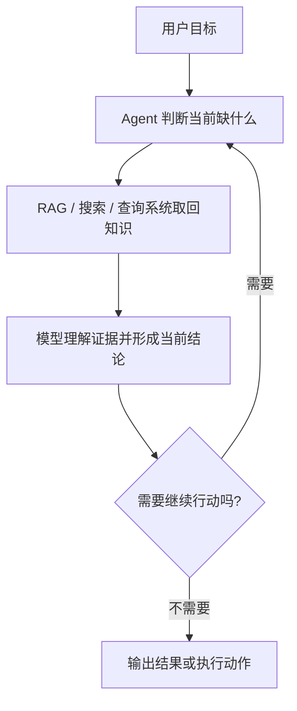

# AI Agent - 第 6 课：RAG 与 Agent：知识获取、推理与执行怎么配合

## 学习目标

- 彻底区分 RAG 系统和 Agent 系统，不再把二者混成一个词。
- 知道什么时候“检索一下再回答”就够了，什么时候必须引入 Agent。
- 理解知识获取、推理、执行在系统里分别扮演什么角色。
- 认识到“会检索”不等于“会做任务”。
- 能设计一个更贴近真实场景的 RAG + Agent 混合方案。

## 内容讲解

### 1. 为什么 RAG 和 Agent 总被混

因为很多 Agent 都会接知识库，很多 RAG 系统也会调用大模型。  
看起来它们都像：

- 先查点东西
- 再让模型说话

但如果往深处看，二者的关注点其实不一样。

### 2. RAG 在解决什么问题

RAG 的核心问题是：

**模型不知道，怎么办？**

它的思路是：

1. 用户提问
2. 系统去知识库检索相关材料
3. 把检索结果放进上下文
4. 模型基于这些材料回答

所以 RAG 的本质是：

**给模型补知识。**

它特别适合这些场景：

- 企业知识库问答
- 文档问答
- FAQ
- 政策、手册、规范类查询

此时系统真正要解决的是“答得对不对、有没有依据”。

### 3. Agent 在解决什么问题

Agent 的核心问题不是“知识不够”，而是：

**为了完成目标，下一步该做什么？**

它不只是查资料，还可能要：

- 决定先搜哪类信息
- 调用多个工具
- 处理中间结果
- 修改执行路径
- 最终完成某个任务

所以 Agent 的本质是：

**让系统围绕目标不断决策和行动。**

### 4. 一个最简单的区分方法

如果一个系统主要在做：

- 检索资料
- 把资料塞给模型
- 输出答案

那它更像 RAG。

如果一个系统主要在做：

- 判断缺什么信息
- 决定下一步查什么或做什么
- 根据工具结果继续推进
- 直到任务完成

那它更像 Agent。

一句话总结：

**RAG 重点是“找对知识”，Agent 重点是“推进任务”。**

### 5. 为什么很多场景其实只需要 RAG

有些团队一上来就把知识问答做成 Agent，结果复杂度一下子升高。  
其实如果需求只是：

- 问制度
- 问产品文档
- 问 FAQ
- 问接口说明

那很多时候一个做得好的 RAG 就够了。

因为用户真正需要的是：

- 找到相关资料
- 让模型基于资料组织答案
- 最好还能引用来源

这里并不一定需要多轮决策和复杂工具调用。

所以一个非常重要的工程判断是：

**不是接了知识库就叫 Agent。**

### 6. 那为什么很多 Agent 又离不开 RAG

因为 Agent 很多时候也需要知识。

举个例子，一个研发助手在排查问题时，除了查实时日志，还可能需要：

- 查公司内部排障手册
- 查某个系统字段定义
- 查历史事故复盘
- 查接口文档

这些都属于“从知识源取信息”，也就是 RAG 的工作。

所以更准确地说：

**RAG 经常是 Agent 的一个子能力。**

Agent 负责决定什么时候去查、查什么、查完怎么用。  
RAG 负责把知识找出来并喂给模型。

### 7. 一个更完整的视角：知识、推理、执行是三件事

很多系统之所以做不清楚，是因为把这三件事揉在一起了。

#### 7.1 知识获取

解决“我需要哪些外部信息”。

来源可能是：

- 向量检索
- 关键词检索
- 数据库查询
- 搜索引擎
- 文件系统

#### 7.2 推理

解决“这些信息意味着什么，下一步该怎么办”。

这部分通常由模型完成。

#### 7.3 执行

解决“真正去做动作”。

比如：

- 发通知
- 创建工单
- 更新状态
- 调内部 API

所以一个成熟系统里，知识、推理、执行往往是分层的，而不是混成一个黑盒。

### 8. Agentic RAG 是什么感觉

你可以把 Agentic RAG 理解成：

**不再只检索一次，而是让系统根据任务过程多轮检索、改写查询、筛选证据、逐步补足知识。**

比如做深度研究时：

1. 先把大问题拆成几个子问题
2. 分别检索
3. 发现某个方向证据不足
4. 再改写查询继续搜
5. 最后整合成报告

这就不是“查一次库然后回答”了，而是带有任务推进属性的检索系统。

所以它更接近：

RAG 是能力，Agent 是编排者。

### 9. 为什么只做检索往往不够

真实业务里，很多难题不只是“资料在哪”，还包括：

- 哪条资料更可信
- 多个来源冲突怎么办
- 资料不全时要不要继续搜
- 是否已经足够支持下一步动作
- 结果是否需要人工确认

这些问题本质上都不是检索问题，而是决策问题。  
这也是为什么一旦任务复杂起来，光靠 RAG 就会显得不够。

### 10. 一个很实用的系统分工

你可以把 RAG + Agent 的分工想成这样：

这里最重要的是：

- RAG 不负责整条任务闭环
- Agent 不应该自己凭空“记得全世界知识”

两者各司其职，系统才会清楚。

### 11. 从落地角度，该怎么选

如果你的场景主要是：

- 文档问答
- 知识检索
- 基于资料生成总结

优先做 RAG，别先上 Agent。

如果你的场景已经明显包含：

- 多步任务拆解
- 多轮检索
- 工具决策
- 执行动作

那就可以考虑 Agent，并把 RAG 作为其知识层。

### 12. 一个容易踩的坑：把 RAG 当成万能记忆

有些团队会把所有状态、历史、知识都塞进一个向量库，然后统称“记忆”。  
这通常会导致设计越来越混乱。

更好的做法是分清楚：

- 文档知识 -> RAG
- 用户偏好 -> 记忆
- 当前任务进度 -> 状态
- 推理过程中的关键信息 -> 笔记

这四者如果不分层，后面系统会越来越难控。

## 小结

这一课最核心的结论是：

**RAG 主要解决“模型知识不够”，Agent 主要解决“任务怎么推进”。**

二者不是互斥关系。  
很多时候，RAG 是 Agent 的知识获取层；而在更简单的知识问答场景里，RAG 本身就已经够用了，没必要额外引入 Agent 的复杂度。

## 问题

1. 为什么说“接了知识库”不等于系统就成了 Agent？
2. RAG 和 Agent 分别更擅长解决哪类问题？
3. 在什么情况下，RAG 足够；在什么情况下，需要升级成 Agent + RAG 的组合？
4. 为什么把知识、状态、记忆、笔记全部混成一个“向量库记忆”通常不是好设计？
