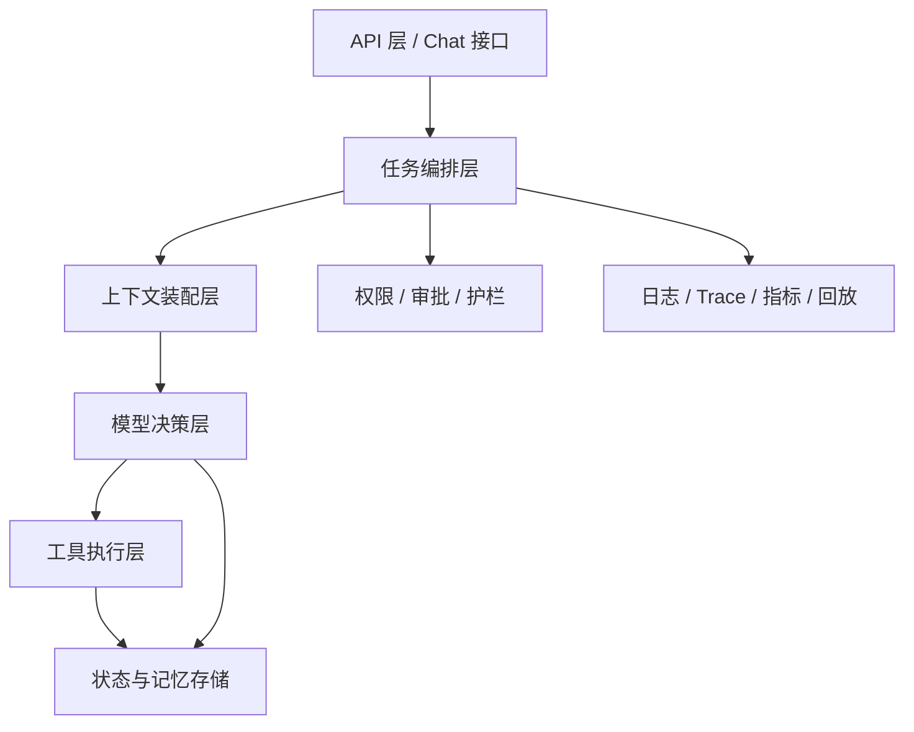

# AI Agent - 第 7 课：工程实现：单 Agent 服务的后端架构怎么设计

## 学习目标

- 从后端系统视角理解一个单 Agent 服务通常由哪些模块组成。
- 知道为什么 Agent 不能只写成“一个请求进来就调一下模型”的接口。
- 理解状态存储、工具层、权限控制、审计、超时和重试在 Agent 服务里的位置。
- 建立“先做单 Agent、先做可控系统”的工程意识。
- 能画出一个适合自己业务的单 Agent 基础架构。

## 内容讲解

### 1. 为什么单 Agent 服务也会比你想象中复杂

很多人第一次做 Agent，会把它理解成一个更复杂的聊天接口：

- 收到用户输入
- 拼 prompt
- 调模型
- 返回答案

但只要任务开始涉及工具、状态、记忆、长时程执行，这种结构很快就不够了。

因为你会马上遇到这些问题：

- 任务执行到一半中断了怎么办
- 同一个动作被重复执行怎么办
- 哪些工具允许自动调用，哪些必须审批
- 外部 API 超时了怎么办
- 怎么回放一次失败任务
- 怎么知道成本花在哪了

所以从工程角度看，单 Agent 服务本质上更像一个：

**带推理能力的任务执行系统。**

### 2. 一个比较典型的单 Agent 架构

这个图的意思不是一定要拆这么多服务，而是告诉你：

**Agent 线上可用，靠的是这些职责都有人管。**

### 3. API 层：先把入口做简单

入口层最主要的职责不是“智能”，而是接请求、验参数、建立任务上下文。

它通常要解决：

- 谁发起的请求
- 当前是什么会话 / 任务
- 这次请求的权限范围是什么
- 是同步请求还是异步任务

这里一个很重要的工程选择是：

如果任务可能超过几秒，最好不要继续坚持同步 HTTP 请求直接等到结束。  
更稳妥的做法通常是：

- 请求创建任务
- 返回任务 ID
- 前端轮询或流式订阅结果

这样你的 Agent 才更适合做长任务。

### 4. 任务编排层：真正决定这次执行怎么跑

编排层负责的不是模型推理细节，而是“这次任务整体怎么走”。

比如：

- 用哪个 Agent 配置
- 最大步数是多少
- 是否允许工具调用
- 是否启用记忆
- 哪些动作需要审批

编排层有点像总控室。  
模型可以决定局部动作，但整体的运行边界应该由编排层先设好。

### 5. 上下文装配层：别把所有东西都塞进 prompt

这一层经常被低估。

它的职责是把真正有用的信息装配给模型，比如：

- 用户当前问题
- 当前任务状态摘要
- 最近关键观察
- 与本轮最相关的记忆
- 必要的知识片段
- 可用工具列表

如果没有这一层，系统往往会退化成：

- prompt 越堆越长
- 无关信息越来越多
- 成本越来越高
- 效果越来越不稳定

所以成熟 Agent 往往不是“一个 prompt”，而是“一个上下文构建器”。

### 6. 模型决策层：它负责判断，不负责兜底一切

模型决策层负责的通常是：

- 当前是否应该答复
- 是否应该调用工具
- 该调用哪个工具
- 工具参数是什么
- 当前是否已经足够结束

但很重要的一点是：

**模型不是系统边界。**

不要把这些职责也交给模型：

- 权限判断
- 预算硬限制
- 危险动作最终放行
- 幂等和重试语义

这些东西应该是系统层规则，不应该只靠模型“自觉”。

### 7. 工具执行层：让外部能力可控地被调用

工具层的职责不只是调接口，还包括：

- 参数校验
- 调用超时
- 重试策略
- 幂等控制
- 错误标准化
- 风险隔离

举个例子，同样是“创建工单”工具，如果不做任何系统包装，问题会很多：

- 参数少一个字段就失败
- 网络抖动时重复创建
- 权限不足时模型看不懂错误
- 下游慢时阻塞整个任务

所以工具层其实更像“Agent 专用适配层”，不是把原有 API 直接透出就够了。

### 8. 状态与记忆存储：别怕麻烦，早点做

单 Agent 服务最早应该做好的持久化信息，通常是这些：

- 会话历史
- 当前任务状态
- 已完成步骤
- 已调用工具记录
- 中间结论或笔记
- 重要长期记忆

为什么要早做？

因为只要线上开始有真实用户，下面这些需求马上就会来：

- 失败任务重跑
- 中断恢复
- 人工接管
- 审计追踪
- 问题复盘

而这些能力全都依赖状态和记录，不是靠模型自己“记住”。

### 9. 护栏层：决定什么能做，什么不能做

Agent 系统天然有副作用风险。  
所以护栏层通常至少要管这些事：

- 某些工具是否可用
- 某些参数是否合法
- 是否超预算
- 是否超步数
- 是否涉及高风险写操作
- 是否需要人工审批

从经验上看，最稳妥的做法是把动作分成三层：

- 只读动作：相对安全，可自动执行
- 低风险写动作：可自动执行，但要有审计
- 高风险写动作：必须人工确认

这层做好了，Agent 才可能真的进生产。

### 10. 可观测性：没有回放能力，就很难真正迭代

Agent 系统特别容易出现一种问题：

“偶尔成功，偶尔失败，而且你说不清为什么。”

所以可观测性非常关键。

你至少要能看到：

- 每一步模型输入输出
- 选了哪个工具
- 工具参数是什么
- 工具返回了什么
- 哪一步失败
- 整个任务耗时和成本

这实际上和后端里的 trace 很像。  
没有 trace，你很难定位问题；没有 Agent trace，你也很难调 Agent。

### 11. 为什么单 Agent 往往是更好的起点

因为一旦上多 Agent，复杂度会立刻增加：

- 状态怎么共享
- 上下文怎么传
- 错误归因更难
- 成本更高
- 调试更痛苦

但很多团队真正的问题，其实单 Agent 就能解决。

所以从工程路线看，一个更健康的顺序通常是：

1. 先做单 Agent
2. 把工具、状态、护栏、回放做好
3. 再评估是否需要多 Agent

### 12. 一个最小可用单 Agent 服务应该长什么样

如果你今天真要落一个最小可用版本，可以先只做这些：

- 一个任务入口
- 一个上下文装配器
- 一个模型决策循环
- 一组只读工具
- 一份任务状态存储
- 一套基础日志与 trace
- 一些硬限制：超时、步数、预算

只要这些做好，你的系统就已经比大多数“炫酷 demo”更接近可上线。

## 小结

这一课最重要的是把 Agent 看成一个后端系统，而不是一段 prompt。

**单 Agent 服务真正要设计的，不只是模型怎么调，而是：任务怎么编排、工具怎么包装、状态怎么存、风险怎么控、问题怎么回放。**

你越早用系统设计的眼光看 Agent，后面走得越稳。

## 问题

1. 为什么说一个单 Agent 服务本质上更像“带推理能力的任务执行系统”，而不是一个聊天接口？
2. 在单 Agent 架构里，哪些职责必须由系统层控制，而不应该只交给模型？
3. 如果没有状态存储和可观测性，线上 Agent 最容易出现什么问题？
4. 为什么很多场景下，先把单 Agent 做稳，比直接上多 Agent 更重要？
