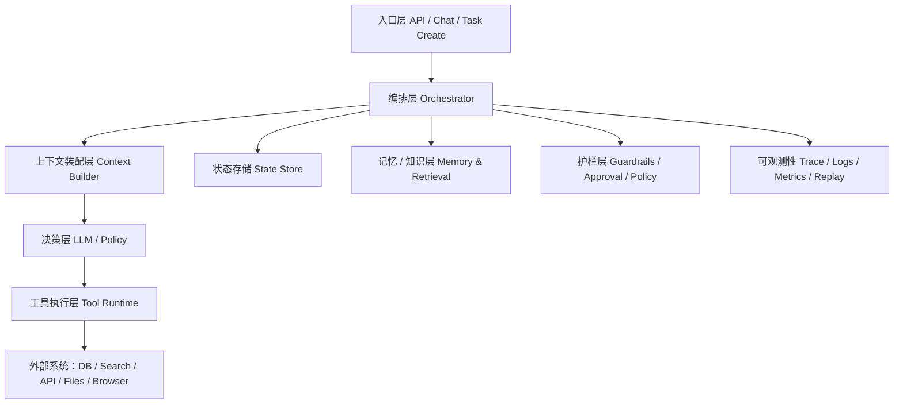
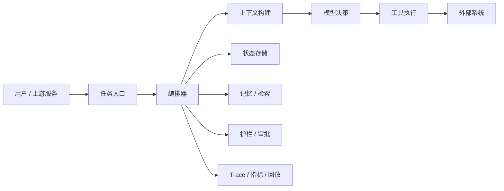

# AI Agent - 第 7 课：工程实现：单 Agent 服务的后端架构怎么设计

## 学习目标

- 从后端系统视角理解一个可上线的单 Agent 服务至少包含哪些模块。
- 知道为什么 Agent 不能只写成“收到请求就调一下模型”的接口。
- 理解状态存储、工具层、护栏、审计、可观测性在 Agent 服务里的位置。
- 明白为什么“先做单 Agent、先做可控系统”是健康路线。
- 能为自己的业务画出一个更靠谱的单 Agent 基础架构。

## 先给结论

如果只记一句话，我希望你记住：

**一个可上线的单 Agent 服务，本质上不是“模型接口”，而是“带推理能力的任务执行系统”。**

这意味着它天然会比普通聊天接口复杂很多。

因为一旦任务开始涉及：

- 工具调用
- 多步执行
- 长任务
- 中断恢复
- 审批放行
- 成本预算
- 线上排障

系统就必须开始承担传统后端系统的责任。

换句话说：

**Agent 工程的难点，从来不只是“调模型”，而是“把推理嵌进一个可控系统”。**

---

## 1. 为什么单 Agent 服务也会比你想象中复杂

很多人最开始的实现会是这样：

1. 收到用户输入
2. 拼 prompt
3. 调模型
4. 返回结果

这在问答、总结、翻译场景里没问题。  
但只要进入 Agent 范畴，很快就会遇到下面这些问题：

- 任务做一半中断了怎么办？
- 模型重复调用同一个写工具怎么办？
- 外部 API 超时怎么办？
- 哪些动作必须人工确认？
- 这次任务为什么失败，怎么回放？
- 成本突然飙升，到底花在哪一步？

只要你开始问这些问题，就说明系统已经不是“prompt 包装层”了，而是：

**一个有状态、有动作、有风险、有调度的执行系统。**

---

## 2. 一个比较典型的单 Agent 架构

这张图的重点不是说你必须拆成十几个服务，而是提醒你：

**这些职责都必须被明确承担。**

否则系统迟早会在这些地方出问题。

---

## 3. 入口层：不要一上来就把一切都做成同步聊天

入口层最基础的职责通常包括：

- 鉴权
- 参数校验
- 建立任务 ID
- 决定同步还是异步执行
- 绑定用户和权限范围

这里一个非常实用的工程判断是：

### 如果任务可能超过几秒，不要死守“一个 HTTP 请求等完”

更稳妥的做法通常是：

1. 创建任务
2. 返回任务 ID
3. 前端轮询或流式订阅状态

因为只要任务进入：

- 多步执行
- 等待工具结果
- 需要人工确认
- 长时间检索

同步请求模型就会越来越差。

所以入口层往往要支持两种模式：

- `同步模式`：适合小任务
- `异步任务模式`：适合长任务

---

## 4. 编排层：真正的总控室

编排层不是“模型层”，它负责的是：

- 这次任务怎么开始
- 能跑多少步
- 是否允许工具调用
- 是否允许写操作
- 哪些动作要审批
- 是否启用记忆和检索

模型负责局部判断，但系统整体边界必须先由编排层设好。

这层的存在特别重要，因为它回答的是系统级问题，而不是语言问题：

- 预算上限是多少？
- 最长时长是多少？
- 失败多少次要终止？
- 哪些工具可见？

如果没有编排层，模型的“局部聪明”很快就会变成系统的“整体失控”。

---

## 5. 上下文装配层：不要把所有东西都塞进 prompt

这是最常被低估的一层。

它要负责决定：

- 当前轮需要给模型哪些信息
- 当前哪些历史信息最重要
- 检索结果里哪几段值得放进去
- 当前任务状态怎么摘要
- 工具列表怎么裁剪

这层的关键不是“大而全”，而是：

**让模型看到对当前这一步最有帮助的信息。**

如果这一层做不好，就会出现：

- prompt 越来越长
- 成本越来越高
- 无关信息越来越多
- 模型越来越抓不住重点

所以一个成熟 Agent 往往不是“一个 prompt”，而是“一个上下文构建器”。

---

## 6. 决策层：模型负责判断，但不应该负责兜底

决策层通常由大模型承担，它负责的事包括：

- 当前是否应该答复
- 是否应该调用工具
- 该调用哪个工具
- 参数怎么填
- 当前是否已经足够结束

但有几个东西，千万别只靠模型“自觉”：

- 权限边界
- 成本预算
- 最大步数
- 高风险动作最终放行
- 幂等控制

一个很重要的系统原则是：

**模型负责局部决策，系统负责最终边界。**

否则你会得到一个“很会想，但没有刹车”的系统。

---

## 7. 工具执行层：不要把内部 API 直接裸露给模型

工具层通常至少要承担这些事：

- 参数校验
- 类型转换
- 默认值补全
- 调用超时
- 重试控制
- 幂等控制
- 错误标准化
- 风险隔离

为什么？

因为你原本的业务 API 大概率不是为 Agent 设计的。

例如一个内部接口可能：

- 参数命名很业务黑话
- 返回结构过深
- 错误信息不标准
- 写操作缺少幂等 key

这些对人类工程师来说还能忍，对 Agent 来说非常容易出错。

所以更成熟的做法通常是：

**在业务 API 之外，再包一层 Agent-friendly Tool Runtime。**

---

## 8. 状态存储：从第一天起就该认真对待

只要你想让任务支持：

- 中断恢复
- 重跑
- 人工接管
- 审计
- 回放

那状态存储就不是可选项，而是必选项。

最早应该持久化的内容通常包括：

- 任务 ID
- 当前阶段
- 当前步数
- 已完成步骤
- 最近工具调用记录
- 当前结论摘要
- 失败原因
- 是否等待人工确认

这里一个非常容易踩的坑是：

只存聊天消息，不存结构化状态。

这样短期看似简单，长期一定会让你很难：

- 精确恢复任务
- 判断系统当前阶段
- 实现幂等重试
- 做可靠回放

---

## 9. 记忆与知识层：别让所有东西都进上下文

单 Agent 服务通常还需要两类额外信息源：

### 9.1 知识层

例如：

- 企业文档
- 排障手册
- API 文档
- 历史复盘

### 9.2 记忆层

例如：

- 用户偏好
- 任务模板经验
- 长期偏好配置

它们的共同作用是：

**降低模型“当场瞎猜”的概率。**

但不要犯一个常见错误：  
不是有知识、有记忆，就每轮都全塞进去。

这层应该被按需检索、按需装配，而不是无脑拼接。

---

## 10. 护栏层：Agent 能不能上线，很多时候看它

护栏层通常至少要管这些事情：

- 哪些工具可见
- 哪些工具可以自动执行
- 哪些动作需要审批
- 是否超过预算
- 是否超过步数
- 是否触发高风险规则
- 是否命中敏感数据或越权访问

一个很常见的分层方式是：

### 只读动作

可以自动执行。

### 低风险写动作

可以执行，但要有审计和幂等。

### 高风险写动作

必须人工确认。

如果你没有明确的护栏层，那系统哪怕效果再好，也很难真的放心放进生产环境。

---

## 11. 可观测性：没有 trace，就几乎不可能认真调 Agent

普通接口失败时，你至少还能看：

- 请求日志
- 错误栈
- SQL 日志

但 Agent 系统失败时，单看最终报错往往完全不够。

你通常至少要能看到：

- 每一步模型输入输出
- 本轮可见上下文摘要
- 选了哪个工具
- 参数是什么
- 工具返回了什么
- 当前状态如何变化
- 总 token、总耗时、总成本

这本质上就是 Agent 时代的 trace。

没有这套东西，你会经常处于这种状态：

“我知道它错了，但我不知道它到底哪一步开始错的。”

---

## 12. 单 Agent 为什么通常是更好的起点

很多人一开始就想：

“要不要直接做多 Agent？”

但从工程演进看，更健康的顺序通常是：

1. 先把单 Agent 做稳
2. 把工具、状态、护栏、回放、评估做扎实
3. 再看是否真的需要角色拆分

因为一旦进入多 Agent，复杂度会立刻上升：

- 状态怎么共享
- 责任怎么归因
- 消息怎么同步
- 失败怎么恢复
- 哪个 Agent 该停、哪个不该停

所以单 Agent 不只是“简单版”，它通常还是：

**最值得先打磨的生产形态。**

---

## 13. 一个最小可用单 Agent 服务，至少应该具备什么

如果你今天要落地一个第一个版本，我建议最少包含下面这些：

### 必要组件

- 一个任务入口
- 一个上下文装配器
- 一个决策循环
- 一组只读工具
- 一个结构化状态存储
- 一套基础 trace
- 超时、步数、预算限制

### 尽快补上的组件

- 工具幂等
- 人工接管
- 权限策略
- 失败重跑
- 基础评估

如果这些都没有，那系统大概率只能算 demo，还不能算可靠服务。

---

## 14. 一张更贴近真实项目的心智图

你可以把单 Agent 服务想成下面这个结构：

这张图有一个很重要的工程启发：

**模型只是其中一层，不是全部。**

如果你以后做 Agent 仍然只盯着 prompt 和 model 版本，系统会很快碰到天花板。

---

## 小结

这一课最重要的结论是：

### 第一，单 Agent 服务本质上是任务执行系统

不是“更复杂的聊天接口”。

### 第二，可上线的关键不在于模型多强，而在于系统是否可控

核心问题是：

- 状态怎么存
- 工具怎么包
- 风险怎么控
- 问题怎么回放

### 第三，先做单 Agent、先做可控系统，是最健康的工程路线

只有把单 Agent 的骨架打稳了，后面多 Agent、协作、复杂规划才有意义。

---

## 问题

1. 为什么说单 Agent 服务从本质上更像任务执行系统，而不是聊天接口？
2. 为什么状态存储不能只靠聊天历史替代？
3. 工具执行层为什么要做 Agent-friendly 包装，而不是直接调用原始内部 API？
4. 为什么说护栏层和可观测性层决定了 Agent 能不能真正上线？
