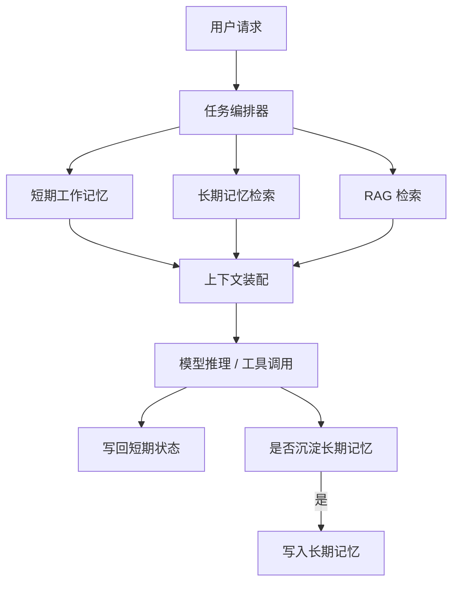

# AI Agent - 第 8 课：记忆与检索：Memory、RAG、长期记忆与外部知识

## 学习目标

- 搞清楚聊天历史、运行状态、长期记忆、知识库这几件事为什么不能混为一谈。
- 理解 Agent 为什么既需要 Memory，又经常需要 RAG，而且这两者不是简单替代关系。
- 知道长期记忆到底在存什么，不该存什么，以及为什么“什么都记住”通常是坏事。
- 建立一条稳定的检索主线：切分、索引、召回、重排、拼装上下文、生成答案。
- 能从系统设计角度判断：一个 Agent 应该用工作记忆、情景记忆、语义记忆，还是根本不需要记忆。

## 内容讲解

### 1. 为什么 Memory 和 RAG 总是被放在一起讲

因为它们都在解决同一个根问题：

**模型自己的上下文窗口太小，而且每次调用都是“短暂失忆”的。**

如果没有外部记忆和外部知识，Agent 很容易出现这些问题：

- 上一轮刚说过的偏好，下一轮就忘了
- 做到一半的任务，下一次调用接不上
- 需要最新资料时，只能硬编
- 同一个用户反复问类似问题，系统每次都像第一次见面

但 Memory 和 RAG 解决的并不是同一件事。

可以先用一句最实用的话来区分：

- **Memory 更像“这个 Agent 自己该记住什么”**
- **RAG 更像“这个 Agent 需要去哪里查资料”**

一个偏内部状态，一个偏外部知识。

### 2. 先把最容易混掉的四个概念拆开

很多人一到 Agent 这儿，脑子里只有一个大词叫“上下文”。  
但工程里至少要分清下面四种东西：

| 概念 | 它在解决什么 | 生命周期 | 典型内容 |
| --- | --- | --- | --- |
| 聊天历史 | 维持当前会话连续性 | 通常较短 | 最近几轮对话 |
| 运行状态 | 保证任务能继续推进 | 一个任务周期内 | 当前步骤、工具结果、待办事项 |
| 长期记忆 | 让 Agent 逐渐“认识”用户或任务世界 | 跨任务、跨会话 | 用户偏好、历史结论、经验总结 |
| 知识库 / RAG | 给模型补外部事实与资料 | 取决于数据源 | 文档、FAQ、代码库、产品手册 |

所以：

- 把聊天记录全量塞给模型，不等于有记忆
- 把向量库接进来，不等于有长期记忆
- 有长期记忆，也不等于能回答最新世界知识

### 3. 借人类记忆做类比，但不要类比过头

人类记忆常被分成工作记忆、情景记忆、语义记忆、程序性记忆。  
这个类比对 Agent 很有帮助，但不要把它理解成“机器真的像人脑一样工作”。

我们借这个类比，只是为了方便建模：

- **工作记忆**：当前这件事眼前要用的信息
- **情景记忆**：某次具体经历和发生过的事件
- **语义记忆**：抽象出来、相对稳定的知识
- **程序性记忆**：做事的方法、习惯、偏好、规则

映射到 Agent 系统，大致可以理解为：

| 人类类比 | Agent 中更接近什么 |
| --- | --- |
| 工作记忆 | 当前任务状态、最近观察、scratchpad |
| 情景记忆 | 某次会话摘要、某次执行轨迹、某次故障处理过程 |
| 语义记忆 | 用户长期偏好、领域事实、抽取后的稳定知识 |
| 程序性记忆 | 工具使用规则、固定工作规范、偏好的输出风格 |

### 4. 一个靠谱 Agent 通常至少有两层记忆

最常见、也最容易落地的设计，不是“做一个大而全记忆系统”，而是先分成两层：

1. **短期工作记忆**
2. **长期外部记忆**

可以画成这样：

这张图最关键的点不是组件名，而是两个方向：

- **读**：需要的时候把记忆和知识拉进来
- **写**：不是每轮都写，而是有选择地沉淀

### 5. 短期工作记忆到底是什么

短期工作记忆不是“为了以后都能记住”，而是为了：

- 让任务做得下去
- 让下一步知道上一部发生了什么
- 让工具调用不会前后脱节

它常见会包含：

- 当前目标
- 已完成步骤
- 上一轮工具输出摘要
- 当前假设
- 未完成待办
- 错误与重试信息

比如一个代码 Agent 正在排查线上故障，工作记忆里可能是：

- 当前要查的是支付超时
- 已经查过 Nginx 日志
- 发现两个异常 trace id
- 下一步要查数据库连接池监控

这些内容高度临时，不一定值得长期保存，但此刻非常关键。

### 6. 长期记忆不是“把所有历史都存下来”

真正难的从来不是“能不能存”，而是“值不值得存”。

长期记忆最常见的错误就是：

- 用户说一句话就存一条
- 所有会话都做摘要
- 每次工具结果都原样入库
- 最后记忆库变成噪声垃圾场

长期记忆最适合存的是这几类：

1. **稳定偏好**
   - 比如用户喜欢中文输出、喜欢表格、偏好某种代码风格
2. **重复会用到的事实**
   - 比如某个团队的发布流程、某个项目的固定目录结构
3. **高价值经历**
   - 比如某次故障定位路径、某类问题的经验结论
4. **长期任务状态**
   - 比如一个跨几天的研究任务目前推进到了哪里

不适合长期存的通常是：

- 一次性寒暄
- 冗长原始日志
- 已经过时的瞬时状态
- 未验证、可信度低的模型猜测

### 7. 记忆系统真正的难点是“写入策略”

很多人把重点放在“用向量库还是图数据库”，但长期看更关键的是：

**什么时候写？写什么？怎么更新？**

一个比较实用的写入策略可以从四个问题开始：

1. **这条信息未来还会用到吗？**
2. **它是稳定事实，还是临时状态？**
3. **它会不会和旧记忆冲突？**
4. **它值得花检索成本吗？**

所以一个成熟的记忆写入链路，通常会包含：

- 候选信息提取
- 记忆价值判断
- 结构化归一
- 冲突检测
- 写入或更新

这也是为什么很多团队最后会发现：

**Memory 的核心不是存储，而是治理。**

### 8. RAG 解决的是“外部知识接入”，不是“我有向量库所以我懂了”

RAG 的基本问题很朴素：

模型参数里没有你公司的内部知识，也没有今天刚更新的文档。  
那就只能在回答前先去查，再把查到的内容塞进当前上下文。

最经典的 RAG 流程可以拆成：

1. 文档解析
2. 切分 chunk
3. 向量化 / 建索引
4. 查询改写
5. 召回候选片段
6. 重排
7. 拼装上下文
8. 生成答案

可以把它想成“开卷考试”：

- 模型不是把答案全背下来
- 而是先翻资料，再根据资料组织回答

### 9. 基础 RAG 为什么经常不好用

因为“检索”这一步远比表面看起来难。

常见问题包括：

- chunk 切太碎，语义断裂
- chunk 切太大，噪声太多
- query 写得太泛，召回不准
- 只做向量召回，漏掉关键词精确匹配
- 候选片段太多，真正有用的信息被淹没
- 检索到了相关片段，但没把它们组织成模型易读的上下文

所以后续才会出现一堆增强手法：

- 混合检索：向量 + 关键词
- 元数据过滤：按用户、时间、来源、权限过滤
- 多路召回：一条问题改写成多个检索子问题
- HyDE：先让模型假想答案，再用这个假想答案去检索
- Reranker：不是只看召回，而是再做一轮排序
- Query Routing：不同问题走不同知识源

### 10. Memory 和 RAG 的边界，决定了系统是否会越做越乱

一个很重要的原则是：

**不要把长期记忆库当成通用文档库，也不要把知识库当成用户记忆库。**

更直白地说：

- 用户偏好、长期目标、个体经历，更适合放 Memory
- 产品文档、代码仓库、帮助中心、更适合走 RAG

否则就会出现两个坏结果：

1. 记忆库里塞满外部文档，检索一团糟
2. 知识库里混入大量个人状态，结果既污染检索，又影响权限边界

### 11. 真正稳定的系统，往往是“Memory + RAG + State”三者分层

一个比较靠谱的思路是：

- **State** 管当前任务
- **Memory** 管跨任务沉淀
- **RAG** 管外部知识补给

如果这三层分好了，系统会更清楚：

- 哪些信息应该自动写回
- 哪些应该只在本轮存在
- 哪些应该通过检索按需引入

### 12. 一个更实用的例子：研究助手为什么需要三层

假设我们做一个研究助手。

用户说：

“帮我持续跟踪 AI Agent 在企业软件里的落地，先整理一版框架，再下周继续。”

这时：

- **工作状态** 里会有：本轮已经收集了哪些论文、下一步待补哪些方向
- **长期记忆** 里会有：这个用户更关注企业落地而不是纯学术、喜欢中文结构化总结
- **RAG** 会去查：论文、博客、公司技术文档、之前沉淀的资料库

如果只靠聊天历史，很快就撑不住。  
如果只靠 RAG，又记不住这个用户是谁、任务推进到哪。  
如果只靠长期记忆，也没法补最新资料。

### 13. 设计 Memory 时，先问这五个问题

1. 这条信息是瞬时状态，还是长期知识？
2. 写入它，会不会帮助未来任务？
3. 它过期了怎么办？
4. 它和旧记忆冲突时怎么处理？
5. 谁能读这条记忆，权限边界是什么？

很多系统不是死在“检索不出来”，而是死在“把不该存的都存了进去”。

### 14. 设计 RAG 时，先问这五个问题

1. 我的问题属于问答、检索、分析，还是执行任务？
2. 数据源是否可信、是否最新、是否有权限边界？
3. chunk 应该按段落切、按语义切，还是按结构切？
4. 召回失败时，是 query 问题、索引问题，还是文档问题？
5. 模型真正需要的是原文、摘要，还是结构化字段？

### 15. 常见误区

- 误区一：有向量库就等于有长期记忆
- 误区二：把每次对话都永久存储
- 误区三：把 Memory 和 RAG 直接混成一个统一检索池
- 误区四：只做“召回率”优化，不做上下文装配优化
- 误区五：忽略冲突、时效和权限，导致记忆越积越脏

## 一句话总结

**Memory 解决“这个 Agent 应该记住什么”，RAG 解决“这个 Agent 需要去哪里查”；真正稳定的系统，通常要把 State、Memory、RAG 分层，而不是把所有信息都塞进一个大上下文里。**

## 问题

1. 聊天历史、运行状态、长期记忆、知识库各自在解决什么问题？
2. 为什么“把所有内容都写入长期记忆”通常会让系统变差？
3. 如果你要做一个研究助手，哪些信息该放 State，哪些该放 Memory，哪些该走 RAG？
4. 一个基础 RAG 系统最容易在哪几个环节出问题？
