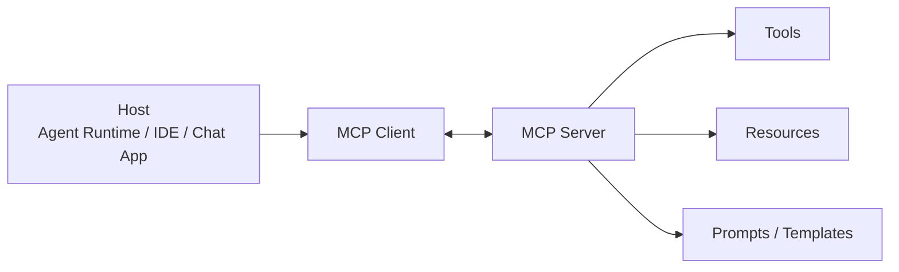

# AI Agent - 第 10 课：智能体通信协议：MCP、A2A、ANP 与工具生态

## 学习目标

- 理解为什么 Agent 做到一定复杂度之后，必须引入协议层，而不是继续靠手写适配。
- 区分 Tool Calling、MCP、A2A、ANP 各自所处的层次，避免把它们当成一回事。
- 深入理解 MCP 的宿主、客户端、服务端三方关系，以及它为什么会迅速成为工具接入的事实标准。
- 理解 A2A 解决的是“智能体之间如何协作”，而不是“工具怎么接入”。
- 能判断协议能解决什么，解决不了什么，不会把协议神化成万能中间件。

## 内容讲解

### 1. 为什么协议会在 Agent 里突然变重要

在最早的 Agent 原型阶段，我们通常这样做：

- 模型决定要不要调用工具
- 框架把工具 schema 发给模型
- 模型返回工具名和参数
- 本地代码执行工具

这个阶段很顺，因为系统还小。

但一旦规模变大，问题就来了：

- 工具越来越多
- 工具来源越来越杂
- 不同运行时之间的能力无法复用
- 多个 Agent 开始协作
- 你需要跨进程、跨机器、跨团队共享能力

这时如果还靠手写 glue code，复杂度会迅速失控。

协议层出现，就是为了让“能力接入”和“能力协作”从临时脚手架，升级成稳定接口。

### 2. 先把四个容易混的层次分开

很多讨论一上来就把函数调用、MCP、A2A 混成一团。  
其实它们不是同一层。

可以先分成这四层：

| 层次 | 它在解决什么 |
| --- | --- |
| 模型接口层 | 模型怎么表达“我要调工具” |
| 工具接入层 | 运行时怎么把外部能力暴露给模型 |
| Agent 协作层 | 多个 Agent 怎么互相委托、协商、回传结果 |
| 网络与发现层 | 在更大网络里怎么发现和路由这些能力 |

对应到常见名词，大致是：

- **Tool Calling / Function Calling**：更偏模型接口层
- **MCP**：更偏工具接入层
- **A2A**：更偏 Agent 协作层
- **ANP**：更偏更大范围的网络与发现层

### 3. Tool Calling 为什么不够

Tool Calling 解决的是：

**模型怎么把“我想调用某个函数”表达出来。**

它通常会告诉你：

- 要调用哪个工具
- 参数长什么样

但它不负责很多更大的问题：

- 工具能力怎么动态发现
- 工具背后怎么连接外部系统
- 权限怎么管理
- 资源怎么暴露给模型
- 工具描述怎么被多个宿主统一复用

也就是说，Tool Calling 很重要，但它更像一个接口点，而不是完整生态。

### 4. MCP 为什么会这么快被接受

因为 MCP 碰到的是一个几乎所有 Agent 团队都会痛的点：

**每个工具集成都重新写一遍，实在太累了。**

MCP 的直观理解可以是：

**给模型和外部能力之间定义了一种标准插头。**

只要工具方按这个插头暴露能力，宿主侧就能更统一地接入。

### 5. MCP 的核心角色不是“一个协议”，而是三方关系

理解 MCP 最好不要只盯着 server。

它通常有三个角色：

- **Host**：真正运行 Agent 或聊天界面的宿主
- **Client**：宿主里负责说 MCP 语言的那一层
- **Server**：暴露工具、资源、提示模板等能力的一侧

可以画成这样：

这里最关键的认识是：

**MCP 不只是工具调用。它还想统一“模型上下文可用能力”的暴露方式。**

### 6. 为什么说 MCP 不只是 tools

很多人第一次接触 MCP，会把它理解成“工具协议”。  
这只说对了一半。

MCP 之所以重要，是因为它想统一三类东西：

1. **Tools**
   - 让模型发起动作
2. **Resources**
   - 让模型能读取结构化外部内容
3. **Prompts**
   - 让宿主能复用预定义提示模板

这意味着 MCP 的野心不是单纯“让模型调函数”，而是：

**把可被模型消费的外部能力，做成一套标准化可插拔接口。**

### 7. MCP 真正解决了什么

它最核心的收益有四个：

1. **接入标准化**
   - 工具方不必为每个 Agent 框架重复适配
2. **宿主复用**
   - IDE、桌面应用、Agent Runtime 可以共用能力生态
3. **能力发现**
   - 宿主不必事先硬编码所有工具
4. **上下文统一**
   - resources 和 prompts 也被纳入一个统一协议面

### 8. 但 MCP 也没有你想象中那么万能

它解决不了这些问题：

- 工具逻辑本身对不对
- 权限设计是否合理
- 工具返回结果是否适合模型理解
- 调用链是否可观测
- 长任务状态如何保存
- 跨 Agent 协调如何做

所以不要把“接了 MCP”理解成“系统就成熟了”。  
它只是把工具接入这件事标准化了一步。

### 9. A2A 的重点不是工具，而是委托

如果说 MCP 更像：

**“我这个 Agent 想用外部能力。”**

那 A2A 更像：

**“我这个 Agent 想把一部分任务交给另一个 Agent。”**

A2A 更适合的画面是：

- 一个研究 Agent 把材料整理交给写作 Agent
- 一个总控 Agent 把检索任务分给搜索 Agent
- 一个客服 Agent 把退款决策交给风控 Agent

也就是说，A2A 面向的是**协作主体之间的任务交接**，不是简单函数调用。

### 10. A2A 为什么难度会比 MCP 高一层

因为工具通常是相对确定的：

- 输入是什么
- 输出是什么
- 什么时候结束

但另一个 Agent 不是一个“函数”，而是一个会推理、会走弯路、会失败的行动者。

所以 A2A 的难点会多很多：

- 能力怎么描述
- 任务怎么拆分
- 结果怎么回传
- 中间状态要不要可见
- 失败怎么办
- 谁对最终结果负责

换句话说，A2A 处理的是**协作协议**，不是**工具协议**。

### 11. A2A 最大的价值在于“边界清晰的分工”

多 Agent 最大的问题从来不是“通不通信”，而是“有没有清晰职责”。

一个 A2A 体系真正适合的场景通常具备这些特征：

- 各 Agent 的专长边界明确
- 子任务之间可以弱耦合
- 结果能被清晰交付
- 不需要共享过多隐式状态

如果这些条件不满足，多 Agent 常常会退化成：

- 消息来回传
- 上下文互相污染
- 调试困难
- 成本倍增

### 12. ANP 讨论的是更大的网络问题

ANP 之所以听起来更“基础设施”，是因为它关心的问题进一步往上走了：

- 在一个更大网络中，服务怎么注册
- 能力怎么发现
- 请求怎么路由
- 智能体怎么找到自己需要的另一个智能体或服务

所以你可以把它理解成更接近：

**Agent 生态里的服务发现和连接层。**

这类东西现在还比较早期，很多实现都不稳定，生态也远不如 MCP 成熟。

### 13. 为什么协议会一层比一层更抽象

因为系统规模一变，问题就变了。

- 只有单 Agent + 本地工具时，Tool Calling 足够
- 想把工具生态做标准化时，MCP 开始有价值
- 想让多个 Agent 协作时，A2A 开始有价值
- 想形成更大网络和发现机制时，ANP 这类协议才值得讨论

所以学习协议时最重要的问题不是：

“哪个最先进？”

而是：

“我当前的问题，到底在哪一层？”

### 14. 一个实用判断：什么时候你需要 MCP

比较典型的情况包括：

- 你要接很多外部能力，不想每个都手写适配
- 你希望能力提供方和 Agent 宿主解耦
- 你要复用别人已经实现好的能力服务
- 你做的是 IDE / 客户端 / Agent 平台，而不是单个小脚本

### 15. 什么时候你才真的需要 A2A

如果你还没把单 Agent 做稳，通常并不需要 A2A。

A2A 真正开始值得考虑，往往是因为：

- 任务天然需要角色分工
- 单 Agent 上下文负担过大
- 某些能力必须独立部署
- 你想把协作关系显式化、可治理

### 16. 什么时候可以先不碰 ANP

如果你还在做：

- 单业务内的 Agent
- 单团队内部工具
- 几个固定 Agent 的协作

那大多数时候完全可以先不碰 ANP。  
它更适合在你已经进入“平台化、生态化、网络化”的阶段再认真考虑。

### 17. 协议的真正价值，是降低系统耦合

一个成熟协议层最大的收益，不是“更酷”，而是：

- 降低接入成本
- 提升复用性
- 让边界显式化
- 让生态可以长出来

如果没有协议，系统也能跑。  
但随着能力和参与方变多，系统会越来越像一堆互相缠住的适配脚本。

### 18. 常见误区

- 误区一：把 Tool Calling 和 MCP 当成同一个东西
- 误区二：把 MCP 当成多 Agent 协作协议
- 误区三：以为有协议就自动有权限、安全、可观测性
- 误区四：还没搞清单 Agent 边界，就急着上 A2A
- 误区五：在还没平台化之前，就过早沉迷网络级协议

## 一句话总结

**Tool Calling 解决“模型怎么表达调用”，MCP 解决“工具和资源怎么标准接入”，A2A 解决“Agent 怎么协作委托”，ANP 讨论“更大网络里的发现与连接”；它们是不同层的问题，不是同一件事的不同叫法。**

## 问题

1. Tool Calling、MCP、A2A、ANP 各自在解决哪一层问题？
2. 为什么说 MCP 不只是工具协议？
3. 为什么 A2A 的难点通常比 MCP 更高？
4. 如果你现在只是在做一个单 Agent 工具助手，哪些协议值得优先学，哪些可以暂时先不碰？
