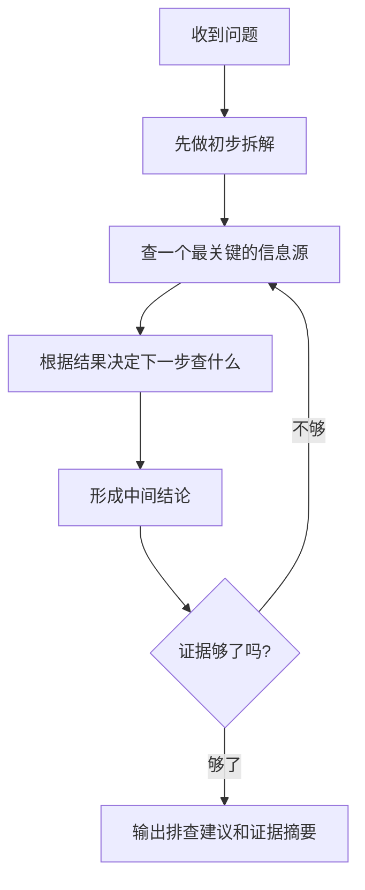

# AI Agent - 第 11 课：实战：从零实现一个可控的研发助手 Agent

## 学习目标

- 学会把一个 Agent 需求拆成：目标、工具、状态、循环、护栏、评测。
- 能用“可控系统”的视角设计一个研发助手，而不是只追求 demo 效果。
- 理解为什么研发助手是一个很适合入门 Agent 落地的真实场景。
- 知道第一版应该做什么、不应该做什么。
- 能把前面几课的概念真正串起来。

## 内容讲解

### 1. 为什么拿“研发助手”做实战

因为它既真实，又足够有代表性。

研发场景天然有很多 Agent 能发挥价值的地方：

- 查文档
- 查接口
- 看日志
- 做问题初筛
- 生成排查建议
- 总结事故过程

同时，它也天然适合做护栏：

- 第一版先只读，不写
- 先做辅助，不做自动执行
- 先做人机协同，不做完全自治

所以研发助手很适合作为第一类真正落地的 Agent。

### 2. 第一步先别问模型，先问目标

很多项目一开始就想着：

- 用什么框架
- 接什么模型
- 上哪些工具

但更该先想的是：

**这个助手到底帮研发做哪一件事？**

第一版最适合做的目标通常应该足够窄，比如：

- 根据报错日志，给出初步排查方向
- 根据工单内容，定位可能相关的系统和文档
- 根据变更记录和告警信息，整理排查摘要

而不适合一开始就做：

- 全能研发搭子
- 自动修复线上问题
- 自动发布和改配置

第一版目标越窄，越容易做稳。

### 3. 第二步：明确它能用哪些工具

一个研发助手常见的只读工具包括：

- 搜索内部知识库
- 读取接口文档
- 查询告警详情
- 查询日志摘要
- 查询最近变更记录
- 查询工单系统内容

这些工具已经足够做很多事情。

而高风险工具，比如：

- 改配置
- 回滚发布
- 重启服务
- 执行 SQL 写操作

第一版建议不要开放。

### 4. 第三步：定义它的状态

别让它只靠聊天历史。

一个研发助手至少可以有这些状态：

- 当前问题描述
- 当前已知现象
- 已查询过的数据源
- 已排除的方向
- 当前待办
- 当前结论置信度

这些状态存在以后，系统会明显稳很多：

- 不容易重复查
- 便于中断恢复
- 人工更容易接手

### 5. 第四步：选执行模式

研发助手特别适合一种混合模式：

- 先做一个轻量计划
- 再边查边做
- 在关键节点总结

因为纯 ReAct 可能太散，纯 Plan-Execute 又不够灵活。

比较实用的流程通常像这样：

### 6. 第五步：给它加护栏

研发助手最容易做错的不是“答错”，而是：

- 查到了不该查的数据
- 引导出过度自信的错误结论
- 无限检索浪费成本

所以护栏要先加上：

- 只读工具白名单
- 最大步数
- 最大耗时
- 最大检索次数
- 高风险动作禁用
- 输出中明确区分“证据”和“推测”

尤其最后一点特别重要。  
研发助手不应该把猜测包装成确定事实。

### 7. 第六步：定义它的输出

第一版研发助手的输出最好结构化一点，而不是一大段自由发挥。

比如可以分成：

- 问题摘要
- 已确认事实
- 初步判断
- 建议下一步
- 证据来源

这种结构有三个好处：

- 人更容易看
- 方便接人工流程
- 后续评测也更容易

### 8. 第七步：怎么评估它是不是有用

不要只问研发同学“感觉怎么样”。  
更应该看这些：

- 初筛是否节省时间
- 建议是否明显减少无效排查
- 是否能正确引用证据
- 是否经常瞎猜
- 工具调用是否稳定

第一版甚至不一定追求“完全自动解决”，  
只要它能把一小时的信息收集压缩成五分钟的高质量摘要，就已经有价值。

### 9. 一个很实际的路线：从辅助型开始

研发助手最稳妥的演进路线通常是：

#### 9.1 第一阶段：问答 + 检索

能查文档、查知识、整理摘要。

#### 9.2 第二阶段：问题初筛

能根据日志、告警、变更记录给出初步方向。

#### 9.3 第三阶段：半自动协作

能生成排查步骤、建议 SQL、建议命令，但不自动执行。

#### 9.4 第四阶段：受控执行

只在审批后，执行有限低风险动作。

这条路线比一开始追求“自动修复线上事故”现实得多。

### 10. 为什么这节实战其实是在复用前面所有课

你会发现，一个看起来简单的研发助手，其实把前面的东西都用上了：

- 第 2 课：需要工具调用
- 第 3 课：需要状态、记忆、笔记
- 第 4 课：需要执行循环
- 第 5 课：需要和固定流程混合
- 第 6 课：需要知识获取
- 第 7 课：需要后端架构
- 第 8 课：需要评测与 trace
- 第 9 课：需要护栏

这也是为什么说 Agent 学习不能只记术语。  
真正一到项目里，所有问题都会一起出现。

## 小结

这一课最核心的不是“怎么做一个炫酷助手”，而是：

**怎么从一个真实、可控、能带来业务价值的窄场景开始，把 Agent 做出来。**

研发助手是一个很好的起点，因为它既足够真实，又适合渐进式放权。  
第一版不必追求全能，先把“目标清楚、工具可控、状态明确、输出可信”做好，价值就会很明显。

## 问题

1. 为什么研发助手很适合作为 Agent 的第一类真实落地场景？
2. 第一版研发助手为什么更适合从只读、辅助型能力开始？
3. 如果你来设计一个研发助手，你最先会开放哪三类工具？为什么？
4. 为什么第一版就把输出做成结构化摘要，通常比自由生成一大段文本更好？
