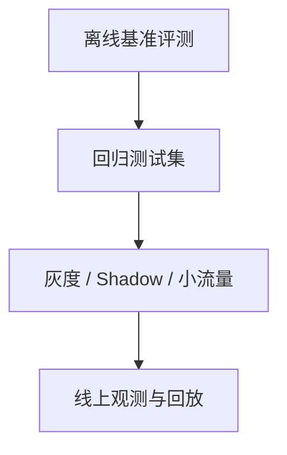

# AI Agent - 第 12 课：智能体评估：Benchmark、LLM Judge、可观测性与线上评估

## 学习目标

- 理解为什么 Agent 评估远比普通问答评估更难，不能只看“最后答对没”。
- 建立三层评估视角：能力评估、系统评估、业务评估。
- 认识 BFCL、GAIA 这类 benchmark 在评什么，它们能告诉你什么、不能告诉你什么。
- 理解 LLM Judge、Win Rate、人工评审各自适合什么场景。
- 学会把离线评测、线上 trace、回放和发布门禁串成一个完整闭环。

## 内容讲解

### 1. 为什么 Agent 的评估比聊天机器人难

普通问答系统，很多时候只关心：

- 回答对不对
- 语言顺不顺

但 Agent 系统常常还涉及：

- 工具有没有选对
- 参数有没有传对
- 有没有走弯路
- 会不会重复调用
- 会不会越权
- 成本是不是太高
- 失败后能不能恢复

所以评 Agent 时，真正困难的是：

**你评的不是一句话，而是一条执行链。**

### 2. Agent 评估至少有三层

一个很稳的评估框架，通常分三层：

1. **能力评估**
   - 模型和 Agent 有没有完成某类任务的能力
2. **系统评估**
   - 工具、状态、检索、时延、成本、稳定性怎么样
3. **业务评估**
   - 对真实用户和真实流程到底有没有价值

很多团队会卡在一个误区：

benchmark 分高，就以为系统能上线。

其实这只说明能力层可能还不错，和业务层稳定可用，中间还差很远。

### 3. 为什么“最终成功率”不是唯一指标

假设一个 Agent 最后把事做成了，但过程中：

- 多调了 8 次工具
- 花了 5 倍 token
- 反复撞护栏
- 跑了 40 秒

那它在生产里可能仍然不可用。

所以 Agent 评估一定要拆维度。

最常见的维度包括：

- 任务成功率
- 工具选择正确率
- 参数正确率
- 平均步数
- 平均时延（必看尾时延 P95/P99，不只是平均）
- token / 成本
- 错误恢复率
- 安全违规率
- **人工接管率**：一个 Agent 如果常常需要人工补救，它的真实自动化价值就要重新评估。这个指标是判断"业务层是否真的省力"的最实用代理。

### 4. Benchmark 在评什么

Benchmark 的本质，不是“给你一个万能分数”，而是：

**在一个受控、可重复的数据集上，对某类能力做标准化测量。**

它最大的价值是：

- 可比较
- 可回归
- 可重复

但它的天然局限也很明显：

- 环境通常比真实业务干净
- 任务边界通常比真实系统清晰
- 很难覆盖你业务里的脏数据、权限边界和异常恢复

所以 benchmark 很重要，但永远只是评估体系的一部分。

### 5. BFCL 这类评估，重点在工具调用能力

BFCL 这一类 benchmark 的重点是：

- 模型有没有识别出该不该调工具
- 选的工具对不对
- 参数填得对不对
- 多工具调用是否合理

这种评估很适合回答一个问题：

**这个 Agent 的函数调用能力到底稳不稳。**

它比较适合早期做：

- 模型对比
- prompt 对比
- 工具 schema 改版回归

但它不能完全回答：

- 长任务能不能做完
- 多轮上下文会不会漂
- 线上成本是否可接受

### 6. GAIA 这类评估，重点在真实任务完成能力

GAIA 一类 benchmark 更像是在问：

**作为一个通用助手，你到底能不能把真实问题做出来？**

它更综合，会同时考：

- 推理
- 工具使用
- 多步任务处理
- 信息获取
- 结果组织

相比只评函数调用，GAIA 更接近真实 Agent 的综合能力。  
但即便这样，它也仍然不是你的生产环境。

### 7. 还有哪些基准值得知道

如果你往更深走，常见还会遇到：

- **WebArena / WebVoyager**
  - 更偏浏览器环境任务
- **SWE-bench**
  - 更偏代码修复与工程任务
- **TAU-bench**
  - 更偏工具调用和业务流程任务

它们都在回答不同的问题。  
所以不是“哪个 benchmark 最权威”，而是：

**你的系统最像哪类任务。**

### 8. LLM Judge 为什么会越来越常见

因为很多真实输出没有标准答案。

比如：

- 总结写得好不好
- 分析是否全面
- 多个方案比较哪个更合理
- 回复是否符合风格要求

这类任务没法直接 exact match，于是大家开始用更强模型当 Judge。

LLM Judge 常见会评这些维度：

- 正确性
- 完整性
- 有用性
- 条理性
- 是否遵守格式

### 9. 但 LLM Judge 也不是裁判之神

它的好处是省人力，适合大规模评估。  
但它也有很大风险：

- 会带自己偏好
- 对模板化答案可能有偏见
- 对某些领域事实判断并不可靠
- 容易受 prompt 设计影响

所以 LLM Judge 更适合：

- 做大规模初筛
- 比较版本相对差异
- 发现明显退化

不太适合：

- 直接决定高风险上线
- 替代全部人工审查

### 10. Win Rate 是什么，为什么常和 LLM Judge 一起出现

Win Rate 更像一套比较框架：

- 给同一个问题两份答案
- 让 Judge 选择哪份更好
- 看版本 A 对版本 B 的胜率

它的价值在于：

- 适合 A/B 比较
- 适合 prompt、模型、工具链路的小改动评估
- 不必定义绝对分数

但它也有局限：

- 只能告诉你谁相对更好
- 不一定告诉你为什么更好
- 如果 Judge 本身偏差大，结论会偏

### 11. 人工评审为什么始终保留

因为很多问题，最后还是得靠人来判断：

- 业务价值到底有没有提升
- 回答是否真正可用
- 风险是否可接受
- 某类边界场景是否已经足够稳

所以成熟体系往往不是“只要自动评测”，而是：

- 自动 benchmark
- 自动回归
- LLM Judge 初筛
- 人工抽样复核

### 12. 离线评估解决不了什么

离线评估通常看不到这些问题：

- 某个外部服务偶发超时
- 某个工具 schema 变了
- 某个新版本 prompt 导致 token 激增
- 某类真实用户输入极脏，benchmark 里没有
- 某个热点场景下成本突然失控

所以只做离线评测，上线之后常常还是会翻车。

### 13. 线上评估的核心不是分数，而是观测

一旦 Agent 上线，最重要的就不是“它在 GAIA 上多少分”，而是：

- 这次请求为什么成功
- 这次请求为什么失败
- 工具调用链到底走成了什么
- 哪一步开始漂了
- 成本到底花在哪

这就进入可观测性问题。

线上至少应该有这些东西：

- trace
- 每步事件日志
- 工具调用记录
- token 和延迟统计
- 错误类型聚类
- 可回放能力

### 14. Trace 为什么对 Agent 特别关键

因为 Agent 的错误通常不是一句“答案错了”。

它更像：

- 第 2 步工具选错了
- 第 3 步召回结果噪声太大
- 第 4 步状态摘要丢了一个关键条件
- 最后输出只是把前面的错误放大了

没有 trace，你只能看到失败结果。  
有 trace，你才能看到失败路径。

### 15. 一个比较完整的评估闭环长什么样

可以理解成四层漏斗：

这四层分别解决：

- 离线 benchmark：能力基线
- 回归测试集：防止老问题复发
- 灰度 / shadow：看真实流量里的稳定性
- 线上观测：发现真实世界里的新问题

### 16. 评估不只是测模型，也要测系统改动

很多退化并不是模型造成的，而是系统造成的。

比如：

- 改了检索 chunk 策略
- 加了一个新工具
- 换了 context builder
- 调整了 memory 写入逻辑

这些都会改变 Agent 行为。  
所以你的评估体系必须覆盖：

- prompt 变更
- 工具变更
- 数据源变更
- 检索策略变更
- 模型版本变更

### 17. 最值得建立的是“回归任务集”

任何一个正在落地的 Agent 系统，最值钱的不是公开 benchmark，而是你自己的：

**高价值真实任务回归集。**

这类任务集最好来自：

- 真实用户请求
- 典型失败案例
- 关键业务路径
- 高风险边界样本

因为只有这些数据，才能真正告诉你：

**这次改动对我的系统，是进步还是退步。**

### 18. 一个很现实的建议：先建立粗指标，再逐步细化

很多团队一上来就想做完美评测体系，结果拖几个月还没起来。更实际的路线是分阶段：

**第一阶段：先有这些基础能力**
- 成功 / 失败统计
- 平均时延 + P95 尾时延
- 单任务成本（token + 工具调用 + 外部 API）
- 工具错误统计
- 基础 trace（每次 LLM 调用 + 每次工具调用 + 中间状态）

这五项就能让你从"凭感觉调优"升级到"有数据看"。

**第二阶段：等系统真有流量了再补**
- 分类任务评测（不同业务场景分别看）
- 线上回放集（把线上失败 trace 沉淀成回归集）
- 人工标注样本（高价值场景的 ground truth）
- 版本对比实验（A/B + Win Rate）

**第三阶段：才接发布门禁**（见下一节）

这个节奏的核心思想是：**评测体系本身要跟着系统成熟度走，不要一开始就把它做成另一个工程难题**。

### 19. 评估体系最后要服务发布门禁

如果评估只停留在“看看分数”，价值就很有限。  
更成熟的做法是把它变成 release gate：

- benchmark 低于阈值，不发
- 回归集退化，不发
- 成本超预算，不发
- 某类安全违规升高，不发

这时评估体系才真正从研究玩具，变成工程基础设施。

### 20. 常见误区

- 误区一：只看最终答案对不对
- 误区二：benchmark 高分就等于可上线
- 误区三：只做离线评估，不做线上观测
- 误区四：用 LLM Judge 代替全部人工
- 误区五：没有沉淀自己的回归任务集
- 误区六：一上来就想做完美评测体系，结果拖到系统都上线了还没建成
- 误区七：只看平均时延不看尾时延，结果 5% 的慢请求把用户体验毁了

## 一句话总结

**Agent 评估不是给系统打一个总分，而是分层回答三个问题：它有没有能力、它作为系统稳不稳、它对真实业务有没有价值；离线 benchmark 只是起点，trace、回放、回归集和发布门禁才是落地关键。**

## 问题

1. 为什么 Agent 评估不能只看“最后答案是否正确”？
2. 能力评估、系统评估、业务评估三层分别在回答什么问题？
3. BFCL、GAIA、LLM Judge 各自更适合评什么？
4. 如果你要给一个上线中的 Agent 建立评估闭环，你会从哪几层先做起？
