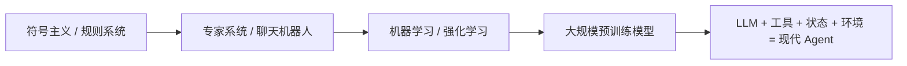

# AI Agent - 扩展课 13：发展史与底层地基：从符号主义到大语言模型 Agent

## 学习目标

- 用一条更连续的历史线理解 Agent，不再把它看成突然冒出来的新概念。
- 知道符号主义、专家系统、强化学习、预训练大模型分别解决了什么问题。
- 理解为什么现代 Agent 看起来很强，但很多老问题其实并没有消失。
- 建立一个更稳的判断：今天的 Agent 强在什么地方，弱又弱在哪。

## 内容讲解

### 1. 为什么学 Agent 还要回头看历史

因为很多今天看起来很新的问题，其实几十年前就有人碰到过。

比如：

- 系统怎么表示知识
- 系统怎么根据环境做决策
- 系统怎么把多个子能力组织起来
- 系统为什么在 demo 里很聪明，换个场景就不行了

如果不看历史，我们很容易把今天的 Agent 神化。  
一看历史就会发现：

**今天真正变强的，是语言理解、泛化能力和工具接口；但可控性、稳定性、长期规划这些难题并没有被彻底解决。**

### 2. 早期 Agent：更像“规则机器”

最早的一批智能体，核心思路不是“从海量数据里学”，而是：

- 人先把知识写进去
- 系统按规则推理
- 再根据规则决定下一步动作

这就是符号主义时代的典型思路。

它的优点很明显：

- 规则清楚
- 推理过程相对可解释
- 在封闭场景里效果很好

但它的问题也很明显：

- 规则太难写全
- 世界一复杂，系统就容易崩
- 一旦出了规则库之外的情况，系统几乎不会变通

### 3. 专家系统：第一次“把知识塞进机器”

专家系统可以理解成符号主义时代最成功的一类落地产品。

它的核心想法是：

- 把某个领域专家的判断规则提取出来
- 存成知识库
- 让推理机帮你一步步做判断

它特别适合：

- 规则相对稳定
- 领域边界清晰
- 专家经验可以总结成 if-then 规则

但一旦世界变复杂，问题就来了：

- 知识获取特别慢
- 维护成本越来越高
- 规则之间会互相打架
- 系统缺乏常识和弹性

所以你今天看到很多“固定流程 + 规则引擎”的系统，其实还带着专家系统时代的影子。

### 4. ELIZA 和聊天机器人：第一次让大家感到“它像在理解我”

像 ELIZA 这样的早期聊天机器人，本质上并不真的理解内容。  
它更像：

- 模式匹配
- 句子改写
- 固定模板响应

但它给后面的 Agent 研究留下了一个特别重要的提醒：

**人很容易把“语言表面上的流畅”误当成“真正的理解”。**

这个提醒到今天依然成立。  
现代大模型比 ELIZA 强太多，但“会说”仍然不等于“会做对”。

### 5. 强化学习：把“试错”引进来

后来大家逐渐意识到，只靠规则不够，系统需要在环境里通过反馈学习。

这时候强化学习的思想就变得重要了：

- Agent 在环境里行动
- 环境给出反馈
- Agent 根据奖励调整策略

这一步很关键，因为它第一次把“行动”和“反馈”真正绑在了一起。

如果说专家系统更像：

- 我先告诉你怎么做

那强化学习更像：

- 你去试，做对了奖励你，做错了惩罚你

这和今天很多 Agent 的直觉已经很接近了。

### 6. 预训练大模型：真正改变游戏规则的地方

现代 Agent 最大的分水岭，不是“有了工具”，而是：

**先有了足够强的大语言模型。**

大模型带来的变化在于：

- 它不再局限于某个窄规则库
- 它能理解开放语言输入
- 它能在很多陌生任务上做迁移
- 它能把“自然语言指令”直接转成行动计划

这时候，Agent 才第一次具备了“通用接口”的味道。

以前我们需要为每个系统写很具体的规则；  
现在我们可以用自然语言告诉模型：

- 目标是什么
- 有哪些工具
- 当前环境是什么

然后让它自己做局部决策。

### 7. 现代 Agent 真正新在哪里

如果只看表面，今天的 Agent 也像：

- 感知环境
- 做决策
- 执行动作

这些老定义几十年前就有。  
现代 Agent 真正新在三点：

#### 7.1 用自然语言做统一接口

以前不同模块之间要写专门的结构化规则。  
现在模型可以直接理解：

- 用户需求
- 工具描述
- 检索结果
- 中间观察

#### 7.2 通用化能力更强

以前一个系统常常只会一件事。  
现在同一个大模型稍微换点上下文，就能切换角色、任务和执行方式。

#### 7.3 更容易和真实软件系统连接

现代 Agent 可以通过 Tool Calling、API、浏览器、代码执行环境去影响外部世界。  
这让它不只是“回答器”，更像“操作系统上的任务执行者”。

### 8. 但老问题其实还在

不要因为今天模型强了，就以为经典问题已经没了。

它们只是换了形式继续出现：

- 以前是规则写不全，现在是 prompt 和上下文仍然覆盖不全
- 以前是知识库维护难，现在是记忆和检索仍然容易失真
- 以前是专家系统脆，现在是 Agent 也会幻觉、误调工具、无限循环

所以更准确的说法不是：

“现代 Agent 解决了智能问题。”

而是：

“现代 Agent 把很多原来很难做的智能接口做得可用了，但系统边界问题依然存在。”

### 9. 一张最值得记住的演进图

这张图的重点不是年代，而是每一代在补什么短板：

- 规则系统补“逻辑”
- 强化学习补“反馈学习”
- 预训练模型补“语言泛化”
- 现代 Agent 补“真实任务执行”

### 10. 对今天做应用的人来说，最重要的启发是什么

如果你是做应用或后端系统的人，学这段历史最重要的收获不是背名字，而是建立一个现实预期：

- Agent 不是魔法
- 它有清晰的技术前史
- 它的强项是开放语义理解和灵活任务推进
- 它的弱项仍然是稳定性、边界控制、长期一致性

这能帮助我们避免两个极端：

- 一个极端是看不起 Agent，觉得只是高级聊天
- 另一个极端是把 Agent 想成万能智能体

## 小结

这一课最重要的结论是：

**现代 Agent 不是凭空出现的，它是符号主义、强化学习、预训练大模型这些思路长期演进后的结果。**

今天的 Agent 之所以比过去更实用，关键在于大模型把自然语言理解和任务泛化能力大幅拉高了；但很多经典问题并没有消失，只是从“规则不足”变成了“上下文不足、工具误用和系统失控”。

## 问题

1. 为什么说 Agent 不是这两年才突然出现的新概念？
2. 专家系统和现代 Agent 在“可控性”和“泛化性”上分别强在哪、弱在哪？
3. 为什么 ELIZA 这类系统的历史，到今天仍然值得学？
4. 如果让你用一句话概括现代 Agent 真正新的地方，你会怎么说？
