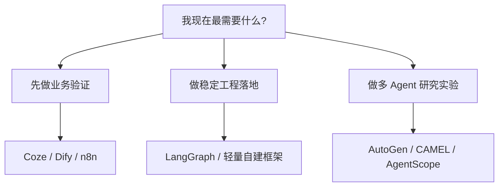

# AI Agent - 扩展课 14：平台与框架地图：Coze、Dify、n8n、AutoGen、LangGraph 怎么看

## 学习目标

- 把低代码平台、工作流编排器、研究框架、自建框架区分清楚。
- 知道 Coze、Dify、n8n、AutoGen、AgentScope、CAMEL、LangGraph 各自更像什么。
- 学会从“适合做什么”而不是“谁最火”来选工具。
- 明白为什么很多团队真正需要的不是更多框架，而是更清晰的系统边界。

## 内容讲解

### 1. 先分清三类东西，不然后面一定乱

很多人在学 Agent 的时候会把这些东西混成一团：

- 低代码平台
- 工作流编排器
- Agent 框架 / 研究框架

其实它们根本不是同一层。

#### 1.1 低代码平台

更像“搭积木做应用”的工具。  
重点是：

- 上手快
- 可视化配置
- 适合原型和业务试验

典型代表：

- Coze
- Dify

#### 1.2 工作流编排器

更像“把系统节点连起来”的工具。  
重点是：

- 流程可视化
- 与外部系统集成
- 自动化任务编排

典型代表：

- n8n

#### 1.3 Agent / 编排框架

更像“给程序员写系统用的开发框架”。  
重点是：

- 状态管理
- 节点编排
- 多 Agent 协作
- 可编程性

典型代表：

- AutoGen
- LangGraph
- AgentScope
- CAMEL

### 2. Coze、Dify 更适合什么

这类平台最大的价值，不是“架构最先进”，而是：

**让你很快把想法跑出来。**

它们一般适合：

- 做 demo
- 快速试业务场景
- 给非纯后端团队一起协作
- 做知识库问答、内容生产、助手原型

它们一般不太适合：

- 超复杂的内部工程控制流
- 深度定制的状态管理
- 很严苛的权限与审计体系

简单说：

- 如果你现在主要问题是“先把东西做出来给业务看”，平台很合适
- 如果你主要问题是“我要把它接进一套复杂后端系统”，平台往往只是起点，不是终点

### 3. n8n 更像自动化编排器，不是纯 Agent 平台

n8n 很适合处理这种事：

- 收到 webhook
- 查数据库
- 调一个模型
- 发邮件 / 发消息 / 更新表单

也就是说，它特别擅长：

- 系统集成
- 固定流程自动化
- 节点可视化编排

如果你的任务本质上还是 workflow，只是其中某几个节点要用模型，n8n 很顺手。

但如果你要做的是：

- 长时任务
- 动态规划
- 多轮状态演进
- 复杂 Agent 决策循环

那 n8n 往往不够顺。

### 4. AutoGen、CAMEL、AgentScope 更偏“多 Agent / 研究和实验”

这一类框架的共同点是：

- 很适合研究不同角色怎么协作
- 很适合做多 Agent 实验
- 比较强调对话、角色、协作模式

它们比较适合的场景：

- 做多角色协作 demo
- 做研究类实验
- 验证某种协作范式

它们的常见问题也很明显：

- 工程控制力不一定最强
- 生产级观测和权限体系常常要自己补
- 很容易先把“角色扮演”做得很花，再发现系统边界不稳

所以这类框架很适合学习和探索，但拿去直接做线上核心系统时，要多一层审慎。

### 5. LangGraph 为什么会越来越受欢迎

LangGraph 受欢迎的一个核心原因是：

它把 Agent 系统解释成了一个“显式状态图”。

这件事很重要，因为 Agent 一旦进入工程落地阶段，大家最痛的往往不是“模型不够聪明”，而是：

- 状态乱
- 分支乱
- 不知道什么时候停
- 失败后无法恢复

LangGraph 这种图式思路适合：

- 把节点和边显式画出来
- 把状态结构定义清楚
- 做比较可控的 Agent 编排

所以如果你是后端视角，往往会觉得这类框架更顺手，因为它更像工程系统，而不只是“聊天智能体”。

### 6. 那到底该怎么选

可以先按目标来选，而不是按框架名字选。

#### 6.1 你要的是“业务验证”

优先看：

- Coze
- Dify
- n8n

因为你现在最重要的是速度，不是架构优雅。

#### 6.2 你要的是“后端可控实现”

优先看：

- LangGraph 这类显式编排框架
- 或者直接自建轻量框架

因为你要管的不只是模型调用，还包括：

- 状态
- 权限
- 可观测性
- 审计
- 失败恢复

#### 6.3 你要的是“研究多 Agent 协作”

优先看：

- AutoGen
- CAMEL
- AgentScope

因为它们在角色协作和实验表达上更自然。

### 7. 自建框架到底值不值得

很多人会在这里摇摆：

- 用现成框架好像不够贴合
- 自己写又怕造轮子

一个比较稳的判断是：

#### 值得自建的情况

- 你已经有了反复出现的固定模式
- 你非常在意权限、状态、审计、幂等
- 你要和现有后端系统深度融合
- 团队能长期维护

#### 不值得自建的情况

- 还在验证场景
- 连核心流程都没定
- 只是为了“掌控一切”而重写一遍

一句话总结：

**先验证场景，再抽象框架；不要在需求还模糊时先搭一个大而全的平台。**

### 8. 一张简单的地图

这张图不是绝对规则，但足够帮你先把方向选对。

### 9. 真正该被放在第一位的，不是框架，而是边界

最后很想强调一句：

真正把项目做成或做砸的，通常不是框架名，而是你有没有先想清楚这些：

- 它到底是不是 Agent 问题
- 工具边界是什么
- 状态怎么存
- 风险怎么控
- 成功怎么评估

框架是放大器。  
边界不清时，框架只会把混乱放大得更快。

## 小结

这一课最重要的结论是：

**平台、工作流编排器、Agent 框架不是同一层东西。选型时要先看目标，再看工具。**

如果你想快速验证业务，Coze / Dify / n8n 这类平台很好用；  
如果你要做可控的工程系统，显式状态和编排框架会更重要；  
如果你要研究多 Agent 协作，再去看 AutoGen、CAMEL、AgentScope 这些框架会更合适。

## 问题

1. 为什么说 Coze、Dify 和 LangGraph 并不是一类工具？
2. 如果你现在要做一个面向内部团队的 Agent 原型，你会先选平台还是框架？为什么？
3. 自建框架最容易掉进的坑是什么？
4. 为什么“先把业务边界想清楚”通常比“先选框架”更重要？
