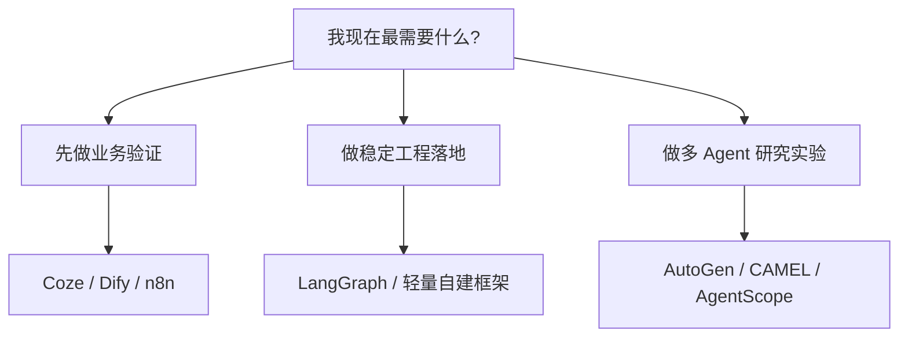

# AI Agent - 扩展课 14：平台与框架地图：Coze、Dify、n8n、AutoGen、LangGraph 怎么看

## 学习目标

- 把低代码平台、工作流编排器、研究框架、自建框架区分清楚。
- 知道 Coze、Dify、n8n、AutoGen、AgentScope、CAMEL、LangGraph 各自更像什么。
- 学会从“适合做什么”而不是“谁最火”来选工具。
- 明白为什么很多团队真正需要的不是更多框架，而是更清晰的系统边界。

## 内容讲解

### 1. 先分清三类东西，不然后面一定乱

很多人在学 Agent 的时候会把这些东西混成一团：

- 低代码平台
- 工作流编排器
- Agent 框架 / 研究框架

其实它们根本不是同一层。

#### 1.1 低代码平台

更像“搭积木做应用”的工具。  
重点是：

- 上手快
- 可视化配置
- 适合原型和业务试验

典型代表：

- Coze
- Dify

#### 1.2 工作流编排器

更像“把系统节点连起来”的工具。  
重点是：

- 流程可视化
- 与外部系统集成
- 自动化任务编排

典型代表：

- n8n

#### 1.3 Agent / 编排框架

更像“给程序员写系统用的开发框架”。  
重点是：

- 状态管理
- 节点编排
- 多 Agent 协作
- 可编程性

典型代表：

- AutoGen
- LangGraph
- AgentScope
- CAMEL

### 2. Coze、Dify 更适合什么

这类平台最大的价值，不是“架构最先进”，而是：

**让你很快把想法跑出来。**

它们一般适合：

- 做 demo
- 快速试业务场景
- 给非纯后端团队一起协作
- 做知识库问答、内容生产、助手原型

它们一般不太适合：

- 超复杂的内部工程控制流
- 深度定制的状态管理
- 很严苛的权限与审计体系

简单说：

- 如果你现在主要问题是“先把东西做出来给业务看”，平台很合适
- 如果你主要问题是“我要把它接进一套复杂后端系统”，平台往往只是起点，不是终点

### 3. n8n 更像自动化编排器，不是纯 Agent 平台

n8n 很适合处理这种事：

- 收到 webhook
- 查数据库
- 调一个模型
- 发邮件 / 发消息 / 更新表单

也就是说，它特别擅长：

- 系统集成
- 固定流程自动化
- 节点可视化编排

如果你的任务本质上还是 workflow，只是其中某几个节点要用模型，n8n 很顺手。

但如果你要做的是：

- 长时任务
- 动态规划
- 多轮状态演进
- 复杂 Agent 决策循环

那 n8n 往往不够顺。

### 4. LangGraph 深水区

#### 4.1 是什么

LangGraph 是 LangChain 团队 2024 年初推出的 **stateful graph runtime**，专门用来编排 LLM 应用 / Agent 系统。一句话定位：

**把 LLM 应用建模成一张带状态的有向图——节点是计算步骤，边是流转规则，状态在图上沿 channel 流动。**

要先把它和 LangChain 分清：

- **LangChain**：更早期的 LLM 应用工具集合（chains / agents / memory 等），核心抽象是 chain
- **LangGraph**：独立的 graph runtime，**不依赖 LangChain**，自己有状态、检查点、流式 API。可以单独用。

不少人现在用 LangGraph 但完全不用 LangChain。

#### 4.2 出现的背景：LangChain 早期 Agent 的痛

2023 年 LangChain v0.0.x / v0.1 早期，做 Agent 是用 `AgentExecutor` + chain。这套在生产里很快暴露问题：

- **控制流是隐式的**：藏在 chain 里的 prompt + parser，看不到全局
- **状态没有显式表达**：靠 message list 滚雪球
- **条件分支很难做**：得自己 hack
- **循环靠 AgentExecutor 内部 while**，看不见也控不住
- **调试地狱**：堆栈深 + 字符串解析失败 = 完全没法排查
- **中断 / 恢复 / 人在回路几乎不可能**

LangChain 团队复盘后发现一个规律：**真正稳定的 Agent 系统都长得像状态机或图，而不是链**。于是参考 Google 的 **Pregel**（vertex-centric graph processing model，原本用于大规模图计算）做了 LangGraph。

#### 4.3 核心抽象（六个）

| 抽象 | 作用 |
| --- | --- |
| **StateGraph** | 图本身，类型化的 state schema |
| **State** | 用 TypedDict / Pydantic 定义的全局状态结构 |
| **Node** | 函数 `(state) -> partial_state_update`，纯函数语义 |
| **Edge** | 节点间流转关系：普通边、条件边、入口边、出口边 |
| **Channel** | 状态字段的更新策略（reducer），决定多个节点写同一字段时怎么合并 |
| **Checkpointer** | 状态持久化层（InMemory / SQLite / Postgres / Redis） |

#### 4.4 原理：Pregel + Channels + Reducer

LangGraph 一次执行被切成一系列 **superstep**（受 Pregel 启发）：

```
superstep N:
  1. 当前 active 节点并行执行（每个节点读 state，返回 partial update）
  2. 每个 update 通过对应 channel 的 reducer 合并到全局 state
  3. 根据 edge 计算下一批 active 节点
  4. checkpoint 写入持久化层（如果配了 checkpointer）
  5. 进入 superstep N+1，直到没有 active 节点（END）
```

**Channel = 字段 + reducer**。reducer 决定该字段怎么合并：

- **默认**：last-write-wins（覆盖）
- **`add_messages`**（内置）：消息列表追加
- **`operator.add`**：list / number 累加
- **自定义**：你可以传任意 `(current, update) -> merged` 函数

这套设计的工程意义：**多个节点并发写同一字段时，合并语义是显式声明的，不是看运气**。这在多 Agent / 并行分支场景下是关键。

#### 4.5 一份最小可读的代码

```python
from typing import TypedDict, Annotated
from langgraph.graph import StateGraph, END
from langgraph.graph.message import add_messages
from langgraph.checkpoint.postgres import PostgresSaver

# 1. 定义 State（每个字段可声明 reducer）
class State(TypedDict):
    messages: Annotated[list, add_messages]   # 消息走 append
    next_action: str                           # 默认 last-write-wins

# 2. 定义节点（纯函数，返回 partial update）
def planner(state: State) -> dict:
    # 让 LLM 决定下一步
    return {"next_action": "search"}

def searcher(state: State) -> dict:
    # 调工具
    return {"messages": [{"role": "tool", "content": "..."}]}

# 3. 定义条件路由
def router(state: State) -> str:
    return "searcher" if state["next_action"] == "search" else END

# 4. 组装图
graph = StateGraph(State)
graph.add_node("planner", planner)
graph.add_node("searcher", searcher)
graph.set_entry_point("planner")
graph.add_conditional_edges("planner", router)
graph.add_edge("searcher", "planner")   # 闭环：搜完回 planner

# 5. 编译并接 checkpointer
app = graph.compile(checkpointer=PostgresSaver(...))

# 6. 运行（thread_id 是会话标识，决定 checkpoint 隔离单元）
config = {"configurable": {"thread_id": "user-123-task-456"}}
app.invoke({"messages": [{"role": "user", "content": "..."}]}, config)
```

#### 4.6 Checkpointer：长任务的灵魂

每个 superstep 后，整个 state 会被 snapshot 写到 checkpointer。这件事看起来普通，但解锁了几个能力：

- **断点续跑**：进程崩溃后，用同一个 `thread_id` 直接 resume，从最后一个 checkpoint 接着跑
- **时间旅行**（time-travel debugging）：用 `app.get_state_history(config)` 拿到所有历史 checkpoint，从任意一个重启
- **中断（Interrupt）**：在某节点执行**前**暂停，等人工输入再恢复
- **多用户隔离**：每个 `thread_id` 一份独立 state，天然支持多租户

人在回路示例：

```python
app = graph.compile(
    checkpointer=PostgresSaver(...),
    interrupt_before=["execute_payment"],   # 跑到这个节点前自动暂停
)

# 跑到 interrupt 点会停下，state 已经 checkpoint
app.invoke(input, config)

# 用户审批后，可以更新 state 再恢复
app.update_state(config, {"approved": True})
app.invoke(None, config)   # input=None 表示从 checkpoint 继续
```

这块和我们在第 23 课讲的"任务状态机与编排"完全对应——LangGraph 把第 23 课要自己写的东西做成了框架。

#### 4.7 典型 pipeline

- **单 Agent ReAct 循环**：planner → tool → planner（条件边判断是否结束）
- **Plan-and-Execute**：planner 生成计划 → executor 顺序执行 → 失败回 planner
- **Supervisor 多 Agent**：supervisor 节点路由到不同 worker 子图
- **Branching workflow**：条件边分支 + 并行节点 + END

#### 4.8 LangGraph Platform / LangSmith

配套的两个产品：

- **LangGraph Platform**：把 graph 部署成 stateful HTTP 服务，自带 thread / run / checkpoint API、人工干预 UI
- **LangSmith**：trace / 评估 / prompt 管理。每次 superstep 自动产 trace，调试体验远好于 v0.1 时代

#### 4.9 优劣势

**优势**：
- 显式状态、显式控制流、显式合并语义——**调试友好是核心卖点**
- Checkpointer + Interrupt 让长任务和人在回路成为一等公民
- 和 LangChain 解耦，单独可用
- 类型化（TypedDict / Pydantic）
- LangSmith 生态成熟

**劣势**：
- 学习曲线偏陡（要理解 channel / reducer / superstep）
- 单图节点超过 20-30 个时图本身难维护，需要拆子图
- 多 Agent 协作得自己设计 supervisor / 子图，**不像 AutoGen 那样原生**
- 仍然偏 Python 生态（虽然 TS 版本在迭代）

### 5. AutoGen 深水区

#### 5.1 是什么

AutoGen 是微软研究院 2023 年发布的多 Agent 对话框架。论文《AutoGen: Enabling Next-Gen LLM Applications via Multi-Agent Conversation》（Wu et al., 2023）。

核心思路：**把多 Agent 协作建模成对话——agent 互相发消息，对话本身推进任务**。

#### 5.2 出现的背景：多 Agent 协作潮

2023 年学术界和工业界开始集体研究"多个 LLM agent 互相协作能不能比单 agent 更强"：

- HuggingGPT、Camel、MetaGPT、ChatDev 等都在试
- 微软的判断：多 Agent 协作的核心抽象应该是**消息驱动 + 角色**，而不是图

AutoGen 早期 v0.2 的核心抽象很简洁：

| 抽象 | 角色 |
| --- | --- |
| `ConversableAgent` | 可以收发消息的基类 |
| `AssistantAgent` | 基于 LLM 回答的 agent |
| `UserProxyAgent` | 代理用户的 agent，可以执行代码 |
| `GroupChat` / `GroupChatManager` | 多 agent 圆桌讨论 |

但 v0.2 在生产用得多了之后，问题暴露：

- 过度耦合 OpenAI Chat Completion API
- 单进程，扩展性差
- 流式、跨语言、可观测性弱
- 模型切换、工具系统都是 hack
- 异步支持差
- 消息流向不清晰，"圆桌"变"消息风暴"

**2025-01 发布 v0.4**——完全重写，分三层架构。

#### 5.3 v0.4 三层架构

| 层 | 包名 | 责任 |
| --- | --- | --- |
| **Core** | `autogen-core` | 事件驱动 actor runtime，消息路由、subscription、单/分布式运行 |
| **AgentChat** | `autogen-agentchat` | 高层 Agent 抽象：AssistantAgent / Team / Termination 等 |
| **Extensions** | `autogen-ext` | 模型客户端、工具、第三方集成 |

这是一次**从框架到运行时**的升级——Core 不假设你做的是聊天，它就是一个 actor runtime；AgentChat 才是把 Core 包装成"聊天 agent"的高层 API。

#### 5.4 原理：Actor Model + Topic 路由

Core 层是经典 actor model（参考 Erlang / Akka）：

- **Agent**：实现 `on_message` 的 actor
- **Runtime**：actor 运行时（`SingleThreadedAgentRuntime` / 分布式 gRPC runtime）
- **Message**：强类型消息（用 dataclass / Pydantic 定义）
- **Topic**：发布订阅机制——agent 订阅 topic_id，发到该 topic 的消息会路由到所有订阅者
- **AgentId** = `(type, key)`：同一类型可以有多实例（按 key 隔离，比如按用户）

代码骨架：

```python
from autogen_core import (
    RoutedAgent, message_handler, MessageContext,
    SingleThreadedAgentRuntime, default_subscription, DefaultTopicId
)
from dataclasses import dataclass

@dataclass
class CodeRequest:
    task: str

@dataclass
class CodeResult:
    code: str

@default_subscription
class Coder(RoutedAgent):
    @message_handler
    async def on_request(self, msg: CodeRequest, ctx: MessageContext) -> None:
        code = await self._write(msg.task)
        # 发到默认 topic，所有订阅该 topic 的 agent 都能收到
        await self.publish_message(CodeResult(code=code), topic_id=DefaultTopicId())

runtime = SingleThreadedAgentRuntime()
await Coder.register(runtime, "coder", lambda: Coder("Coder agent"))
runtime.start()
await runtime.publish_message(CodeRequest(task="..."), topic_id=DefaultTopicId())
```

actor model 的工程含义：

- agent 之间天然异步、解耦
- 单进程跑就是 in-memory event loop；分布式跑就用 gRPC runtime（多进程 / 多机器）
- 消息是值传递，不共享状态——并发安全
- 可观测性可以挂在 runtime 层（OpenTelemetry trace）

#### 5.5 AgentChat 层：开箱即用的多 Agent 模式

Core 太底层，所以 AgentChat 包装了几个常用 team 模式：

| Team | 调度策略 |
| --- | --- |
| `RoundRobinGroupChat` | 轮流发言 |
| `SelectorGroupChat` | LLM 看历史选下一个发言者 |
| `Swarm` | agent 用 handoff 工具显式转交（参考 OpenAI Swarm） |
| `MagenticOneGroupChat` | orchestrator + worker（基于 Magentic-One 论文） |

```python
from autogen_agentchat.agents import AssistantAgent
from autogen_agentchat.teams import RoundRobinGroupChat
from autogen_agentchat.conditions import TextMentionTermination
from autogen_ext.models.openai import OpenAIChatCompletionClient

model = OpenAIChatCompletionClient(model="gpt-4o")
writer = AssistantAgent("writer", model_client=model, system_message="You write haiku.")
critic = AssistantAgent("critic", model_client=model, system_message="Reply APPROVE if good.")

team = RoundRobinGroupChat(
    [writer, critic],
    termination_condition=TextMentionTermination("APPROVE"),
)

result = await team.run(task="Write a haiku about CRDTs.")
```

这种"writer + critic 互相对话直到通过"是 AutoGen 最经典的范式。

#### 5.6 Magentic-One：AutoGen 上的旗舰应用

微软在 AutoGen 上构建的通用 agent 系统：一个 orchestrator 协调多个专业 worker（FileSurfer / WebSurfer / Coder / ComputerTerminal）。在 GAIA benchmark 上表现强，是 2025 年 AutoGen 最知名的成功案例。它也是 AutoGen v0.4 设计的实际推动力——**v0.4 actor model 就是为了支撑 Magentic-One 这种规模的多 agent 系统才重写的**。

#### 5.7 怎么用：典型场景

- **多 agent 协作研究 / demo**（最强项）
- **代码生成 + 评审循环**（writer + critic）
- **文档撰写 + 审查**
- **Web 浏览 + 任务执行**（直接用 Magentic-One）
- **跨语言 / 跨进程 agent 系统**（用分布式 runtime）

#### 5.8 优劣势

**优势**：
- 多 Agent 协作抽象天然
- v0.4 actor model 工程能力强（异步、分布式、强类型消息）
- Microsoft 背书 + 学术影响力（论文、benchmark、Magentic-One）
- 支持单进程到分布式无缝扩展
- Python + .NET 双栈

**劣势**：
- 比 LangGraph 更"会议室"风格，**消息风暴**容易出现
- v0.2 → v0.4 是大改，老代码迁移成本高
- 控制流仍以消息为主，不像 LangGraph 那样**显式可视**
- 生产级长任务恢复 / 状态管理要自己接外部存储（没有像 LangGraph checkpointer 那样的内置抽象）
- 调试一个长对话比调一个 graph 难

### 5b. CAMEL / AgentScope：研究侧的两种思路

简单提一下相邻位置的两个研究框架：

- **CAMEL**：更早（2023 早），强调"角色扮演 + 任务分解"，论文级实验框架。落地少，研究多。
- **AgentScope**（阿里）：偏向多 Agent 仿真和分布式，2024 起在中文生态有一定使用。生产用例不如 LangGraph / AutoGen 多。

它们的定位都更偏研究，**做生产系统时通常不是首选**。

### 6. LangGraph vs AutoGen：选型对照

如果只在这两者之间选，可以对照这张表：

| 维度 | LangGraph | AutoGen |
| --- | --- | --- |
| 心智模型 | 状态图（state machine） | Actor / 对话 |
| 控制流 | **显式**（节点 + 边 + 条件） | **隐式**（消息驱动 + 调度策略） |
| 状态管理 | 内置（channel + reducer + checkpointer） | 自己接存储 |
| 长任务 / 断点续跑 | 一等公民 | 需自己设计 |
| 多 Agent | 用 supervisor + 子图实现 | 原生强项 |
| 人在回路 | `interrupt_before/after` 内置 | 用 UserProxyAgent + 自己接 UI |
| 调试 / 观测 | LangSmith trace 成熟 | OpenTelemetry，需自己配 |
| 学习曲线 | 中（要理解 channel / reducer） | 低到中（v0.4 比 v0.2 陡） |
| 生产成熟度 | 高，已被多家企业线上使用 | v0.4 仍在快速演进 |
| **最适合** | **后端工程系统、长任务、可控流程** | **多 Agent 研究、对话型协作** |

简单标准：

- 你要做"**一个有明确流程的 Agent / Workflow**"——LangGraph
- 你要做"**多个 agent 围绕任务自发协作**"——AutoGen
- 你要做"**线上稳定、可恢复、可观测的生产系统**"——大概率是 LangGraph，AutoGen 要补的工程细节多
- 你要做"**研究 / demo 多 agent 协作范式**"——AutoGen 更顺手

### 7. 那到底该怎么选

可以先按目标来选，而不是按框架名字选。

#### 7.1 你要的是“业务验证”

优先看：

- Coze
- Dify
- n8n

因为你现在最重要的是速度，不是架构优雅。

#### 7.2 你要的是“后端可控实现”

优先看：

- LangGraph 这类显式编排框架
- 或者直接自建轻量框架

因为你要管的不只是模型调用，还包括：

- 状态
- 权限
- 可观测性
- 审计
- 失败恢复

#### 7.3 你要的是“研究多 Agent 协作”

优先看：

- AutoGen
- CAMEL
- AgentScope

因为它们在角色协作和实验表达上更自然。

### 8. 自建框架到底值不值得

很多人会在这里摇摆：

- 用现成框架好像不够贴合
- 自己写又怕造轮子

一个比较稳的判断是：

#### 值得自建的情况

- 你已经有了反复出现的固定模式
- 你非常在意权限、状态、审计、幂等
- 你要和现有后端系统深度融合
- 团队能长期维护

#### 不值得自建的情况

- 还在验证场景
- 连核心流程都没定
- 只是为了“掌控一切”而重写一遍

一句话总结：

**先验证场景，再抽象框架；不要在需求还模糊时先搭一个大而全的平台。**

### 9. 一张简单的地图



这张图不是绝对规则，但足够帮你先把方向选对。

### 10. 真正该被放在第一位的，不是框架，而是边界

最后很想强调一句：

真正把项目做成或做砸的，通常不是框架名，而是你有没有先想清楚这些：

- 它到底是不是 Agent 问题
- 工具边界是什么
- 状态怎么存
- 风险怎么控
- 成功怎么评估

框架是放大器。  
边界不清时，框架只会把混乱放大得更快。

## 小结

这一课最重要的结论是：

**平台、工作流编排器、Agent 框架不是同一层东西。选型时要先看目标，再看工具。**

如果你想快速验证业务，Coze / Dify / n8n 这类平台很好用；  
如果你要做可控的工程系统，显式状态和编排框架会更重要；  
如果你要研究多 Agent 协作，再去看 AutoGen、CAMEL、AgentScope 这些框架会更合适。

## 问题

1. 为什么说 Coze、Dify 和 LangGraph 并不是一类工具？
2. 如果你现在要做一个面向内部团队的 Agent 原型，你会先选平台还是框架？为什么？
3. 自建框架最容易掉进的坑是什么？
4. 为什么“先把业务边界想清楚”通常比“先选框架”更重要？
5. LangGraph 的 channel + reducer 设计在解决什么工程问题？为什么不直接用 Python 字典覆盖？
6. LangGraph 的 checkpointer 解锁了哪些能力？哪一种是"不接 checkpointer 就根本做不到"的？
7. AutoGen v0.4 为什么要从 v0.2 完全重写？actor model 比 ConversableAgent 解决了什么？
8. 同样是"writer + critic 互评"的需求，用 LangGraph 和 AutoGen 实现各自长什么样？哪个更顺手？
9. 你做一个长任务的客服 Agent（要支持中途人工接管、断点续跑、日志可回放），你会选哪个？为什么？
