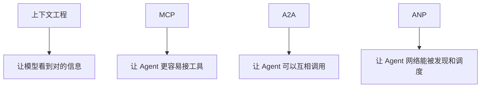

# AI Agent - 扩展课 15：上下文工程与协议生态：MCP、A2A、ANP、笔记与长任务

## 学习目标

- 理解“上下文工程”为什么正在变成 Agent 时代的核心能力。
- 知道长期任务里为什么需要结构化笔记，而不只是会话历史。
- 明白 MCP、A2A、ANP 这些协议名词分别在解决什么问题。
- 建立一个更清晰的生态视角：上下文、工具、服务发现、Agent 协作是不同层面的问题。

## 内容讲解

### 1. 上下文工程到底在解决什么

很多人以前讲 prompt engineering，重点是：

- 词怎么写
- 示例怎么给
- 语气怎么调

但做 Agent 之后你很快会发现，真正更难的问题不是“句子怎么写得漂亮”，而是：

**模型这次到底应该看到哪些信息。**

这就是上下文工程。

它关心的是：

- 放什么进去
- 不放什么进去
- 先放什么
- 后放什么
- 长任务中如何持续更新

所以从工程视角看，上下文工程更像：

**给模型做输入预算管理和信息编排。**

### 2. 一个有效上下文通常由哪些部分组成

一个成熟的 Agent 上下文，往往不只是用户一句话。

常见组成包括：

- 用户当前问题
- 当前任务状态摘要
- 已完成步骤
- 最近关键观察
- 与本轮最相关的记忆
- 检索到的知识片段
- 当前可用工具
- 运行规则和约束

你会发现，这里真正难的不是“有没有数据”，而是：

**哪些该进上下文，哪些应该只存在存储层，等需要时再拉出来。**

### 3. 为什么长任务一定要有“笔记”

如果一个任务只持续一轮对话，单纯靠上下文还凑合。  
但只要进入长任务，比如：

- 代码库分析
- 深度研究
- 多文档整合
- 多轮工单排查

问题就出来了：

- 会话历史越来越长
- 关键信息埋在旧记录里
- 模型容易重复查同样的事
- 中断后很难恢复

这时候就需要“结构化笔记”。

结构化笔记不是普通聊天记录，它更像：

- 当前目标
- 已知事实
- 已排除方向
- 阻塞点
- 下一步待办

有了它，Agent 才像是真的在做一个项目，而不是每次重新开聊。

### 4. 为什么说文件系统和终端访问也属于上下文工程的一部分

很多信息没必要提前都建索引。  
比如：

- 某个日志文件现在长什么样
- 某个目录下有哪些文件
- 某个配置最近怎么改过

这类信息更适合“即时探索”，而不是一开始全塞进向量库。

所以在长任务里，经常会出现两类信息获取方式：

#### 4.1 预先结构化好的知识

适合：

- 文档
- FAQ
- 固定知识库

#### 4.2 即时探索型信息

适合：

- 文件系统
- 终端输出
- 当前环境状态

这也是为什么很多工程型 Agent 到最后都会需要：

- NoteTool
- TerminalTool
- RAG

三者一起用。

### 5. MCP 到底在解决什么问题

MCP 最容易被误解成“又一个 Agent 框架”。  
其实它更像：

**工具接入协议。**

它解决的是一个很朴素的问题：

- 一个模型 / Agent 怎么用统一方式发现和调用外部工具

如果没有协议，常见情况就是：

- 每接一个工具都要手写适配
- 换模型还要再适配一遍
- 社区工具难以复用

MCP 的价值就在于：

- 工具如何描述
- 参数如何传
- 结果如何返回

这些事情开始变得更统一。

所以你可以把 MCP 理解成：

- 不是在定义 Agent 怎么思考
- 而是在定义 Agent 怎么接外部能力

### 6. A2A 在解决什么问题

如果说 MCP 主要解决：

- Agent 怎么连工具

那 A2A 更像在解决：

- Agent 怎么和 Agent 交流

一旦进入多 Agent 协作，你马上就会碰到这些问题：

- 谁来发布能力
- 谁来调用谁
- 消息格式怎么统一
- 任务状态怎么交接

A2A 这一类协议思路，本质上是在回答：

**把另一个 Agent 当成一种服务时，双方怎么对话。**

所以 MCP 更像“工具协议”，A2A 更像“Agent 服务协议”。

### 7. ANP 可以怎么理解

ANP 这类名字更适合从“服务发现 / Agent 网络”去理解，而不是背缩写。

它解决的更像是：

- 网络里有哪些 Agent
- 谁会什么能力
- 当前哪个节点负载更低
- 任务该发给谁

如果把多 Agent 系统想成一个分布式系统，那 ANP 这类思路就像：

- 注册中心
- 服务发现
- 简单调度

所以它和 MCP、A2A 也不是一层：

- MCP：工具接入
- A2A：Agent 间通信
- ANP：发现与组织网络中的 Agent

### 8. 一张更清晰的层次图

很多学习上的混乱，就是把这四层问题搅在一起了。

### 9. 做长任务时，一个更稳的思路

如果你要做的是长任务，不妨把系统理解成下面几件事的组合：

- 会话：用户这次到底要干什么
- 状态：任务当前推进到了哪里
- 笔记：哪些事实值得长期保留
- 检索：需要时补知识
- 工具：真的去做动作
- 协议：需要接别的工具或别的 Agent 时的连接方式

这样看以后，很多概念会突然清楚：

- 上下文工程不是只写 prompt
- MCP 不是在替你做决策
- A2A 不是多 Agent 自动变聪明
- 笔记系统不是聊天历史的重复品

### 10. 哪些东西最值得优先学

如果你是后端工程师，我会建议优先级这样排：

1. 先学上下文工程和结构化状态
2. 再学工具协议，尤其是 MCP
3. 多 Agent 通信协议按需了解
4. 服务发现类协议在真正进入 Agent 网络化时再深入

因为在大多数真实项目里，最先卡住你的通常不是 A2A，  
而是：

- 上下文太乱
- 工具接得太散
- 长任务状态不可恢复

## 小结

这一课最核心的结论是：

**上下文工程决定模型“看到什么”，协议决定系统“怎么连接什么”。两者都重要，但不是一回事。**

做单 Agent 时，你最先该补的是上下文、状态和工具接入；  
做多 Agent 时，才会更明显地碰到 A2A、ANP 这类协作和发现问题。

## 问题

1. 为什么说上下文工程比 prompt engineering 更接近 Agent 的真实工程问题？
2. 结构化笔记和普通聊天历史的差别是什么？
3. MCP、A2A、ANP 分别更像在解决哪一层问题？
4. 如果你现在要做一个长任务 Agent，你会优先补“笔记系统”还是“多 Agent 协议”？为什么？
