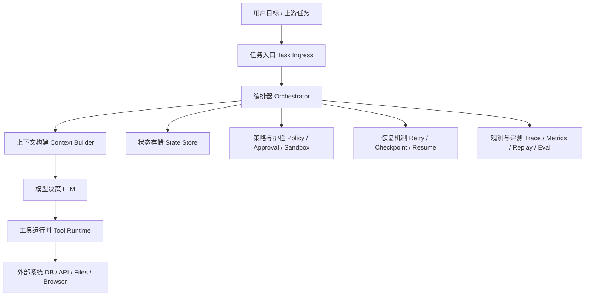

# AI Agent - 第 31 课：Harness Engineering：把“大模型会一点”变成“系统能交付”

## 学习目标

- 理解为什么很多 Agent 系统的问题不在模型本身，而在 harness 没搭好。
- 明白 Harness Engineering 和 Prompt Engineering 的职责边界。
- 建立一套工程视角：工具、状态、流程、护栏、恢复、观测、评测要怎么一起工作。
- 学会用一份实战检查清单判断一个 Agent 现在是 demo，还是已经接近可交付系统。

## 先给结论

Harness Engineering 的本质，如果只记一句话，就是：

**把“大模型会一点”变成“系统能交付”。**

很多人一提 Agent，脑子里先想到的是：

- prompt 怎么写
- system prompt 怎么分层
- few-shot 怎么塞
- planner prompt 怎么调

这些当然重要。  
但它们主要解决的是：

**模型“怎么想”。**

而真实系统能不能把事情做完，往往取决于另外一层：

- 它什么时候该停
- 它失败后怎么恢复
- 它能不能安全调用工具
- 它会不会重复执行副作用
- 它的上下文会不会越跑越乱
- 它的每一步能不能被观察、回放和审计

这些问题，主要都不是 prompt 在解决。  
解决它们的，就是 harness。

---

## 内容讲解

### 1. 什么叫 harness

你可以把 harness 理解成：

**包在模型外面、负责组织执行、约束行为、管理状态、连接工具、处理失败、沉淀观测的一整层系统。**

模型像一个会推理的“大脑”。  
而 harness 更像：

- 它的手脚
- 它的任务调度器
- 它的安全带
- 它的仪表盘
- 它的故障恢复系统

所以当我们说“做 Agent”，如果只是在调 prompt，通常还没有真正进入 Harness Engineering。

### 2. 为什么说 prompt 决定不了交付

因为模型本身是一个概率生成器。

它确实会：

- 理解目标
- 生成下一步
- 推断该用哪个工具
- 根据反馈修正策略

但它天然并不可靠地具备下面这些系统能力：

- 不知道什么时候必须终止
- 不知道失败后该从哪一步恢复
- 不知道哪些动作应该转人工
- 不知道哪些写操作绝不能重复
- 不知道上下文哪些该保留，哪些该压缩
- 不知道工具返回异常时该重试、降级还是放弃

也就是说，模型可以产生动作意图，  
但不能天然保证动作执行的工程正确性。

所以你在 demo 里看到“模型会一点”，  
不等于你在生产里得到“系统能交付”。

### 3. Harness Engineering 主要在做哪四件事

第一，给模型接上“手脚”。

让它不只是能说，还能做：

- 查数据库
- 读文件
- 调 API
- 跑代码
- 操作浏览器
- 触发工作流

没有这层，模型再聪明，也只是聊天机器人。

第二，给模型装上“流程”。

任务不是一句话结束的，而是一步步推进的。  
harness 要定义：

- 先做什么
- 后做什么
- 哪一步可以并行
- 哪一步必须串行
- 失败后怎么重试
- 超时后怎么收敛
- 什么情况下终止
- 什么情况下转人工

第三，给模型加上“护栏”。

真正的 Agent 工程，不是追求最大自由，而是追求可控自治。

所以 harness 要明确：

- 哪些工具只读
- 哪些工具有副作用
- 哪些动作必须审批
- 哪些环境只能沙箱执行
- 哪些上下文不能出现在模型输入里
- 哪些预算一旦超限就必须停止

第四，把随机性压成工程上的确定性。

模型天生不稳定。  
同一句话，两次可能走出不同路径。

harness 的价值不是消灭随机性，而是把随机性关进笼子里：

- 用稳定的工具接口收敛动作空间
- 用结构化状态收敛恢复路径
- 用检查点收敛长任务漂移
- 用评测和回放收敛迭代方向
- 用权限和预算收敛风险外溢

### 4. Harness 和 Prompt 的区别到底是什么

一句最直白的话是：

- Prompt Engineering 是教模型怎么说。
- Harness Engineering 是设计模型怎么干活。

前者更像写台词。  
后者更像搭生产系统。

再具体一点：

| 维度 | Prompt Engineering | Harness Engineering |
| --- | --- | --- |
| 主要目标 | 提升单次输出质量 | 提升任务完成率与系统可交付性 |
| 关注点 | 指令、风格、示例、格式 | 工具、状态、流程、护栏、恢复、观测 |
| 失败表现 | 回答不稳、格式不对 | 任务跑丢、重复执行、越权、无法恢复 |
| 典型产物 | prompt 模板、few-shot、角色设定 | orchestrator、tool runtime、state store、policy、trace |
| 核心问题 | 模型这次答得好不好 | 系统能不能稳定把事做完 |

真实工程里，二者不是替代关系，而是分层关系。

- prompt 负责提升局部决策质量
- harness 负责保证系统整体可控

### 5. 一个成熟 harness 通常包含哪些层

你可以把 harness 粗略理解成下面这张图：



这里最重要的工程认知是：

**模型只占其中一层。**

真正影响线上稳定性的，往往是它外面的这些层。

### 6. Harness 最容易被低估的六个模块

#### 6.1 工具运行时

很多团队的问题不是没有工具，而是工具太“面向工程师”，不面向模型。

一个能给 Agent 用的工具，不是简单暴露内部函数，而是要做好：

- 清晰 schema
- 参数校验
- 默认值补全
- 错误标准化
- 超时控制
- 幂等约束
- 返回结果标准化

如果工具层没做好，模型就会：

- 老选错工具
- 老填错参数
- 老把失败当成功
- 老在副作用动作上重复执行

#### 6.2 状态存储

聊天历史不是状态机。  
模型上下文也不是检查点。

一个真实任务至少应该有结构化状态，例如：

- `run_id`
- 当前阶段
- 已完成步骤
- 待执行动作
- 外部副作用记录
- 重试计数
- 人工接管标记
- 最后可恢复位置

如果这些没有外化存储，任务一旦中断，基本只能整轮重跑。

#### 6.3 编排与状态机

Agent 一旦走出单轮同步问答，就要面对：

- 多步执行
- 长时间等待
- 异步回调
- 多次失败
- 用户中途修改目标

这时候不能只靠 while loop。  
更稳的做法是把任务显式建模成状态机。

状态机不是为了“画图好看”，而是为了：

- 明确终止条件
- 明确恢复边界
- 明确副作用发生点
- 明确人工接管点

#### 6.4 护栏与策略

护栏不是最后补一条正则。

成熟的护栏至少应该分层：

1. 输入层
   - 敏感信息脱敏
   - 注入攻击检测
   - 参数合法性校验
2. 决策层
   - 工具可见性裁剪
   - 最大步数
   - 预算限制
   - 风险分级
3. 执行层
   - 权限控制
   - 审批放行
   - 沙箱隔离
   - 幂等控制
4. 输出层
   - 内容审查
   - 证据绑定
   - 格式校验

#### 6.5 失败恢复

真实系统里，失败不是特例，而是常态。

你至少要提前决定：

- 哪类错误允许自动重试
- 哪类错误应该立即失败
- 哪类错误要降级成只读模式
- 哪类错误要转人工
- 恢复时是否允许重放之前的动作

恢复做得差，常见后果是：

- 外部动作重复执行
- 任务卡在半状态
- 进程重启后上下文断裂
- 人工只能“重新来一遍”

#### 6.6 可观测性与评测

没有 trace，Agent 基本没法认真调。  
没有回放，很多问题根本复现不了。  
没有评测门禁，系统迭代会越来越像玄学。

一个实用的 harness 至少要能回答：

- 任务失败在哪一步
- 模型为什么选了这个工具
- 这次上下文里到底放了什么
- 哪个外部依赖最常超时
- 哪个 prompt / 策略版本导致成功率下降

### 7. Harness Engineering 真正关心的，不是“更聪明”，而是“更不掉链子”

所以有经验的人做 Agent，关注点通常不是：

- 再写一个更花哨的 planner prompt
- 再加一个角色扮演设定
- 再堆一个多 Agent

而是这些更“工程化”的问题：

- 工具接口是否稳定
- 状态是否可追踪
- 执行链路是否可观测
- 失败是否可恢复
- 风险动作是否可拦截
- 结果是否可验证

这也是为什么很多团队模型不差，效果却很差。

问题往往不在模型，而在 harness：

- 工具描述不清，模型老调错
- 上下文堆太多，任务越跑越乱
- 没有中间检查，错一步后面全错
- 没有失败恢复，一崩就整轮报废
- 权限给太大，模型一出错就是事故
- 多 Agent 硬堆，复杂度增长快过收益

### 8. 从 demo 到产品，harness 往往分四个阶段演进

#### 阶段 1：Prompt Demo

特征通常是：

- 一个 prompt
- 一个模型
- 几个工具
- 一次请求跑完

它适合快速验证“模型大概会不会”。

但风险也最明显：

- 没状态
- 没恢复
- 没护栏
- 没回放
- 没法长期稳定迭代

#### 阶段 2：可控单 Agent

这时开始补基础 harness：

- 任务 ID
- 步数限制
- 工具白名单
- 基础状态存储
- 基础 trace
- 超时与重试

这通常才是第一个“能试着给内部人用”的版本。

#### 阶段 3：可恢复执行系统

再往前一步，就要补：

- 检查点
- 幂等
- 审批
- 人工接管
- 回放
- 结果验证

到了这一步，系统才开始具备生产可用的骨架。

#### 阶段 4：可运营的 Agent 平台

最终要进入的是：

- 策略可配置
- 工具可治理
- 风险可审计
- 指标可观测
- 版本可比较
- 评测可门禁

这时你做的已经不只是某个 Agent，而是一套持续演进的能力平台。

### 9. 工程实践上应该怎么落地

下面这部分最重要。  
因为 Harness Engineering 真正值钱的地方，不是概念解释，而是工程动作。

#### 9.1 先定义“任务完成”而不是先写 prompt

第一步不是问：

- prompt 怎么写最聪明

而是先问：

- 什么叫完成
- 什么叫部分完成
- 什么叫失败
- 什么情况下必须停
- 什么情况下必须转人工

如果完成条件不清楚，后面所有 harness 设计都会漂。

#### 9.2 先收敛动作空间，再追求自主性

很多 Agent 一开始就暴露太多工具。

更健康的做法是：

1. 先做少量高价值、语义清楚的工具
2. 先做只读工具
3. 再逐步引入低风险写工具
4. 最后才考虑高风险副作用动作

工程里最忌讳的是：

**系统还没可控，就先给模型太大自由。**

#### 9.3 把每一步都设计成“可恢复单元”

一个实用问题是：

**如果系统此刻崩了，下次从哪里继续？**

所以每一步最好都能说清：

- 输入是什么
- 输出是什么
- 有没有副作用
- 是否可重试
- 是否需要幂等 key
- 失败后从哪里恢复

如果一段逻辑说不清这些，它还不适合进入生产链路。

#### 9.4 让工具对模型友好，而不是只对工程师友好

工具设计建议至少遵守这几条：

- 名称要区分明确，不要多个工具都像“查询信息”
- 描述里写清“什么时候该用”和“什么时候不要用”
- 参数尽量少，字段语义尽量清楚
- 返回值要结构化，不要把原始噪声直接丢给模型
- 错误要有类别，便于恢复策略分流

很多时候，Agent 的上限不由模型决定，而由工具接口决定。

#### 9.5 给写操作默认加幂等

只要是这些动作，就应该默认按“可能被重复调用”设计：

- 创建
- 修改
- 删除
- 发送
- 提交
- 扣费

因为重复执行的来源太多了：

- 模型不确定结果，重试一次
- 网络超时，编排器重放一次
- 系统恢复，人工点继续一次

没有幂等，Agent 的错误会直接放大成事故。

#### 9.6 用策略层承接风险，而不是把风险交给模型自觉

例如可以做一个简单策略矩阵：

| 动作类型 | 是否允许自动执行 | 是否需要审批 | 默认执行环境 |
| --- | --- | --- | --- |
| 只读查询 | 是 | 否 | 普通运行时 |
| 低风险写操作 | 条件允许 | 视业务而定 | 受控运行时 |
| 高风险写操作 | 否 | 是 | 沙箱 + 审批 |
| 外网访问 / 系统变更 | 很少默认允许 | 是 | 强隔离环境 |

这样系统的边界是代码和策略定义出来的，  
不是靠 prompt 里一句“请谨慎”。

#### 9.7 把上下文当资源来管理

上下文不是越多越好。

好的 harness 会主动做：

- 工具裁剪
- 历史摘要
- 阶段性压缩
- 笔记提炼
- 证据和噪声分离

否则任务一长，上下文会像日志堆积一样失控。

#### 9.8 默认建设 trace、回放和基准样本

最低限度建议记录：

- run_id
- step_id
- 当前状态
- prompt / policy 版本
- 工具调用参数摘要
- 工具结果摘要
- 错误类型
- 最终结果

然后准备一批固定样本，持续看：

- 完成率
- 平均步数
- 平均成本
- 恢复成功率
- 风险动作拦截率

没有这套东西，优化常常会陷入“感觉这版更聪明了”的错觉。

### 10. 一个很实用的 harness 最小落地模板

如果你今天要自己搭一个第一个可控 Agent，我建议最少有这些：

#### 必要组件

- 一个任务入口
- 一个 orchestrator
- 一个上下文构建器
- 一组语义清楚的只读工具
- 一个结构化状态表
- 一套 trace
- 最大步数、最大耗时、最大预算限制

#### 尽快补上的组件

- 写工具幂等
- 审批机制
- 检查点
- 恢复逻辑
- 人工接管
- 基础评测集

如果这些都没有，系统通常只能算 demo，不算可靠 Agent。

### 11. 一套适合你亲手练的工程实践路线

如果你想把这课真正练进手里，我建议不要一上来做“大而全 Agent”，而是选一个很窄的场景。

比如下面这两类就很适合：

- 研发助手：读代码、查文件、跑测试、总结错误
- 排障助手：查日志、查配置、关联工单、生成排障建议

这类题目有三个好处：

- 工具边界比较清楚
- 成功标准比较容易定义
- 很适合逐步加 harness，而不是一上来全堆满

一个比较健康的练习顺序是：

#### 第一步：先定义任务完成条件

先写清这几件事：

- 什么叫成功完成
- 什么叫部分完成
- 什么叫失败
- 最大允许多少步
- 哪些动作不允许自动做

不要先写 prompt，先写这张定义表。

#### 第二步：先只做 3 到 5 个只读工具

例如做研发助手时，只先给：

- `search_code`
- `read_file`
- `run_tests`
- `list_changed_files`

不要一开始就给写文件、发消息、改配置这类副作用动作。

#### 第三步：先把 `run` 和 `step` 状态存起来

哪怕是最简单版本，也建议至少有两张结构化表：

```text
runs(
  run_id,
  goal,
  status,
  current_step,
  budget_state,
  created_at,
  updated_at
)

steps(
  step_id,
  run_id,
  step_no,
  action_type,
  tool_name,
  input_digest,
  output_digest,
  status,
  retry_count,
  started_at,
  finished_at
)
```

这样你至少能知道：

- 任务走到哪了
- 哪一步失败了
- 哪一步重试过
- 哪个动作已经发生过

#### 第四步：给每一步补 trace

最小 trace 不需要复杂平台，先把这些记下来就很有用了：

- `run_id`
- `step_id`
- 使用的 prompt / policy 版本
- 工具名
- 参数摘要
- 结果摘要
- 错误类型
- 最终决策

你会很快发现，很多“模型不聪明”的问题，其实一看 trace 就知道是工具描述或上下文构建出了问题。

#### 第五步：故意制造一次失败，再把恢复跑通

这是最关键的一步。

不要只测 happy path。  
你应该主动造一个故障，比如：

- 工具超时
- 返回空结果
- 参数校验失败
- 运行中断

然后验证：

- 系统是否知道停在哪一步
- 是否会重复执行副作用
- 是否知道该重试还是转人工
- 恢复后是不是从正确位置继续

如果这一步做通了，你才算真的开始在做 harness，而不只是做 prompt demo。

#### 第六步：最后再引入一个受控写工具

比如：

- `write_patch`
- `create_ticket`
- `send_notification`

但要同时补上：

- 幂等 key
- 审批开关
- 风险级别
- 审计记录

到这里，你会第一次真正感受到：

**Agent 工程最难的不是让模型决定“要不要做”，而是系统怎么安全地让它“真的做”。**

#### 第七步：做一小套固定评测集

准备 10 到 20 个固定任务样本，持续记录：

- 完成率
- 平均步数
- 平均耗时
- 平均成本
- 恢复成功率
- 误触发写操作次数

这套小评测集会帮你避免“今天看起来更聪明，明天实际上更不稳”的错觉。

### 12. 常见反模式

下面这些坑很常见，而且几乎都不是“换个更强模型”能解决的：

1. 只调 prompt，不建状态
2. 只接工具，不做 schema 和错误标准化
3. 只做 happy path，不设计恢复
4. 只看回答质量，不看任务完成率
5. 只做多 Agent 编排，不做单 Agent 可控性
6. 只做功能，不做 trace 和回放
7. 把权限交给模型理解，不做系统级拦截
8. 一上来就暴露高风险写操作

### 13. 一个后端工程师视角下的理解方式

如果你本来是后端工程师，可以把 Harness Engineering 和熟悉的系统问题对应起来：

| Agent 问题 | 后端里对应的问题 |
| --- | --- |
| 工具调用 | RPC / SDK / 外部依赖治理 |
| 状态持久化 | 任务表 / 工作流状态机 |
| 幂等与重试 | 分布式系统稳定性治理 |
| 护栏与审批 | 权限系统 / 风控 / 发布门禁 |
| 回放与 trace | 可观测性 / 调试链路 |
| 人工接管 | 运维控制台 / 人工兜底流程 |

所以 Harness Engineering 并不是一套和软件工程无关的新玩具。  
它恰恰是在把大模型能力，接进成熟的软件工程世界。

### 14. 为什么说 AI 从 demo 走向产品，靠的主要就是 harness

因为 demo 阶段最容易被高估的是“模型会不会”。  
产品阶段最容易被低估的是“系统能不能扛住真实世界”。

真实世界会不断给你脏东西：

- 模糊输入
- 脏数据
- 外部依赖抖动
- 权限边界
- 超时
- 部分失败
- 人工介入
- 成本压力

prompt 可以帮助模型更好理解问题，  
但只有 harness 才能让系统在这些脏条件下仍然尽量稳定完成任务。

所以 Harness Engineering 真正解决的问题，从来不是：

- 模型够不够聪明

而是：

**模型已经够聪明了，怎么才能不掉链子。**

## 小结

这课最重要的结论有四个：

### 第一，harness 决定 Agent 能不能交付

prompt 影响模型表现，  
harness 决定系统完成率、稳定性和风险边界。

### 第二，Harness Engineering 的核心不是“给模型更多自由”

而是给模型更清晰的动作空间、更明确的状态边界、更可靠的恢复路径和更强的系统约束。

### 第三，真正的工程重点是可控性

核心看的是：

- 工具是否稳定
- 状态是否可追踪
- 失败是否可恢复
- 风险是否可拦截
- 结果是否可验证

### 第四，先把 harness 做明白，再谈更复杂的 agent 形态

单 Agent 都没有稳定 harness，  
多 Agent、大规模自治、复杂协作通常只会把问题放大。

## 你现在应该能回答的问题

1. 为什么说 Harness Engineering 的本质是“把大模型会一点变成系统能交付”？
2. Harness Engineering 和 Prompt Engineering 的核心区别是什么？
3. 一个成熟 harness 至少应该包含哪几层？
4. 为什么状态、幂等、护栏、恢复和可观测性都属于 harness 的一部分？
5. 如果你要把一个 Agent demo 推向内测版，最先该补哪几项工程能力？
