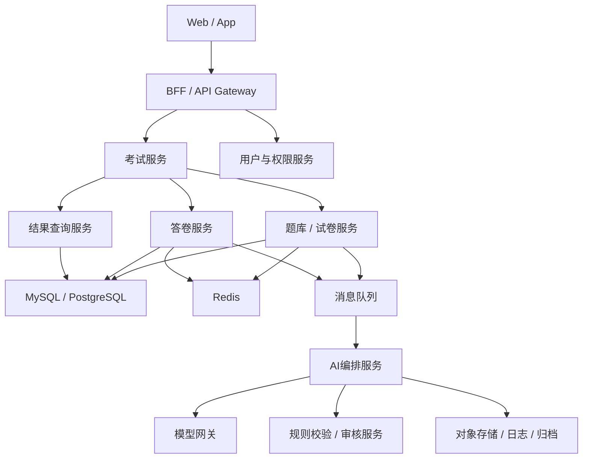

# AI考试平台系统设计 - 第 1 课：需求澄清与总体架构

## 学习目标（本节结束后你能做到什么）

1. 能把“AI 考试平台”从一个模糊概念，收敛成清晰的业务边界和系统目标。
2. 能识别这道题的核心对象：考试模板、试卷、考试实例、答卷、评分结果、考试记录。
3. 能画出一个合理的高层架构，并说明为什么要把考试交易链路和 AI 异步链路分开。
4. 知道这道题第一优先级通常不是吞吐，而是公平、可审计、可恢复。

## 内容讲解（核心概念，用类比、例子、图示说清楚）

很多人一听“设计一个 AI 考试平台”，会下意识把它理解成“在线答题网站 + 调大模型”。这样答通常不够。因为面试官真正想听的，不是你知道多少 AI 名词，而是你能不能先把业务模式讲清楚。  
这个系统到底是给谁用的？是面向练习刷题，还是面向招聘面试，还是面向企业培训考核？不同场景决定了系统对公平性、时效性、审计、人工介入的要求完全不同。

你在面试里首先应该澄清几件事：

- 考试是练习型还是正式考核型？
- 题型有哪些，只有选择题，还是包含主观题、代码题、附件题？
- AI 是负责“辅助出题”，还是正式题目全部由 AI 生成？
- 评分结果是否允许人工复核？
- 用户提交后是立刻出分，还是异步出分？
- 用户是否能查看解析、评分理由和历史考试记录？
- 是否有防作弊要求，比如切屏检测、设备绑定、重复登录控制？

这些问题的作用，是快速确定系统的核心矛盾。  
如果是练习平台，重点是低成本、高迭代、个性化推荐；  
如果是正式考试平台，重点则变成题目质量、评分一致性、试卷冻结、防作弊和追溯能力。  
你可以主动做一个合理假设：`这是一个支持练习与正式测评的考试平台，但正式考试模式下，题目和评分都必须可审计、可复核。`

再往下，要把核心对象分清楚。至少有下面这些：

- `ExamTemplate`：考试模板，定义考试目标、题型配比、难度、时长、规则。
- `QuestionItem`：题目条目，包含题干、选项、标准答案、参考解析、知识点标签和题目版本。
- `ExamPaper`：一次真正发布给考生使用的试卷快照。它不是动态拼出来的意向，而是已经冻结的题目集合。
- `ExamAttempt`：某个用户的一次考试实例，包含开始时间、结束时间、状态、剩余时长等。
- `AnswerSheet`：用户作答内容快照，可能包含自动保存版本和最终提交版本。
- `GradingResult`：判卷结果，记录总分、分题得分、评分理由、评分版本、复核状态。
- `ExamRecord`：用户可见的考试历史视图，是对 attempt、paper、result 的整合读取模型。

这里最重要的工程观念是：`考试模板`、`试卷快照`、`答卷`、`评分结果`四者不能混成一份数据。  
模板是规则；试卷是本次考试拿到的题；答卷是用户输入；评分结果是系统对答卷的解释。  
一旦把这些对象混在一起，后面做版本追溯、申诉处理、重放判卷都会非常痛苦。

高层架构上，我建议先拆成两条链：

1. `考试交易链路`
   - 管理用户开考、作答、自动保存、提交、查分、查看考试记录
   - 这条链强调状态正确、低延迟、幂等和权限控制

2. `AI 能力链路`
   - 负责 AI 出题、AI 判卷、解析生成、质量校验、风险审查
   - 这条链更适合异步化，强调模型路由、失败重试、人工复核和审计

为什么一定要拆？因为考试交易链路追求的是“用户动作要稳定落地”，而 AI 链路天然存在不确定性和高延迟。  
如果你把“开始考试”直接绑死到“在线调用大模型生成整套题”，或者把“提交答卷成功”绑死到“实时等大模型完成所有主观题评分”，系统体验和稳定性都会很差。

一个比较稳的总体架构可以这样画：

这张图里要把真相源讲清楚。  
我的建议是：考试状态、答卷状态、结果状态这些核心业务状态，真相源都在关系数据库里。  
Redis 用来加速和做短期会话态，比如考试计时、防重复提交 token、热点试卷读取。  
消息队列承接 AI 异步任务。  
模型网关只负责统一调用外部 LLM Provider，不保存正式业务状态。  
对象存储则放答卷快照、附件、模型返回原文、评分证据和归档文件。

这里还有一个经常被忽略的点：`ExamRecord` 最好作为独立读取模型来看待。  
用户点“我的考试记录”时，不是现场去 join 一堆底层表拼装，而是读取已经组织好的记录视图，比如考试名称、考试时间、总分、是否通过、可否复核、查看解析入口。  
这样一方面查询更稳定，另一方面权限控制也更清晰，因为用户只该看到自己的记录和允许展示的解释信息。

最后你可以用一句话收束这一课：  
这道题本质上不是“一个页面调一个模型”，而是一个`考试交易系统 + AI 生成与判卷系统 + 审计治理系统`的组合。主交易链路要稳，AI 链路要可控，用户记录要可追溯。

## 小结（3-5 条关键点）

1. 先澄清场景是练习平台还是正式考试平台，这是整道题的分水岭。
2. 考试模板、试卷快照、答卷、评分结果必须分开建模，不能揉成一团。
3. 主交易链路和 AI 能力链路要解耦，否则系统会被模型延迟和不确定性拖垮。
4. 核心状态真相源应该在数据库里，模型输出只是候选结果，不是天然真相。
5. “我的考试记录”更适合作为独立读取模型设计，方便权限控制和性能优化。

## 检查站：请回答以下问题

1. 为什么“开始考试时临时让大模型生成整张试卷”通常不是正式考试里的好方案？
2. 考试模板、试卷快照、答卷、评分结果四者分别解决什么问题？
3. 为什么 AI 考试平台必须把交易链路和 AI 链路拆开？
4. 如果用户要看“我的考试记录”，你觉得哪些字段应该直接展示，哪些字段应该谨慎展示？
