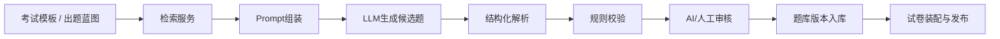

# AI考试平台系统设计 - 第 2 课：AI出题Agent与考试链路设计

## 学习目标（本节结束后你能做到什么）

1. 能解释为什么 AI 出题不应该设计成一次“裸调大模型”的黑盒操作。
2. 能讲清受约束的出题 Agent 流水线，包括检索、生成、校验、审核和入库。
3. 能把试卷发布、开考、自动保存、提交这条考试主链路说清楚。
4. 理解为什么正式考试强调“试卷冻结”，而不是“随用户请求动态生成”。

## 内容讲解（核心概念，用类比、例子、图示说清楚）

“AI 出题”这四个字最容易让方案变得很飘。  
很多人会说：运营配置考试范围后，系统把 Prompt 发给大模型，大模型吐出 20 道题，存库就完了。  
这样说的问题是，它默认模型会稳定地产生可用题目，但真实情况恰恰不是。模型可能生成重复题、超纲题、答案不唯一的题、难度失衡的题，甚至输出格式不合法。所以出题不能被当成一次神秘调用，而要被设计成一个受约束的流水线。

我更推荐把“Agent”理解成`多阶段工具链`，而不是一个可以无限自主规划的智能体。  
在正式考试场景里，你反而应该限制自由度，让系统每一步都可解释、可校验、可回放。

一条稳妥的出题链路通常包括这些阶段：

1. `蓝图定义`
   - 先由考试模板定义题型配比、知识点覆盖、难度分布、题量、语言风格和禁用范围
   - 这一步的产物不是题目，而是一张出题规格说明书

2. `知识检索`
   - 从已有题库、教材资料、知识点库中检索上下文
   - 目的是让生成不完全依赖模型记忆，而是受考试范围约束

3. `候选题生成`
   - 让模型按结构化 schema 生成题干、选项、标准答案、解析、知识点标签
   - 最好强制 JSON 或函数调用输出，而不是纯自然语言

4. `规则校验`
   - 校验字段是否齐全
   - 校验答案是否唯一
   - 校验是否和已有题重复
   - 校验题干和答案是否自洽
   - 校验敏感内容、脏话、政治风险、版权风险

5. `质量审核`
   - 可以由第二个模型做 reviewer，也可以配人工抽检
   - 对正式考试来说，这一步非常关键，因为它决定题目能不能进入正式题库

6. `入库与版本化`
   - 通过审核的题目才成为正式 `QuestionItem`
   - 题目、答案、解析、Prompt 版本、模型版本都要固化

这条链路背后的思想很像工厂质检。  
大模型像一个高效但不稳定的生产设备，它能快速产出候选品，但平台必须有检验、返工、报废和追溯机制，不能让每个模型输出都直接进生产。

一个适合面试表达的图可以这样画：

这里最值得你主动讲的一点是：`正式考试尽量预生成，练习模式可以半动态生成。`  
为什么？  
因为正式考试更重公平性和可审计性。你希望同一场考试里的题目要么完全相同，要么在受控题池里随机，但无论如何都应该在开考前就冻结。  
练习模式则更重个性化和低成本容错，可以接受按用户薄弱点动态生成题目，只要质量校验做得足够稳。

所以，试卷发布链路通常不是“用户点开始考试 -> 现场调用大模型 -> 立即生成试卷”。  
而应该是：

1. 运营或老师创建考试模板
2. 系统异步触发出题任务
3. 候选题经过校验和审核后进入题库
4. 发布时从题库装配出正式试卷快照
5. 用户开考时，系统只创建 `ExamAttempt` 并绑定这张已经冻结的 `ExamPaper`

这样一来，考试主链路就稳定很多。  
开考时要做的事情通常包括：

- 校验用户是否有考试资格
- 校验当前是否在允许考试的时间窗口
- 创建考试实例并写入开始时间、结束时间、剩余时长
- 生成一次性防重 token
- 加载试卷快照和用户历史草稿

用户作答过程中，系统最好支持自动保存，但保存对象应该是 `AnswerSheetDraft` 这类过程态，而不是每次都覆盖最终提交态。  
自动保存要注意两个工程问题。  
第一个是幂等，避免前端网络抖动导致重复保存把旧内容覆盖新内容。  
第二个是乱序，多个保存请求可能先后到达顺序不同，所以最好带版本号或客户端时间戳做保护。

提交链路则建议这样设计：

1. 用户点击提交
2. 服务端再次校验考试是否仍在可提交状态
3. 冻结最终答卷快照
4. 更新考试实例状态为 `submitted`
5. 投递判卷任务事件
6. 同步返回“提交成功，结果稍后可见”或“客观题已出分，主观题稍后完成”

为什么提交成功不等于判卷完成？  
因为主观题 AI 判卷可能慢、可能失败、可能需要复核。  
如果你把提交动作和完整判卷强绑定，用户提交体验会很差，系统也会更脆弱。

这一课收束成一句话就是：  
AI 出题要做成受约束流水线，正式考试要强调试卷冻结；考试交易主链路只负责稳定地让用户“开始、作答、保存、提交”，不要把模型调用直接绑死在关键交互上。

## 小结（3-5 条关键点）

1. AI 出题不能是一次裸调模型，而应该是蓝图驱动、检索增强、结构化生成、规则校验和审核入库的流水线。
2. Agent 在这里更像受约束的工具编排，而不是自由发挥的自治体。
3. 正式考试更适合预生成并冻结试卷，练习模式才更适合动态生成。
4. 开考主链路要轻，重点是资格校验、实例创建、试卷绑定和计时状态落库。
5. 提交成功和判卷完成应该解耦，尤其是有主观题时。

## 检查站：请回答以下问题

1. 为什么正式考试场景更强调“预生成 + 冻结试卷”，而不是用户开始时临时生成？
2. 一条完整的 AI 出题流水线至少应该包含哪几个阶段？
3. 自动保存答卷时，为什么要考虑幂等和乱序覆盖问题？
4. 如果面试官问“为什么不让模型直接现编一套题给每个用户”，你会怎么回答？
