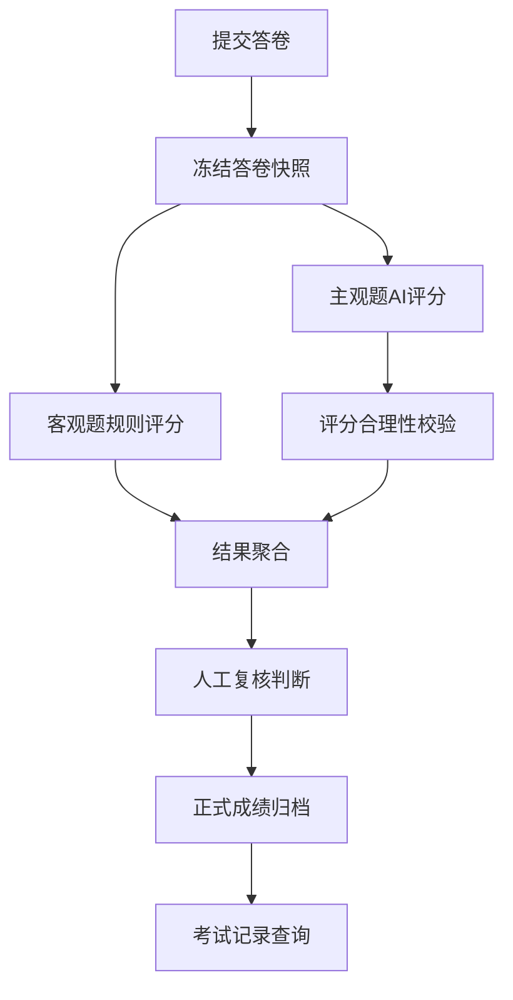

# AI考试平台系统设计 - 第 3 课：AI判卷、结果归档与考试记录

## 学习目标（本节结束后你能做到什么）

1. 能把 AI 判卷拆成客观题评分、主观题评分、结果聚合、人工复核和记录归档几个层次。
2. 能解释为什么判卷结果必须版本化，不能被模型升级静默覆盖。
3. 能设计用户查看“我的考试记录”的数据结构和查询链路。
4. 理解 AI 判卷里最关键的不是“能打分”，而是“评分是否稳定、可解释、可追溯”。

## 内容讲解（核心概念，用类比、例子、图示说清楚）

如果说 AI 出题的难点是质量控制，那 AI 判卷的难点就是`公平性和可审计性`。  
因为用户一旦拿到分数，分数就不只是一个机器结果，而是一个可能影响学习路径、录用决策、绩效评估的正式结论。  
所以判卷系统不能只有“模型返回多少分”，还要有评分依据、评分版本、异常兜底和复核入口。

判卷第一步要先分题型，不要把所有题都交给大模型。  
一个成熟的设计通常会这样分层：

1. `客观题`
   - 选择题、判断题、固定答案填空题
   - 优先用规则引擎或标准答案直接评分
   - 这部分最稳定、最便宜，也最容易解释

2. `半结构化题`
   - 短文本问答、关键词填空、简短代码输出
   - 可以先做规则匹配或关键词召回，再决定是否调用模型复核

3. `主观题`
   - 论述题、案例分析题、开放性问答、长文本题
   - 这部分才适合进入 LLM 评分流水线

也就是说，AI 判卷不应该是“所有题都丢给模型”。  
模型是贵的、慢的、不稳定的，所以应该只在它真正有价值的题型上使用。

一条比较稳的主观题判卷流水线可以是：

1. `答卷冻结`
   - 先把用户最终提交的答卷快照固化，后续所有评分都基于同一份输入

2. `评分 Rubric 加载`
   - 每道题都要有明确评分标准，比如论点完整性、事实准确性、结构表达、关键知识点覆盖
   - Rubric 也必须版本化

3. `模型评分`
   - 把题目、标准答案、Rubric、用户答案送给评分模型
   - 返回分数、分项得分、理由摘要、证据片段

4. `合理性校验`
   - 校验分数是否越界
   - 校验理由是否和分数一致
   - 校验是否出现明显幻觉，比如引用了答案里没有的内容

5. `聚合与边界判断`
   - 汇总总分、是否通过、是否需要复核
   - 对边缘分、置信度低、模型冲突的结果打上人工复核标记

6. `结果归档`
   - 将分题得分、总分、评分理由、模型版本、Prompt 版本、Rubric 版本、执行时间写入正式结果表

这条链路的核心思想是：`最终结果是平台归档出来的，不是模型自然给出来的。`  
模型只是提供一个候选评分，平台要负责做边界控制和状态固化。

你可以用下面这张图来讲：

人工复核为什么重要？  
因为 AI 评分不只是技术问题，还是信任问题。  
如果一份答卷刚好卡在通过线附近，或者模型给出的评分理由明显不充分，系统就应该把它打到“待复核”队列，而不是强行自动出分。  
你可以把这理解成银行风控里的人工审核通道。大部分单子自动化处理，但高风险样本必须进人工。

再说一个非常关键、面试里很容易加分的点：`判卷结果必须版本化。`  
比如某次考试在 2025 年 1 月用 `model_v3 + rubric_v7 + prompt_v12` 判卷并出分了。  
三个月后你升级了模型，不意味着你可以把这位用户历史记录里的分数静默改掉。  
正确做法应该是：

- 旧记录保留原始评分结果和版本信息
- 如果确实需要重算，必须生成新的复评分记录
- 新旧结果要并存，可标明“原始成绩”和“复评成绩”

否则一旦用户申诉“为什么我昨天 82 分今天变成 76 分”，你根本无法解释。

接下来讲“我的考试记录”。  
这个页面其实是一个查询模型，不是底层表的简单列表。  
用户通常关心的是：

- 考试名称
- 考试时间
- 提交时间
- 总分和是否通过
- 各题型得分
- 是否已发布解析
- 是否可申请复核

而平台内部还会保存更多不一定要展示给用户的数据，比如：

- 模型原始输出全文
- Prompt 细节
- 内部风险标签
- 人工复核操作人
- 调试日志

也就是说，面向用户的 `ExamRecordView` 和面向内部排障的 `GradingTrace` 最好是分开的。  
对用户来说，需要的是清晰、稳定和可理解；对内部来说，需要的是完整、可追溯和可调试。

最后，用一句适合面试的话收束这一课：  
AI 判卷系统不是“把答案发给模型让它打个分”，而是“规则评分 + 模型评分 + 边界校验 + 复核兜底 + 结果版本化归档”的组合流程，考试记录则是这套流程对用户的稳定投影。

## 小结（3-5 条关键点）

1. 客观题优先规则评分，主观题才进入 AI 评分流水线，不要所有题都交给模型。
2. AI 评分结果必须经过合理性校验和复核判断，不能直接当正式成绩。
3. 评分结果必须记录模型版本、Prompt 版本和 Rubric 版本，保证可追溯。
4. 用户考试记录是独立查询模型，展示信息和内部调试信息要分层。
5. 模型升级后，旧成绩不能被静默覆盖，必要时应该生成新的复评分记录。

## 检查站：请回答以下问题

1. 为什么客观题通常不应该直接用大模型评分？
2. 主观题 AI 判卷为什么必须保存 Rubric 版本和模型版本？
3. 如果一份答卷刚好卡在通过线附近，你会怎么设计自动出分和人工复核的边界？
4. 用户查看“我的考试记录”时，你会展示哪些内容，不展示哪些内部信息？
