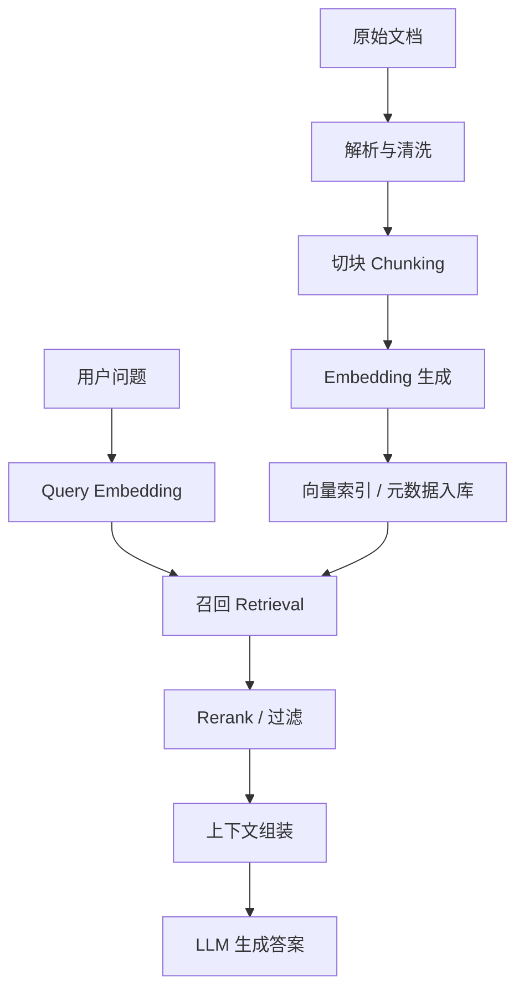

# AI考试平台系统设计 - 第 6 课：RAG、Token策略与向量检索落地

## 学习目标（本节结束后你能做到什么）

1. 能把一个 RAG 系统拆成文档解析、切块、embedding、索引、召回、rerank、上下文组装和生成几个步骤。
2. 能说清 Python 生态里常见的 RAG 包分别负责什么，而不是把 LangChain 当成万能答案。
3. 能落地设计一个适合后端工程师使用的向量表结构，尤其是基于 PostgreSQL + pgvector 的方案。
4. 知道 token 预算、chunk 大小、topK、rerank 和最终回答质量之间的关系。
5. 能识别 RAG 里最常见的问题，比如召回不准、上下文污染、索引漂移、成本失控和结果不稳定。

## 内容讲解（核心概念，用类比、例子、图示说清楚）

很多人第一次接触 RAG，会把它理解成一句话：把资料扔进向量数据库，问题来了以后相似度检索，再把结果拼到 Prompt 里。  
这句话方向没错，但工程上远远不够。  
因为真正决定效果的，往往不是“有没有向量库”，而是以下几个细节：

- 文档到底怎么切
- metadata 怎么建
- embedding 用什么模型
- 是纯向量检索还是混合检索
- topK 取多少
- 是否需要 rerank
- 最终 prompt 里到底塞多少上下文

所以你最好把 RAG 理解成一条完整的数据处理链，而不是一个单点能力。



### 1. RAG 常用什么包

先说包，不然概念容易太虚。  
我把它分成 6 层来看。

#### 1.1 编排层

- `LangChain`
  - 更像组件拼装层，擅长把 loader、splitter、embedding、vector store、retriever、prompt 组织起来
  - 官方文档现在明确区分 2-Step RAG、Agentic RAG 和 Hybrid RAG
- `LlamaIndex`
  - 更强调 indexing、retriever、query engine、node 体系
  - 如果场景以知识库和检索为中心，很多人会觉得它比通用编排框架更顺手
- `Haystack`
  - 更像偏检索和搜索工程化的流水线框架，尤其在 retriever、reranker、evaluation 方面比较清晰

这三类框架都能做 RAG。  
如果你只是做一个可控的业务型知识检索，`LangChain + pgvector` 就够了。  
如果你要把知识索引、节点关系、检索器抽象做得更重，LlamaIndex 很常见。  
如果你更偏搜索工程和可评测流水线，Haystack 也很适合。

#### 1.2 文档解析层

- `pypdf` 或 `PyMuPDF`
  - 处理 PDF 文本抽取
- `python-docx`
  - 处理 Word
- `beautifulsoup4`
  - 处理 HTML
- `unstructured`
  - 对复杂文档切分比较方便，尤其是杂格式文档
- `pandas`
  - 处理 CSV、Excel、表格类知识

这里的核心不是“能不能读出来”，而是“能不能保留结构”。  
比如标题、段落、表格、代码块、页码、章节层级，这些结构信息后面都值得放进 metadata。

#### 1.3 切块层

- `langchain-text-splitters`
  - 最常见的是 `RecursiveCharacterTextSplitter`
- `LlamaIndex` 里的 node parser / sentence splitter
- 一些自定义切块器
  - 按标题、按章节、按表格、按代码函数切

切块是 RAG 最容易被低估的环节。  
块太大，召回进来以后 token 爆炸；块太小，语义被切碎，检索命中率下降。  
很多项目的效果问题，不是模型太差，而是 chunk 切坏了。

#### 1.4 Embedding 层

- `openai`
  - 直接调用 embedding API
- `sentence-transformers`
  - 本地或自托管常见选择
- `FlagEmbedding`
  - BGE 系列在中文场景比较常见
- 一些云厂商 embedding SDK

embedding 模型的选择，决定了召回空间长什么样。  
如果你是中英文混合知识库，模型的多语言能力会直接影响效果。

#### 1.5 向量存储层

- `pgvector`
  - 适合已经有 PostgreSQL 的团队
- `Qdrant`
  - 专职向量数据库，工程体验比较好
- `Milvus`
  - 更偏大规模向量检索
- `Weaviate`
  - 自带很多向量检索和 schema 能力
- `OpenSearch`
  - 如果团队本来就有搜索栈，做混合检索很自然

对于大多数后端团队，我会优先给两个建议：

- 数据量中小、团队已经深用 PostgreSQL：先用 `pgvector`
- 数据量更大、过滤和混合检索要求高：考虑 `Qdrant` 或 `OpenSearch`

#### 1.6 Token 与 rerank 层

- `tiktoken`
  - 用来做 token 计数和预算控制
- `bge-reranker` 或其他 cross-encoder reranker
  - 用于二次排序
- 一些云厂商 rerank API

RAG 不要只看召回，还要看`召回后怎么收口`。  
因为 top20 里真正有价值的，可能只有前 3 条，rerank 就是在做这件事。

### 2. RAG 怎么实现

最小可用闭环通常是：

1. 文档解析
2. 清洗和结构保留
3. 切块
4. 生成 chunk embedding
5. chunk 和 metadata 入库
6. 查询时把 query 做 embedding
7. 相似度召回 topK
8. 可选 rerank
9. 把结果拼进 prompt
10. 让模型基于上下文回答并给 citation

如果你用 Python，最朴素的一套落地方式可能是：

- 文档解析：`PyMuPDF + python-docx + beautifulsoup4`
- 切块：`langchain-text-splitters`
- embedding：`openai` 或 `sentence-transformers`
- 向量库：`pgvector`
- 编排：自己写服务，或者用 `LangChain`

为什么我说“自己写服务”也很正常？  
因为很多业务型 RAG 最终不会把所有流程都交给框架。  
框架适合 PoC 和快速集成，但一旦涉及权限、版本、缓存、指标、租户隔离、灰度、降级，你通常还是要有一层自己的业务服务。

### 3. Token 策略到底是什么

很多人会把 token 策略理解成“别超 context window”。这太浅了。  
工程上 token 策略至少有四层含义：

#### 3.1 索引时 token 策略

也就是 chunk 多大。  
比如一个知识块如果平均 1200 token，召回 6 块就是 7200 token，再加系统提示、用户问题、指令模板，很快就把上下文吃满。  
所以 chunk 大小要和最终回答模型的 context、topK、rerank 共同设计。

经验上你可以这样理解：

- 事实问答、FAQ：chunk 可以小一些，200 到 500 token 更常见
- 需要长上下文推理的文档问答：可以放到 500 到 1000 token
- 表格、代码、制度条款：更适合按结构切，而不是只按 token 数硬切

#### 3.2 查询时 token 策略

不是所有召回结果都要直接塞给大模型。  
查询时要做预算分配，比如：

- 给系统提示预留 500 token
- 给用户问题预留 200 token
- 给模型回答预留 1000 token
- 剩下部分才给检索上下文

如果模型上下文上限是 16k，你实际给检索上下文的预算也许只有 8k 到 10k，而不是全部 16k。

#### 3.3 结果打包策略

召回 top10 不等于 prompt 里放 10 块。  
更合理的做法通常是：

- 先召回 top20
- rerank 到 top5
- 去重和合并相邻 chunk
- 按 token 预算装箱

这比简单 `top_k=5` 稳得多。

#### 3.4 成本策略

embedding 和 generation 都按 token 计费。  
OpenAI 官方文档当前给出的价格里，`text-embedding-3-small` 每百万 token 价格明显低于 `text-embedding-3-large`，这意味着你完全可以对不同数据分层：低价值资料用便宜 embedding，高价值资料用更强模型。[OpenAI Embeddings](https://platform.openai.com/docs/guides/embeddings) 和 [Pricing](https://platform.openai.com/docs/pricing) 都给了具体说明。

所以 token 策略不仅影响效果，也直接影响账单。

### 4. 向量怎么构建

“向量怎么构建”本质上是在问：文本怎么变成 embedding，以及这一步怎样做得可维护。

一个比较稳的做法是：

1. 固定清洗规则
   - 去掉无意义页眉页脚
   - 保留标题层级
   - 规范空白符和换行

2. 固定 chunk 规则
   - 不能今天按 200 token 切，明天按 800 token 切还混用

3. 固定 embedding 模型版本
   - 不同模型输出维度和向量空间可能完全不同

4. 按批次生成 embedding
   - 记录 `embedding_model`、`embedding_dim`、`embedding_version`

5. 入库时保留原文和结构 metadata
   - 方便后续重建、重排和回查

这里一个特别重要的原则是：`query embedding` 和 `document embedding` 必须来自兼容的向量空间。  
最常见的错误，就是文档已经用 A 模型入库了，查询时却偷偷换成 B 模型去查，最后召回质量莫名其妙变差。

### 5. 向量数据库怎么建表

如果你用 PostgreSQL + pgvector，一个很务实的建模通常是两张主表：

1. `kb_document`
   - 存文档级元数据

2. `kb_chunk`
   - 存 chunk 级文本、embedding 和可检索 metadata

例如可以这样建：

```sql
CREATE EXTENSION IF NOT EXISTS vector;

CREATE TABLE kb_document (
    id BIGSERIAL PRIMARY KEY,
    tenant_id BIGINT NOT NULL,
    source_type TEXT NOT NULL,
    source_uri TEXT NOT NULL,
    title TEXT,
    doc_version TEXT NOT NULL,
    status TEXT NOT NULL DEFAULT 'active',
    created_at TIMESTAMPTZ NOT NULL DEFAULT now(),
    updated_at TIMESTAMPTZ NOT NULL DEFAULT now()
);

CREATE TABLE kb_chunk (
    id BIGSERIAL PRIMARY KEY,
    tenant_id BIGINT NOT NULL,
    document_id BIGINT NOT NULL REFERENCES kb_document(id),
    chunk_no INT NOT NULL,
    content TEXT NOT NULL,
    content_tsv tsvector,
    metadata JSONB NOT NULL DEFAULT '{}'::jsonb,
    token_count INT NOT NULL,
    embedding_model TEXT NOT NULL,
    embedding_dim INT NOT NULL,
    embedding_version TEXT NOT NULL,
    embedding vector(1536) NOT NULL,
    created_at TIMESTAMPTZ NOT NULL DEFAULT now(),
    UNIQUE(document_id, chunk_no, embedding_version)
);
```

为什么要这样拆？

- 文档级和 chunk 级更新频率不同
- 文档级权限和 chunk 级检索粒度不同
- 后面做重建索引、重 embedding、按租户清理时更方便

`content_tsv` 是干什么的？  
它是给 BM25 或 PostgreSQL 全文检索准备的，方便做混合检索。  
因为只做 dense vector，经常会漏掉精确关键词，比如错误码、接口名、字段名、法规编号。

### 6. 怎么建索引

如果是 pgvector，最基本的是：

```sql
CREATE INDEX idx_kb_chunk_tenant_doc ON kb_chunk (tenant_id, document_id);
CREATE INDEX idx_kb_chunk_metadata ON kb_chunk USING GIN (metadata);
CREATE INDEX idx_kb_chunk_tsv ON kb_chunk USING GIN (content_tsv);
```

向量索引可以根据场景选 HNSW 或 IVFFlat。  
pgvector 官方 README 明确支持 exact search 和 approximate nearest neighbor search，也支持多种距离算子，比如 L2、inner product、cosine distance。[pgvector README](https://github.com/pgvector/pgvector)

如果你更偏稳定和易理解，先从精确搜索开始是合理的。  
数据量大了再上 ANN 索引。

### 7. 怎么查表搜索

最简单的相似度查询是：

```sql
SELECT
    id,
    document_id,
    content,
    metadata,
    1 - (embedding <=> $1::vector) AS score
FROM kb_chunk
WHERE tenant_id = $2
  AND metadata @> '{"lang":"zh"}'
ORDER BY embedding <=> $1::vector
LIMIT 10;
```

这里用的是 cosine distance。  
如果你要做混合检索，一般会把 BM25 和向量检索分两路跑，再做融合。思路可能是：

1. 关键词检索 top20
2. 向量检索 top20
3. 合并去重
4. 按 RRF 或自定义权重融合
5. 再 rerank 到 top5

为什么要混合？  
因为纯向量检索对语义近似很好，但对精确术语常常不够稳。  
比如：

- API 名称
- SQL 字段名
- 错误码
- 法律条文编号
- 版本号

这些内容经常是 BM25 或关键词过滤更强。

### 8. 会有什么问题

RAG 的坑非常多，我按最常见的列给你。

#### 8.1 Chunk 切得不对

- 太大：召回一块带进来很多噪音
- 太小：上下文被切碎，关键信息跨块丢失
- 没按标题切：章节语义断裂
- 表格、代码、问答格式被切坏

#### 8.2 只做向量，不做关键词和过滤

结果是：

- 精确词命中差
- 多租户隔离容易出错
- 同名概念跨业务线污染

#### 8.3 Metadata 建得太弱

如果 metadata 里没有这些字段，后面会很痛苦：

- tenant_id
- doc_type
- source
- lang
- product
- version
- section_path
- updated_at

你后面想做权限、灰度、失效剔除、版本过滤，全都会卡住。

#### 8.4 Embedding 漂移

更换 embedding 模型但不重建历史索引，是非常常见的事故源。  
要么统一重建，要么按版本并存，绝不能混着用还假装没事。

#### 8.5 召回不少，但答案还是错

这说明问题不一定在 retrieval，可能在：

- rerank 不行
- prompt 没约束好
- 模型没学会引用上下文
- 塞进 prompt 的上下文顺序不对
- chunk 里正反例混在一起

#### 8.6 Token 爆炸

经常有人为了“召回更全”直接 top20 全塞，最后：

- 成本高
- 延迟高
- 上下文噪音高
- 模型反而抓不住重点

#### 8.7 文档更新不及时

源文档更新了，向量库没更新，模型回答就会引用过期信息。  
这在制度文档、产品配置、题库解析里都很常见。  
所以 ingestion 一定要支持增量更新、软删除、重建和版本切换。

### 9. 我建议你额外关注的几个实现点

#### 9.1 Parent-child retrieval

检索时用小 chunk 提高召回精度，返回时再带上它对应的父段落或父章节。  
这样既能精准命中，又能给模型更完整的上下文。

#### 9.2 Rerank

很多场景里，embedding 召回只是第一步，最终效果差异常常出在 rerank。  
如果你的 query 非常短、候选很多、知识库里相似段落多，rerank 的价值通常很高。

#### 9.3 Citation 和拒答

不要只让模型“回答”，最好让它输出：

- 答案
- 引用 chunk
- 引用来源
- 不足以回答时明确拒答

否则你很难区分“有依据的答案”和“模型自己脑补的答案”。

#### 9.4 评测

没有评测，RAG 就很容易变成玄学调参。  
至少要准备：

- 一组标准 query
- 每个 query 的理想文档或理想 chunk
- Recall@K
- MRR / nDCG
- 最终答案正确率
- 引用正确率

如果你只靠主观感觉调 chunk 和 topK，系统很快会失控。

#### 9.5 多租户与权限

企业场景里，RAG 很容易踩“查到了不该看的文档”。  
所以权限过滤必须进入检索前置条件，而不是检索后才做页面隐藏。  
正确做法通常是：检索时就带上 tenant_id、org_id、doc_scope、visibility 这些过滤条件。

最后用一句适合面试和实战都能用的话收束这一课：  
RAG 的关键不在“接上一个向量库”，而在于把文档结构、chunk 策略、embedding 版本、metadata 过滤、召回融合、rerank 和 token 预算这一整条链设计协调。真正稳定的系统，往往是`好索引 + 好过滤 + 好重排 + 好预算`，而不是单纯更大的模型。

## 小结（3-5 条关键点）

1. RAG 是一条完整链路，不只是“向量检索 + 大模型”两个点。
2. 包选型可以分层看：编排、解析、切块、embedding、向量存储、rerank 和 token 计数。
3. 向量表一定要带好 metadata、版本信息和租户字段，否则后面过滤、重建和权限会很难做。
4. Token 策略本质上是在做上下文预算，不只是防止超长，还决定召回质量、延迟和成本。
5. 真实项目里，混合检索、rerank、citation、拒答和评测，通常比“换一个更强模型”更先带来效果提升。

## 检查站：请回答以下问题

1. 为什么很多 RAG 项目的问题不在模型，而在 chunk 和 metadata 设计？
2. 如果你已经用 PostgreSQL 了，什么时候你会先选 pgvector，什么时候你会考虑专职向量库？
3. 为什么 query embedding 和 document embedding 不能随意切模型混用？
4. 如果你要控制 token 成本和延迟，你会优先改哪三个参数或策略？
