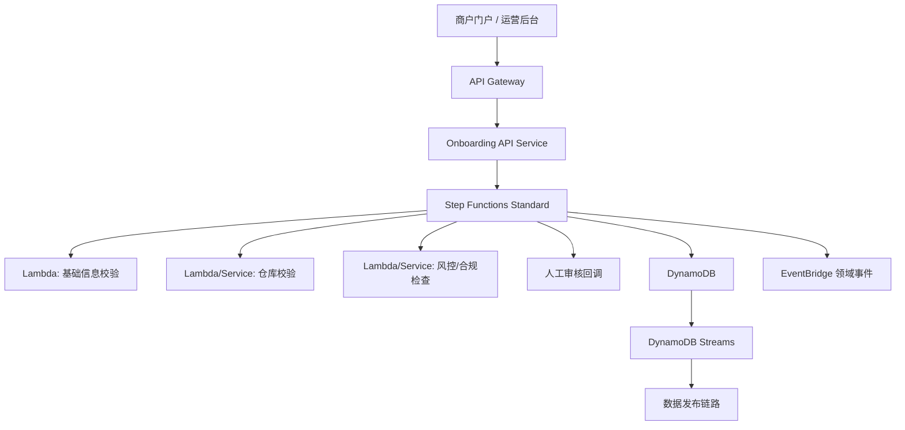

# AWS商户入驻与数据发布系统设计 - 第 1 课：需求澄清与总体架构

## 学习目标（本节结束后你能做到什么）

1. 把“设计一个基于 AWS 的商户入驻系统”这道模糊面试题，先收敛成清晰的问题定义。
2. 说清楚商户入驻场景里的核心实体、核心流程和非功能目标，而不是一上来堆 AWS 组件。
3. 给出一张合理的高层架构图，并解释为什么主流程要用 Step Functions Standard。
4. 能区分交易链路和分析链路，避免把 Redshift、Dashboard 之类的分析系统误放进主交易路径。

## 内容讲解（核心概念，用类比、例子、图示说清楚）

这道题看起来是在问 AWS 技术选型，实际上面试官真正想听的不是“你知道多少 AWS 名字”，而是你能不能把一个业务问题拆清楚，再把服务边界讲清楚。很多人一听到题目里有 Step Functions、Lambda、Glue、Redshift，就条件反射式地开始说：前面 API Gateway，后面 Lambda，数据库 DynamoDB，异步再上 Glue。这样的回答最大的问题是，它没有先回答“这个系统到底要解决什么问题”。

如果把题目翻译成业务语言，本质是这样一个场景：平台要接收商户提交的入驻申请，商户要填写自己的主体信息、联系人信息、结算或经营信息，还要声明自己使用哪些仓库。平台收到申请之后，要按规则做多步校验，有些校验是自动的，有些需要人工参与。整个过程不是一个短接口，而是一个会持续推进、可能跨分钟甚至跨小时的长流程。最终，系统要给出明确结果：通过、拒绝、补资料、待人工审核。与此同时，业务方还希望把这些入驻过程中的状态变化、结果数据同步到数仓，给管理层看 Dashboard，并定期把报表发到邮箱。

所以，这个题天然应该拆成两条链：

1. 交易工作流链路：负责“让一个申请可靠地往前推进”，这是 Step Functions、Lambda、微服务、DynamoDB 关心的部分。
2. 数据发布链路：负责“把交易数据变成分析数据”，这是 DynamoDB Streams、S3、Glue、Redshift、Dashboard、邮件关心的部分。

这两条链千万不要混在一起。因为交易链路追求的是正确性、幂等、可恢复、可审计；分析链路追求的是解耦、低耦合集成、最终一致、可回放。如果你把 Redshift 放进主交易路径，面试官多半会追问你：数仓慢了是不是就不能入驻了？这显然不合理。

先看需求澄清。你可以在面试里先问几件事。第一，入驻是平台型商户入驻，还是仓配网络里的内部商家接入？第二，一个商户是否可以绑定多个仓库？第三，仓库是平台仓、第三方仓，还是两者都有？第四，是否存在人工审核节点？第五，外部依赖有哪些，比如 KYC、黑名单、合规系统、通知系统。第六，分析报表的实时性要求是多少，是分钟级、小时级，还是 T+1。第七，申请提交后，用户是否要实时查看处理进度。你问这些问题，不是为了拖延，而是为了明确核心矛盾：这是一个长事务编排问题，不是一个简单 CRUD 系统。

接着讲核心实体。最少要有四个：

- `MerchantProfile`：商户主体信息，比如企业名称、营业执照号、法人信息、联系人、地址等。
- `WarehouseBinding`：商户和仓库之间的绑定关系，可能是一对多。
- `OnboardingRequest`：一次入驻申请单，记录当前状态、步骤结果、失败原因、重试次数。
- `AuditRecord`：审核记录，记录谁在什么时候做了什么决定。

这里有一个非常重要的工程观念：商户正式档案和入驻申请单不要混成一张表。入驻申请单是“过程态”，正式商户档案是“结果态”。如果你把两者揉在一起，状态会越来越乱，回溯和审计也会非常痛苦。

为什么主流程适合用 Step Functions？因为它最像一个“流程总控”。你可以把它理解成项目经理，而每个 Lambda 或微服务就是一个具体执行任务的小组。项目经理不亲自干活，但它知道流程走到哪一步了、下一步该找谁、失败后怎么重试、超时后怎么报警、人工审核回来后从哪里继续。这个场景和传统单接口调用完全不同。入驻流程里经常会有分支判断、并行校验、等待回调、失败补偿，而这些恰好是状态机擅长的事情。

这里推荐 `Step Functions Standard`，而不是 `Express`。原因不是 Express 不行，而是这道题更强调长流程、可追踪、可审计、人工审核和失败恢复。Standard 适合有状态、持续时间长、需要完整执行历史的业务工作流。Express 更适合高频、短时、事件驱动的轻量流程。如果你能主动讲出这个取舍，面试官会觉得你不是只会背“Step Functions 有两种”，而是真知道该怎么选。

高层架构可以这样组织：

这张图里最容易说错的一点，是谁才是真相源。我的建议是：交易态的真相源是 DynamoDB 里的申请单和商户档案；Step Functions 负责编排，但不是业务真相；EventBridge 负责发布事件，但不是最终状态存储；Redshift 负责分析，但不参与主流程决策。只要你把这个边界讲清楚，后面很多追问都会更容易答。

再说一下为什么很多人会选 DynamoDB。不是因为“都在 AWS 上所以方便”，而是因为这个场景的访问模式很适合 Key-Value/文档型存储：按 `merchantId`、`onboardingId` 查申请状态；按状态查待处理任务；按商户查仓库绑定；按幂等键防重复提交。再加上 Step Functions、Lambda 和 DynamoDB 的组合在 AWS 里运维成本较低，非常适合面试题里的 serverless 风格方案。当然，这不代表 Aurora 不能做。如果你的业务非常依赖复杂联表、多条件检索、事务性报表，Aurora 也是合理选项。但在“入驻长流程 + 事件驱动 + 弹性优先”这个场景下，DynamoDB 是更自然的答案。

最后，用一句话收束这一课：这个系统不是“几个 AWS 服务拼起来”，而是一个“交易工作流系统 + 数据发布系统”的组合。主流程解决入驻推进和状态管理，数据链路解决分析、报表和通知，两者解耦但通过事件连接。

## 小结（3-5 条关键点）

1. 这道题应该先拆成两条链：交易工作流链路和数据发布链路，不能混成一个系统讲。
2. 商户正式档案和入驻申请单要分开建模，一个是结果态，一个是过程态。
3. 主流程更适合用 Step Functions Standard，因为它强调长事务、可审计、等待回调和失败恢复。
4. DynamoDB 可以作为交易态真相源，Step Functions 负责编排，Redshift 只负责分析，不参与主链路决策。
5. 面试里先讲需求澄清和边界，再讲 AWS 组件，表达会更像工程师，而不是产品说明书。

## 检查站：请回答以下问题

1. 为什么这个题一定要拆成交易链路和分析链路两部分？如果不拆，会带来什么问题？
2. 为什么商户正式档案和入驻申请单不建议混在一张表里？
3. 在这个场景下，你会如何向面试官解释 Step Functions Standard 比 Express 更合适？
4. 如果面试官追问“为什么不用 Aurora”，你会怎么回答？
