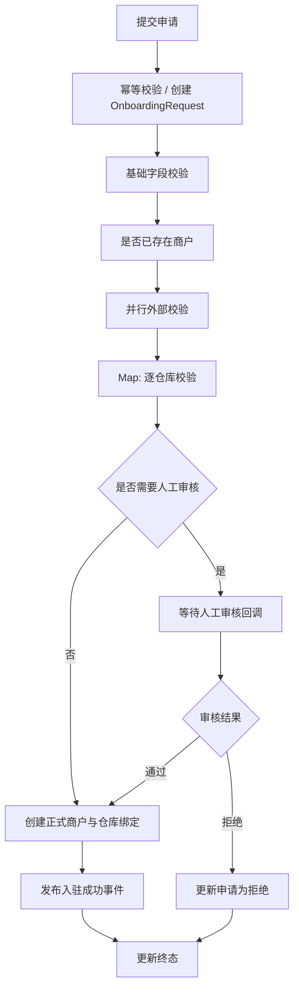

# AWS商户入驻与数据发布系统设计 - 第 2 课：基于 Step Functions 的入驻工作流设计

## 学习目标（本节结束后你能做到什么）

1. 能把商户入驻流程拆成清晰的状态机步骤，而不是只说“Step Functions 调几个 Lambda”。
2. 理解 Choice、Parallel、Map、Retry、Catch、Callback 这些能力在真实业务里分别解决什么问题。
3. 能解释 Step Functions 和微服务的职责边界，知道状态机负责编排，服务负责业务规则。
4. 掌握这个题里最关键的几个工程点：幂等、人工审核、补偿、失败恢复、进度查询。

## 内容讲解（核心概念，用类比、例子、图示说清楚）

如果第一课解决的是“系统大概长什么样”，那这一课解决的是“流程到底怎么往前走”。很多人在讲 Step Functions 时有一个误区：把它理解成“Lambda 的调度器”。这太浅了。更准确地说，Step Functions 是流程编排层。它最重要的价值，不是调函数，而是把一个长流程里的步骤、分支、回滚、等待、错误处理显式化。对于商户入驻这种多步骤、跨系统、部分人工参与的流程，这种显式化非常有价值。

你可以先把正常路径抽出来。一个相对完整的入驻流程，至少会包括下面这些步骤：

1. 创建申请单并做幂等校验。
2. 校验基本字段是否合法，比如商户主体信息、证照字段、联系人信息。
3. 去重检查，判断该主体是否已经入驻或是否存在相同申请。
4. 并行做若干外部检查，比如风控、KYC、黑名单、资质校验。
5. 对商户声明的多个仓库做逐个校验和绑定准备。
6. 判断是否需要人工审核。
7. 人工审核通过后，创建正式商户档案和仓库绑定关系。
8. 发布“商户已入驻”或“商户审核失败”的领域事件。
9. 更新申请单终态，并提供进度查询。

注意，这里面至少有三种不同类型的步骤。第一类是同步的、快速完成的，比如字段校验。第二类是外部依赖调用，比如调用风控或仓库服务。第三类是长等待节点，比如人工审核。把这三类步骤都用普通同步接口串起来，系统会非常脆弱，而且很难观察每一步到底卡在哪。

用状态机来表达会清晰很多：

先讲幂等。面试里如果你不主动提幂等，这类题往往会被追问。因为商户前端很可能会重复点提交，API 网关或客户端也可能超时重试。一个成熟做法是：提交申请时要求调用方带 `idempotencyKey`，服务端先尝试写入一条“幂等键记录”或直接以 `onboardingId` 为唯一执行键。只要同一个幂等键已经存在，就返回已有申请单。这样你就能避免创建出多个相同申请，也能避免重复触发状态机执行。

再讲状态机里的 Choice。Choice 本质上就是业务分叉。比如校验结果通过与否、仓库列表是否为空、是否命中高风险规则、是否需要人工审核，这些都应该显式变成流程里的决策点，而不是藏在某个 Lambda 内部。为什么？因为一旦判断逻辑藏在函数里，流程对面试官和运维人员来说都是黑盒。你很难回答“为什么这单走了人工审核”，也很难解释“为什么这个申请在某一步终止了”。

Parallel 和 Map 则对应两种很常见的业务结构。Parallel 适合多个独立检查并发执行，比如风控、KYC、税务校验、黑名单校验彼此独立，就可以并发做，减少总耗时。Map 适合对一个列表中的多个元素做同构处理，比如一个商户绑定 5 个仓库，那就对 5 个仓库逐个校验、逐个构造绑定结果。这里的面试表达重点不是“我用了 Parallel / Map”，而是“为什么可以并行、为什么要拆列表处理、并发数怎么控制、部分失败怎么处理”。

人工审核是这个题很容易拉开层次的地方。正确思路不是让 Lambda 一直轮询审核结果，而是使用 callback 模式，也就是状态机把任务挂起，等待审核系统在审核完成后回调一个 task token。你可以把它理解成“流程先停在这里，等人处理完再继续”。这比轮询更优雅，因为它节省计算资源，也更符合长流程的自然形态。如果你能在面试里主动说出“人工审核节点使用 task token 回调恢复工作流”，通常会非常加分。

失败处理是第二个关键点。入驻流程里并不是所有步骤都支持传统事务，所以不要讲成“加一个分布式事务就好了”。更合理的表述是 saga 风格补偿。比如正式商户档案已经创建成功，但仓库绑定其中一个失败了，那么你要么设计成“先全部校验通过再一次性落正式态”，要么在失败后执行补偿动作，把已创建的结果撤销或标成待人工处理。这里没有银弹，关键是你要说明：跨服务长流程不能指望数据库事务兜底，只能靠状态机 + 幂等 + 补偿。

Step Functions 里的 Retry 和 Catch 也要讲得具体。不是所有错误都适合重试。网络抖动、下游 5xx、限流，适合有限次指数退避重试；参数非法、业务拒绝、主体重复，这类属于确定性失败，不应该重试，而应该直接进入终态或人工处理。很多候选人会泛泛地说“这里配置重试机制”，但更成熟的说法是“区分瞬时错误和业务错误，瞬时错误做退避重试，业务错误直接落状态并记录原因码”。

再讲一下 Step Functions 和微服务的边界。这个边界说错很容易显得架构观不稳。状态机负责流程推进和状态迁移，不负责承载全部业务规则。比如“某类商户是否需要特殊合规审查”“某仓库类型是否允许绑定”这种领域规则，应该留在对应服务里，由服务返回结果；状态机拿到结果后决定流程下一步怎么走。这样设计的好处是规则变更时不必频繁重写整个状态机，也避免把业务复杂度塞进编排层。

进度查询也是一个必须主动补的点。很多人默认可以直接查 Step Functions 执行历史，但这通常不是面向业务查询的最佳接口。更好的做法是：每个关键节点都把当前申请状态、失败原因、当前步骤名称、更新时间写回 `OnboardingRequest`。这样前台查进度时，直接读 DynamoDB 就行。Step Functions 的执行历史更多是给运维、排障和审计辅助使用，而不是当作业务读模型。

最后，把这一课收成一句可复述的话：商户入驻工作流的核心不是“串起几个 Lambda”，而是把长流程中的分支、等待、失败和恢复显式管理起来。Step Functions 做编排，微服务做规则判断，DynamoDB 存过程态和结果态，进度查询直接读申请单视图。

## 小结（3-5 条关键点）

1. Step Functions 的核心价值是显式管理长流程，不只是调 Lambda。
2. Choice、Parallel、Map、Callback 分别对应业务分支、并行检查、列表处理和人工审核等待。
3. 幂等必须放在提交流程最前面，否则重复提交会制造多个申请单和重复执行。
4. 跨服务长流程要用 saga 思想处理失败，依赖幂等、状态机和补偿，而不是依赖数据库分布式事务。
5. 业务进度查询应该读申请单状态表，而不是把 Step Functions 执行历史当成前台接口。

## 检查站：请回答以下问题

1. 如果商户前端因为超时重试，连续发了三次相同申请，你会怎么保证只创建一个工作流？
2. 为什么人工审核更适合 task token 回调，而不是让 Lambda 轮询？
3. Parallel 和 Map 在这个题里分别应该用在什么地方？两者最核心的区别是什么？
4. 如果“创建正式商户成功，但仓库绑定失败”，你会怎么设计补偿或人工介入流程？
