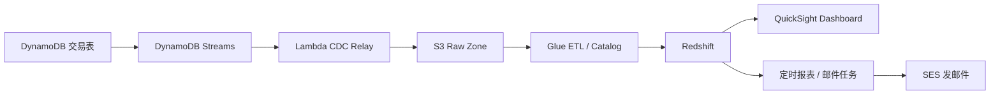

# AWS商户入驻与数据发布系统设计 - 第 3 课：DynamoDB Streams 到 Redshift 的数据发布链路

## 学习目标（本节结束后你能做到什么）

1. 理解为什么交易工作流和数据分析链路必须解耦，以及解耦后各自的职责是什么。
2. 能讲清楚 DynamoDB Streams、Lambda、S3、Glue、Redshift、Dashboard、邮件之间的数据流向。
3. 知道为什么不建议直接从 DynamoDB Streams 把数据同步进 Redshift，而是先落地到 S3。
4. 能回答数据链路中的常见追问：重放、去重、延迟、Schema 演进、报表实时性和邮件发布。

## 内容讲解（核心概念，用类比、例子、图示说清楚）

现在我们从交易链路切到分析链路。这个切换在面试里一定要讲清楚，因为很多候选人会默认“业务数据已经在 DynamoDB 里了，那就直接给报表用”。这在真实系统里通常不合适。原因很简单：交易库的设计目标是支撑主业务读写，它的数据模型是围绕业务访问路径设计的；分析库的设计目标是做聚合、筛选、趋势分析、漏斗和报表，访问模式完全不同。如果强行让 DynamoDB 直接扮演分析库，会出现查询复杂、成本不可控、历史分析困难等问题。

所以，正确思路是把交易数据增量采集出来，进入单独的数据发布链路。你题目里提到的“DynamoDB 里有监听的东西”，更准确的 AWS 表达就是 `DynamoDB Streams`。只要交易表开启 Stream，每次写入、更新、删除都会生成变更事件。这个事件流就是 CDC，也就是 Change Data Capture，变更数据捕获。它不是报表系统本身，但它提供了一个低耦合的增量入口。

很多人在这里会马上说：“那我用 Lambda 订阅 Streams，然后直接写 Redshift。”这个方案在非常简单的场景里不是绝对不行，但对于面试题而言，最好不要把它讲成主方案。为什么？第一，Streams 保留期有限，不适合作为长期回放源。第二，Redshift 是分析系统，不是为了接收高频小批量行级写入而设计的，直接写入容易带来批次碎片和运维复杂度。第三，一旦 Redshift 或转换逻辑出问题，你需要一个可重放的中间层，否则就很难补数据。

因此，更稳妥的方案是：`DynamoDB Streams -> Lambda CDC Relay -> S3 Raw Zone -> Glue ETL -> Redshift -> QuickSight/邮件`。

这条链路可以把它理解成“先把原始快递都收到中转仓，再统一分拣和配送”，而不是每来一件就直接送到终点。S3 在这里扮演的就是原始中转仓。Streams 上的每条变更事件先经过一个轻量 Lambda 做标准化处理，再按时间和业务主题落到 S3 的 raw 层。之后 Glue 再定时或准实时地把原始增量转成适合分析的事实表和维度表，最后导入 Redshift 做面向报表的查询。

先说 Lambda CDC Relay 该做什么。它不应该做很重的聚合计算，更不应该承载复杂业务规则。它的职责应该是：

- 读取 DynamoDB Stream 记录。
- 把 `INSERT`、`MODIFY`、`REMOVE` 标准化成统一事件格式。
- 补充事件时间、业务主键、表名、版本号、事件类型。
- 把原始事件落到 S3 分区目录，比如按日期、小时、事件类型分区。

这样设计的价值非常大。第一，S3 上保留了原始事件，可以回放。第二，Glue 作业失败时，可以重新消费原始数据，不依赖 Streams 的短保留。第三，后续如果除了 Redshift 还想给别的分析系统或机器学习任务使用，也可以直接复用 S3 原始层。

图可以这样画：

接着说 Redshift 里的数据组织。你最好不要把它讲成“把 DynamoDB 表原样搬过去”。分析库一般会按主题建模。比如：

- 商户维表：商户属性、行业、地区、类型、当前状态。
- 仓库维表：仓库类型、区域、服务能力。
- 入驻事实表：申请提交时间、审核通过时间、拒绝时间、处理时长、审核结果。
- 步骤事件事实表：每个状态变化的时间点，用于漏斗和 SLA 分析。

这样你就能做很多管理层真正关心的指标：每日新增商户数、通过率、拒绝率、平均审核时长、人工审核占比、每个仓库类型的绑定覆盖率、不同区域商户入驻转化漏斗等。面试官如果听到你能主动从数据模型层面区分“交易表”和“分析主题表”，会觉得你的系统观更完整。

再说实时性。你题目里提到要“发布到 Dashboard，再推送相关人的邮箱”。这里不要轻易承诺“秒级实时”。更工程化的表达是：交易流程本身的状态查询走 DynamoDB，保证及时；分析报表通常接受分钟级到小时级延迟。如果是运营大盘，5 到 15 分钟刷新通常足够；如果是日报、周报，T+1 或每小时汇总更常见。你需要根据业务目标讲清楚 SLA，而不是默认所有数据都必须实时。

邮件推送的方案也可以讲得有层次。如果收件人本身就在 BI 体系里，用 Dashboard 工具的定时报表能力最省事；如果需要发给外部邮箱或非 BI 用户，可以用 Lambda 定时从 Redshift 查询汇总结果，再通过 SES 发邮件。重点不是一定选哪一个，而是说明：邮件只是发布形式，它依赖的上游是已经清洗好的分析数据，而不是直接去扫交易表。

再补三个很常见的追问。

第一个是去重。因为流式链路天然可能发生重试和重复投递，所以 Glue 或入仓逻辑里最好保留事件唯一键，例如 `eventId` 或“主键 + 版本号 + 变更时间”。在事实表加工时，以这些字段做幂等处理，避免重复计数。

第二个是 Schema 演进。DynamoDB 是比较灵活的，字段可能不断增加。如果你没有中间原始层，直接推 Redshift，字段变更会很难管理。有了 S3 raw 和 Glue catalog 之后，就可以更稳妥地处理新增字段、默认值、历史兼容问题。

第三个是延迟与告警。数据链路虽然不在主交易路径上，但也不能“挂了就挂了”。你至少要监控：Streams 积压、Lambda 失败率、S3 落地延迟、Glue 作业成功率、Redshift 装载延迟、Dashboard 刷新是否超时。因为管理层最容易问的不是“你们用了什么服务”，而是“今天为什么报表不更新了”。

所以，这一课最核心的思路是：交易数据通过 CDC 进入一个可回放的数据湖入口，再经由 ETL 进入分析仓库，最后服务于 Dashboard 和邮件。这样既保护了主交易系统，也给分析链路留足了演进空间。

## 小结（3-5 条关键点）

1. DynamoDB Streams 是交易表增量变化的入口，但不适合作为长期回放和复杂分析的终点。
2. 更稳妥的数据发布链路是 Streams 到 Lambda 标准化，再落 S3，之后用 Glue 加工进 Redshift。
3. Redshift 应该存分析主题模型，而不是简单复制 DynamoDB 的交易表结构。
4. 交易状态查询追求实时，报表和邮件更适合分钟级或小时级最终一致，不要混用 SLA。
5. 数据链路必须考虑重放、去重、Schema 演进和延迟告警，否则上线后可维护性很差。

## 检查站：请回答以下问题

1. 为什么不建议把 DynamoDB Streams 的事件直接持续写进 Redshift 作为主方案？
2. Lambda CDC Relay 在这条链路里最合适承担哪些职责，哪些职责不该放进去？
3. 如果 Glue 作业失败了两小时，你为什么还能补数据？前提是什么？
4. 交易查询和 Dashboard 查询为什么不应该共用一套数据库或同一条 SLA？
