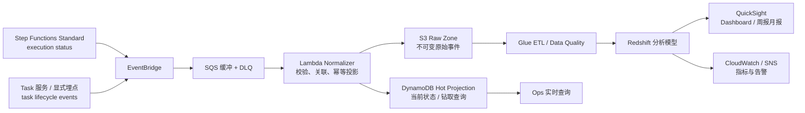

# AWS商户入驻与数据发布系统设计 - 第 6 课：DF Onboarding 工作流可观测性与 BI 报表平台复盘

## 学习目标（本节结束后你能做到什么）

1. 能把 Amazon Direct Fulfillment（DF）的 vendor / warehouse onboarding 项目定位为一个“工作流可观测性 + 分析报表”平台，而不是单纯罗列 AWS 服务。
2. 能讲清楚 execution 级监控和 task 级业务埋点的边界，避免把 Step Functions 的 EventBridge 原生能力讲错。
3. 能从事件采集、热查询、可回放存储、ETL、数仓和 BI 六层完整说明设计方案。
4. 能围绕乱序去重、Schema 演化、增量入仓、成本和生产故障回答追问。
5. 能说明如果重新设计，会如何从 T+1 报表演进到准实时运营与主动诊断。

## 一、项目定位与业务背景

这个项目可以这样开场：

> 在 Amazon Direct Fulfillment 业务中，vendor 及其 warehouse 的 onboarding 要经过资料校验、合规审核、SKU 接入、carrier 对接、SLA 配置、税务或付款设置等多步处理。流程由 AWS Step Functions 编排，跨多个服务异步协作，可能持续数小时到数天。项目目标是把原本难以分析的执行过程沉淀成可查询、可聚合、可告警、可做报表的数据资产。

这里的数字不要凭空写死。面试或简历中可以留出真实口径后补：

| 指标 | 待确认的真实数据 |
| --- | --- |
| 接入的 state machine 数量 | `__` 个 |
| 单个 onboarding 平均 task 数 | `__` 个，例如确认后再写 20 到 40 |
| 日均 onboarding execution 数 | `__` |
| 峰值 task event TPS | `__` |
| 报表使用团队 / 用户数 | `__` |
| SLA 或排障耗时改善 | `__` |

不要把本项目和交易真相源混淆。`OnboardingRequest` 与正式 vendor / warehouse 状态仍应由业务系统保存；本平台采集工作流与业务步骤事件，服务于运营查询、瓶颈分析、审计、报表和告警。也就是说，它是 observability / analytics read model，不替代业务写模型。

## 二、为什么需要这个平台

业务痛点可以归纳为四类：

1. **执行过程是黑盒**：Ops 或 PM 想知道某个 vendor 卡在哪一步、等待多久，往往只能逐条打开 Step Functions 执行记录或到多个服务里翻日志。
2. **SLA 无法量化**：团队无法稳定回答过去 30 天的通过率、端到端 P50/P95 耗时、各步骤耗时、失败原因 Top N 或不同 vendor / region 的差异。
3. **历史与分析能力不足**：工作流执行历史不是长期分析仓库，Standard workflow 完成后的执行历史可通过 API 获取至多 90 天，且不适合反复做聚合报表。
4. **报表和运营响应滞后**：业务方需要周报、月报以及异常趋势告警，例如某 region 仓库接入停滞、某审核步骤 P95 突增或失败率异常上升。

这个项目的核心矛盾可以概括成一句话：

> 在不侵入或拖慢 onboarding 主流程的前提下，把跨服务长工作流转化为可重放的事件数据和可运营的分析指标。

## 三、一个必须讲准确的 AWS 能力边界

原始构想里最容易被追问的点，是“Step Functions 通过 EventBridge 自动发出 `TaskStateEntered` / `TaskStateExited`”。这个说法需要校正。

### 1. 原生 execution 级事件

Step Functions **Standard Workflows** 会自动向 EventBridge 发送 `Step Functions Execution Status Change` 事件，例如 `RUNNING`、`SUCCEEDED`、`FAILED`、`TIMED_OUT` 和 `ABORTED`。AWS 文档同时说明：

- Express Workflows 不自动发送这类 EventBridge 服务事件，通常通过 CloudWatch Logs 监控。
- Step Functions 直接发往 EventBridge 的服务事件属于 best-effort delivery，并且可能乱序。
- EventBridge 事件中的 escaped input / output 组合过大时可能不包含完整 payload；文档给出的边界是 248 KiB，并可通过 `inputDetails` / `outputDetails` 判断是否包含。

因此，execution 级事件适合做总体吞吐、终态成功率和 execution 状态监控，但不能单靠它构建完整、强可靠的 task 明细事实表。

### 2. task 级事件怎么拿

要分析“卡在哪个 task、每个步骤耗时多久”，需要显式产生业务步骤事件。实际有两种合理路径：

| 方案 | 做法 | 适用场景 | 取舍 |
| --- | --- | --- | --- |
| 业务服务写状态事件 | 每个任务执行服务在开始、成功、失败时写步骤状态或发布业务事件，再经 DynamoDB Streams / EventBridge 采集 | 已有可靠业务状态表，强调业务真相 | 事件语义最可靠，但要求服务侧接入 |
| 状态机显式埋点 | 在关键 Task 前后调用 EventBridge `PutEvents` 集成，发布自定义 lifecycle event | 希望编排层统一补埋点 | 状态机更冗长；埋点本身也要处理失败 |

推荐以业务步骤状态事件为主、execution status 事件为补充：业务侧描述“发生了什么”，Step Functions 描述“编排执行最终怎样结束”。两类数据以 `executionArn`、`onboardingId` 和 `correlationId` 关联。

## 四、推荐总体架构

与“Lambda 直接把事件写 DynamoDB，Glue 再扫描 DynamoDB”相比，生产化方案应尽早保留一份可回放的 S3 raw 事件。DynamoDB 更适合承担热查询投影，而不是成为唯一历史明细来源。



每层职责如下：

| 层次 | AWS 组件 | 主要职责 |
| --- | --- | --- |
| 事件产生 | Step Functions、业务 task 服务 | execution 终态事件与 task 业务生命周期事件 |
| 路由与削峰 | EventBridge、SQS、DLQ | 解耦消费者、吸收峰值、保存处理失败事件 |
| 标准化与热投影 | Lambda、DynamoDB | 字段抽取、去重、当前步骤查询、失败单钻取 |
| 原始存储 | S3 Raw Zone | 按时间 / 事件类型落不可变事件，支持回放和回填 |
| 加工与建模 | Glue（PySpark）、Glue Data Catalog | 清洗、关联、数据质量检查、事实维度建模 |
| 分析与展示 | Redshift / Redshift Serverless、QuickSight | 聚合查询、趋势报表、业务切片和发布 |
| 运维 | CloudWatch、SNS / PagerDuty / Slack | 采集失败、积压、ETL 延迟、SLA 异常告警 |

### 为什么中间加 SQS 和 S3

- `EventBridge -> SQS -> Lambda` 让 Lambda 以 batch 消费并平滑应对高峰，DLQ 也更便于运维重放。
- S3 raw 保存事件原貌，Glue 逻辑变更、Redshift 表变更或新增分析维度时，都能从原始层回算。
- DynamoDB 只服务近期明细查询与当前态，不承载所有长期分析扫描，成本和职责更清晰。

如果现有系统已经采用 `DynamoDB Streams -> S3 -> Glue -> Redshift` 采集业务状态变化，也可以继续沿用；它捕获的是业务状态表 CDC，而 EventBridge execution status 用于补充工作流终态和运维告警。

## 五、事件与数据模型

### 1. 标准事件结构

任务生命周期事件至少保留下面字段：

```json
{
  "event_id": "uuid-or-deterministic-id",
  "event_type": "TASK_STARTED | TASK_SUCCEEDED | TASK_FAILED",
  "event_time": "UTC timestamp",
  "ingested_at": "UTC timestamp",
  "onboarding_id": "business request id",
  "vendor_id": "vendor id",
  "warehouse_id": "nullable warehouse id",
  "execution_arn": "step functions execution arn",
  "state_machine_arn": "state machine arn",
  "state_machine_version": "business/workflow version",
  "task_name": "TaxVerification",
  "attempt": 1,
  "status": "RUNNING | SUCCEEDED | FAILED",
  "error_code": "nullable",
  "error_message": "nullable sanitized summary",
  "region": "business region",
  "raw_payload_s3_uri": "s3://.../payload.json"
}
```

两个安全边界要主动说明：

- task input / output 可能包含税务、付款或联系人敏感字段，分析层只保留允许使用的维度与脱敏错误摘要，原始 payload 要做 KMS 加密、IAM 最小权限和保留期治理。
- 大 payload 统一传 S3 reference，不把完整文档在 Step Functions、EventBridge 或 DynamoDB item 里来回传递。

### 2. DynamoDB 热查询投影

核心访问模式通常是：

- 按 `executionArn` 查询一个 onboarding 的所有步骤、顺序和失败原因。
- 按 `onboardingId` 或 `vendorId` 查询当前状态。
- 按状态、日期、region 或 workflow 类型筛选当前失败 / 超时项目，供 Ops 处理。

可以将 execution 钻取明细设计为：

```text
PK = EXEC#<executionArn>
SK = TASK#<taskName>#ATTEMPT#<attempt>
```

这能高效读取一次执行下的步骤记录。但要明确：增加 sort key **不会**把同一个 `executionArn` 的写入分散到不同 partition。若每个执行仅几十个步骤，这种聚合读取模型通常可接受；如果单次执行产生大量高频事件，应引入分片键或把高吞吐 raw 写入交给 S3 / stream，再异步物化查询视图。

为 Ops 工作队列设计 GSI 时，可以按状态与时间桶加分片，避免所有失败项落到同一个热 key：

```text
GSI1PK = STATUS#<status>#DATE#<yyyy-mm-dd>#SHARD#<00..15>
GSI1SK = <updated_at>#<executionArn>
```

### 3. Redshift 分析模型

数仓不应只是复制 DynamoDB item，而应围绕指标建模：

| 表 | 粒度 | 关键字段 / 用途 |
| --- | --- | --- |
| `task_execution_fact` | 每个 execution 的每个 task attempt 一行 | 开始、结束、耗时、状态、错误码、SLA 是否达成 |
| `onboarding_execution_fact` | 每次 onboarding execution 一行 | 端到端耗时、终态、人工审核标记、成功 / 失败 |
| `vendor_dim` | 每个 vendor 或历史版本一行 | vendor 类型、业务维度、脱敏属性 |
| `warehouse_dim` | 每个 warehouse 或历史版本一行 | region、warehouse 类型、carrier 维度 |
| `state_machine_dim` | 每个 workflow 版本一行 | state machine 名称、版本、生效时间 |
| `date_dim` | 每个自然日一行 | 日 / 周 / 月 / 财季与展示时区 |

QuickSight 可以基于这些表提供：

- onboarding 吞吐量、通过率与失败率趋势。
- 端到端耗时及 task 耗时的 P50 / P95 分布。
- 失败原因 Top N 与失败步骤漏斗。
- vendor 类型、warehouse region、workflow version 的切片比较。
- SLA 超时数量和当前卡住的申请列表。

## 六、最有价值的技术挑战

### 1. 重复、乱序与可恢复的一致性

系统要按照可能重复、可能乱序、甚至某些 best-effort service event 缺失来设计：

- 自定义 task event 使用稳定的 `event_id`，原始事件落 S3 时保持不可变。
- DynamoDB 投影用 conditional `PutItem` / `UpdateItem` 或版本条件更新，只有更晚的状态才覆盖当前态。
- `TASK_SUCCEEDED` 先于 `TASK_STARTED` 到达时，分别保存已知字段，后到事件补齐开始时间，不能依赖“先读再整行覆盖”。
- 对 execution 终态与 task 汇总做周期 reconciliation，例如检查“execution 已结束但仍有 RUNNING task”的异常记录。

这里还有一个很容易说错的细节：`BatchWriteItem` 不支持每个写请求的条件表达式。因此，SQS 可以让 Lambda 批量接收事件以减少 invocation，但需要条件幂等的当前态更新不能直接依赖 `BatchWriteItem`；应使用条件写，必要时用事务写维持去重记录与投影的一致性。

### 2. Schema 演化与 workflow version

不同 state machine 的 input / output 结构不同，workflow 升级还可能新增步骤或重命名 task。解决思路是：

- raw 层保留原始 JSON 与 `schema_version` / `state_machine_version`。
- curated 层只提炼稳定的通用事实字段；类型特有字段进入扩展表或以 Redshift `SUPER` / JSON 形式延迟解析。
- 维护 task mapping，例如把旧版 `ValidateTax` 与新版 `TaxVerification` 映射到统一分析步骤。
- 新 state machine 通过配置注册关键 task、业务维度、SLA 和脱敏规则，降低每次接入都改 Lambda / Glue 代码的成本。

### 3. 增量 ETL 与跨日长流程

工作流可能今天开始、三天后结束，因此同一 execution 会在多个加工窗口里不断更新。可以选择两种增量源：

| 增量源 | 优点 | 注意点 |
| --- | --- | --- |
| 持续写入的 S3 raw events | 延迟低、最适合事件事实和回放 | 要管理事件去重、分区和小文件合并 |
| DynamoDB incremental export to S3 | 无 DynamoDB RCU 消耗，对热表影响小 | 需要启用 PITR；适合批量快照 / 状态增量，而不是秒级告警 |

Glue 作业按 `process_date` 与事件时间窗口处理增量，先写 staging 表，再将受影响 execution 的最新汇总合并到事实表。需要注意的是，Amazon Redshift 当前支持 `MERGE`；面试里可以说使用 staging + `MERGE` 做幂等更新，而不必再笼统地说“Redshift 没有 UPSERT，只能 DELETE + INSERT”。

### 4. 时区、SLA 与指标口径

时间口径不一致会直接让报表失去可信度：

- 数据存储和耗时计算全部使用 UTC timestamp。
- 展示层按业务需求转换到 PST/PDT 或其他区域时区，并正确处理夏令时。
- SLA 明确定义是自然耗时、工作时段耗时，还是排除“等待 vendor 补材料 / 等待人工审核”的可暂停时钟。
- 数据字典固定“成功率分母”“超时定义”“重试 attempt 如何计数”等规则，避免周报和 dashboard 得出不同答案。

### 5. 成本与负载隔离

- SQS batch consumer 减少 Lambda 高频单事件调用并吸收短时流量峰值。
- DynamoDB 用 TTL 清理热投影中的过期明细，长期事件保留在低成本 S3。
- Glue 读取分区化的 S3 增量，不每天全表扫描 DynamoDB。
- Redshift 使用 WLM 隔离 ETL 与 BI 查询，或者在工作负载不稳定时评估 Redshift Serverless。
- 若查询以历史扫描和低频报表为主，可评估 S3 + Glue Catalog + Athena / Iceberg + QuickSight，减少常驻数仓成本。

## 七、生产环境问题与应对

| 问题 | 影响 | 应对方式 |
| --- | --- | --- |
| EventBridge 到目标投递失败 | event 未被消费，指标缺失 | 为 target 设置 SQS DLQ 和 CloudWatch alarm；EventBridge 默认对可重试交付失败重试最长 24 小时、最多 185 次；提供 replay 流程 |
| Step Functions 原生状态事件缺失或乱序 | execution 报表与任务事实不匹配 | 不把 best-effort 原生事件当作唯一 task 真相；业务状态事件 + 定期 reconciliation |
| Lambda 正常接收但业务处理失败 | 投影或 raw 数据遗漏 | 不吞异常；SQS visibility timeout、重试与 DLQ；记录 poison event 处理结果 |
| DynamoDB throttling / 热 key | Ops 查询或状态投影延迟 | 合理分片 GSI、on-demand 或 auto scaling、监控 throttled requests、以 SQS 削峰 |
| Glue 作业失败或超时 | 当天报表缺数 | 作业幂等、按分区重跑、失败告警、保留 raw / staging 数据用于 backfill |
| Redshift ETL 与 BI 查询争抢资源 | 仪表盘慢或装载延迟 | WLM 隔离队列、批量 `COPY` / `MERGE`、评估 RA3 或 Serverless |
| payload 超限或包含敏感信息 | 采集失败或合规风险 | 大对象传 S3 reference；加密与脱敏；限制 BI 层暴露字段 |
| 工作流定义升级 | 历史趋势断裂、指标变动 | 引入版本维度和 mapping 配置；回归检查 SLA / dashboard |
| 新增报表维度需要历史数据 | 半年历史无法重算 | S3 raw 长期留存；Glue 参数化日期区间；Redshift `MERGE` 完成回填 |

## 八、如果重新设计：演进方向

### 1. 从 T+1 到准实时运营

如果当前是每日 Glue 批处理，业务仍无法立即回答“现在有多少 onboarding 卡住”。可以保留批处理作为审计与历史汇总，同时增加实时路径：

```text
EventBridge / DynamoDB Streams -> Kinesis Data Streams -> Flink 实时聚合
                                           -> DynamoDB / OpenSearch 当前态
                                           -> CloudWatch Metrics + Alert
```

QuickSight 继续看趋势与管理报表，Ops 页面或告警系统消费实时当前态。这比强行让一张 BI dashboard 同时承担实时排障与历史分析更清晰。

### 2. 数据湖和开放表格式

当历史事件增长而查询频次并不持续很高时，可将 S3 作为中心存储，使用 Glue Catalog + Athena 查询，并进一步用 Iceberg 管理 schema evolution、幂等合并和 time travel。Redshift 可保留给高频、低延迟 BI workload，或通过 Spectrum 访问湖中数据。

### 3. 主动告警与异常检测

基础版本先做规则告警：

- 某 task 的失败率连续窗口超过阈值。
- 当前 `RUNNING` 且超过 SLA 的 execution 数量骤增。
- SQS backlog、DLQ 消息、Glue delay 或 dashboard refresh 超阈值。

进一步可以基于历史时序建立异常基线，例如监控某 state machine / region 的 P95 耗时突增；是否需要模型化异常检测，应以误报成本和运营使用情况决定，而不是为了引入机器学习。

### 4. 端到端 trace 与诊断辅助

- 通过 AWS X-Ray 或 OpenTelemetry 将 onboarding correlation id 贯穿工作流和下游 API 调用，使“卡在 task”进一步定位为“卡在哪个服务调用”。
- 将脱敏后的历史失败原因、处置 runbook 和已解决案例建立知识检索能力，帮助 Ops 找相似故障及处置建议。
- 自然语言查询可以作为 BI 入口的补充，例如查询“上周卡在 tax verification 超过 24 小时的 vendor”，但回答必须受数据权限与指标口径约束。

## 九、面试表达模板

### 1 分钟项目概述

> 我负责的是 Amazon Direct Fulfillment vendor 与 warehouse onboarding 的工作流可观测性和 BI 报表能力。Onboarding 由 Step Functions 编排，跨合规、仓库、carrier 和付款等服务，持续时间可能从小时到天。过去 Ops 很难判断一单卡在哪一步，也无法稳定统计 SLA 与失败瓶颈。我的设计将 execution 终态事件和业务 task 生命周期事件统一采集，经 EventBridge、SQS 和 Lambda 标准化后，一路物化到 DynamoDB 做近期钻取查询，一路落 S3 raw 作为可回放历史，再由 Glue 建模进入 Redshift，供 QuickSight 做耗时、失败率和 region / vendor 切片分析。关键难点是重复乱序、workflow schema 演化和跨日 execution 的增量合并，因此我用条件幂等更新、版本映射和 staging + Redshift MERGE 保证数据可靠，同时以 DLQ、告警和回放支持生产恢复。

### 简历 bullet 模板（填入真实数字后使用）

- 设计并交付 DF vendor / warehouse onboarding 工作流可观测性平台，覆盖 `__` 个 Step Functions workflow、日均 `__` 次 execution，将 task 级耗时和失败原因沉淀至 QuickSight dashboard，帮助 `__` 名运营 / PM 用户定位 SLA 瓶颈。
- 搭建 `EventBridge/SQS -> Lambda -> DynamoDB + S3 -> Glue -> Redshift` 数据链路，通过幂等投影、raw event 回放和增量 `MERGE` 处理重复乱序与跨日 execution 更新，将报表延迟控制在 `__`，数据缺失率降低 `__`。
- 建立 DLQ replay、ETL 重跑、workflow version mapping 与 CloudWatch 告警机制，使 onboarding 失败排障耗时从 `__` 降至 `__`，并支持 `__` 个月历史数据回填。

没有真实指标时，不要在简历上编造吞吐、改善比例或用户规模；可以在口头表达里把数字标明为“容量设计假设”。

## 十、官方文档核验点

- [Automating Step Functions event delivery with EventBridge](https://docs.aws.amazon.com/step-functions/latest/dg/eventbridge-integration.html)：Standard workflow 自动产生 execution status change 事件、事件可能乱序、payload inclusion 边界。
- [Add EventBridge events with Step Functions](https://docs.aws.amazon.com/step-functions/latest/dg/connect-eventbridge.html)：在工作流中通过 `PutEvents` 显式发自定义事件。
- [Choosing workflow type in Step Functions](https://docs.aws.amazon.com/step-functions/latest/dg/choosing-workflow-type.html)：Standard workflow 完成后执行历史的可检索时间窗口。
- [How EventBridge retries delivering events](https://docs.aws.amazon.com/eventbridge/latest/userguide/eb-rule-retry-policy.html)：target delivery 重试与 DLQ 行为。
- [Partitions and data distribution in DynamoDB](https://docs.aws.amazon.com/amazondynamodb/latest/developerguide/HowItWorks.Partitions.html)：partition key 与 sort key 的分布和检索语义。
- [BatchWriteItem](https://docs.aws.amazon.com/amazondynamodb/latest/developerguide/API_BatchWriteItem_v20111205.html)：batch write 不支持逐项条件表达式。
- [Requesting a table export in DynamoDB](https://docs.aws.amazon.com/amazondynamodb/latest/developerguide/S3DataExport_Requesting.html)：启用 PITR 后可向 S3 做 full / incremental export。
- [MERGE - Amazon Redshift](https://docs.aws.amazon.com/redshift/latest/dg/r_MERGE.html)：使用 staging source 合并增量事实数据。

## 小结（3-5 条关键点）

1. 这个项目的定位是 onboarding 工作流的可观测性与分析平台，业务系统仍是真相源。
2. Step Functions 自动发送的是 Standard workflow 的 execution status change；task 级分析必须依靠显式业务事件或埋点。
3. DynamoDB 负责热查询投影，S3 raw 负责可回放历史，Glue 与 Redshift 负责分析建模，QuickSight 负责消费指标。
4. 技术含金量主要体现在重复乱序处理、跨日增量合并、Schema / workflow version 演进、SLA 口径和生产恢复能力。
5. 演进路线应先补实时当前态与主动告警，再根据成本和查询模式评估数据湖、trace 与诊断辅助能力。

## 检查站：请回答以下问题

1. 为什么不能说 Step Functions 会原生把每个 task 的进入 / 退出事件自动发送给 EventBridge？你的 task 事实数据从哪里来？
2. 为什么 DynamoDB 的 `executionArn + sort key` 设计适合单次执行钻取，却不能被描述为解决热 partition 的方案？
3. 如果一条 `TASK_SUCCEEDED` 比 `TASK_STARTED` 更早到达，你如何保证最终耗时统计仍然正确？
4. 为什么 S3 raw 层对于新增维度、补数和 Glue 故障恢复都很重要？
5. 如果业务方要求从 T+1 变为“十分钟内发现异常积压”，你会新增哪些组件，又会保留哪些批处理能力？
