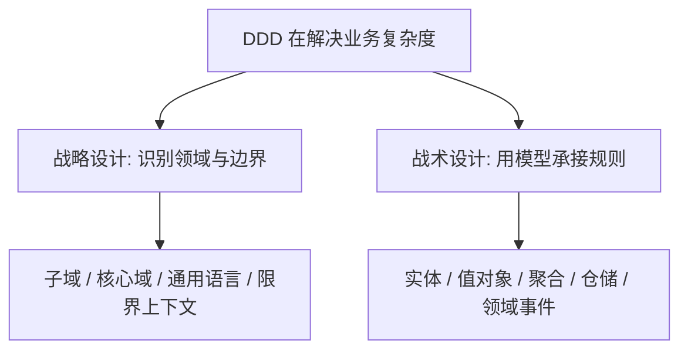

# DDD - 第 1 课：什么是 DDD 与为什么需要它

## 学习目标（本节结束后你能做到什么）

- 用自己的话解释 DDD 到底在解决什么问题，而不是把它理解成一组时髦术语。
- 区分“技术复杂”与“业务复杂”这两类不同的复杂度来源。
- 理解 DDD 为什么特别适合规则多、概念多、协作成本高的后端系统。
- 说清楚 DDD、CRUD、三层架构、微服务之间不是一回事。
- 初步建立一个判断标准：什么场景值得用 DDD，什么场景不值得硬套。

## 内容讲解（核心概念，用类比、例子、图示说清楚）

### 1. 先把常见误解拆掉：DDD 不是“把类写复杂”

很多工程师第一次接触 DDD，往往是从代码片段开始的：  
看到 `OrderAggregate`、`Money`、`DomainEvent`、`Repository` 这些类名，然后形成一个印象: DDD 就是“对象更多、分层更厚、写法更学院派”。

这个印象只抓到了表面，甚至可以说是最容易学偏的地方。

DDD 的核心不是“类怎么命名”，也不是“目录怎么分层”，而是下面这件事：

**当业务规则本身已经变复杂时，代码能不能直接表达业务概念，并把关键规则守在模型内部，而不是散落在 controller、service、dao、SQL、if-else 和各种脚本里。**

你可以把 DDD 想成一种“翻译系统”。

- 一边是真实业务世界：订单、支付、退款、库存锁定、结算周期、优惠叠加、风控校验。
- 另一边是软件世界：类、方法、数据库表、消息、接口、任务。

DDD 试图做的事，就是让这两边的映射尽量清晰、稳定、可协作。  
如果业务人员说“已支付订单不能直接取消，必须走退款申请”，那这条规则最好能在模型里被清楚表达，而不是只存在于需求文档或某个老同事脑子里。

### 2. 为什么我们会需要 DDD：很多系统难，不是难在技术，而是难在业务

后端工程师很容易把“系统复杂”理解成高并发、高可用、分布式事务、消息堆积、缓存击穿。  
这些当然是复杂度，但它们属于**技术复杂度**。

还有一类复杂度经常更难处理，叫**业务复杂度**。  
它来自下面这些东西：

- 规则很多，而且彼此会相互影响
- 规则经常变化
- 同一个词在不同团队口中意思不一样
- 一个动作表面简单，背后其实有大量约束条件
- 系统不是没人会写，而是谁都能写一点，但没人能完整说清楚

比如“下单”这件事，表面看就是插一条订单记录。  
但真正做过业务的人知道，它可能包含：

- 订单状态机
- 库存预占与释放
- 优惠券冻结与回滚
- 支付超时
- 部分发货
- 售后逆向单
- 风控拦截
- 履约时效判断

这时系统真正困难的地方，往往不是“写一条 SQL”，而是“这些规则到底应该放在哪里，怎样保证以后改规则时不会牵一发而动全身”。

DDD 就是在处理这种问题。

### 3. DDD 关心的“领域”到底是什么

这里的“领域”，你可以先理解成：  
**业务问题发生的那片世界，以及这片世界里的概念、关系、规则和约束。**

例如电商里的订单域，里面关心的不是 Redis 怎么配，而是：

- 什么叫订单创建成功
- 什么叫待支付、已支付、已发货、已完成、已关闭
- 什么情况下允许取消
- 什么情况下必须退款而不是取消
- 库存扣减是在下单时还是支付时
- 优惠金额如何分摊到子单

这些东西才是“领域知识”。

也就是说，领域不是技术名词集合，而是业务语义集合。  
DDD 的第一步，不是设计数据库表，而是先把这些业务语义找出来，并让团队在同一套语言下讨论它们。

### 4. 没有 DDD 时，代码通常会怎么坏掉

一个没有领域建模意识的系统，最常见的演化路径是这样的：

1. 一开始需求简单，大家先快速写个 `OrderService.create()`。
2. 后来要加库存、优惠券、风控、履约校验，于是继续往 `OrderService` 里塞逻辑。
3. 再后来不同入口都能改订单状态，controller、job、消息消费者都各自写一套判断。
4. 最后没有人真正为规则负责，大家都知道“这里不能乱改”，但没人敢说规则全貌是什么。

这种代码不是不能跑，而是会出现几个明显症状：

- 业务规则散落
- 方法很长，判断很多
- 同一规则重复出现
- 改一个需求时，不知道会影响哪几个接口
- 业务方说的“取消”“关闭”“退款”“逆向”在代码里混成一团

这时候问题已经不是“代码风格不好”，而是**业务概念没有被模型承接住**。

### 5. DDD 的核心思路：让业务规则回到业务模型

DDD 有很多术语，但你先抓住四个核心想法就够了。

#### 5.1 先关注核心业务，而不是平均用力

不是所有模块都值得同样精细地设计。  
有些部分只是通用管理后台、字典配置、导出查询，可能简单 CRUD 就够了。  
有些部分直接决定业务竞争力，比如定价、履约、风控、结算规则，这些才值得重点建模。

这就是 DDD 的一个重要态度：**把建模精力优先放在核心域。**

#### 5.2 用统一语言沟通，而不是各说各话

如果产品说“冻结库存”，研发 A 理解成“写库存冻结表”，研发 B 理解成“扣减可售库存”，测试理解成“预占但可回滚”，那后面一定会乱。

DDD 强调团队要形成**通用语言**。  
语言不是写在墙上的词典，而是体现在会议讨论、接口命名、类命名、事件命名里的共同语义。

#### 5.3 用边界隔开语义，不要强行全局统一

同一个词在不同业务里可能不是一个意思。  
“订单”在交易域里是购买合同，在履约域里更像配送任务，在售后域里又会关联逆向单。

DDD 不追求整个公司只有一个“终极订单模型”，而是强调**限界上下文**: 在一个边界内语言清晰、模型自洽；跨边界时明确转换关系。

#### 5.4 让模型守住关键约束

如果“已支付订单不能直接删除”是关键业务规则，那它最好由订单模型本身来约束。  
这样无论是 HTTP 接口、消息消费者还是定时任务，只要想改订单，都得经过同一套业务规则。

这就是为什么后面 DDD 会讲实体、值对象、聚合。  
它们不是为了显得高级，而是为了给业务规则一个稳定的落点。

### 6. DDD 和三层架构、微服务到底是什么关系

这是初学者最容易混淆的地方。

#### 6.1 DDD 不是三层架构的替代品

三层架构解决的是“代码如何按职责分层”，例如 controller、service、repository。  
DDD 解决的是“业务语义如何进入模型，关键规则由谁负责”。

两者可以同时存在。  
你完全可以有应用层、领域层、基础设施层。区别不在于有没有分层，而在于业务逻辑是不是还全部堆在 service 里。

#### 6.2 DDD 不是微服务拆分指南

微服务关注的是部署边界、团队边界、独立扩缩容和服务自治。  
DDD 关注的是业务边界和模型边界。

它们经常相关，但绝对不是一回事。  
你可以在单体应用里做 DDD，也可以做了微服务却完全没有领域建模，只是把一个大泥球拆成多个小泥球。

#### 6.3 DDD 也不是“凡事都要上复杂对象模型”

如果一个模块只是后台字典管理、配置维护、简单查询报表，规则几乎没有变化，那直接 CRUD 往往更合适。  
DDD 的价值主要出现在“业务规则复杂且持续演化”的地方。

### 7. 一个后端视角的例子：订单取消为什么不是一个简单接口

假设你写一个取消订单接口，最朴素的实现可能是：

```java
update order set status = 'CANCELLED' where order_id = ?
```

技术上这很容易，但业务上往往不成立。  
因为“取消订单”可能隐含很多前置条件：

- 订单是否已支付
- 是否已经出库
- 是否已分配骑手
- 是否命中秒杀活动
- 优惠券是否要退回
- 库存是否要释放
- 是否需要生成退款单

如果这些判断散落在多个 service 里，后面只要流程一变，改动就会非常危险。  
DDD 的思路是：先明确“取消”在这个上下文里的业务含义，再让模型暴露一个有语义的方法，例如 `cancel()`，并在内部检查是否允许取消、需要触发哪些后续动作。

这并不意味着所有逻辑都塞进一个对象，而是意味着：  
**关键业务规则必须有明确归属，而不是靠调用方自觉。**

### 8. 什么时候值得用 DDD，什么时候不值得

你可以先用一个很实用的判断标准。

适合重点考虑 DDD 的场景：

- 核心链路业务规则复杂，而且经常变化
- 多团队协作，对同一概念存在理解偏差
- 系统已经开始出现“改需求像拆炸弹”的迹象
- 一条业务流程跨越多个对象、多种状态和多种约束
- 你发现代码结构已经无法反映业务结构

不适合一上来重度 DDD 的场景：

- 页面型后台，主要是配置和查询
- 业务流程短，规则少，变化频率低
- 团队当前连最基本的模块边界和测试保障都还没有
- 需求极度不稳定，业务概念本身还没成形

要注意，不适合重度 DDD，不等于永远不能借鉴 DDD。  
很多项目其实只需要用到其中一部分思想，比如统一术语、明确边界、把关键规则收拢到少数核心模型里，就已经能明显改善代码质量。

### 9. 先把 DDD 的整体地图装进脑子

你可以先把后面的内容理解成两大块：



学习时你始终要追问这两个问题：

1. 这个概念是在帮我澄清业务边界，还是在帮我承接业务规则？
2. 它解决了什么混乱，如果不用它，会乱在哪里？

只要你不丢掉这两个问题，后面每一个术语都会更容易落地。

## 小结（3-5 条关键点）

- DDD 不是“把类写复杂”，而是在业务复杂时，让代码模型、团队语言和业务规则重新对齐。
- 后端系统的复杂度不只有高并发和分布式问题，很多时候更难的是规则复杂、概念混乱、职责失控带来的业务复杂度。
- DDD 关注的“领域”是业务世界里的概念、关系、状态和约束，不是技术组件集合。
- DDD 和三层架构、微服务都有关联，但它们不是同一个问题域；DDD 可以用于单体，也不等于必须上微服务。
- 不是所有模块都需要重度 DDD，真正值得建模的是规则复杂、持续演化、对业务有决定性影响的核心部分。

---

## 检查站：请回答以下问题

1. 用你自己的话解释：DDD 想解决的核心问题到底是什么？请不要只回答“为了更好地建模”，而是说清楚它在对抗什么样的混乱。
2. “技术复杂度”和“业务复杂度”有什么区别？请你各举一个后端场景例子。
3. 为什么说 DDD 不是微服务，也不是简单的三层架构改名？你试着区分一下它们各自关注什么。
4. 结合你做过的业务，想一个你觉得“可能值得用 DDD 思维处理”的模块，并说明原因。

请把你的答案直接告诉我，我会根据你的回答决定下一步。
