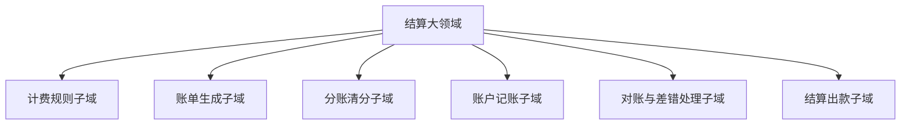

# DDD - 第 2 课：领域、子域与核心域：业务地图怎么画

## 学习目标（本节结束后你能做到什么）

- 理解“领域”不是一个大而空的词，而是业务问题发生的范围。
- 区分“领域”和“子域”，知道为什么复杂业务不能只用一个大模型硬包住。
- 理解核心域、支撑域、通用域三种分类，以及它们为什么决定建模投入的轻重。
- 能从一个后端业务系统出发，画出第一版业务地图，而不是一上来先想表和服务。
- 初步建立一个判断习惯：什么地方应该重建模，什么地方保持务实简洁。

## 内容讲解（核心概念，用类比、例子、图示说清楚）

### 1. 为什么一上来要先讲“业务地图”

很多人学 DDD 时会有一个常见冲动：  
先定义几个实体，再补几个值对象，然后开始设计聚合。

这一步并不是不能做，但如果你在还没看清业务全貌时就急着进入代码建模，最后很容易出现两种情况：

- 把不属于一类问题的东西强行放进同一个模型里
- 把真正关键的业务和普通支撑模块平均对待，最后哪里都不突出

所以 DDD 的顺序不是“先写模型，再理解业务”，而是反过来：  
**先画业务地图，再决定哪里值得重点建模。**

你可以把这一步想成修城市道路之前先看地图。  
如果你连商业区、住宅区、工业区都没分清，就直接修路，最后大概率是路修了很多，但都不顺。

DDD 里的“领域、子域、核心域”就是这张地图的第一层。

### 2. 什么是领域

前一课我们说过，领域就是业务问题发生的那片世界。  
这一课把它再说具体一点：

**领域，是围绕某类业务目标、业务规则和业务概念形成的问题空间。**

比如在一个电商平台里，你可以看到很多不同的问题空间：

- 用户下单
- 商品定价
- 库存锁定
- 支付扣款
- 履约配送
- 售后退款
- 财务结算

这些都在同一个公司里，但它们不是同一个问题。  
每一块都有自己的概念、规则、状态流转和专业语言。

所以“领域”这个词，重点不是“公司做什么业务”，而是“我们到底在解决哪一类业务问题”。

### 3. 什么是子域：复杂业务一定要拆

如果一个系统足够复杂，就很难只有一个大领域。  
这时我们要进一步拆成更小的业务块，这些业务块就叫**子域**。

子域可以理解成：  
**大领域下面相对独立、边界更清楚、规则更聚焦的问题子集。**

继续用电商举例。  
如果我们说“大领域是交易系统”，它下面可能至少还能拆成这些子域：

- 商品子域
- 营销子域
- 订单子域
- 支付子域
- 库存子域
- 履约子域
- 售后子域
- 结算子域

注意，这种拆分不是按数据库表拆，也不是按技术中间件拆，而是按**业务问题的差异**来拆。

为什么必须拆？

因为不同子域关心的核心问题根本不一样。

- 订单子域关心订单生命周期、状态变更、下单约束
- 库存子域关心可售数量、预占、扣减、回补
- 支付子域关心支付单、渠道回调、支付状态确认
- 结算子域关心账单生成、分账规则、出入账口径、结算周期

如果你把这些东西全部塞进一个“交易大模型”，短期看好像统一了，长期一定会失控。  
因为你统一的不是语言，而是混乱。

### 4. 子域不是技术模块，也不是微服务名录

这里有一个非常重要的提醒。

很多工程师一听“拆分”，脑子里立刻出现：

- 订单服务
- 库存服务
- 支付服务
- 营销服务

这当然是一种常见结果，但**子域首先是业务分析结果，不是部署结果**。

同一个子域，完全可能先落在单体里的一个模块中；  
也可能多个子域暂时还在同一个服务里；  
还可能一个子域因为历史原因散在多个服务里，但从业务视角它依然是一个子域。

所以不要把“子域”直接等同于“微服务”。

一个更稳妥的理解是：

- 子域回答的是“业务问题怎么分块”
- 微服务回答的是“系统怎么部署和自治”

前者偏业务建模，后者偏工程组织。  
它们可以相关，但不是一一对应关系。

### 5. 核心域、支撑域、通用域：不是所有地方都值得同样投入

这是 DDD 很有价值的一点。  
它不要求你全系统每个角落都做同等力度的建模，而是要求你先分清轻重。

#### 5.1 核心域

核心域是最值得投入建模精力的地方。  
它通常直接承载公司的核心竞争力，或者至少是业务复杂度最高、最能体现业务差异的部分。

核心域通常有这些特点：

- 规则复杂
- 变化频繁
- 对业务结果影响大
- 不能直接买现成系统替代
- 团队容易在这里产生理解偏差

例如：

- 外卖平台的履约调度
- 金融系统的定价与风控
- 电商平台的营销规则引擎
- 结算中心中的分账与账务处理规则

你刚才提到“结算中心适合用 DDD”，这个判断是有道理的。  
因为结算往往涉及账期、对账、分账、账户、账单、异常调整、退款回冲等复杂规则，它天然就比“用户列表分页查询”更值得被认真建模。

#### 5.2 支撑域

支撑域也重要，但它不是公司的核心竞争力来源。  
它通常是在支撑核心业务顺利运转。

例如：

- 权限管理
- 流程审批
- 通知中心
- 内部工单系统
- 通用运营后台

这类模块也可能不简单，但通常不需要你在模型上投入和核心域同等的设计精力。  
很多时候清晰分层、边界明确、适度抽象就够了。

#### 5.3 通用域

通用域是那些很多公司都会有、差异化不强、甚至可以购买或复用成熟方案的部分。

例如：

- 登录鉴权
- 文件存储
- 搜索
- 短信邮件发送
- 基础监控

对于通用域，DDD 的务实态度是：  
**能复用就复用，能买就买，能轻就轻。**  
不要把最宝贵的建模时间都花在这些不会形成业务壁垒的地方。

### 6. 为什么分类这三种域很重要

因为它直接决定你怎么分配注意力。

如果你不做这个分类，常见后果有两个：

1. 在不重要的地方设计过度  
比如一个简单的配置中心，硬要上很厚的领域模型、很多工厂和事件，结果成本很高，收益很低。

2. 在真正重要的地方设计不足  
比如营销、定价、结算这种规则密集区，却还在用“一个超长 service + 一堆 if-else”顶着，最后每次改规则都像拆雷。

DDD 不是为了让你“全都设计”，而是为了让你**把设计资源投在最值钱的地方**。

### 7. 怎么从真实系统里找出子域

你可以先用下面这套很实用的观察方式。

#### 7.1 看业务目标是否不同

如果两部分工作追求的业务目标都不一样，它们很可能不是一个子域。

例如：

- 订单子域的目标是正确表达交易过程
- 库存子域的目标是准确管理可售与实物占用
- 结算子域的目标是正确完成账务归集与清分

它们彼此协作，但不是一个问题。

#### 7.2 看核心概念和语言是否不同

如果讨论这两块业务时，用的词已经明显不一样，往往说明它们处在不同子域。

例如订单域会频繁出现：

- 下单
- 取消
- 拆单
- 状态流转

结算域会频繁出现：

- 账单
- 账期
- 分账
- 结算单
- 出账
- 对账

词汇一旦不同，往往说明思维模型也不同。

#### 7.3 看规则是否由不同角色主导

如果两块业务的规则总是由不同岗位定义和维护，也往往是拆子域的信号。

例如：

- 交易产品经理定义订单流程
- 财务或清结算团队定义分账口径
- 风控团队定义拦截规则

这说明它们本来就不该被揉成一个统一模型。

#### 7.4 看变化是否同步

如果两类规则经常独立变化，彼此节奏不同，也适合拆分。

比如营销活动规则一周变三次，但库存扣减规则半年才动一次。  
它们耦在一起，只会让发布和测试复杂度上升。

### 8. 用“结算中心”做一个业务地图示例

既然你提到了结算中心，我们就拿它做一个更贴近你的例子。

假设我们要分析一个平台型结算中心。  
它大概率不是一个单点功能，而是一组围绕“钱怎么正确流转和归集”的业务集合。

第一版业务地图可以先这样看：

这些子域的关注点并不一样：

- 计费规则子域：决定怎么计算应结金额
- 账单生成子域：决定什么时候出账、按什么口径聚合
- 分账清分子域：决定平台、商家、服务商之间怎么拆钱
- 账户记账子域：决定余额、流水、借贷方向、幂等等问题
- 对账与差错处理子域：决定怎么发现并修复账实不一致
- 结算出款子域：决定什么时候打款、打款状态如何流转

这一步还没有进入实体和值对象，但已经非常有价值。  
因为你开始知道：这里至少不是“一个 SettlementService 搞定一切”的问题。

### 9. 画业务地图时常见的误区

#### 9.1 按页面拆

比如“账单列表页一个模块，账单详情页一个模块”。  
这不是业务地图，这是前端导航。

#### 9.2 按数据库表拆

比如“订单表、订单明细表、退款表，所以这就是三个子域”。  
表只是存储结果，不代表业务边界。

#### 9.3 按团队现状硬拆

比如“现在 A 组维护这个服务，所以这是一块域；B 组维护那个服务，所以那又是一块域”。  
团队边界可以参考，但不能直接当业务边界。

#### 9.4 追求一步到位

第一次画图时，不需要追求绝对准确。  
DDD 的边界本来就需要在讨论、实现、演化中不断修正。

更现实的目标是：  
先画出一个足够能帮助大家沟通和分辨轻重的第一版地图。

## 小结（3-5 条关键点）

- 领域是在解决某类业务问题的范围，子域是把复杂业务进一步拆成边界更清楚的问题子集。
- 子域是业务分析结果，不等于微服务，不等于数据库表，也不等于组织架构现状。
- 核心域最值得投入建模精力，支撑域和通用域则更强调务实，不要平均用力。
- 画业务地图的目标不是一次性得出完美答案，而是先看清业务分块、语言差异和投入重点。
- 在真实项目里，先分清“哪里最值得认真建模”，比一上来讨论类图更重要。

---

## 检查站：请回答以下问题

1. 用你自己的话解释：领域和子域分别是什么，它们之间是什么关系？
2. 为什么说“子域”不能直接等同于“微服务”或“数据库表”？
3. 核心域、支撑域、通用域三者最关键的区别是什么？请你各举一个你熟悉系统中的例子。
4. 结合你提到的结算中心，试着先拆 3 到 5 个你认为合理的子域，并简单说说每个子域主要解决什么问题。

请把你的答案直接告诉我，我会根据你的回答决定下一步。
