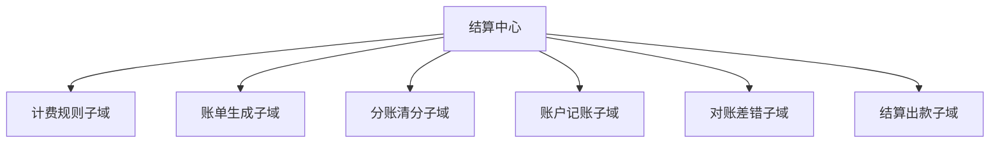

# DDD - 第 2 课补充：领域与子域补充：先分清层级，再分清边界

## 学习目标（本节结束后你能做到什么）

- 彻底分清“领域”和“子域”为什么会看起来像同一类词，但其实是在不同观察层级上说话。
- 理解为什么同一个业务名词，在不同讨论范围里，既可能是一个领域，也可能是另一个更大范围下的子域。
- 分清支撑域和通用域为什么容易混淆，以及实际判断时应该看什么。
- 能把“结算中心”拆成更像 DDD 业务地图的子域，而不是把所有上下游相关系统都装进去。

## 内容讲解（核心概念，用类比、例子、图示说清楚）

### 1. 你现在真正混淆的，不是定义本身，而是“观察层级”

你会觉得“支付”和“商品”好像有时是领域，有时又像子域，这个感觉非常正常。  
问题不在于你没背住定义，而在于你还没有建立一个很重要的意识：

**DDD 里的领域和子域，不是绝对头衔，而是相对于你当前讨论范围来说的。**

这句话很关键。

你可以先把它想成地图。

- 当你看中国地图时，上海是其中一个城市。
- 当你把视角放到上海地图时，浦东、徐汇、闵行又变成了更小的区域。

“上海”这个名字没有变，变的是你的观察层级。  
DDD 里的很多概念也是这样。

所以初学时你可以先用一个最稳的记法：

- **领域**：你当前正在讨论的那一整块业务问题范围
- **子域**：这块范围里面，再往下拆出来的几个更具体的问题块

也就是说，先有一个“整体范围”，再谈它下面的“子问题”。

### 2. 用一个固定层级的例子，把领域和子域钉住

为了避免绕来绕去，我们先固定一个讨论范围。

假设我们现在讨论的是“平台交易与资金相关业务”这一大块。  
在这个层级下，我们可以先把它看成一个较大的业务领域。  
然后它下面可能拆出这些子域：

- 订单子域
- 支付子域
- 营销子域
- 库存子域
- 履约子域
- 结算子域

在这个视角里：

- “交易与资金相关业务”是领域
- “订单、支付、库存、结算”这些是子域

这时你就不要再问“支付是不是领域”。  
因为在这个讨论层级里，它先作为子域出现。

但是，如果有一天我们不讨论整个平台，只专门讨论“支付”这块业务，那么视角又变了。  
这时“支付”本身就可以作为一个更聚焦的业务领域，而它下面又能继续拆：

- 支付单管理
- 支付渠道路由
- 回调确认
- 退款处理
- 对账

这时你会发现：

- 在大地图里，支付是一个子域
- 在专门讨论支付时，支付又成了一个更小范围内的领域

这不是自相矛盾，而是层级切换。

### 3. 初学阶段，先不要追求“绝对标准命名”，先抓住这条原则

你现在最需要的是一个不会把自己绕晕的实用原则：

**先问：我现在讨论的整体范围是什么？然后再问：这个整体范围内部能拆成哪些相对独立的问题块？**

只要你先把这个“整体范围”说清楚，后面的子域就容易落稳。

所以以后你看到一个词时，不要急着问：

- 它到底是领域还是子域？

先问：

- 它是相对于哪个更大的范围来说的？

这个问题一加上去，很多混乱会立刻消失。

### 4. 为什么“子域”不能直接等于微服务

你这题的方向其实答对了，我这里帮你再补完整一点。

子域描述的是**业务问题边界**。  
微服务描述的是**系统部署和工程自治边界**。

这两个边界经常有关联，但不会天然一一对应。

常见情况至少有三种：

#### 4.1 多个子域暂时放在一个服务里

例如一个业务刚起步时，订单、支付、营销都还在同一个单体服务中。  
这不代表它们是一个子域，只代表工程上暂时没有拆。

#### 4.2 一个子域被拆成多个服务

例如“账户记账”这个子域，因为吞吐、账务隔离、审计要求等原因，可能被拆成记账服务、账本服务、余额服务。  
它们从工程上是多个服务，但从业务上还是同一类问题。

#### 4.3 历史系统导致边界错位

现实里很常见：某个服务名叫“settlement-service”，里面却混了支付回调、账单导出、营销补贴、账户记账。  
服务边界已经脏了，但业务边界并不会因此自动变正确。

所以做 DDD 时，一个非常重要的动作就是：  
**先把业务边界想清楚，再决定工程边界怎么落。**

### 5. 为什么“子域”也不能直接等于数据库表

数据库表是存储结构，不是业务地图。

一个子域里可能有很多张表。  
例如账单子域里可能有：

- 账单主表
- 账单明细表
- 调账记录表
- 账单快照表

反过来，一张表也未必只属于一个清晰的业务问题。  
有些历史系统的“大宽表”就是多个业务概念硬挤在一起的结果。

所以“按表拆业务”很容易发生一个问题：  
你拆出来的不是业务边界，而是存储碎片。

### 6. 支撑域和通用域为什么容易混

你提到一个很好的疑问：  
“权限这些东西，有时看起来像支撑域，有时又像通用域，这怎么分？”

这个疑问很有价值，因为这里确实不是死记硬背。

先给你一个最实用的判断标准：

- **通用域**：行业里很多公司都差不多，差异化不强，可以复用成熟方案，甚至可以买现成能力
- **支撑域**：它主要是在支撑核心业务，但和你的业务流程、组织方式、管理方式有明显耦合，往往不能完全拿通用产品一套带走

所以支撑域和通用域的区别，不是“哪个更重要”，而是：

- 它是不是标准化程度很高
- 它是不是几乎不构成业务差异
- 它是不是可以被成熟方案替代

### 7. 权限为什么有时像支撑域，有时像通用域

这正是因为分类跟上下文有关。

#### 情况 A：普通后台 RBAC

如果只是常见的角色、菜单、按钮权限，这通常更像通用域。  
因为大部分公司都差不多，成熟方案很多，也很难构成竞争力。

#### 情况 B：强业务耦合的权限体系

如果你的权限不是简单 RBAC，而是和组织树、数据范围、审批链、业务状态、租户隔离、财务责任归属强相关，那它就可能更像支撑域。  
因为这时它已经不只是一个通用工具，而是在深度支撑你的业务运作。

所以你刚才的困惑不是错，反而说明你已经碰到了分类里的真实难点。  
这里不要追求“权限永远属于哪一类”，而要追问：

- 在我的系统里，它到底有多标准？
- 它和核心业务流程到底绑得有多深？

### 8. 结算中心的拆分：为什么“库存子域”大概率不该放进来

你说“结算中心可以拆成支付子域、账户子域、库存子域、账单子域”。  
这里我帮你温和地纠正一下：

**如果我们讨论的是结算中心本身，那么库存通常不属于结算中心内部子域。**

原因不是库存不重要，而是它解决的是另一类业务问题：

- 库存关心的是数量占用、可售、扣减、回补
- 结算关心的是金额计算、账务归集、分账、出款、对账

它们有关联，但不是同一块问题空间。  
库存更像结算中心的上游或邻接业务域，而不是结算中心内部子域。

支付也有类似情况。

如果你的“结算中心”是狭义的清结算系统，那么支付通常也是外部协作方或上游领域。  
结算系统会接支付结果，但“渠道扣款”和“账务清分”仍然不是同一类问题。

所以，讨论“结算中心”时，更合理的拆法通常像下面这样：

你可以这样理解每一块：

- 计费规则子域：怎么算钱，口径是什么
- 账单生成子域：按什么周期、粒度、对象出账
- 分账清分子域：不同参与方之间钱怎么拆
- 账户记账子域：余额、流水、借贷方向、幂等怎么保证
- 对账差错子域：怎么发现账不平，怎么修
- 结算出款子域：什么时候打款，打款状态如何流转

这时你会发现，地图明显比“支付、库存、账单、账户”更贴近结算中心自身职责。

### 9. 你现在先记住一个够用的判断框架

以后你在业务里做第一轮领域划分时，可以先连续问自己 4 个问题：

1. 我现在讨论的整体范围是什么？
2. 这个范围内部能拆成哪些相对独立的问题块？
3. 哪些块是系统核心竞争力，值得重点建模？
4. 哪些东西只是上下游协作方，不应该硬塞进当前范围内部？

这 4 个问题如果问清楚了，领域、子域、核心域这些概念就会慢慢站稳。

## 小结（3-5 条关键点）

- 领域和子域的关键不是词本身，而是你当前站在哪个观察层级上看问题。
- 初学时最稳的做法是：先说清楚当前讨论的整体范围，再拆内部的子问题块。
- 支撑域和通用域的区别，不是简单看重不重要，而是看它是否标准化、是否可复用、是否构成业务差异。
- 同一个模块在不同公司、不同系统里，分类可能不同，这很正常。
- 结算中心的子域应该围绕“钱如何计算、归集、记账、校验、出款”来拆，而不是把所有相关上下游系统都装进去。

---

## 检查站：请回答以下问题

1. 如果我们把“结算中心”看成当前讨论的整体范围，那么它的“子域”应该是什么含义？请你用自己的话解释，不要直接抄定义。
2. 为什么“库存”通常不应该被当成结算中心内部子域？它和结算中心更像是什么关系？
3. 请你重新拆一次结算中心，给出 3 到 5 个你认可的子域，并分别用一句话说明它们解决什么问题。

请把你的答案直接告诉我，我会根据你的回答决定是回到主线推进第 3 课，还是再补一个更短的小练习。
