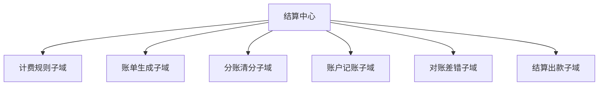

# DDD - 第 2 课补充 2：结算中心拆分练习：分清内部子域与上下游协作域

## 学习目标（本节结束后你能做到什么）

- 分清“当前系统内部子域”和“当前系统的上下游协作领域”不是一回事。
- 理解为什么你会反复把支付放进结算中心内部，这背后不是粗心，而是“讨论范围”还在滑动。
- 能用结算中心这个例子，稳定地画出一版更像 DDD 业务地图的拆分。
- 为下一课“限界上下文”打地基，因为上下文边界本质上就建立在这一步之上。

## 内容讲解（核心概念，用类比、例子、图示说清楚）

### 1. 你现在差的不是定义，而是“把讨论范围固定住”

你这轮回答里最有价值的一点是：  
你已经明确知道“库存不应该算结算中心内部”，而更像独立领域。

这说明你已经开始有边界意识了，这是进步很大的地方。

但你还是会把“支付、账单、结算、账户”一起放进结算中心内部子域。  
这里真正的问题不是你不懂业务，而是**你的讨论范围还在来回切换**。

有时候你在说“平台整个资金链路”，这时支付当然是其中一块。  
有时候我们在说“狭义的结算中心”，这时支付通常就是它的上游协作方，而不是内部子域。

所以你现在最需要的是先把一句话钉住：

**当我们说‘结算中心的子域’时，默认讨论范围是狭义结算中心本身，不是整个平台的交易资金域。**

只要这句话站稳，很多混乱会立刻消失。

### 2. 为什么“支付”这么容易被你放进结算中心内部

因为从业务链路上看，支付和结算确实挨得很近。

例如：

- 用户支付成功
- 平台收到支付结果
- 后续需要分账、记账、出账、打款

在时间顺序上，它们前后相连。  
这很容易让人产生一种直觉：既然它们连得这么紧，那应该属于同一个内部模块。

但 DDD 看的不是“时间上是否相邻”，而是“它们解决的是不是同一类业务问题”。

支付主要解决的是：

- 支付单创建
- 渠道路由
- 渠道扣款
- 支付回调确认
- 退款请求与确认

结算中心主要解决的是：

- 该怎么算钱
- 该怎么生成账单
- 平台和参与方怎么分账
- 账户怎么记账
- 账对不上时怎么发现和修复
- 什么时候可以出款

你会发现，这两边虽然强相关，但关注点已经明显不同。  
一个更偏“钱是怎么付的”，另一个更偏“钱付完以后怎么归集、核算、记账、清分、打款”。

所以在狭义结算中心视角里，支付通常是上游协作领域，不是内部子域。

### 3. 一个特别实用的判断问题

以后你遇到类似困惑时，可以问自己一句话：

**这个模块是在解决当前系统内部的核心职责，还是只是向当前系统提供输入、触发、结果或协作数据？**

如果它主要是在“提供输入或协作结果”，那它更像上下游协作域。  
如果它主要是在“承担当前系统自己的核心职责”，那它更像内部子域。

拿结算中心举例：

- 支付把“支付成功/退款成功”等结果提供给结算中心
- 库存把“履约或退货相关状态”提供给结算链路中的部分规则
- 订单把“订单成交、取消、退款、售后”等业务事实提供给结算中心

这些都很重要，但它们更多是在给结算中心“输入业务事实”。  
而结算中心自己的职责是基于这些事实完成核算、记账、分账、对账和出款。

### 4. 用一张表把它彻底分开

下面这张表你可以反复看，直到感觉稳定为止。

| 名词 | 如果我们讨论“整个平台交易资金链路” | 如果我们讨论“狭义结算中心本身” |
| --- | --- | --- |
| 订单 | 一个业务子域 | 结算中心的上游协作域 |
| 支付 | 一个业务子域 | 结算中心的上游协作域 |
| 库存 | 一个业务子域 | 通常不是结算中心内部，而是邻接/上游领域 |
| 账单生成 | 可能属于结算相关子域的一部分 | 结算中心内部子域 |
| 分账清分 | 可能属于结算相关子域的一部分 | 结算中心内部子域 |
| 账户记账 | 可能属于结算相关子域的一部分 | 结算中心内部子域 |
| 对账差错 | 可能属于结算相关子域的一部分 | 结算中心内部子域 |
| 结算出款 | 可能属于结算相关子域的一部分 | 结算中心内部子域 |

这张表不是说“支付永远不能和结算放在一起”。  
它是在告诉你：**必须先固定讨论范围，再判断谁是内部子域，谁是协作领域。**

### 5. 结算中心更合理的一版拆分

如果我们现在固定讨论范围为“狭义结算中心”，那么一版更稳的拆分通常像这样：

你可以先这样记每块在干什么：

- 计费规则子域：决定应结金额怎么算，采用什么口径
- 账单生成子域：决定什么时候出账、对谁出账、按什么维度聚合
- 分账清分子域：决定不同参与方怎么拆钱
- 账户记账子域：决定余额和流水怎么落账、怎么保证幂等和借贷方向正确
- 对账差错子域：决定账实不一致如何发现、定位和修复
- 结算出款子域：决定什么时候可以打款、打款流程如何流转

这里最重要的不是背名字，而是看出一个共性：  
这些子域都在回答“结算中心自己要做什么”。

### 6. 如果你们公司把支付和结算放在同一个大系统里怎么办

这是个很现实的问题。  
很多公司的系统名称和 DDD 边界并不完全一致。

例如有些公司会把整个“资金平台”都叫结算中心，里面既有支付，也有账户，也有结算，也有对账。  
如果你们内部就是这么叫的，那也没关系，但你要在脑中再分一层：

- 大范围：资金域，里面有支付、账户、结算、对账等子域
- 小范围：狭义结算域，里面才有账单、清分、记账、出款等内部子域

也就是说，**名字可以沿用公司的历史叫法，但脑中的边界不能跟着糊。**

### 7. 你现在先学会这一个动作就够了

以后遇到一个系统时，你先别急着拆类、拆服务、拆表。

先做下面这一步：

1. 固定当前讨论范围
2. 列出这个范围自己的核心职责
3. 把只是给它提供输入或协作结果的上下游领域先排除出去
4. 再对剩下的核心职责做子域拆分

这个动作一旦稳定下来，你后面学限界上下文、聚合边界、领域服务时会轻松很多。  
因为你终于是在清楚的地图上建房子，而不是在雾里搭脚手架。

## 小结（3-5 条关键点）

- 你现在的主要问题不是不会拆，而是当前讨论范围还没固定，所以内部子域和协作领域混在一起。
- 支付和结算在业务链路上相邻，不代表它们在狭义结算中心里属于同一内部子域体系。
- 画业务地图时，要先分清“系统自己负责什么”与“系统依赖谁提供业务事实”。
- 如果公司内部把大资金域统称为结算中心，也没关系，但你脑中要再细分一层边界。
- DDD 的核心不是名字统一，而是边界清楚、职责清楚、语言清楚。

---

## 检查站：请回答以下问题

1. 如果我们把“狭义结算中心”作为固定讨论范围，那么“支付”更像它的什么：内部子域，还是上游协作域？请说原因。
2. 请你重新给出一版“狭义结算中心”的 4 个内部子域，不要再把支付和库存放进来。
3. 你再用一句话说清楚：为什么“先固定讨论范围”这件事这么重要？

请把你的答案直接告诉我，我会根据你的回答决定是回主线进入第 3 课，还是再做一轮更短的判断题练习。
