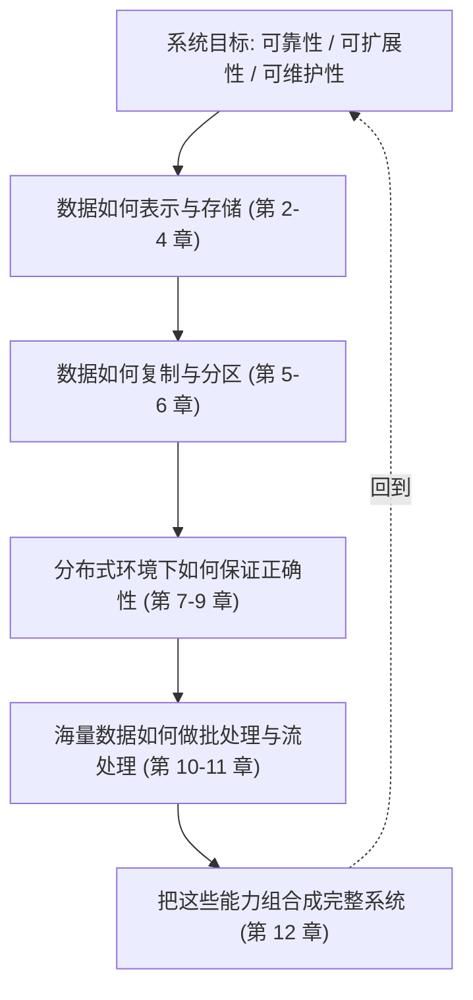

# DDIA - 第 1 课：DDIA 在讲什么与全书地图

## 学习目标（本节结束后你能做到什么）

- 说清楚 DDIA 这本书到底在研究什么问题，而不是把它误解成某个数据库教程。
- 理解“数据密集型应用”这个名字的真正含义，知道它和“计算密集型应用”有什么不同。
- 用自己的话解释 DDIA 全书最核心的三条评估标准：可靠性、可扩展性、可维护性。
- 了解这三条标准背后的思想史（CAP、PACELC、FLP、End-to-End 论点）以及它们为什么没有被 DDIA 选作主线。
- 建立对全书章节结构的整体地图，知道后面各章为什么会按这个顺序出现。
- 理解 Kleppmann 在书中隐藏的一条主线：**数据库正在被解构**，每一章其实是数据库内部某个零件的放大图。
- 初步形成一个阅读姿势：学 DDIA 时重点不是记结论，而是抓住每种设计背后的取舍。

## 内容讲解（核心概念，用类比、例子、图示说清楚）

### 1. 先把这本书“摆正”：DDIA 不是某个技术栈操作手册

很多人第一次听说 DDIA，会以为它是一本“分布式系统大全”，或者“数据库原理强化版”。这两个理解都只说对了一部分。

DDIA 更准确的定位是：
**它教你如何思考一个以数据为中心的系统应该怎样设计。**

注意这个句子里有两个关键词：

1. 以数据为中心
   说明讨论重点不是页面样式、前端交互、算法刷题，而是数据怎么存、怎么流动、怎么复制、怎么扩展、怎么保证正确。
2. 如何设计
   说明书里不是单纯列知识点，而是在反复训练你判断方案的能力。作者真正想让你学会的，不是“某个组件怎么配”，而是“为什么会有人这样设计，它解决了什么问题，又带来了什么代价”。

所以，DDIA 最适合这样的人：

- 已经写过一些业务代码，但对系统为什么这样搭建还说不透；
- 经常听到缓存、MQ、分库分表、主从复制、事务、一致性这些词，但脑子里没有一张完整地图；
- 想从“会用组件”进阶到“理解架构”。

#### 1.1 作者 Kleppmann 的写作立场

理解 DDIA 的一个关键上下文：作者 Martin Kleppmann 本人不是“某个数据库的布道者”。他在 LinkedIn 做过流处理基础设施（Samza 的核心贡献者之一），后来去剑桥做分布式算法研究（CRDTs、因果一致性）。这决定了书里一个很独特的立场：

**同一个问题，不把它看成“MySQL 怎么做”“Cassandra 怎么做”，而是看成“任何数据系统都要面对的同一个问题，只是采用了不同解法”。**

所以你会发现书里出现的案例横跨：关系库（Postgres、MySQL）、文档库（MongoDB）、宽列库（Cassandra、HBase）、KV 库（Dynamo、Redis）、搜索引擎（Elasticsearch、Lucene）、消息系统（Kafka、RabbitMQ）、批处理（MapReduce、Spark）、流处理（Flink、Samza）、甚至版本控制（Git 的因果模型）。

它把这些放在同一张桌子上比较，不是为了炫耀知识量，而是要让你看清一个残酷的事实：**没有哪个系统靠魔法工作，它们用的是同一组有限的基础工具，只是组合方式和取舍不同。**

### 2. 什么叫“数据密集型应用”

“数据密集型”这个名字非常关键。如果你不先理解它，后面很多章节会像散点知识。

所谓数据密集型应用，简单说，就是系统的大部分挑战来自：

- 数据量大
- 数据访问频繁
- 数据需要在多个组件之间流动
- 数据要长期保存、检索、同步、纠错、恢复

比如下面这些系统，就明显属于数据密集型应用：

- 电商系统：商品、订单、库存、支付、物流状态都要持续读写
- 社交平台：帖子、评论、点赞、关注关系、消息流都在不断变化
- 日志平台：机器不断产生日志，系统要接收、存储、检索、聚合、报警
- 推荐系统的数据链路：用户行为先写入日志，再进入消息流、离线计算、在线服务

相对地，计算密集型应用更关心 CPU 或 GPU 算得够不够快，比如科学计算、图形渲染、模型训练中的某些阶段。
它们当然也会处理数据，但主要瓶颈不一定在“数据如何组织与流动”，而可能在“计算本身很重”。

你可以这样粗略记：

- 计算密集型：核心压力在“算”
- 数据密集型：核心压力在“存、取、传、同步、扩展、纠错”

#### 2.1 为什么这个词是在 2010 年代之后才流行起来

“data-intensive”不是凭空冒出来的术语。理解它的历史背景，有助于你理解为什么这本书在今天比十年前更重要。

- 1970s–1990s：数据系统的主战场是**单机关系数据库**。瓶颈基本都在 CPU 和磁盘，解决方案是升级硬件或写更好的 SQL。Codd 的关系模型解决了“查询表达力”问题，问题规模也没大到单机装不下。
- 1990s–2000s：互联网起来，Web 应用开始把单库拆成主从、加缓存。LAMP 架构（Linux + Apache + MySQL + PHP）是典型。此时“数据密集型”还没作为专门命题提出来。
- 2007–2012：Google 的 Bigtable/GFS/MapReduce 三篇论文（2003–2006）外溢到工业界，Dynamo 论文（2007）提出了“最终一致性”的设计哲学，Hadoop 生态爆炸，NoSQL 运动兴起。大家突然发现：**单机数据库根本装不下现代数据**。这个时期产生了大量“一个系统解一个问题”的专用数据库：搜索靠 Lucene/Elasticsearch、宽列靠 HBase/Cassandra、流处理靠 Storm/Kafka。
- 2013–2017：当一个公司同时用 10 种数据系统时，**如何让数据在这些系统之间流动、保持一致**反而成了更大的问题。Kleppmann 在 2014 年写了那篇著名的博客《Turning the database inside-out》，把 Kafka 式的日志看作数据库的核心。**DDIA 第 1 版（2017）就是这个时代思想的总结。**
- 2017 之后：云原生、Serverless、湖仓一体（Lakehouse）、向量数据库、实时数仓。问题没变，换了皮肤。

这个历史脉络你要有，是因为书里很多例子和参考文献都来自 2000–2015 这个窗口。不是 Kleppmann 不关心新东西，而是这十几年恰好是“数据系统思想”集中爆发的阶段，新系统大多是在旧思想上的重组。

### 3. DDIA 全书其实反复围绕三个目标展开

作者在开篇就给出三个总目标，它们是全书的总纲：

- 可靠性（Reliability）
- 可扩展性（Scalability）
- 可维护性（Maintainability）

这三个词看着像口号，但其实特别实用。你今后看任何系统设计，都可以先问这三个问题。

#### 3.1 可靠性：系统出问题时还能不能扛住

可靠性不是“永远不出错”，因为任何系统都会出错。
真正的问题是：**当组件出故障、机器宕机、网络抖动、数据写坏、代码有 bug 时，系统能否继续提供合理服务。**

你可以把可靠性想成一辆车在复杂路况下还能安全开。
不是要求它永远不上坡、不下雨、不遇到坑，而是要求它在这些不理想条件下仍然可控。

在数据系统里，可靠性常常体现为：

- 数据不会轻易丢
- 单机坏了不会全站瘫痪
- 消息重复或乱序时有补救策略
- 某个依赖暂时不可用时系统能降级，而不是整条链路一起死

#### 3.2 可扩展性：负载上来后能不能继续撑

可扩展性关心的是：用户更多了、数据更大了、请求更密了以后，系统还能不能继续工作。

重点不是“现在快不快”，而是“将来压力变大时，系统是不是还有增长空间”。
比如一个系统在每天 1 万请求时很稳定，不代表在每天 1 亿请求时还稳定。

所以谈可扩展性时，不能只说“这个架构很强”，要说清楚：

- 负载是什么：QPS、吞吐、存储量、活跃用户数、热点比例？
- 瓶颈在哪：CPU、磁盘、网络、锁竞争、单机内存、热点 key？
- 扩展方式是什么：加机器、加副本、分区、缓存、异步化、预计算？

#### 3.3 可维护性：系统是不是越做越难改

很多系统上线初期跑得挺快，但半年后谁都不敢改。
这类系统的问题往往不在“不能跑”，而在“难以理解、难以排错、难以演进”。这就是可维护性问题。

可维护性本质上是在问：
**这个系统对人友好吗？**

它通常包含：

- 可理解：新同学能不能看懂
- 可演进：新需求来了能不能改
- 可运维：线上出问题能不能快速定位

如果一个系统性能极强，但只有原作者敢碰，那它的工程质量其实并不高。

#### 3.4 为什么是这三个，而不是 CAP / PACELC / ACID

你可能听过更有名的几组词：CAP 定理（一致性、可用性、分区容错）、PACELC、ACID、BASE。为什么 Kleppmann 不把全书建立在这些之上？

原因很值得琢磨：

1. **CAP 其实只适用于一类很窄的场景**（存在网络分区时，在 C 和 A 之间选一个）。Kleppmann 本人多次公开批评过 CAP 被过度解读（见他 2015 年的论文《A Critique of the CAP Theorem》）。现实中系统很少真的在做“强一致 vs 高可用”的二选一，更多是“不同一致性语义 + 不同可用性层级”的连续光谱。
2. **ACID 是针对单机事务的术语**，在分布式语境里术语本身就变形了。书里专门花一整章（第 7 章）来拆“事务”这个词到底指什么。
3. **CAP/PACELC 只谈正确性，不谈运维**。而真实系统里，团队被 oncall 拖垮、需求卡在迁移上，这些都不是一致性问题，是可维护性问题。

所以 Kleppmann 选了一个更工程、更贴近团队日常的三角：**系统对故障的反应、对增长的反应、对人的反应。**

这不是否定 CAP/ACID，而是**把它们当作工具放在更大的框架里用**。后续章节你会看到 CAP 出现在第 9 章（一致性与共识），ACID 出现在第 7 章（事务），它们是工具，不是总纲。

### 4. 为什么后面会讲数据模型、复制、分区、事务、一致性

很多初学者看 DDIA 目录会困惑：为什么前面讲数据库模型，中间讲复制分区，后面又跑去讲事务、共识、批处理、流处理？看起来像很多主题拼在一起。

其实它们是顺着同一条主线展开的：

1. 先问：系统要处理什么样的数据，以及怎样存取这些数据
   这对应数据模型、存储与检索、编码与演化。
2. 再问：当数据量和请求量变大时，怎么让系统撑住
   这对应复制与分区。
3. 接着问：多个副本、多个节点一上来，正确性怎么保证
   这对应事务、隔离级别、分布式故障、一致性、共识。
4. 最后问：除了在线读写，海量数据还要怎么分析和加工
   这对应批处理与流处理。

你会发现，全书不是“东一章西一章”，而是在不断回答这四个问题：
**数据是什么？怎么存？怎么扩？怎么保证在复杂环境下依然正确？**

#### 4.1 这其实是“把数据库拆成零件”的一条暗线

这是 DDIA 藏得比较深的一个视角，但一旦理解就很难再忘。

传统关系数据库（比如 Postgres）在内部其实同时承担了很多角色：

- **数据模型**（关系模型、schema）
- **存储引擎**（B-Tree，行存）
- **查询处理**（SQL 解析、优化器、执行器）
- **事务管理**（MVCC、WAL、锁）
- **复制**（主从复制、逻辑复制）
- **索引**（B-Tree 索引、GIN、倒排）
- **缓存**（Buffer Pool）

这些零件过去都藏在“数据库”这一个黑箱里。但现代架构越来越流行**把这些零件分开、各用最好的一个，再通过数据流串起来**：

- 存储引擎分开：OLTP 用 Postgres，OLAP 用 ClickHouse
- 索引分开：主数据在 Postgres，全文索引在 Elasticsearch，向量索引在 Milvus
- 缓存分开：Redis 作为前置缓存
- 事务日志外挂：Debezium + Kafka 把数据库的 binlog 变成事件流
- 复制跨系统：CDC 把 MySQL 变更流到 Kafka，再落到数仓

Kleppmann 在博客和书里称这个趋势为 **"Unbundling the database"（数据库解构）** 或 **"turning the database inside-out"**。

回头看 DDIA 目录，你会惊讶地发现，几乎每一章都在放大这个被拆出来的零件：

| DDIA 章节 | 对应的数据库内部零件 |
|---|---|
| 第 2 章 数据模型 | schema、文档/关系/图 |
| 第 3 章 存储与检索 | B-Tree、LSM Tree、列存 |
| 第 4 章 编码 | 序列化、wire format |
| 第 5 章 复制 | 主从、多主、无主 |
| 第 6 章 分区 | sharding、routing |
| 第 7 章 事务 | MVCC、锁、隔离级别 |
| 第 8 章 分布式问题 | 时钟、网络分区、拜占庭 |
| 第 9 章 一致性与共识 | 线性化、Paxos/Raft |
| 第 10–11 章 批/流处理 | 查询执行、物化视图 |
| 第 12 章 未来 | 如何把这些零件组装回去 |

所以你可以把全书理解为：**先把数据库大卸八块，每一块讲透原理和取舍；最后再教你按自己的需求重新拼装。**

这个视角一旦建立，你看后面任何章节都不会再觉得“怎么又换主题了”。

### 5. 用一个真实业务场景，把全书主线串起来

假设你要做一个外卖平台。

用户下单时，会出现这些需求：

- 用户要看到商家和商品信息
- 下单后要扣库存、创建订单、发起支付
- 商家和骑手端要实时看到订单状态
- 平台要能统计日活、成交额、履约时长
- 活动期间流量暴涨，系统不能崩

如果你带着 DDIA 的视角看，这里面其实包含了一整套问题：

- 商品、订单、用户关系应该用什么数据模型？（第 2 章）
- 查询模式不同，底层更适合索引结构还是日志结构？（第 3 章）
- 订单消息在服务间传递用什么编码？Schema 演化怎么办？（第 4 章）
- 订单数据为什么要复制？主从延迟造成“自己下的单自己刷新看不到”怎么办？（第 5 章）
- 热门商家流量暴涨时，数据怎么分区避免单点热点？（第 6 章）
- 支付成功但订单更新失败时，事务边界怎么划？（第 7 章）
- 订单系统跨机房部署时，节点看到的“现在时间”是不一样的，怎么定序？（第 8 章）
- 库存扣减要不要用分布式锁？能不能用共识算法？（第 9 章）
- 当天的订单要产出报表，走实时流还是隔夜批？（第 10–11 章）

你看，一个具体业务往下拆，很快就落回 DDIA 的章节主题。
这就是为什么这本书在后端、架构、数据平台领域很重要，因为它给你的不是某个场景答案，而是可迁移的分析框架。

### 6. 三个真实的失败案例，说明为什么要用这套视角

如果你觉得“可靠性、可扩展性、可维护性”听起来像口号，看几个真实出过事的系统就会改观。这些案例后续章节会反复出现，先在这里建立心智锚点。

#### 6.1 Knight Capital（2012，可维护性塌方）

一家美国高频交易公司 Knight Capital 部署新代码时，8 台服务器里只更新了 7 台，第 8 台还运行着一个被复用的老 feature flag。开市后，老代码路径把测试用的“电力喂单”逻辑注入到真实市场，**45 分钟里下了 4 亿股错单，亏损 4.6 亿美元，公司次日接近破产**。

这个事故的根因不是代码 bug，也不是容量不够，而是：

- 同一个 flag 在新旧代码里语义相反（代码演化没处理好）
- 没有统一的部署验证机制（运维流程）
- 没有快速熔断下单的机制（运行期保护）

这就是典型的**可维护性 + 可靠性复合事故**。DDIA 第 1 章强调“看不见的人为错误”，原型就是这类事件。

#### 6.2 AWS S3 US-EAST-1（2017，可靠性反噬）

2017 年 2 月 28 日，一个 AWS 工程师在排查 S3 账单系统一个小问题时，执行了命令要移除少量服务器。他**打错了一个参数**，结果命令不是移除几台，而是移除了 S3 index 子系统的大部分容量。整个 US-EAST-1 的 S3 不可用了近 4 小时，牵连了大量依赖 S3 的服务（包括 Slack、Trello、Medium、Quora）。

这里面几个 DDIA 相关的点：

- 单个人工命令的“爆炸半径”没有被系统限制住（可靠性）
- 重启 S3 index 子系统的流程**多年没演练过**，实际花了几小时才恢复（可维护性）
- 大量服务把 S3 当作“永远在线”的假设依赖，没有降级路径（第 8 章分布式系统假设问题）

这类事故让业界后来普遍接受了一个观点：**不是 AWS 不可靠，而是你把一个外部服务当单点依赖的架构是脆弱的。**

#### 6.3 GitHub 43 秒网络分区（2018，一致性与故障切换）

2018 年 10 月 21 日，GitHub 美东和美西数据中心之间的网络中断了 43 秒。就这 43 秒，触发了 MySQL Orchestrator 自动故障切换，选举出了一个新主库。但网络恢复后，老主库又有自己的一批写入数据。

结果：**两个主库各自有对方不知道的数据，GitHub 花了 24 小时手动合并回去。**

这个案例几乎是 DDIA 第 5 章（复制）+ 第 8 章（网络分区）+ 第 9 章（脑裂和共识）的活教材。它告诉你：

- 复制不是“加一份”那么简单，故障切换的语义必须想清楚
- 网络的“短暂中断”在大规模系统里是常态，不是边缘情况
- 没有共识算法保护的主库选举，在网络抖动时会制造两个真相

你学完 DDIA 后面章节后，回头看这个案例，会发现每一个细节都对应书里讨论过的一个陷阱。

### 7. 学 DDIA 最重要的阅读姿势：不要只背结论，要抓 trade-off

这本书没有哪一章的结论是“某方案永远最好”。
它更常见的表达方式是：

- 这个设计在某些条件下很好
- 但它会带来某些副作用
- 如果你的需求变了，结论也会跟着变

例如：

- 复制能提高可用性和读吞吐，但会带来副本延迟与一致性问题
- 分区能支持横向扩展，但会带来热点、跨分区事务、再平衡成本
- 事务能简化正确性，但也可能牺牲吞吐或可用性
- 强一致能让程序员心智简单，但分布式环境下要靠共识算法，延迟和可用性都受影响
- 批处理能保证幂等和可追溯，但延迟天然更高；流处理延迟低，但恰好一次语义很难做对

所以学 DDIA 时，最该训练的能力不是“记住名词定义”，而是这三步：

1. 这个方案解决了什么问题？
2. 它依赖什么前提？
3. 它会引入什么新代价？

一旦你开始这样思考，这本书就不再只是“知识输入”，而会变成你的系统设计语言。

#### 7.1 一个更具体的“读章四问”框架

为了让这个姿势可执行，每读一章我建议你强制问自己四个问题：

1. **问题（Problem）**：这一章要解决的根本问题是什么？如果这一章不存在，哪类系统设计会出错？
2. **方案（Solution space）**：书里列出了几种方案？它们之间的关键分歧点是什么？（比如复制章里：同步 vs 异步、单主 vs 多主 vs 无主）
3. **前提（Assumption）**：每个方案背后隐含了什么假设？（比如 B-Tree 假设随机 IO 不太差、LSM 假设写比读多、Raft 假设多数派存活）
4. **代价（Cost）**：这个方案引入了什么新问题？这些新问题在后面哪一章又被展开讨论？

最后一问特别重要，因为它揭示了全书的结构：**每一章的“解决方案”，在下一章往往变成“新问题”。** 复制解决了可用性，带来了一致性问题 → 第 9 章；分区解决了扩展，带来了跨分区事务问题 → 第 7/9 章。这是 DDIA 的内在节奏。

### 8. 全书地图先在脑中搭起来

你现在可以先把全书想成下面这张图：

如果你后面某一章读着觉得“细节太多”，就把自己拉回这张图：
它一定是在回答其中某一个层次的问题。

### 9. 常见的误读，先在这里排雷

最后提几个初学者最容易踩的误区，让你带着警觉进入后面的章节。

1. **“DDIA 已经过时了，都 2017 年的书了”** —— 底层思想集中在 1970–2015 年这 40 年产生。新系统（比如 TiDB、CockroachDB、ClickHouse、Pinot、DuckDB、Kafka Streams）用的基础构件都还是书里讲的那些。新的是包装，不是原理。
2. **“这本书讲的都是大公司的事，小团队用不上”** —— 恰恰相反。小团队才更需要这种“看透黑箱”的能力，因为你没有 10 个专家替你选型。大公司可以堆人力，小团队只能靠判断。
3. **“我只做业务，不做基础设施，这些底层知识没用”** —— 业务代码每天都在做数据系统的选型决策：是用关系库还是文档库、要不要缓存、用同步还是 MQ、要不要二级索引。不懂原理，你做的每个决策都在赌。
4. **“看懂了每一章，就学会了 DDIA”** —— 每一章都懂、但没建立起章与章之间的联系，就还没真的读通。复制章的问题在一致性章才有答案，分区章的问题在事务章才有答案。章间连线比章内细节更重要。
5. **“DDIA 给答案”** —— DDIA 不给答案，它给**问题的分类学**。书读完之后，你不会变成“能立刻写出最佳架构的人”，而是“在别人拍脑袋之前能先问清楚前提的人”。后者才是这本书的真正交付物。

## 小结（5 条关键点）

- DDIA 不是数据库命令教程，而是一套设计数据系统的思维框架，作者的立场是“不偏向任何一个产品，只看背后通用的力学”。
- “数据密集型应用”的挑战主要来自数据的存储、检索、传输、同步、扩展与纠错，而不只是计算本身；这个词在 2010 年代数据系统爆炸后才成为独立命题。
- 全书最核心的总目标是可靠性、可扩展性、可维护性；它们不是否定 CAP/ACID，而是一个更偏工程、更贴近团队日常的上层框架。
- 暗线是“数据库解构”：每一章其实是把传统数据库内部的一个零件拆出来放大；最后一章再教你按自己的需求重新拼装。
- 学 DDIA 的阅读姿势是“读章四问”：问题是什么、方案空间是什么、各自前提是什么、代价和后续章节的联系是什么。

---

## 检查站：请回答以下问题

1. 用你自己的话解释：为什么 DDIA 不是“某个数据库教程”，而更像一本“系统设计思维书”？你能不能举出一个书里把多个看似无关的系统放在一起比较的例子？
2. “数据密集型应用”为什么不是自古有之的术语，而是 2010 年代才流行起来？它和早期“互联网应用”有什么关键差别？
3. Kleppmann 明明有 CAP、PACELC、ACID、BASE 这些现成的理论可用，为什么他还要另起炉灶用“可靠性、可扩展性、可维护性”作为全书主线？你觉得这样选的好处是什么？代价是什么？
4. 用自己的话解释“数据库解构”（Unbundling the database）。你能在自己熟悉的项目里找出一个“把原本在数据库里的某个零件拿出来单独做”的例子吗？（比如 Redis 作为缓存、Elasticsearch 作为二级索引、Kafka 作为 WAL 等）
5. 从 Knight Capital、AWS S3、GitHub 这三个案例里挑一个你最有感觉的，说一下它为什么不能只归类为“可靠性问题”或“可扩展性问题”。

请把你的答案直接告诉我，我会根据你的回答决定下一步。
