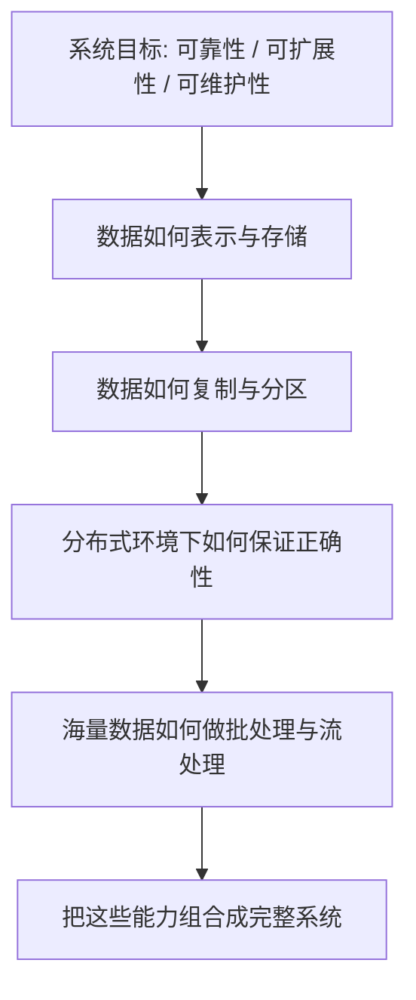

# DDIA - 第 1 课：DDIA 在讲什么与全书地图

## 学习目标（本节结束后你能做到什么）

- 说清楚 DDIA 这本书到底在研究什么问题，而不是把它误解成某个数据库教程。
- 理解“数据密集型应用”这个名字的真正含义，知道它和“计算密集型应用”有什么不同。
- 用自己的话解释 DDIA 全书最核心的三条评估标准：可靠性、可扩展性、可维护性。
- 建立对全书章节结构的整体地图，知道后面各章为什么会按这个顺序出现。
- 初步形成一个阅读姿势：学 DDIA 时重点不是记结论，而是抓住每种设计背后的取舍。

## 内容讲解（核心概念，用类比、例子、图示说清楚）

### 1. 先把这本书“摆正”：DDIA 不是某个技术栈操作手册

很多人第一次听说 DDIA，会以为它是一本“分布式系统大全”，或者“数据库原理强化版”。这两个理解都只说对了一部分。

DDIA 更准确的定位是：  
**它教你如何思考一个以数据为中心的系统应该怎样设计。**

注意这个句子里有两个关键词：

1. 以数据为中心  
   说明讨论重点不是页面样式、前端交互、算法刷题，而是数据怎么存、怎么流动、怎么复制、怎么扩展、怎么保证正确。
2. 如何设计  
   说明书里不是单纯列知识点，而是在反复训练你判断方案的能力。作者真正想让你学会的，不是“某个组件怎么配”，而是“为什么会有人这样设计，它解决了什么问题，又带来了什么代价”。

所以，DDIA 最适合这样的人：

- 已经写过一些业务代码，但对系统为什么这样搭建还说不透；
- 经常听到缓存、MQ、分库分表、主从复制、事务、一致性这些词，但脑子里没有一张完整地图；
- 想从“会用组件”进阶到“理解架构”。

### 2. 什么叫“数据密集型应用”

“数据密集型”这个名字非常关键。如果你不先理解它，后面很多章节会像散点知识。

所谓数据密集型应用，简单说，就是系统的大部分挑战来自：

- 数据量大
- 数据访问频繁
- 数据需要在多个组件之间流动
- 数据要长期保存、检索、同步、纠错、恢复

比如下面这些系统，就明显属于数据密集型应用：

- 电商系统：商品、订单、库存、支付、物流状态都要持续读写
- 社交平台：帖子、评论、点赞、关注关系、消息流都在不断变化
- 日志平台：机器不断产生日志，系统要接收、存储、检索、聚合、报警
- 推荐系统的数据链路：用户行为先写入日志，再进入消息流、离线计算、在线服务

相对地，计算密集型应用更关心 CPU 或 GPU 算得够不够快，比如科学计算、图形渲染、模型训练中的某些阶段。  
它们当然也会处理数据，但主要瓶颈不一定在“数据如何组织与流动”，而可能在“计算本身很重”。

你可以这样粗略记：

- 计算密集型：核心压力在“算”
- 数据密集型：核心压力在“存、取、传、同步、扩展、纠错”

### 3. DDIA 全书其实反复围绕三个目标展开

作者在开篇就给出三个总目标，它们是全书的总纲：

- 可靠性（Reliability）
- 可扩展性（Scalability）
- 可维护性（Maintainability）

这三个词看着像口号，但其实特别实用。你今后看任何系统设计，都可以先问这三个问题。

#### 3.1 可靠性：系统出问题时还能不能扛住

可靠性不是“永远不出错”，因为任何系统都会出错。  
真正的问题是：**当组件出故障、机器宕机、网络抖动、数据写坏、代码有 bug 时，系统能否继续提供合理服务。**

你可以把可靠性想成一辆车在复杂路况下还能安全开。  
不是要求它永远不上坡、不下雨、不遇到坑，而是要求它在这些不理想条件下仍然可控。

在数据系统里，可靠性常常体现为：

- 数据不会轻易丢
- 单机坏了不会全站瘫痪
- 消息重复或乱序时有补救策略
- 某个依赖暂时不可用时系统能降级，而不是整条链路一起死

#### 3.2 可扩展性：负载上来后能不能继续撑

可扩展性关心的是：用户更多了、数据更大了、请求更密了以后，系统还能不能继续工作。

重点不是“现在快不快”，而是“将来压力变大时，系统是不是还有增长空间”。  
比如一个系统在每天 1 万请求时很稳定，不代表在每天 1 亿请求时还稳定。

所以谈可扩展性时，不能只说“这个架构很强”，要说清楚：

- 负载是什么：QPS、吞吐、存储量、活跃用户数、热点比例？
- 瓶颈在哪：CPU、磁盘、网络、锁竞争、单机内存、热点 key？
- 扩展方式是什么：加机器、加副本、分区、缓存、异步化、预计算？

#### 3.3 可维护性：系统是不是越做越难改

很多系统上线初期跑得挺快，但半年后谁都不敢改。  
这类系统的问题往往不在“不能跑”，而在“难以理解、难以排错、难以演进”。这就是可维护性问题。

可维护性本质上是在问：  
**这个系统对人友好吗？**

它通常包含：

- 可理解：新同学能不能看懂
- 可演进：新需求来了能不能改
- 可运维：线上出问题能不能快速定位

如果一个系统性能极强，但只有原作者敢碰，那它的工程质量其实并不高。

### 4. 为什么后面会讲数据模型、复制、分区、事务、一致性

很多初学者看 DDIA 目录会困惑：为什么前面讲数据库模型，中间讲复制分区，后面又跑去讲事务、共识、批处理、流处理？看起来像很多主题拼在一起。

其实它们是顺着同一条主线展开的：

1. 先问：系统要处理什么样的数据，以及怎样存取这些数据  
   这对应数据模型、存储与检索、编码与演化。
2. 再问：当数据量和请求量变大时，怎么让系统撑住  
   这对应复制与分区。
3. 接着问：多个副本、多个节点一上来，正确性怎么保证  
   这对应事务、隔离级别、分布式故障、一致性、共识。
4. 最后问：除了在线读写，海量数据还要怎么分析和加工  
   这对应批处理与流处理。

你会发现，全书不是“东一章西一章”，而是在不断回答这四个问题：  
**数据是什么？怎么存？怎么扩？怎么保证在复杂环境下依然正确？**

### 5. 用一个真实业务场景，把全书主线串起来

假设你要做一个外卖平台。

用户下单时，会出现这些需求：

- 用户要看到商家和商品信息
- 下单后要扣库存、创建订单、发起支付
- 商家和骑手端要实时看到订单状态
- 平台要能统计日活、成交额、履约时长
- 活动期间流量暴涨，系统不能崩

如果你带着 DDIA 的视角看，这里面其实包含了一整套问题：

- 商品、订单、用户关系应该用什么数据模型？
- 查询模式不同，底层更适合索引结构还是日志结构？
- 热门商家流量暴涨时，数据怎么分区避免单点热点？
- 订单数据为什么要复制？复制后主从延迟怎么办？
- 支付成功但订单更新失败时，事务边界怎么划？
- 订单状态流转要不要用消息队列？重复消费怎么办？
- 运营报表适合实时算还是离线批处理？

你看，一个具体业务往下拆，很快就落回 DDIA 的章节主题。  
这就是为什么这本书在后端、架构、数据平台领域很重要，因为它给你的不是某个场景答案，而是可迁移的分析框架。

### 6. 学 DDIA 最重要的阅读姿势：不要只背结论，要抓 trade-off

这本书没有哪一章的结论是“某方案永远最好”。  
它更常见的表达方式是：

- 这个设计在某些条件下很好
- 但它会带来某些副作用
- 如果你的需求变了，结论也会跟着变

例如：

- 复制能提高可用性和读吞吐，但会带来副本延迟与一致性问题
- 分区能支持横向扩展，但会带来热点、跨分区事务、再平衡成本
- 事务能简化正确性，但也可能牺牲吞吐或可用性

所以学 DDIA 时，最该训练的能力不是“记住名词定义”，而是这三步：

1. 这个方案解决了什么问题？
2. 它依赖什么前提？
3. 它会引入什么新代价？

一旦你开始这样思考，这本书就不再只是“知识输入”，而会变成你的系统设计语言。

### 7. 全书地图先在脑中搭起来

你现在可以先把全书想成下面这张图：

如果你后面某一章读着觉得“细节太多”，就把自己拉回这张图：  
它一定是在回答其中某一个层次的问题。

## 小结（3-5 条关键点）

- DDIA 不是数据库命令教程，而是一套设计数据系统的思维框架。
- “数据密集型应用”的挑战主要来自数据的存储、检索、传输、同步、扩展与纠错，而不只是计算本身。
- 全书最核心的总目标是可靠性、可扩展性、可维护性，后面几乎所有章节都可以回到这三个维度来理解。
- 复制、分区、事务、一致性、批处理、流处理不是散乱主题，而是在回答“数据怎么存、怎么扩、怎么在复杂环境中保持正确”。
- 学 DDIA 不能只背定义，必须持续追问每种设计解决什么问题、依赖什么前提、代价是什么。

---

## 检查站：请回答以下问题

1. 用你自己的话解释：为什么 DDIA 不是“某个数据库教程”，而更像一本“系统设计思维书”？
2. “数据密集型应用”和“计算密集型应用”有什么差别？请你各举一个例子。
3. 可靠性、可扩展性、可维护性这三个目标里，你现在最容易混淆的是哪两个？你试着先区分一下。
4. 假设你在做一个电商订单系统，你觉得全书后面为什么一定会讲到“复制”或“分区”？请用直觉回答，不要求标准答案。

请把你的答案直接告诉我，我会根据你的回答决定下一步。
