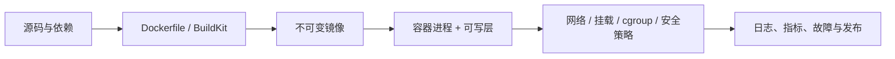

# Docker 专题学习路径

## 学习定位

Docker 最容易学成“命令表”：会写 `docker run`，会抄一个 `Dockerfile`，遇到容器退出、镜像过大、数据丢失、端口不通时却说不清原因。本专题不重复项目课程里已有的部署演示，而是把 Docker 放回它真正的技术链路中：

1. 容器首先是宿主机上的进程，Linux 内核提供隔离与资源治理。
2. 镜像首先是不可变的文件系统差异层和运行配置，容器只是叠加了一个可写层的实例。
3. 数据、网络、安全、信号与资源限制决定了容器能否可靠运行，而不只是能否启动。
4. Compose 适合在单机组织多个服务；进入集群编排以后，需要继续学习 Kubernetes，而不是把两者混为一谈。

素材中的基础定义、常用命令和图片概念已融入下列章节；仓库中已经存在的项目型 Docker 示例与 Kubernetes 深入章节不在这里重复展开。

## 学习目标

完成本专题后，你应该能够：

- 解释容器与虚拟机的隔离边界差异，并说清 namespace、cgroup v2、rootfs 和安全限制分别负责什么。
- 解释镜像层、容器可写层、Copy-on-Write 与构建缓存，写出可复现、较小且不泄露敏感数据的 `Dockerfile`。
- 为一个服务选择合适的数据挂载、网络连接、资源限制、PID 1 与最小权限设置。
- 使用 Compose 组织本地或单机场景的依赖，并明确它不提供集群调度和高可用。
- 从退出码、日志、inspect、OOM、网络与挂载入手排查容器故障。
- 解释 Docker Engine、containerd、OCI 和 Kubernetes 容器运行时之间的关系。

## 章节主线

| 章节 | 核心问题 | 学完后的判断能力 |
| --- | --- | --- |
| [01_容器本质与隔离边界：Namespace、Cgroup_v2、Rootfs与虚拟机.md](./01_容器本质与隔离边界：Namespace、Cgroup_v2、Rootfs与虚拟机.md) | 容器到底是什么，隔离到什么程度？ | 不把容器误认为轻量虚拟机，也不把隔离误认为天然安全 |
| [02_镜像与可复现构建：Layer、OverlayFS、Dockerfile与多阶段构建.md](./02_镜像与可复现构建：Layer、OverlayFS、Dockerfile与多阶段构建.md) | 镜像为何可复用，构建为何会变胖或泄密？ | 能设计可缓存、可审计、精简且可发布的镜像 |
| [03_运行时边界：数据卷、网络、资源限制、PID1与安全加固.md](./03_运行时边界：数据卷、网络、资源限制、PID1与安全加固.md) | 容器运行起来之后，状态和边界怎么管理？ | 能处理持久化、互联、优雅停机、限流和最小权限 |
| [04_Compose与排障运维：本地编排、故障定位、OCI与Kubernetes边界.md](./04_Compose与排障运维：本地编排、故障定位、OCI与Kubernetes边界.md) | 多容器怎么组织，坏了怎么查，走向集群时如何衔接？ | 能操作单机应用栈，建立可重复的排障路径并理解运行时生态 |

## 与已有内容的去重边界

仓库已经有若干相关内容，适合作为完成主线后的案例或扩展阅读：

- [制作 Docker 镜像](../geektime后端-架构/Go%20语言项目开发实战/docs/46%20-%20如何制作Docker镜像？.md) 已有 Go 项目构建示例；本专题重点补充 BuildKit 视角、配置层与文件层的区别、秘密信息与可复现构建。
- [容器化核心技术与原理](../geektime后端-架构/Go进阶%20·%20分布式爬虫实战/docs/50-不可阻挡的容器化：Docker核心技术与原理.md) 已有爬虫容器化与桥接网络案例；本专题补充 cgroup v2、隔离的安全边界与运行约束。
- [Docker Compose 搭建本地爬虫环境](../geektime后端-架构/Go进阶%20·%20分布式爬虫实战/docs/51%20-%20多容器部署：如何利用%20Docker%20Compose快速搭建本地爬虫环境？.md) 已有业务栈实例；本专题强调配置、健康检查、数据保护和排障流程。
- [Kubernetes 学习路径](../Kubernetes/00_学习路径.md) 已深入覆盖 Pod、Service、CNI、存储和编排；Docker 专题只讲进入该阶段前必须理解的 OCI/runtime 衔接，不重复 Kubernetes 对象体系。

## 推荐学习方式

学习 Docker 时，最好始终带着三张图思考：

每学一章，都尝试回答：

1. 这一层的状态保存在哪里，容器删除后还在不在？
2. 这个便利功能的安全边界是什么，默认行为是否足以进入生产？
3. 出故障时，第一条证据从哪里拿，而不是凭经验猜？

## 资料处理说明

本专题根据补充素材整理为文字、命令与 Mermaid 图示。素材图片仅作为理解参考，不复制、不保存到专题目录中。
