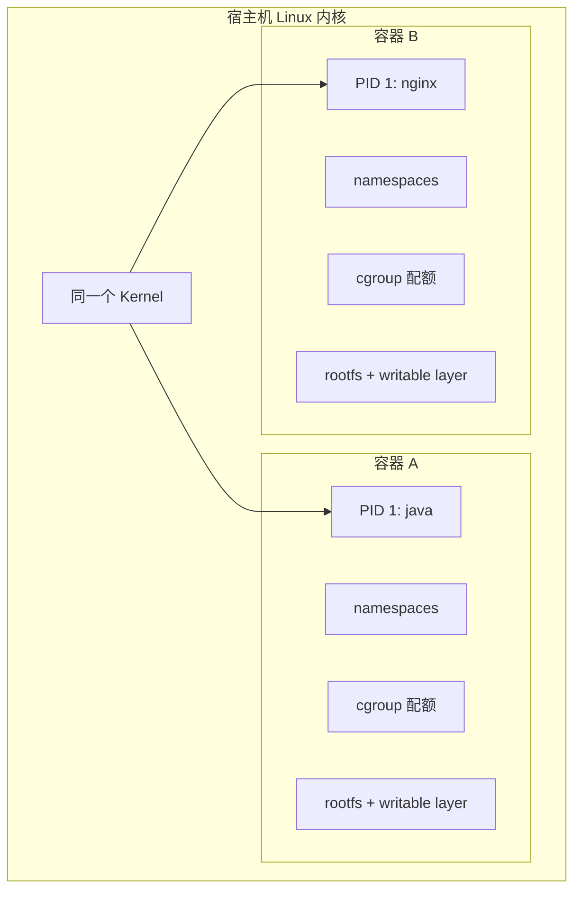
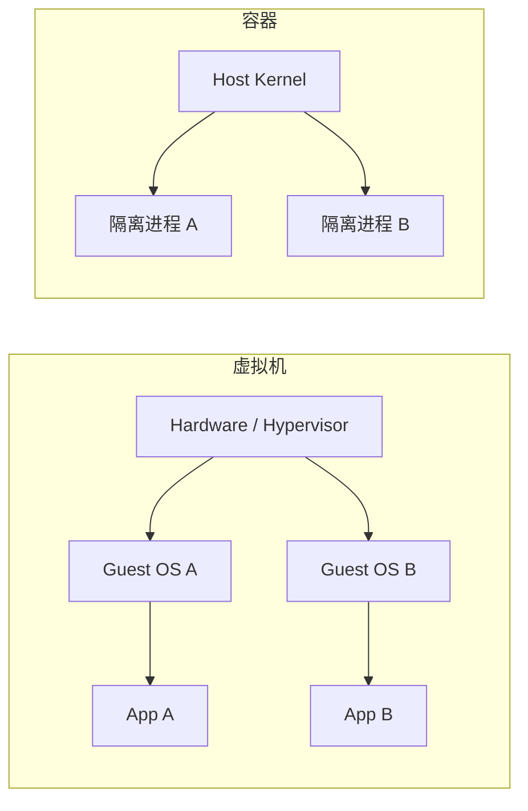

# Docker - 第 1 课：容器本质与隔离边界

## 学习目标（本节结束后你能做到什么）

- 从内核角度解释“容器是受约束的进程”，而不是一台缩小版虚拟机。
- 说清 namespace、cgroup v2、rootfs/挂载视图和安全策略各自解决的问题。
- 比较容器与虚拟机的隔离、启动速度、资源密度和适用边界。
- 面对“容器隔离了，所以一定安全”这种说法，能指出缺失的防护措施。

## 内容讲解（核心概念，用类比、例子、图示说清楚）

### 1. 容器不是另一个内核，而是被限制视野和配额的进程

在 Linux 宿主机上执行一个普通进程，它默认能看到宿主机分配给它的进程关系、网络设备、挂载点和资源。Docker 启动容器时，并没有为应用启动一套新的 Linux 内核；它让该应用仍运行在宿主机内核上，但为它组织一组隔离视图、独立根文件系统和资源规则。

更准确的表达是：

> 容器是由镜像提供用户态文件系统、由 namespace 隔离视图、由 cgroup 管理资源，并附加安全约束的一组宿主机进程。



这解释了两个表面矛盾的现象：容器启动通常比虚拟机快、密度高，因为不必启动 Guest OS；容器的内核隔离边界也天然弱于虚拟机，因为内核漏洞、错误权限或危险挂载可能穿过容器边界。

### 2. Namespace 解决“能看到什么”

namespace 的核心作用是隔离可见性。一个容器里的进程可能自认为 PID 是 `1`，可能只看得到自己的网卡和路由，也只看到自己的根目录；宿主机则仍能看到这个真实进程和它使用的资源。

| namespace | 容器内感受到的隔离 | 常见问题 |
| --- | --- | --- |
| PID | 容器有自己的进程编号树，主进程成为容器内 PID 1 | PID 1 的信号处理和僵尸子进程回收 |
| mount | 看到自身挂载点和 rootfs | 将宿主机敏感目录挂进容器会破坏边界 |
| network | 独立网卡、IP、路由、端口空间 | `127.0.0.1` 只指向当前网络命名空间 |
| UTS | 独立 hostname/domainname | hostname 不等于可发现的服务地址 |
| IPC | 隔离共享内存、消息队列等进程通信 | 跨容器共享 IPC 需要明确理由 |
| user | 容器内用户 ID 可映射到宿主机非特权 ID | 容器内 `root` 不应默认等同宿主机 root |

例如两个容器都能监听 `8080`，原因不是端口冲突消失了，而是它们处于不同 network namespace。只有在发布端口到同一宿主机端口时，如两者都要求 `-p 8080:8080`，冲突才发生。

namespace 只控制视图，并不防止一个进程把 CPU 吃满或把内存耗尽，因此还需要 cgroup。

### 3. Cgroup v2 解决“能用多少、用了多少”

Control Group 将进程组织到资源层级中，对 CPU、内存、I/O、进程数等进行记账和限制。现代 Linux 更常使用 cgroup v2：所有控制器位于统一层级，而不是 v1 中不同资源分别拥有层级。这让资源委派和容器管理器的行为更一致。

常见概念性文件如下，真实路径通常由 systemd 和 Docker 创建的 scope 决定，不应依赖硬编码目录：

| cgroup v2 接口 | 作用 | 线上含义 |
| --- | --- | --- |
| `memory.max` | 内存硬上限 | 超过后可能触发 OOM kill，容器出现退出码 137 |
| `memory.current` / `memory.events` | 当前内存及事件 | 区分是否真的发生 OOM |
| `cpu.max` | CPU 时间配额和周期 | CPU 到顶时通常表现为 throttling，而非进程崩溃 |
| `pids.max` | 可创建进程/线程上限 | 防止 fork bomb，也可能让线程创建失败 |
| `io.max` | 块设备 I/O 限制 | 防止单服务冲击同机其他工作负载 |

Docker 命令把这些规则转化为运行时配置，例如：

```bash
docker run --rm \
  --memory=512m \
  --cpus=1.5 \
  --pids-limit=256 \
  my-api:1.0
```

这不等价于“服务需要多少资源就一定有多少资源”。限制是保护边界，服务还需要监控、容量评估与压测。排查时可以先看 `docker stats` 和 `docker inspect <container>`，再在宿主机深入查看 cgroup 事件。

### 4. Rootfs 与镜像让进程觉得它有一台自己的机器

容器中的 `/bin`、`/lib`、应用文件和默认配置来自镜像层形成的 rootfs。宿主机仍提供内核，镜像里不存在一份可独立启动的内核。因此，同一份 Linux 容器镜像不能凭空在不兼容的内核 ABI 上运行；桌面系统上的 Docker 通常通过一个 Linux VM 提供所需内核。

rootfs 让应用依赖可随镜像分发，但不代表应用产生的数据天然持久。容器运行时叠加的可写层随容器生命周期变化，数据库数据、上传文件、关键日志应进入受管理的挂载或外部系统，这会在第 3 课展开。

### 5. 容器与虚拟机：不是替代关系



| 维度 | 容器 | 虚拟机 |
| --- | --- | --- |
| 内核 | 与宿主机共享 | 每台 VM 拥有 Guest OS 内核 |
| 启动与密度 | 快、开销低 | 较慢、资源开销高 |
| 隔离边界 | 依赖共享内核及安全配置 | 硬件虚拟化边界通常更强 |
| 适合场景 | 服务交付、弹性扩缩、本地依赖 | 强租户边界、不同 OS 内核、敏感隔离 |

生产环境常常二者一起使用：云平台先用 VM 划出租户/节点边界，再在 VM 上运行容器，提高发布效率与资源利用率。

### 6. 隔离不等于安全：最常漏掉的边界

只说“用了 namespace 和 cgroup，因此安全”是不完整的。cgroup 管的是资源，namespace 管的是视图；容器若以特权模式运行、挂载 Docker socket 或宿主机根目录，攻击面仍很大。

基础加固要点包括：

- 应用以非 root 用户运行，必要时启用 user namespace 映射。
- 尽量只读根文件系统，将必须写入的位置显式挂载。
- 删除不需要的 Linux capabilities，例如 `--cap-drop=ALL` 后按需添加。
- 配置 seccomp，并在宿主机使用 AppArmor 或 SELinux 等强制访问控制。
- 不把 `/var/run/docker.sock` 轻易挂给业务容器；拥有它通常等于能控制宿主机上的容器资源。
- 不把生产密钥写入镜像层或普通环境文件，使用受控的秘密注入机制。
- 及时修补宿主机内核与镜像依赖，扫描已发布镜像。

容器的便利来自共享，而安全需要你主动收紧共享的程度。

## 小结（3-5 条关键点）

1. 容器本质是使用宿主机内核的受约束进程，镜像提供用户态文件系统，不提供独立内核。
2. namespace 隔离可见性，cgroup v2 记账和限制资源，rootfs 提供一致依赖；三者职责不同。
3. 容器密度和启动速度优于虚拟机，但共享内核意味着安全边界通常不如 VM 强。
4. 资源限制必须与监控和容量治理结合，退出或变慢不能只凭“容器问题”猜测。
5. 非 root、能力收缩、安全配置、受控挂载与秘密管理，才让隔离接近可用的生产边界。

## 问题 （检测用户对当前章节内容是否了解）

1. 为什么说容器内的 PID 1 仍然是宿主机上的普通进程？namespace 改变了什么，没有改变什么？
2. 一个容器内存到达上限后异常退出，你会通过哪些证据判断是否为 cgroup OOM，而不是手工 `kill`？
3. 为什么两个容器可以都监听容器内的 `8080`，但不一定能都发布到宿主机的 `8080`？
4. 在什么场景下，你会宁愿使用 VM 或 VM 加容器，而不是直接在一台共享宿主机上运行容器？
5. 将 Docker socket 挂入业务容器为什么风险极高？
