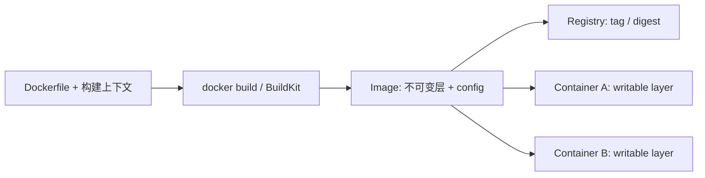
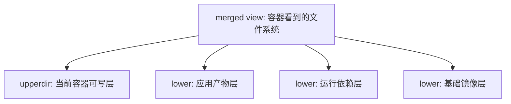

# Docker - 第 2 课：镜像与可复现构建

## 学习目标（本节结束后你能做到什么）

- 区分镜像、容器和仓库，解释镜像层与容器可写层的生命周期。
- 理解 OverlayFS/Copy-on-Write 对体积、性能和持久化的影响。
- 写出具备缓存意识、多阶段构建、非 root 运行和合理启动命令的 `Dockerfile`。
- 避免把秘密、构建垃圾或不可复现的远程内容写入生产镜像。

## 内容讲解（核心概念，用类比、例子、图示说清楚）

### 1. Image、Container、Registry 是三件不同的事

镜像（image）是只读的发布制品：包含应用运行所需文件、文件系统层以及启动配置。容器（container）是镜像运行后的实例：启动进程时额外获得一个可写层和运行参数。仓库（registry）负责按名称、标签或摘要保存和分发镜像，例如私有 registry 或公共镜像仓库。

镜像标签如 `api:1.0` 是可变名称，镜像摘要如 `sha256:...` 才定位具体内容。需要可审计发布时，构建结果应记录 digest，部署时至少避免依赖漂移的 `latest`。



### 2. Layer 与 OverlayFS：读取叠加，写入 copy-up

镜像通常由多个不可变层组成。Linux 上 Docker 常使用 `overlay2` 存储驱动：多个 lower layers 叠成只读视图；容器增加 upper writable layer；应用最终看到 merged view。



当应用只读取基础镜像中的 `/app/app.jar` 时，可以直接读取 lower 层；首次修改这个文件时，OverlayFS 先把它复制到 upper 层再修改，这就是 copy-up。删除 lower 层中的文件也不会改写原层，而会在上层留下“不可见标记”（whiteout）。因此：

- 删除前一层已经写入的大文件，并不会使早先层变小。
- 多个容器可以共享镜像层，但各自的写入互不共享。
- 大量随机写、数据库数据或重要上传文件不应依赖容器可写层。

### 3. “每条 Dockerfile 指令都创建文件层”并不准确

教材常为了直观说每条指令形成一层。更严谨的说法是：`RUN`、`COPY`、`ADD` 会产生文件系统差异层；`ENV`、`CMD`、`ENTRYPOINT`、`USER`、`EXPOSE` 等主要改变镜像配置和历史，不一定产生包含文件变更的新 rootfs diff layer。它们依然会影响缓存键、运行行为或审计结果。

缓存也不是“永远正确的自动更新”：

- `COPY pom.xml .` 的输入内容变化会使该步骤和其后步骤缓存失效。
- `RUN apt-get update` 的外部仓库内容变了，但指令文字不变时，缓存可能仍被复用；需要更新基础镜像、显式刷新策略或锁定依赖。
- 把频繁变化的业务代码放在安装稳定依赖之前，会让每次改代码都重新下载依赖。

所以，构建文件应把稳定、昂贵的步骤放前面，把频繁变化的源码放后面，并保持依赖可锁定。

### 4. 一个可发布的多阶段构建示例

下面以 Java 服务为例。目标不是背语法，而是看到四个原则：构建环境与运行环境分离、利用依赖缓存、最终镜像只携带产物、进程以非 root 和 exec 形式启动。

```dockerfile
# syntax=docker/dockerfile:1
FROM eclipse-temurin:21-jdk-jammy AS build
WORKDIR /src

COPY .mvn/ .mvn/
COPY mvnw pom.xml ./
RUN ./mvnw -B -DskipTests dependency:go-offline

COPY src ./src
RUN ./mvnw -B -DskipTests package

FROM eclipse-temurin:21-jre-jammy AS runtime
RUN groupadd --system app && useradd --system --gid app --home-dir /app app
WORKDIR /app
COPY --from=build --chown=app:app /src/target/service.jar ./service.jar
USER app
EXPOSE 8080
ENTRYPOINT ["java", "-jar", "/app/service.jar"]
```

第一阶段可以拥有 JDK、Maven 缓存和编译工具；最终阶段只需要 JRE 与运行产物。这样不仅镜像更小，还减少运行容器中可被攻击者利用的工具。对 Go 等静态编译服务，最终阶段还可以选择精简的 distroless 镜像；对需要 shell、证书、原生库或排障工具的服务，应根据实际支持成本选择 slim、distroless 或 Alpine，而不是机械认为 Alpine 永远最优。Alpine 的 musl libc 与某些二进制/排障方式可能不兼容。

### 5. Dockerfile 常见指令的工程边界

| 指令 | 应该怎么理解 | 容易踩的坑 |
| --- | --- | --- |
| `FROM` | 选择基础运行环境，可多阶段 | 只写可漂移标签、不检查漏洞或兼容性 |
| `WORKDIR` | 后续命令和启动的工作目录 | 用多段 `RUN cd` 让上下文难追踪 |
| `COPY` | 将明确的本地内容复制入镜像 | 构建上下文过大，把 `.git`、密钥带进去 |
| `ADD` | 还支持本地 tar 自动解包和 URL 获取 | 行为隐含；一般优先 `COPY`，远程下载应校验 checksum |
| `RUN` | 构建期执行并记录文件变更 | 包缓存留在旧层；下载未锁版本导致不可复现 |
| `ARG` / `ENV` | 构建变量与运行环境默认值 | 把密码/token 放进去，它们可能出现在历史或镜像配置中 |
| `CMD` | 默认参数或默认命令，可被运行时覆盖 | shell 形式让信号不能可靠直达应用 |
| `ENTRYPOINT` | 固定可执行入口，常与 `CMD` 参数结合 | 写成包装脚本却不 `exec` 最终进程 |

推荐搭配：

```dockerfile
ENTRYPOINT ["/app/server"]
CMD ["--config=/etc/app/config.yaml"]
```

此时 `docker run image --debug` 可以替换默认参数，而入口仍固定。JSON 数组的 exec form 使应用直接成为容器主进程，有助于收到停止信号；shell form 如 `CMD java -jar app.jar` 常会多包一层 shell。

### 6. 体积、缓存、安全与复现要一起优化

只追求“层越少越好”会带来误解。将软件安装和缓存删除写在同一个 `RUN` 中，确实能避免缓存残留在不可变的前置层，例如：

```dockerfile
RUN apt-get update \
    && apt-get install -y --no-install-recommends ca-certificates curl \
    && rm -rf /var/lib/apt/lists/*
```

但把所有构建动作强塞为一条巨大命令，也会降低缓存复用与可读性。更重要的构建检查表是：

- 使用 `.dockerignore` 排除 `.git`、构建输出、IDE 文件、本地秘密和不需要的大目录。
- 使用依赖锁文件，固定基础镜像版本，关键环境用 digest 提升可追溯性。
- 不在 `ARG`、`ENV`、`COPY` 或某个临时后又删除的层里写入生产秘密；删除并不能从旧层抹掉内容。构建期秘密应使用 BuildKit secret mount，运行期秘密应由运行平台注入。
- 通过多阶段构建仅复制运行产物，不把编译器、包管理缓存和测试数据带入最终镜像。
- 对镜像进行漏洞扫描、SBOM/来源记录和发布 digest 记录。

### 7. 为什么生产构建不依赖 `docker commit`

`docker commit` 可以把一个容器的当前可写层保存为新镜像，适合临时调查现场或快速实验。但它没有清晰、可评审的构建配方，容易带入缓存、日志、手工改动甚至秘密。生产镜像应来自版本管理中的 `Dockerfile` 和确定的构建流程，使团队能够重放、审计和修复。

## 小结（3-5 条关键点）

1. 镜像是不可变发布制品，容器是在镜像之上增加运行配置与可写层的实例，registry 负责分发。
2. OverlayFS 的 copy-up 和不可变层解释了共享、缓存、镜像变胖及“删除文件仍不瘦”的原因。
3. `RUN`、`COPY`、`ADD` 主要产生文件差异层；配置型指令也会影响行为与缓存，不能用简单口号替代分析。
4. 多阶段构建、`.dockerignore`、非 root、exec 入口与秘密隔离共同构成可发布镜像的基础。
5. 可复现、可审计和安全优先于盲目追求极小层数或某一种基础镜像。

## 问题 （检测用户对当前章节内容是否了解）

1. 为什么在一个 `RUN` 中下载一个 500 MB 压缩包、下一条 `RUN` 再删除它，最终镜像仍可能很大？
2. `CMD ["--port=8080"]` 与 `ENTRYPOINT ["/app/server"]` 组合后，运行时传入其他参数会发生什么？
3. 为什么把 token `COPY` 进镜像、使用完后再删除仍不安全？
4. 某项目每改一行源码都重新下载所有依赖，你会如何重新排序 Dockerfile 以改善缓存？
5. `docker commit` 在什么极少数场景有价值，为什么不应作为生产发布方式？
