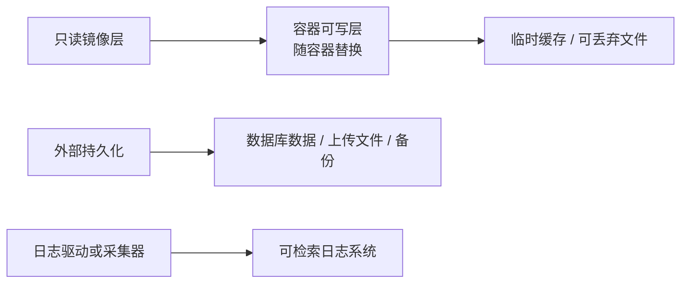

# Docker - 第 3 课：运行时边界

## 学习目标（本节结束后你能做到什么）

- 判断哪些数据能够随容器消失，哪些必须落到持久化或外部服务。
- 为单机容器选择 bridge、host、none、共享网络栈等网络模式，并正确理解端口映射和服务发现。
- 配置基础资源限制、优雅终止与 PID 1 行为，降低线上失控风险。
- 用最小权限视角审核一个 `docker run` 或 Compose 服务定义。

## 内容讲解（核心概念，用类比、例子、图示说清楚）

### 1. 容器可写层不是数据仓库

容器启动后，应用写入其根文件系统的内容落到该容器的可写层。容器被删除或重新创建后，这一层不再是可依赖的业务状态。日志写在容器内部且不采集、数据库写在容器层、上传文件未挂载，都是“重建容器后数据不见了”的直接原因。



Docker 提供三类常见挂载：

| 类型 | 数据放在哪里 | 适合什么 | 要注意什么 |
| --- | --- | --- | --- |
| named volume | Docker 管理的宿主机存储位置 | 本地开发、单机持久状态、数据库演示 | 仍需要备份；容器高可用不等于数据高可用 |
| bind mount | 明确的宿主机路径映射到容器 | 配置注入、开发代码挂载、受控主机集成 | 主机路径耦合和权限风险大，别随意挂 `/` 或 Docker socket |
| tmpfs | 只存在内存中 | 不需落盘的临时敏感材料或高速临时文件 | 重启即失；占用内存，也受资源限制影响 |

单机 Docker 的命名卷比在容器可写层放数据库靠谱，但“生产数据一律用 Docker volume”仍然过度简化：多机环境通常把数据库托管到外部存储服务，或在编排平台中用明确的持久卷、备份与恢复方案管理。持久化的真正问题是数据生命周期、备份、恢复、一致性和权限，而不只是 `-v` 参数。

```bash
docker volume create pg-data
docker run -d --name db \
  --mount type=volume,source=pg-data,target=/var/lib/postgresql/data \
  postgres:16
```

删除容器不应顺手删除该数据卷；删除卷之前必须确认备份与消费者。

### 2. 网络命名空间：容器里的 localhost 只代表自己

应用容器连接 `127.0.0.1:5432`，访问的是应用容器自己的 network namespace，而不是另一个数据库容器，也不是宿主机。多个服务互联时，推荐创建用户自定义 bridge 网络，通过服务名解析和容器端口通信。

```bash
docker network create app-net
docker run -d --name db --network app-net postgres:16
docker run -d --name api --network app-net -p 8080:8080 my-api:1.0
```

此时 `api` 连接地址应为 `db:5432`。`-p 8080:8080` 的含义是将宿主机入口发布给外部访问；同一 Docker 网络内的服务无需先绕到宿主机发布端口。容器 IP 可能随着重建变化，所以不应把查询出来的临时 IP 写死在配置里。

| 网络模式 | 特征 | 合理用途 | 代价/误区 |
| --- | --- | --- | --- |
| user-defined `bridge` | 同主机隔离网络，带名称解析 | 普通 Web/API/数据库组合 | 是单机网络，不等于跨主机服务网格 |
| 默认 `bridge` | 默认网桥，能力较基础 | 简单临时容器 | 用户自定义 bridge 通常更便于名称发现和隔离 |
| `host` | 直接使用宿主机网络栈 | 极少数需要避免 NAT 或监听主机网络的场景 | 端口隔离消失，跨平台行为也有限制 |
| `none` | 无外部网络 | 离线转换、强化隔离的任务 | 不能访问依赖和外部服务 |
| `container:<id>` | 与另一个容器共享网络栈 | sidecar 式紧耦合实验 | 端口冲突、生命周期耦合，需要谨慎 |
| `overlay` | 面向跨主机的 Docker 集群网络 | Swarm 等特定集群方案 | 不是普通单机 Compose 的默认选择 |

Docker bridge 在 Linux 上通常由 network namespace、veth pair、Linux bridge 与 NAT/转发表协作实现。进入 Kubernetes 后，Pod 网络、Service 和 CNI 会成为新的抽象，详见 [Kubernetes 网络专题](../Kubernetes/07_Kubernetes网络底层专题：CNI、kube-proxy、iptables与eBPF.md)。

### 3. 资源限制：把故障限制在容器，而不是拖垮整机

一个无上限的容器可以在共享宿主机上抢占内存、CPU 或创建大量进程。下面的运行示例表达的是边界，而非万能生产模板：

```bash
docker run -d --name api \
  --network app-net \
  -p 8080:8080 \
  --memory=512m \
  --cpus=1.5 \
  --pids-limit=256 \
  --read-only \
  --tmpfs /tmp:rw,noexec,nosuid,size=64m \
  --cap-drop=ALL \
  --security-opt no-new-privileges=true \
  my-api:1.0
```

- `--memory` 触及上限时可能导致进程被内核终止，应配合应用堆设置和告警。
- `--cpus` 达到限制通常表现为延迟上升与 CPU throttling，不一定出现退出。
- `--pids-limit` 防止进程/线程失控，但太小也会导致线程池扩张失败。
- `--read-only` 要求应用把 `/tmp`、上传或运行时生成文件显式放到允许写的位置。
- `--cap-drop` 和 `no-new-privileges` 降低权限提升路径；若服务确需监听低端口或执行特殊系统操作，再最小化增加能力。

资源约束应与应用容量模型一致。Java 服务若容器上限为 512 MB，却把堆最大值设为 512 MB，还会忽略元空间、线程栈、直接内存和 native 开销，OOM 仍很常见。

### 4. PID 1、信号与优雅停机

Docker 认为容器主进程结束时容器生命周期结束。这个主进程在容器 namespace 中是 PID 1，它有两个工程责任：

1. 收到 `docker stop` 发出的终止信号后，应用应停止接收新请求、完成必要清理，并在超时前退出。
2. 若应用会产生子进程，应正确回收退出的子进程，避免僵尸进程累计。

常见错误是用 shell 包装应用却没有 `exec`：

```sh
#!/bin/sh
java -jar /app/service.jar
```

这样 shell 成为 PID 1，信号未必按预期转给 Java。更好的脚本结尾是：

```sh
#!/bin/sh
exec java -jar /app/service.jar
```

或者直接在镜像中使用：

```dockerfile
ENTRYPOINT ["java", "-jar", "/app/service.jar"]
```

对于会启动子进程但自身不善于回收的程序，可考虑 `docker run --init`，让轻量 init 进程承担信号转发与子进程回收。它不能替代应用自己的优雅停机逻辑。

### 5. 安全与配置：运行方便不能以放开宿主机为代价

镜像与运行时配置应分离：镜像携带代码、运行库与非敏感默认设置；环境差异和秘密在运行时注入。把数据库密码写进 Dockerfile、提交到 Compose 文件、作为镜像环境变量默认值，都可能通过仓库历史、镜像 inspect 或构建缓存泄露。

审核运行配置时应问：

- 是否真的需要以 root 运行？容器文件、挂载目录是否给予了最小权限？
- 是否真的需要 `--privileged`、宿主机 PID/network 或 Docker socket？这些通常应当视为高风险特例。
- 配置和密钥来源是否可轮换、可审计？日志是否可能把密钥打印出来？
- 对外只发布必要端口了吗？数据库是否误发布到公网入口？
- 日志是否写到标准输出/标准错误并由平台采集，还是悄悄堆积在容器层？

安全不是最后才加的一组参数，而是镜像、挂载、网络、权限和操作流程共同形成的运行边界。

## 小结（3-5 条关键点）

1. 容器可写层适合临时状态，不适合承担需恢复的业务数据；持久化必须考虑备份和生命周期。
2. 容器的 `localhost` 只属于其 network namespace，服务互联优先依赖自定义 bridge 网络中的名称解析。
3. 内存、CPU、进程数和写入权限的限制能够缩小故障影响，但需要结合应用运行模型与监控。
4. PID 1 决定容器退出和信号处理质量，exec form、优雅停机和必要的 init 进程都很重要。
5. 最小权限、受控秘密、有限端口和避免危险宿主机挂载，是运行时安全的基本线。

## 问题 （检测用户对当前章节内容是否了解）

1. 为什么把数据库文件写入容器根文件系统会让“容器重建”变成危险操作？named volume 又没有自动解决哪些问题？
2. API 容器连接数据库容器时，为什么推荐 `db:5432` 而不是数据库容器的临时 IP 或 `localhost:5432`？
3. 服务响应变慢但没有退出，你如何判断是 CPU throttling、下游延迟还是内存问题？
4. 一个 entrypoint shell 不使用 `exec`，在部署停止期间可能造成什么影响？
5. 哪些运行参数或挂载一出现，就应触发安全审查而不是默认接受？
