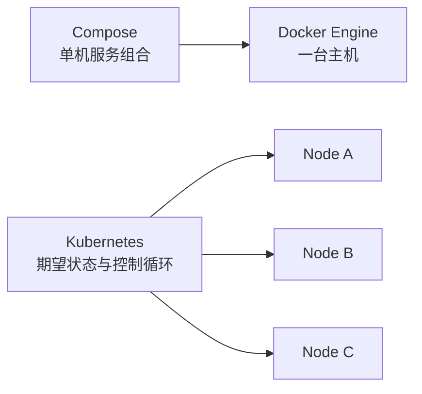
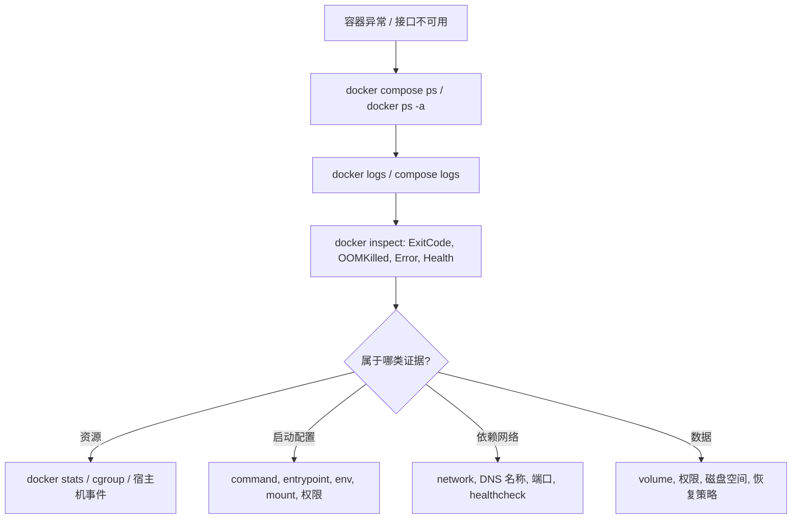
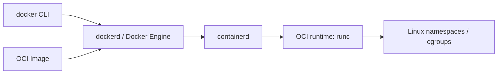

# Docker - 第 4 课：Compose 与排障运维

## 学习目标（本节结束后你能做到什么）

- 用 Compose 描述一个单机多容器应用，并理解网络、卷、健康检查和配置注入的职责。
- 明确 Compose 与 Kubernetes 的边界，不把“多容器启动”误认为“生产集群编排”。
- 建立从状态、日志、退出码、资源、网络到挂载的故障定位顺序。
- 解释 Docker Engine、containerd、runc、OCI 与 Kubernetes CRI 之间的关系。

## 内容讲解（核心概念，用类比、例子、图示说清楚）

### 1. Compose 解决的是可重复的单机应用栈

手工执行若干条 `docker run` 容易丢失参数：某次忘记网络，某次端口不同，某次数据卷名称变了。Compose 让服务、网络、卷和启动依赖写入一份声明式 YAML，适合开发测试、演示环境、CI 依赖服务以及可以接受单主机边界的小型运行场景。

下面示例表达一个 API、PostgreSQL、Redis 的本地栈：

```yaml
services:
  api:
    build: .
    ports:
      - "8080:8080"
    environment:
      DB_HOST: db
      REDIS_HOST: cache
    depends_on:
      db:
        condition: service_healthy
      cache:
        condition: service_started
    networks: [backend]

  db:
    image: postgres:16
    environment:
      POSTGRES_DB: app
      POSTGRES_USER: app
      POSTGRES_PASSWORD_FILE: /run/secrets/db_password
    secrets: [db_password]
    volumes:
      - pg-data:/var/lib/postgresql/data
    healthcheck:
      test: ["CMD-SHELL", "pg_isready -U app -d app"]
      interval: 5s
      timeout: 3s
      retries: 20
    networks: [backend]

  cache:
    image: redis:7
    networks: [backend]

networks:
  backend:

volumes:
  pg-data:

secrets:
  db_password:
    file: ./secrets/db_password.txt
```

这个例子有几处边界需要看清：

- 服务在同一个 `backend` 网络中，应使用 `db:5432` 与 `cache:6379` 访问依赖，不需要把数据库端口发布到宿主机。
- `ports` 只给需要从宿主机进入的 API 使用，降低无意暴露数据库的风险。
- `depends_on` 配合 healthcheck 能降低“依赖还没准备好就启动”的失败率，但不能替代应用自己的重试、超时与降级。
- `secrets` 的文件仍须由使用者在单机上安全提供和管控，不能把示例秘密文件提交进代码库。
- `pg-data` 使数据库容器重建后仍能看到本机数据，但它没有带来跨节点容灾、备份或数据库高可用。

常用生命周期命令是：

```bash
docker compose up -d --build
docker compose ps
docker compose logs -f api
docker compose exec api sh
docker compose stop
docker compose down
```

`docker compose down` 通常删除本项目创建的容器和网络，不默认删除命名卷；加上 `--volumes` 会删除卷，涉及数据时必须慎用。

### 2. Compose 不提供集群控制循环

Compose 能声明“这一台 Docker 主机上应运行哪些服务”，但它不负责跨机器调度、副本重新分布、滚动发布控制、节点故障迁移、持久卷调度或多租户策略。单机宿主机宕机时，同机所有 Compose 服务仍会一起不可用。



因此选择路径通常是：

- 本地开发/集成验证：Compose 能以低成本表达依赖栈。
- 单机可容忍中断的服务：Compose 可使用，但仍需备份、监控、重启策略和发布纪律。
- 要求跨节点容错、弹性、滚动发布和平台化权限治理：进入 [Kubernetes 专题](../Kubernetes/00_学习路径.md)，不能靠扩写 Compose 文件补齐。

### 3. 容器秒退或不健康：按证据排查，不按猜测重启

容器失败的第一原则是先保留证据。重复重启可能滚动掉日志、反复写坏数据或掩盖根因。可以使用如下路径：



#### 容器立即退出

容器的生命与主进程绑定。若镜像只是启动一个后台进程，然后入口脚本结束，容器也会结束。先检查：

```bash
docker inspect --format '{{.State.Status}} {{.State.ExitCode}} {{.State.OOMKilled}} {{.State.Error}}' api
docker logs --tail=200 api
docker image inspect my-api:1.0 --format '{{json .Config.Entrypoint}} {{json .Config.Cmd}}'
```

退出码 `137` 表示进程收到 `SIGKILL`，内存 OOM 是高频原因，但不是唯一原因；人工 `docker kill`、宿主机行为也可能产生它。必须结合 `.State.OOMKilled`、宿主机日志与内存指标判断，不能看到 137 就直接下结论。

#### 启动时想进入容器排查

运行中的容器优先使用 `docker exec -it <name> sh` 打开新的排查进程；`docker attach` 连接的是主进程输入输出，误操作可能影响服务。若容器启动即失败，可以临时覆盖入口检查文件、权限和配置：

```bash
docker run --rm -it --entrypoint sh my-api:1.0
```

该方式只适用于镜像中存在 shell 的情况；distroless 镜像应通过可观测信息、专用 debug 镜像或受控临时调试容器排查，而不是因此把生产镜像塞满工具。

#### 能启动但连不上依赖

依次核验服务名是否解析、服务是否在同一网络、应用是否误连接 `localhost`、目标监听端口是否为容器端口，以及仅对外访问时才需要的宿主机发布端口。健康检查失败还应区分“进程已启动但尚未 ready”和“配置根本错误”。

#### 数据与磁盘异常

核验挂载是否实际生效、容器用户是否有目录权限、Docker 主机磁盘和 inode 是否耗尽、备份是否可恢复。数据库容器切勿为了“快速重建”而随意删除数据卷。

### 4. `build`、`commit`、清理与可运维性

运行中的容器手改后执行 `docker commit` 能快速保存现场，但不应变成发布流程：修改历史不透明、不可审查，且可能携带秘密或临时文件。正确流程是修复 Dockerfile/配置，构建新的有版本镜像，再以新容器替换旧容器。

主机长期构建和运行会累积镜像、停止的容器、构建缓存和网络。清理前先查看占用和消费者：

```bash
docker system df
docker ps -a
docker volume ls
docker image ls
```

`docker system prune` 会清除未使用对象；加入 `--volumes` 会触及卷数据。清理命令不应被当作无脑定时任务，尤其不应在不清楚数据归属时对生产主机执行。

### 5. Docker、OCI 与 Kubernetes：镜像仍可用，运行链路变了

现代 Docker 使用一个分层链路完成容器管理，可以简化理解为：



OCI 定义镜像格式和运行时规范，因此通过 Docker 构建的符合规范的镜像并不只属于 Docker Engine。Kubernetes 的 kubelet 通过 CRI 与容器运行时交互，当前常见运行时是 containerd 或 CRI-O。Kubernetes 自 `1.24` 起移除了内置的 dockershim：这意味着它不再通过该适配层把 Docker Engine 当作运行时，并不意味着 Docker 构建的 OCI 镜像不能部署到 Kubernetes。

Docker 负责把一个服务可靠封装和在主机上运行；Kubernetes 关注跨节点的期望状态、调度、服务发现、扩缩与治理。理解这条边界，能避免面试和架构讨论中把“镜像格式”“容器引擎”“集群编排器”混成一个概念。

## 小结（3-5 条关键点）

1. Compose 用声明式文件组织单机多容器栈，适合开发和有限单机场景，但不是高可用集群编排器。
2. 服务互联依靠共享网络和名称发现，healthcheck/依赖启动不能替代应用重试与容错。
3. 排障应从状态、日志、inspect 与可验证证据展开；退出码 137 需要验证 OOM，而不是凭经验定案。
4. 生产镜像应通过可复现构建发布，清理卷和主机资源前必须确认数据责任。
5. Docker 镜像遵循 OCI 生态，Kubernetes 1.24 移除 dockershim 不等于抛弃 Docker 构建的镜像。

## 问题 （检测用户对当前章节内容是否了解）

1. Compose 中 API 和数据库同处一个网络时，为什么通常只对外发布 API 端口，而不发布数据库端口？
2. `depends_on` 已设置数据库 healthcheck，为什么 API 仍应实现连接重试和超时？
3. 一个容器退出码为 `137`，你需要拿到哪些证据后才能判断它发生了 OOM？
4. `docker compose down --volumes` 与普通 `down` 的风险差异是什么？
5. Kubernetes 移除 dockershim 后，为什么团队仍然可以使用 Dockerfile 构建部署到 Kubernetes 的应用镜像？
