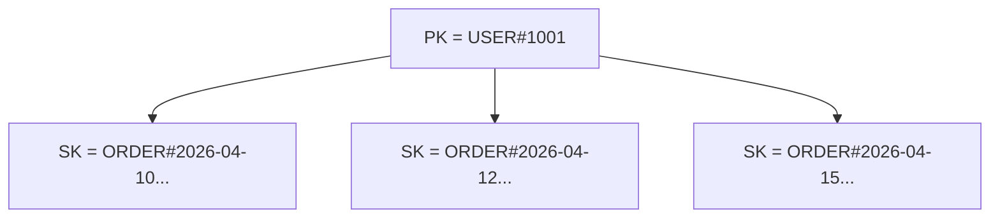

# DynamoDB - 第 2 课：建模核心：访问模式优先、主键设计与单表思维

## 学习目标（本节结束后你能做到什么）

- 理解 DynamoDB 为什么强调“先列访问模式，再建模”。
- 分清 Partition Key、Sort Key 在建模中的职责。
- 理解 Single Table Design 为什么被反复提到。
- 能把一个简单业务从“关系型思维”改写成“DynamoDB 思维”。

## 内容讲解（核心概念，用类比、例子、图示说清楚）

### 1. 为什么 DynamoDB 建模从“查询清单”开始

在 MySQL 里，我们常常先建几张表：

- user
- order
- order_item

后面需要什么查询，就写 SQL，必要时再补索引。

但在 DynamoDB 里，如果你也这么干，后面会很痛苦。因为 DynamoDB 不鼓励你做任意组合查询，它鼓励你做的是：

- 按主键查
- 按排序键范围查
- 按预先设计好的索引查

所以你必须先问业务几个问题：

- 我最常见的查询是什么？
- 这个查询是按谁查？
- 一次拿一条，还是拿一组？
- 需要按时间顺序取吗？
- 需要按状态筛吗？

这些答案，会直接决定主键和索引怎么设计。

### 2. 什么是访问模式优先

访问模式优先，英文常说 `Access Pattern First`，意思不是一句抽象口号，而是一个非常落地的方法：

先写出系统的核心查询动作，再反推数据怎么存。

比如订单系统，你可能会有下面这些查询：

1. 根据订单 ID 查询订单详情
2. 查询某个用户最近 20 条订单
3. 查询某个商户某天的订单
4. 查询状态为 `PAID` 且待发货的订单

这 4 个查询长得就完全不一样，它们对主键和索引的要求也完全不一样。

所以 DynamoDB 的第一步不是“我要建一张订单表”，而是：

**我要先把这 4 类查询列成清单。**

### 3. Partition Key 和 Sort Key 分别在干什么

#### 3.1 Partition Key

Partition Key 决定：

- 数据会按什么逻辑被路由
- 相同分区键的数据会聚到一起

简单理解，它先回答的是：

**这一批数据属于谁？**

例如：

- `USER#1001`
- `MERCHANT#2002`

#### 3.2 Sort Key

Sort Key 决定：

- 同一个分区里的数据怎么排序
- 你能不能在同一个分区里做范围查询

它更像是在回答：

**这一批数据内部怎么排？**

例如：

- 时间戳
- `ORDER#2026-04-15T10:00:00`
- 状态拼接时间

### 4. 一个最经典的例子：用户订单列表

如果你只关心“查某个用户最近的订单”，那建模思路可以是：

- `PK = USER#1001`
- `SK = ORDER#2026-04-15T10:00:00#12345`

这样你就能：

- 通过 Partition Key 把同一用户的数据聚到一起
- 通过 Sort Key 让订单按时间排好

于是“查最近 20 条订单”就自然了。

这就是 DynamoDB 最舒服的时刻：

**当你的查询天然就是某个分区下的一段有序数据时，它会非常顺。**

### 5. 单表设计为什么会被反复提到

Single Table Design 的意思不是“永远只能有一张表”，而是：

**把一组经常一起访问、能通过统一主键模式组织起来的实体放进同一张表里。**

在 DynamoDB 里，单表设计流行的原因有两个：

1. Query 最擅长查“同一个 PK 下的一组数据”
2. 如果不同实体刚好会一起被访问，那放同一张表可能更自然

例如一个电商场景里，你可以让：

- 用户资料
- 用户订单
- 用户地址

都挂在 `PK = USER#1001` 下面，只是 `SK` 前缀不同：

- `PROFILE`
- `ORDER#...`
- `ADDRESS#...`

这样查“某用户相关数据”时就会非常顺。

### 6. 但不要把单表设计神化

单表设计常被讲得很玄，甚至像宗教。

其实它只是一个手段，不是目的。

你要问的不是：

“是不是大厂都用单表设计？”

而是：

“这些实体有没有明显共享访问路径，放一起会不会更自然？”

如果没有，那分表完全没问题。

所以更准确的说法是：

**单表设计适合访问模式有明显聚合关系的业务，不适合机械模仿。**

### 7. DynamoDB 建模时最常见的关系型误区

#### 误区一：实体先拆得很干净

看起来很规范，但后面一查业务就发现：

- 一个页面要跨很多表补数据
- DynamoDB 又没有你熟悉的 Join

于是模型反而变差。

#### 误区二：觉得后面加个索引就行

在 DynamoDB 里，加 GSI 不是“补一棵便宜的索引树”，而是：

- 新增一条访问路径
- 新增写放大
- 新增成本

所以索引不是随手补的。

#### 误区三：先存，再想怎么查

这在 DynamoDB 里是最危险的。

因为一旦主键设计偏了，后面很多查询会被迫走 Scan，系统体验会直线下降。

### 8. 一个很实用的建模步骤

以后你做 DynamoDB 表设计时，可以按这个顺序来：

1. 列出核心访问模式
2. 给每个访问模式标“按谁查”“取一条还是一组”“要不要排序”
3. 看看能不能用一个 PK + SK 模式承接掉大部分查询
4. 剩下不能承接的，再考虑 GSI
5. 最后再决定是一张表还是多张表

这套顺序非常重要，因为它会让你少走很多弯路。

## 小结（3-5 条关键点）

- DynamoDB 建模的起点不是实体关系，而是访问模式清单。
- Partition Key 决定“聚在一起”，Sort Key 决定“在这一组里怎么排”。
- Single Table Design 的本质是围绕共享访问路径组织数据，而不是追求形式上的“一张表”。
- DynamoDB 最常见的建模失败，往往来自把关系型数据库的思维直接搬过来。

## 问题 （检测用户对当前章节内容是否了解）

1. 为什么 DynamoDB 设计表结构时，必须先写访问模式清单？
2. Partition Key 和 Sort Key 在职责上分别解决什么问题？
3. Single Table Design 的本质到底是什么？什么时候适合，什么时候不适合？
4. 如果一个查询只能通过 Scan 才能完成，你觉得更可能是业务本来就不适合 DynamoDB，还是模型设计有问题？
