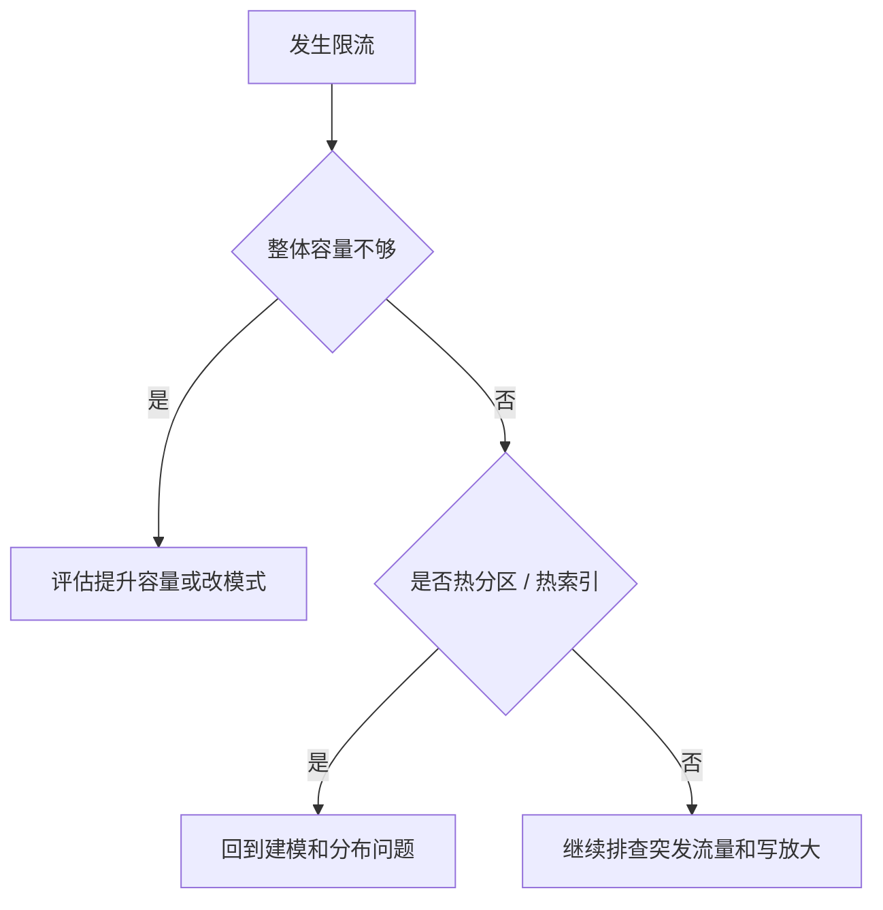

# DynamoDB - 第 6 课：容量与成本：RCU、WCU、On-Demand、Auto Scaling 与限流

## 学习目标（本节结束后你能做到什么）

- 理解 RCU 和 WCU 在 DynamoDB 里到底代表什么，不再把它们当成神秘单位。
- 分清 Provisioned 和 On-Demand 两种容量模式的适用场景。
- 理解 Auto Scaling 为什么能帮忙，但不是万能护身符。
- 明白限流（Throttling）在 DynamoDB 中为什么常见，以及它和热点问题的关系。

## 内容讲解（核心概念，用类比、例子、图示说清楚）

### 1. DynamoDB 为什么不像 MySQL 那样直接聊 QPS

MySQL 常说：

- 这台实例能扛多少 QPS

但 DynamoDB 更喜欢从“容量单位”去描述读写。

原因在于它是托管服务，而且它想把资源控制变成一种显式模型：

- 你要多少读能力
- 你要多少写能力
- 你愿意花多少钱

所以你在 DynamoDB 里，脑子里不能只有“请求量”，还要有：

**请求量最终会折算成多少读写容量消耗。**

### 2. RCU 和 WCU 到底是什么

可以先用一个最简单的工程理解：

- `RCU`：读容量单位
- `WCU`：写容量单位

它们不是单纯“读一次算 1、写一次算 1”，而和：

- item 大小
- 一致性要求

都有关系。

所以 DynamoDB 里的一个很重要思维是：

**同样一条业务请求，不同 item 大小、不同一致性选择，消耗的容量并不一样。**

### 3. 为什么成本感知在 DynamoDB 里特别重要

因为 DynamoDB 很容易给人一种错觉：

- 不用自己运维
- 自动扩缩容
- AWS 托管很省心

于是大家就容易忽略另一件事：

**省运维，常常换来更强的容量和账单感知。**

你如果模型设计不合理：

- Scan 太多
- GSI 太多
- item 太大
- 热点太集中

最后表面上系统还能跑，账单和限流先来教育你。

### 4. Provisioned 和 On-Demand 怎么选

#### Provisioned

你提前声明大致的读写容量。

优点：

- 可预测
- 量稳定时更容易控成本

缺点：

- 业务波动大时更容易配不准

#### On-Demand

按实际请求自动伸缩，AWS 帮你吸收更多波动。

优点：

- 更省心
- 业务峰谷变化大时更友好

缺点：

- 长期稳定高流量下，成本未必最优

一个很粗的判断方法：

- 业务量稳定、对成本敏感：优先认真评估 Provisioned
- 流量不稳定、变化快、想省运维心智：On-Demand 往往更自然

### 5. Auto Scaling 能解决什么，不能解决什么

Auto Scaling 确实很有用，它能帮你根据负载变化自动调高或调低 Provisioned 容量。

但它不是万能的，至少有两个边界要记住：

1. 它有反应时间，不是无限即时
2. 它解决的是整体容量调节，不直接解决热分区

这点非常关键。

很多人看到限流，第一反应就是：

“是不是表总吞吐不够，调 Auto Scaling 就好了？”

不一定。

如果问题本质是热点集中在少数分区，那 Auto Scaling 只能部分缓解，不能从根上修正分布问题。

### 6. DynamoDB 为什么会限流

限流并不一定是坏事，它是系统在保护自己。

常见原因有：

- 你真的超出了配置容量
- 突发流量太快，自动扩缩来不及
- 某些分区太热，局部先爆
- 索引也在同步写，导致实际消耗比想象中高

所以 DynamoDB 的限流问题，很多时候不是一句“加资源”能回答的。

你要先判断：

### 7. GSI 会让成本上升，这一点要反复记

你每多一个 GSI，通常意味着：

- 写主表一次
- 还要同步写索引一次或多次

所以成本不只是“表的吞吐”，还包括：

- 索引的吞吐
- 索引的存储

这也是为什么 DynamoDB 的容量问题，和建模问题是强耦合的。

### 8. 一个特别常见的误区：只盯吞吐，不盯 item 大小

很多人讨论 WCU/RCU 时，只盯请求数，却忽略：

- item 大小会直接影响容量消耗

所以工程上，你不仅要问：

- 每秒多少请求

还要问：

- 每次读写的 item 大概多大
- 会不会一次返回很多 projection
- 是否存在大字段重复进多个索引

### 9. DynamoDB 成本控制最实用的几个抓手

1. 减少不必要的 GSI
2. 控制 item 大小
3. 避免 Scan
4. 用稀疏索引减少无效索引数据
5. 根据业务波动选择合适的容量模式
6. 对热点流量做前置缓冲和本地缓存

这些抓手本质上都是一句话：

**让系统只为真正有价值的访问路径付费。**

## 小结（3-5 条关键点）

- DynamoDB 的容量和成本模型是显式的，不能只看 QPS。
- RCU/WCU 与 item 大小、一致性和访问路径密切相关。
- Provisioned 更适合稳定负载，On-Demand 更适合波动负载。
- Auto Scaling 能帮忙调容量，但不能根治热分区问题。
- 限流的根因可能是整体容量不够，也可能是分区偏斜或索引写放大。

## 问题 （检测用户对当前章节内容是否了解）

1. 为什么 DynamoDB 里不能只谈请求量，而还要谈容量单位和 item 大小？
2. Provisioned 和 On-Demand 的核心取舍是什么？
3. Auto Scaling 为什么不能彻底解决热分区？
4. 如果一张表的账单越来越高，你会优先从哪几个方向排查？
