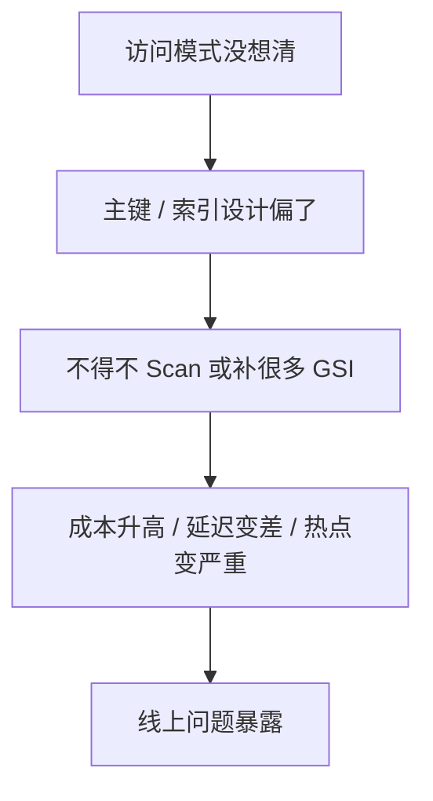

# DynamoDB - 第 8 课：常见坑与面试追问：分页、1MB 限制、批量操作、反模式与排障

## 学习目标（本节结束后你能做到什么）

- 掌握 DynamoDB 最常见的工程坑，而不是只会概念题。
- 理解分页、1MB 返回限制、批量操作这些看似细节却非常重要的问题。
- 能总结出 DynamoDB 常见反模式，并形成面试表达闭环。
- 对线上排障建立一个初步的分析框架。

## 内容讲解（核心概念，用类比、例子、图示说清楚）

### 1. DynamoDB 真正常见的坑，往往不是 API，不是权限，而是“理解偏了”

很多人用 DynamoDB 出问题，不是因为不会写 SDK，而是因为下面这些认知没立住：

- 以为它能像 MySQL 一样随便查
- 以为加个 GSI 就能补救一切
- 以为 On-Demand 就不会限流
- 以为 TTL 能精确定时删除
- 以为分页就是 offset + limit

所以这节要做的，是把这些非常真实的坑讲透。

### 2. 分页为什么和 MySQL 完全不是一回事

在 MySQL 里，大家很熟悉：

- `LIMIT 1000, 20`

但 DynamoDB 没有 offset 这种心智。

它更像是：

- 你先拿一页数据
- 系统告诉你“下次从哪继续”
- 你带着 `LastEvaluatedKey` 再往下取

这意味着 DynamoDB 的分页是：

**基于游标的分页**

而不是关系型数据库里那种基于偏移量的分页。

这个差异非常重要，因为它影响：

- 前后端接口设计
- 翻页稳定性
- 结果集连续性理解

### 3. 1MB 限制为什么一定要记住

这是 DynamoDB 一个非常容易在面试和工程里被忽略的点。

一次 Query 或 Scan 的返回，并不是“你要多少给多少”，而是有返回体限制的。

你最需要形成的直觉是：

**不是我查到了多少条，而是这次返回的总数据量有没有到上限。**

所以很多时候：

- 你以为“怎么才返回这么点”
- 实际上不是没数据，而是这一页已经达到返回上限了

这也是为什么 LastEvaluatedKey 很重要。它告诉你：

- 不是结束了
- 而是下一页还得继续取

### 4. 批量操作为什么也不能神化

Batch 写和 Batch 读当然很有用，但别把它理解成：

- 万能批处理
- 一次提交就什么都稳了

你要特别注意：

- 批量操作不等于事务
- 批量成功不代表每一条都成功
- 失败项可能需要重试

这在工程上很关键，因为很多人一看到 batch，就误以为“一组请求要么都过，要么都不过”。

不是这样的。

所以批量操作更像：

**提升效率的工具，不是强一致提交工具。**

### 5. 常见反模式一：把 DynamoDB 当关系型数据库硬用

表现包括：

- 实体过度拆表
- 后面查询需求来了再补救
- 想做复杂聚合和临时筛选
- 想依赖 Join 拼页面

这种设计前期看似规整，后面一到真实业务查询就会非常别扭。

### 6. 常见反模式二：遇到查不到就 Scan

这是 DynamoDB 最危险的使用习惯之一。

Scan 当然不是绝对不能用，但如果你的核心线上路径经常要靠 Scan 才能跑通，那大概率说明：

- 模型不对
- 索引没设计好
- 访问模式根本没想清楚

所以对 DynamoDB 来说，Scan 更像一个警报器，而不是常规解法。

### 7. 常见反模式三：GSI 乱加

很多人第一次用 DynamoDB，看到查不到，就开始补 GSI。

但 GSI 背后会带来：

- 写放大
- 成本上升
- 模型复杂度上升

所以 GSI 的正确问题不是：

- 能不能加？

而是：

- 这条访问路径值不值得长期被维护？

### 8. 常见反模式四：忽略热分区

很多系统初期数据量小，怎么跑都快。

但一旦业务里出现：

- 某个超级热点租户
- 某个爆款商品
- 某个热点活动

如果分区键设计天然偏斜，问题就会突然暴露。

所以 DynamoDB 里最危险的设计，往往不是“完全错”，而是：

**小流量时看不出错，大流量时突然崩。**

### 9. 线上排障最该怎么想

拿到一个 DynamoDB 问题时，不要一上来就调高吞吐。

更稳的顺序是：

1. 先看是不是热点问题
2. 再看是不是访问模式走偏，出现大量 Scan
3. 再看是不是某个 GSI 写放大过重
4. 再看是不是分页或批量逻辑写错
5. 最后再判断整体容量模式是不是不匹配

这点非常关键，因为 DynamoDB 很多问题根因都在建模，而不是简单资源不足。

### 10. 面试里最容易被追问的几个点

#### 为什么 DynamoDB 分页不是 offset？

因为它本质上是分布式存储 + 游标续查，不适合也不鼓励基于偏移量的思路。

#### 为什么 Query 和 Scan 差别这么大？

因为 Query 走的是预先设计好的访问路径，而 Scan 更接近全表式遍历。

#### 为什么 GSI 不是越多越好？

因为每条 GSI 都代表新的写入同步路径和成本负担。

#### 为什么 DynamoDB 学起来比 Redis API 更难？

因为难点不是命令，而是建模前置。

### 11. 一个总结性的心智图

这张图其实把 DynamoDB 大部分坑都串起来了。

## 小结（3-5 条关键点）

- DynamoDB 分页是基于游标而不是 offset，`LastEvaluatedKey` 是重点。
- Query 和 Scan 的差别非常大，核心路径尽量不依赖 Scan。
- 1MB 返回限制意味着很多查询不是“没结果”，而是“这一页结束了”。
- Batch 操作提升效率，但不等于事务。
- DynamoDB 线上问题很多最终都会追溯到建模、分区键和索引设计。

## 问题 （检测用户对当前章节内容是否了解）

1. 为什么 DynamoDB 的分页不能照搬 MySQL 的 offset 思路？
2. 一次 Query 结果不全时，你首先应该想到什么？
3. Batch 操作和事务在语义上最大的差别是什么？
4. 如果一个系统上线初期没问题，流量一大 DynamoDB 才开始出问题，你最优先怀疑哪几类设计问题？
