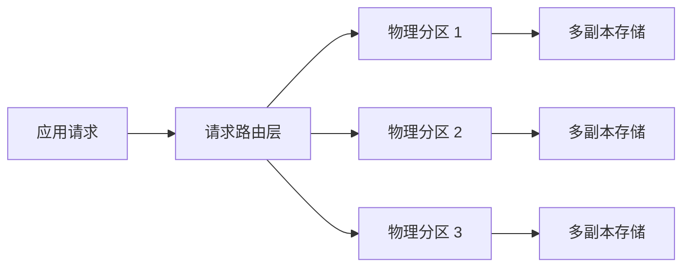
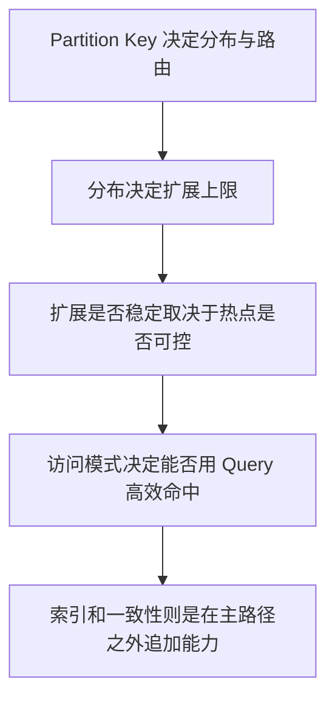

# DynamoDB - 第 9 课：DynamoDB 底层原理：分区、副本、请求路由、一致性与自适应容量

## 学习目标（本节结束后你能做到什么）

- 不再把 DynamoDB 只理解成“云上的 KV 数据库”，而能从分布式存储原理角度解释它为什么这样设计。
- 理解 Partition Key 为什么几乎决定了路由、扩展能力和热点风险。
- 理解为什么 `Query` 天然高效、`Scan` 天然昂贵，这不是 AWS 故意为难人，而是底层结构决定的。
- 说清楚强一致读、最终一致读、GSI 一致性、自适应容量这些概念背后的理论含义。

## 内容讲解（核心概念，用类比、例子、图示说清楚）

### 1. 先把 DynamoDB 从“表”还原成“分布式系统”

很多人看 DynamoDB 控制台，看到的是一张表，于是下意识会觉得：

- 一张表就是一块逻辑存储
- 索引是后来附加的能力
- 查询是数据库帮我在表上执行

这是一种非常关系型数据库的直觉。

但从底层看，DynamoDB 更接近下面这个画面：

也就是说：

- 你看到的是“一张逻辑表”
- 系统实际维护的是“很多物理分区”
- 每个请求先被路由到某个分区，再在那个分区内完成读写

所以 DynamoDB 的很多设计，包括：

- 为什么一定要强调 Partition Key
- 为什么 Query 必须先给分区键
- 为什么 Scan 会贵
- 为什么热点问题常常是局部问题

其实都不是 API 设计偏好，而是这套分布式结构的自然结果。

### 2. Partition Key 为什么这么重要

在 DynamoDB 里，Partition Key 不只是“一个查询字段”，它更像：

**一条数据进入底层分区世界的入口地址。**

系统会对 Partition Key 做哈希，把数据分布到不同物理分区上。这里有两个结果：

1. 不同的 Partition Key 值越分散，数据越容易均匀分布
2. 读写请求也会按 Partition Key 被路由到对应分区

所以 Partition Key 其实同时承担了三层职责：

- 数据分布的依据
- 请求路由的依据
- 可扩展性的基础

这就是为什么在 DynamoDB 里，主键设计不是“字段选择问题”，而是“系统分布设计问题”。

### 3. 为什么 Query 高效，而 Scan 昂贵

这个问题，如果只背“Query 走键，Scan 扫全表”，还是太浅。

更底层一点看：

#### Query 为什么高效

因为你给了系统明确的分区入口。

例如：

- `PK = USER#1001`

系统可以立刻知道：

- 这个请求应该去哪一组分区
- 在目标分区里再按 Sort Key 做局部查找

也就是说，Query 本质上是：

**先精确路由，再局部查找。**

#### Scan 为什么昂贵

因为你没有告诉系统该去哪。

这时系统只能：

- 广泛扫描多个分区
- 再把结果汇总回来

这在分布式系统里天然更重，因为它不是一个“局部请求”，而是一个“广域搜索”。

所以 Query 和 Scan 的差别，本质不是“一个命令快一个命令慢”，而是：

- 一个是路由明确的定点查找
- 一个是缺少路径设计下的全域遍历

### 4. Sort Key 在底层是在干什么

如果说 Partition Key 决定的是“去哪一个分区”，那 Sort Key 决定的就是：

**到了这个分区之后，怎样在这一组 item 里有序组织和高效检索。**

所以一个复合主键：

- `PK = USER#1001`
- `SK = ORDER#2026-04-15#0001`

并不是简单的两个字段拼起来，而是在表达一种非常明确的分层结构：

1. 先把“同一个用户的数据”聚在一起
2. 再在这组数据里按订单维度和时间维度组织顺序

这也是为什么 DynamoDB 里经常用 Sort Key 承担：

- 时间序列
- 类型前缀
- 聚合内排序
- 范围查询

因为它本质上是“分区内的组织规则”。

### 5. 一致性为什么会分成 strong 和 eventual

这是另一个很容易背结论、却不容易真正理解的点。

如果一份数据只有一个副本，那强一致最简单：

- 写完就读，读到的一定是最新值

但 DynamoDB 是高可用分布式存储，它的持久化和可用性来自副本复制。只要有多个副本，就一定会遇到一个问题：

**某个时刻，各个副本上的数据状态可能不是完全同步的。**

因此：

- 强一致读意味着你需要读到“最新已提交版本”
- 最终一致读意味着系统可以从较新的副本或已同步完成的副本里返回结果，但短时间内可能读到旧值

为什么 DynamoDB 很多地方更偏向 eventual consistency？

因为在分布式系统里，越强的实时一致性，通常意味着：

- 更高协调成本
- 更高读延迟
- 更少缓存空间

所以 DynamoDB 的默认设计，是在大多数在线场景里用最终一致来换吞吐和延迟。

### 6. 为什么 GSI 天生是最终一致的

这点很多人只会背，但不知道为什么。

你可以把 GSI 理解成：

**主表数据的一份“按另一套键重新组织”的派生视图。**

既然是派生视图，它就不是写入的原发点，而是：

- 主表先写成功
- 再把变更传播到索引视图

因此 GSI 和主表之间天然存在一个传播窗口。

这个窗口通常很短，但从理论上说，只要是“异步传播视图”，就不可能天然保证严格同步的强一致。

所以 GSI 的最终一致，不是 AWS 偷懒，而是因为：

- 它本质上就是一份复制出来的访问路径
- 复制就意味着传播延迟

### 7. 为什么单表设计和 DynamoDB 的底层结构是契合的

单表设计常被误解成“故意把数据搞乱”。

其实从 DynamoDB 底层来看，它是很合理的。

因为 DynamoDB 擅长的是：

- 让同一访问模式相关的数据尽量共位
- 让一次 Query 在少量分区和少量 item collection 内完成

而单表设计做的事情正是：

- 把一个业务聚合的多种实体放到同一个 Partition Key 下
- 用 Sort Key 表达不同类型和顺序

这和关系型数据库的“范式化拆表”方向正好相反。

换句话说：

- MySQL 的核心问题是如何高效 Join
- DynamoDB 的核心问题是如何尽量不需要 Join

### 8. 自适应容量到底在救什么

自适应容量（Adaptive Capacity）这类词很容易被听成“自动帮你解决热点”。

其实它更像是：

**DynamoDB 在检测到流量分布不完全均匀时，对局部热点做的一种自动补偿能力。**

它的意义在于：

- 不是所有访问偏斜都立刻变成灾难
- 系统会尽量帮你把资源向热点区域倾斜

但它不是无限兜底，也不是让你可以随便设计差 Partition Key。

因为如果你的热点本质上是：

- 极端集中
- 长时间稳定集中
- 写入高度集中在同一逻辑键

那这已经不是“轻微偏斜”，而是模型本身在和底层分布机制对抗。

所以自适应容量的正确理解不是：

- “我不用管热点了”

而是：

- “系统会尽量帮我缓冲一定程度的不均匀，但我仍然要为分布负责”

### 9. 为什么 DynamoDB 很容易在“整体没满时局部先炸”

这其实是所有分布式分片系统的典型特征。

因为你真正消费的不是一桶总资源，而是很多个分片上的局部资源。

所以一个常见误判是：

- 总吞吐还没到上限，为什么还会被限流？

答案往往是：

- 不是总资源不够，而是某个分区先到极限了

这也是为什么 DynamoDB 排障不能只看“总量”，还要看：

- 热点租户
- 热点用户
- 热点商品
- 热点时间段

### 10. 这套原理最后会落回一句话

把 DynamoDB 真正想明白之后，你会发现它的很多规则其实都很统一：

所以 DynamoDB 的底层原理，并不是若干散乱名词，而是一条非常完整的系统逻辑：

- 先分布
- 再路由
- 再局部检索
- 再用索引复制访问路径
- 最后在一致性、成本、可扩展性之间做权衡

## 小结（3-5 条关键点）

- DynamoDB 的逻辑表背后是很多物理分区，真正决定性能和扩展性的不是“表名”，而是分区和路由。
- Partition Key 同时决定数据落点、请求路由和热点风险，是 DynamoDB 建模的第一核心。
- Query 高效是因为它能先精确路由再局部查询，Scan 昂贵是因为它本质上需要跨分区遍历。
- GSI 本质上是异步维护的派生访问路径，因此天然更接近最终一致而不是强一致。
- 自适应容量能缓冲一定程度的访问偏斜，但不能替代正确的分区键设计。

## 问题 （检测用户对当前章节内容是否了解）

1. 为什么说 Partition Key 不是单纯的“查询字段”，而是 DynamoDB 底层分布机制的一部分？
2. 从分布式系统角度看，为什么 Query 和 Scan 的代价差别会这么大？
3. GSI 为什么天然更容易落到最终一致语义，而不是强一致？
4. 自适应容量为什么只能缓解热点，而不能替代正确建模？
